```mermaid
%%{init: {'theme':'mc'}}%%
flowchart TD
    Start([User on LandingPage<br/>STATE: Idle]) --> ClickGetStarted[User clicks<br/>Get Started]
    ClickGetStarted --> ShowBooking[Display NewBookingUI]

    ShowBooking --> EnterPickup[User enters pickup<br/>location]
    EnterPickup --> Autocomplete1[Google Places<br/>Autocomplete API]
    Autocomplete1 --> SelectPickup[User selects<br/>pickup address]
    SelectPickup --> StorePickup[Store pickup:<br/>lat, lng, address]

    StorePickup --> EnterDest[User enters<br/>destination]
    EnterDest --> Autocomplete2[Google Places<br/>Autocomplete API]
    Autocomplete2 --> SelectDest[User selects<br/>destination address]
    SelectDest --> StoreDest[Store destination:<br/>lat, lng, address]

    StoreDest --> ClickQuote[User clicks<br/>Get Fare Estimate]
    ClickQuote --> ValidateLocations{Both locations<br/>valid?}

    ValidateLocations -->|No| ShowValidationError[Show error:<br/>Enter both locations]
    ShowValidationError --> ShowBooking

    ValidateLocations -->|Yes| CallGetQuote[BookingContext<br/>.getFareQuote]
    CallGetQuote --> PostQuote[POST /quotes<br/>Send pickup & dest]

    PostQuote --> CalcDistance[Calculate distance<br/>Google Distance Matrix]
    CalcDistance --> CalcPricing[Calculate fare:<br/>base + distance + surge]
    CalcPricing --> SaveQuote[Save quote to QuoteStore<br/>expires in 5 min]

    SaveQuote --> ReturnQuote[Return quote:<br/>id, amount, eta]
    ReturnQuote --> DisplayQuote[Display fare estimate<br/>Show quote details]
    DisplayQuote --> StateChange["⚡ STATE: QuoteReceived<br/>(quote ≠ null)"]
    StateChange --> ShowPaymentBtn[Show Proceed to<br/>Payment button]
    ShowPaymentBtn --> End([End: Quote displayed])

    style StateChange fill:#ffffcc,stroke:#333,stroke-width:2px,stroke-dasharray: 5 5
    style ShowValidationError fill:#ffcccc
    style End fill:#ccffcc
```

```mermaid
%%{init: {'theme':'mc'}}%%
sequenceDiagram
    autonumber
    participant User
    participant NewBookingUI as RB2.3: NewBookingUI
    participant GooglePlaces as RB8: Google Places API
    participant BookingContext as RB2.1: BookingContext
    participant rideService as RB2.2: rideService
    participant googleMapsUtil as RB3.3: googleMapsUtil
    participant GoogleMaps as RB8: Google Maps APIs
    participant quoteRouter as RB6.2: quoteRouter<br/>(Backend)
    participant QuoteService as RB5.1: QuoteService<br/>(Backend)
    participant PricingService as RB5.5: PricingService<br/>(Backend)
    participant QuoteStore as RB7.5.1: QuoteStore<br/>(Backend)

    Note over User,QuoteStore: INITIAL STATE: Idle<br/>(quote=null, booking=null)

    User->>NewBookingUI: Clicks "Get Started" from LandingPage
    NewBookingUI->>NewBookingUI: Renders booking form

    User->>NewBookingUI: Types pickup address
    NewBookingUI->>GooglePlaces: Search suggestions
    GooglePlaces-->>NewBookingUI: Address suggestions
    User->>NewBookingUI: Selects pickup address
    NewBookingUI->>NewBookingUI: setPickupLocation({lat, lng})

    User->>NewBookingUI: Types destination address
    NewBookingUI->>GooglePlaces: Search suggestions
    GooglePlaces-->>NewBookingUI: Address suggestions
    User->>NewBookingUI: Selects destination
    NewBookingUI->>NewBookingUI: setDropoffLocation({lat, lng})

    User->>NewBookingUI: Clicks "Get Fare Estimate"

    NewBookingUI->>BookingContext: getFareQuote(pickup, dropoff, tokenId)
    activate BookingContext

    BookingContext->>googleMapsUtil: calculateTripDistance(pickup, dropoff)
    activate googleMapsUtil
    googleMapsUtil->>GoogleMaps: Distance Matrix API
    GoogleMaps-->>googleMapsUtil: {distance: km, duration: min}
    googleMapsUtil-->>BookingContext: DistanceObject
    deactivate googleMapsUtil

    BookingContext->>BookingContext: setTripDistance(distanceData)

    BookingContext->>rideService: getQuote(pickup, dropoff, tokenId)
    activate rideService

    rideService-->>quoteRouter: POST /quotes<br/>{pickup, dest, tokenId}
    activate quoteRouter

    quoteRouter->>QuoteService: getQuote(pickup, dest, tokenId)
    activate QuoteService

    QuoteService->>PricingService: estimate(distance, duration)
    activate PricingService
    PricingService->>PricingService: baseFare() = $5.00<br/>surgeFactor() = 1.0
    PricingService-->>QuoteService: fareAmount
    deactivate PricingService

    QuoteService->>QuoteService: Create Quote object<br/>expiresAt = now + 5 minutes
    QuoteService->>QuoteStore: save(quote)
    activate QuoteStore
    QuoteStore-->>QuoteService: saved
    deactivate QuoteStore

    QuoteService-->>quoteRouter: QuoteObject
    deactivate QuoteService

    quoteRouter-->>rideService: {id, amount, currency, expiresAt}
    deactivate quoteRouter

    rideService-->>BookingContext: QuoteObject
    deactivate rideService

    BookingContext->>BookingContext: setQuote(quoteData)
    BookingContext-->>NewBookingUI: success
    deactivate BookingContext

    NewBookingUI->>User: Display quote<br/>Amount: $X.XX<br/>Distance: X.X km<br/>ETA: X mins<br/>"Proceed to Payment" button

    Note over User,QuoteStore: FINAL STATE: QuoteReceived<br/>(quote≠null, booking=null)
```

```mermaid
%%{init: {'theme':'mc'}}%%
sequenceDiagram
    autonumber
    participant User
    participant App as RB0.1: App
    participant FindingDriverModal as RB3.2: FindingDriverModal
    participant BookingContext as RB2.1: BookingContext
    participant rideService as RB2.2: rideService
    participant rideRouter as RB6.3: rideRouter<br/>(Backend)
    participant RideService as RB5.2: RideService<br/>(Backend)
    participant QuoteStore as RB7.5.1: QuoteStore<br/>(Backend)
    participant RideRepo as RB7.1: RideRepository<br/>(Backend)
    participant MatchingService as RB5.3: MatchingService<br/>(Backend)
    participant DriverRepo as RB7.2: DriverRepository<br/>(Backend)

    Note over User,DriverRepo: INITIAL STATE: QuoteReceived<br/>(quote≠null, booking=null)

    User->>App: Confirms ride (from PaymentConfirmation)
    App->>BookingContext: requestRide(pickup, dropoff, quoteId, tokenId)
    activate BookingContext

    BookingContext->>rideService: createRide(pickup, dropoff, quoteId, tokenId)
    activate rideService

    rideService-->>rideRouter: POST /rides<br/>{riderId, pickup, dest, quoteId}
    activate rideRouter

    rideRouter->>RideService: createRide(input)
    activate RideService

    RideService->>QuoteStore: get(quoteId)
    activate QuoteStore
    QuoteStore-->>RideService: Quote object
    deactivate QuoteStore

    RideService->>RideService: Validate quote<br/>- Check expiration<br/>- Check coordinates match

    RideService->>RideRepo: save(ride)
    activate RideRepo
    Note over RideRepo: Backend State: REQUESTED
    RideRepo-->>RideService: Ride created<br/>status=REQUESTED
    deactivate RideRepo

    RideService->>QuoteStore: delete(quoteId)
    activate QuoteStore
    QuoteStore-->>RideService: deleted
    deactivate QuoteStore

    Note over RideService,DriverRepo: Auto-assignment starts immediately

    RideService->>MatchingService: assignDriver(rideId)
    activate MatchingService

    MatchingService->>RideRepo: update(rideId, {status: MATCHING})
    activate RideRepo
    Note over RideRepo: Backend State: REQUESTED → MATCHING
    RideRepo-->>MatchingService: updated
    deactivate RideRepo

    MatchingService->>DriverRepo: findNearby(pickup, 15km)
    activate DriverRepo
    DriverRepo->>DriverRepo: Haversine distance calculation<br/>Filter available drivers
    DriverRepo-->>MatchingService: [driver1, driver2, ...]
    deactivate DriverRepo

    alt Driver found
        MatchingService->>MatchingService: Select first driver (closest)
        MatchingService->>DriverRepo: setAvailability(driverId, false)
        activate DriverRepo
        Note over DriverRepo: Driver State: AVAILABLE → UNAVAILABLE
        DriverRepo-->>MatchingService: updated
        deactivate DriverRepo

        MatchingService->>RideRepo: update(rideId, {status: DRIVER_ASSIGNED, driverId})
        activate RideRepo
        Note over RideRepo: Backend State: MATCHING → DRIVER_ASSIGNED
        RideRepo-->>MatchingService: Ride with driver
        deactivate RideRepo

        MatchingService-->>RideService: Ride with driver assigned
    else No driver found
        MatchingService->>RideRepo: update(rideId, {status: REQUESTED})
        activate RideRepo
        Note over RideRepo: Backend State: MATCHING → REQUESTED
        RideRepo-->>MatchingService: Ride without driver
        deactivate RideRepo

        MatchingService-->>RideService: Ride without driver
    end
    deactivate MatchingService

    RideService-->>rideRouter: Ride object with driver
    deactivate RideService

    rideRouter-->>rideService: {id, status, driver, driverId, ...}
    deactivate rideRouter

    rideService->>rideService: Transform response<br/>lon → lng, dest → dropoff
    rideService-->>BookingContext: RideObject with driver
    deactivate rideService

    BookingContext->>BookingContext: setBooking(rideData)
    Note over BookingContext: Frontend State: booking≠null, driver=null

    BookingContext->>App: Show FindingDriverModal
    App->>FindingDriverModal: isOpen=true
    activate FindingDriverModal
    FindingDriverModal->>User: "Finding your driver..."<br/>(5 second delay)

    BookingContext->>BookingContext: Wait 5 seconds

    BookingContext->>BookingContext: setDriver(driver)<br/>setDriverLocation(driver.location)
    Note over BookingContext: Frontend State: driver≠null

    deactivate FindingDriverModal
    App->>App: Hide FindingDriverModal

    BookingContext->>BookingContext: setTrip({state: 'DriverEnRoute', startTime})
    BookingContext-->>App: success
    deactivate BookingContext

    App->>User: Show DriverTrackingUI

    Note over User,DriverRepo: FINAL STATE: DriverEnRoute<br/>(booking≠null, driver≠null, trip.state='DriverEnRoute')<br/>Backend: status=DRIVER_ASSIGNED

    Note over User,DriverRepo: Animation starts in Scenario 5
```

```mermaid
%%{init: {'theme':'mc'}}%%
flowchart TD
    Start([Driver assigned<br/>STATE: DriverEnRoute]) --> GetRoute[Get route path:<br/>driver → pickup<br/>Google Directions API]
    GetRoute --> CalcSteps[Calculate animation steps:<br/>duration × 60 / 2]

    CalcSteps --> StartInterval[Start 2-second interval<br/>animation loop]
    StartInterval --> AnimateLoop{Animation<br/>loop running}

    AnimateLoop -->|Every 2s| IncrementStep[Increment current step]
    IncrementStep --> CalcProgress[progress = step / totalSteps]
    CalcProgress --> UpdateDriver[Update driver location<br/>from route path]
    UpdateDriver --> UpdateMap[Update map marker<br/>position]
    UpdateMap --> CalcRemainingETA[Calculate remaining<br/>ETA]

    CalcRemainingETA --> CheckProgress{progress >= 1.0?}
    CheckProgress -->|No| AnimateLoop
    CheckProgress -->|Yes - Arrived| StopInterval1[Stop animation interval]

    StopInterval1 --> StateChange1["⚡ STATE: ArrivedAtPickup<br/>(trip.state = 'ArrivedAtPickup')"]
    StateChange1 --> EnableStartBtn[Enable Start Trip<br/>button]

    EnableStartBtn --> UserStart{User clicks<br/>Start Trip?}
    UserStart -->|No - Wait| EnableStartBtn

    UserStart -->|Yes| CallStartTrip[BookingContext<br/>.startTrip]
    CallStartTrip --> StateChange2["⚡ STATE: InTrip<br/>(trip.state = 'InTrip')"]

    StateChange2 --> GetRoute2[Get new route:<br/>pickup → destination<br/>Google Directions API]
    GetRoute2 --> StartInterval2[Start new animation<br/>pickup → destination]

    StartInterval2 --> AnimateLoop2{Animation<br/>loop running}
    AnimateLoop2 -->|Every 2s| UpdateDriver2[Update driver location]
    UpdateDriver2 --> CheckProgress2{progress >= 1.0?}

    CheckProgress2 -->|No| AnimateLoop2
    CheckProgress2 -->|Yes - At Destination| StopInterval2[Stop animation interval]

    StopInterval2 --> CallComplete[BookingContext<br/>.completeRide]
    CallComplete --> PostComplete[POST /rides/:id/complete]
    PostComplete --> StateChange3["⚡ STATE: TripCompleted<br/>(trip.state = 'Completed')"]
    StateChange3 --> End([End: Show<br/>TripCompletedUI])

    style StateChange1 fill:#ffffcc,stroke:#333,stroke-width:2px,stroke-dasharray: 5 5
    style StateChange2 fill:#ffffcc,stroke:#333,stroke-width:2px,stroke-dasharray: 5 5
    style StateChange3 fill:#ffffcc,stroke:#333,stroke-width:2px,stroke-dasharray: 5 5
    style End fill:#ccffcc
```

```mermaid
%%{init: {'theme':'mc'}}%%
sequenceDiagram
    autonumber
    participant User
    participant DriverTrackingUI as RB3.1: DriverTrackingUI
    participant Map as RB2.4: Map
    participant BookingContext as RB2.1: BookingContext
    participant googleMapsUtil as RB3.3: googleMapsUtil
    participant GoogleDirections as RB8: Google Directions API
    participant rideService as RB2.2: rideService
    participant rideRouter as RB6.3: rideRouter<br/>(Backend)
    participant RideService as RB5.2: RideService<br/>(Backend)
    participant RideRepo as RB7.1: RideRepository<br/>(Backend)

    Note over User,RideRepo: INITIAL STATE: DriverEnRoute<br/>(trip.state='DriverEnRoute', tripProgress=0)

    DriverTrackingUI->>User: Show driver info<br/>Name, rating, vehicle, phone<br/>ETA countdown

    BookingContext->>BookingContext: useEffect detects trip.state='DriverEnRoute'
    activate BookingContext

    BookingContext->>googleMapsUtil: getRoutePath(driverLocation, pickupLocation)
    activate googleMapsUtil
    googleMapsUtil->>GoogleDirections: Directions API request
    GoogleDirections-->>googleMapsUtil: Route path [Array<{lat,lng}>]
    googleMapsUtil-->>BookingContext: routePath (e.g., 100 points)
    deactivate googleMapsUtil

    BookingContext->>BookingContext: Start animation interval (2 seconds)

    loop Every 2 seconds (until progress >= 1.0)
        BookingContext->>BookingContext: currentStep++<br/>progress = currentStep / totalSteps
        BookingContext->>BookingContext: pathIndex = floor(progress * routePath.length)
        BookingContext->>BookingContext: setDriverLocation(routePath[pathIndex])
        BookingContext->>BookingContext: setTripProgress(progress)

        BookingContext->>Map: Update driver marker position
        Map->>User: Animate driver moving along route

        DriverTrackingUI->>User: Update ETA countdown
    end

    BookingContext->>BookingContext: progress >= 1.0 detected
    BookingContext->>BookingContext: Stop animation interval
    BookingContext->>BookingContext: setTrip({state: 'ArrivedAtPickup'})
    deactivate BookingContext

    Note over User,RideRepo: STATE: ArrivedAtPickup<br/>(trip.state='ArrivedAtPickup', tripProgress=1.0)

    DriverTrackingUI->>User: "Driver has arrived!"<br/>"Start Trip" button enabled

    User->>DriverTrackingUI: Clicks "Start Trip"
    DriverTrackingUI->>BookingContext: updateTripState('InTrip')
    activate BookingContext

    BookingContext->>BookingContext: setTrip({state: 'InTrip', pickupTime})

    BookingContext->>rideService: No API call for startRide()<br/>(Frontend-driven state)
    Note over rideService: Note: Backend startRide() exists but not called in current flow

    BookingContext->>BookingContext: useEffect detects trip.state='InTrip'
    BookingContext->>BookingContext: Reset initialDriverLocation to pickup

    BookingContext->>googleMapsUtil: getRoutePath(pickup, destination)
    activate googleMapsUtil
    googleMapsUtil->>GoogleDirections: Directions API request
    GoogleDirections-->>googleMapsUtil: Route path to destination
    googleMapsUtil-->>BookingContext: routePath
    deactivate googleMapsUtil

    BookingContext->>BookingContext: Start animation interval (2 seconds)

    loop Every 2 seconds (until progress >= 1.0)
        BookingContext->>BookingContext: currentStep++<br/>progress = currentStep / totalSteps
        BookingContext->>BookingContext: setDriverLocation(routePath[pathIndex])
        BookingContext->>BookingContext: setTripProgress(progress)

        Map->>User: Animate driver moving to destination
    end

    BookingContext->>BookingContext: progress >= 1.0 detected<br/>Destination reached
    BookingContext->>BookingContext: Stop animation

    BookingContext->>BookingContext: completeRide() (automatic)
    BookingContext->>rideService: completeRide(bookingId)
    activate rideService

    rideService-->>rideRouter: POST /rides/:id/complete
    activate rideRouter
    rideRouter->>RideService: completeRide(rideId, riderId)
    activate RideService

    RideService->>RideRepo: update(rideId, {status: COMPLETED, completedAt})
    activate RideRepo
    Note over RideRepo: Backend State: IN_RIDE → COMPLETED
    RideRepo-->>RideService: Ride completed
    deactivate RideRepo

    RideService-->>rideRouter: Ride object
    deactivate RideService
    rideRouter-->>rideService: success
    deactivate rideRouter
    rideService-->>BookingContext: success
    deactivate rideService

    BookingContext->>BookingContext: setTrip({state: 'Completed', endTime})<br/>setBooking({status: 'Completed'})
    deactivate BookingContext

    DriverTrackingUI->>User: Navigate to TripCompletedUI

    Note over User,RideRepo: FINAL STATE: TripCompleted<br/>(trip.state='Completed', booking.status='Completed')<br/>Backend: status=COMPLETED
```

```mermaid
%%{init: {'theme':'mc'}}%%
sequenceDiagram
    autonumber
    participant User
    participant TripCompletedUI as RB4.2: TripCompletedUI
    participant App as RB0.1: App
    participant BookingContext as RB2.1: BookingContext
    participant helpers as RB3.4: helpers
    participant RatingService as RB5.8: RatingService<br/>(Backend)

    Note over User,RatingService: INITIAL STATE: TripCompleted<br/>(trip.state='Completed', booking.status='Completed')

    TripCompletedUI->>TripCompletedUI: Display trip summary

    TripCompletedUI->>helpers: formatCurrency(fareAmount)
    helpers-->>TripCompletedUI: "$X.XX"

    TripCompletedUI->>helpers: formatTime(duration)
    helpers-->>TripCompletedUI: "X mins"

    TripCompletedUI->>User: Show receipt<br/>━━━━━━━━━━━━━━<br/>Fare: $X.XX<br/>Distance: X.X km<br/>Duration: X mins<br/>From: Pickup Address<br/>To: Destination Address<br/>━━━━━━━━━━━━━━<br/>5-star rating interface

    User->>TripCompletedUI: Selects star rating (1-5)
    TripCompletedUI->>TripCompletedUI: handleRating(stars)
    TripCompletedUI->>RatingService: rateRide(rideId, stars)
    activate RatingService
    Note over RatingService: (Currently placeholder - returns success)
    RatingService-->>TripCompletedUI: {success: true}
    deactivate RatingService

    TripCompletedUI->>User: "Thank you for your feedback!"

    User->>TripCompletedUI: Clicks "Request Another Ride"
    TripCompletedUI->>App: onBookAnother() callback
    App->>BookingContext: reset()
    activate BookingContext

    BookingContext->>BookingContext: Clear animation intervals
    BookingContext->>BookingContext: setPickupText('')<br/>setDropoffText('')<br/>setQuote(null)<br/>setBooking(null)<br/>setTrip(null)<br/>setDriver(null)<br/>setDriverLocation(null)<br/>setTripProgress(0)<br/>setTripDistance(null)<br/>setDriverETA(null)<br/>setError(null)

    BookingContext-->>App: reset complete
    deactivate BookingContext

    App->>App: Navigate to LandingPage
    App->>User: Show LandingPage<br/>"Get Started" button

    Note over User,RatingService: FINAL STATE: Idle<br/>(quote=null, booking=null, trip=null, driver=null)<br/>Ready for new ride
```

```mermaid
%%{init: {'theme':'mc'}}%%
sequenceDiagram
    autonumber
    participant User
    participant DriverTrackingUI as RB3.1: DriverTrackingUI
    participant BookingContext as RB2.1: BookingContext
    participant rideService as RB2.2: rideService
    participant rideRouter as RB6.3: rideRouter<br/>(Backend)
    participant RideService as RB5.2: RideService<br/>(Backend)
    participant RideRepo as RB7.1: RideRepository<br/>(Backend)
    participant DriverRepo as RB7.2: DriverRepository<br/>(Backend)

    Note over User,DriverRepo: INITIAL STATE: DriverEnRoute or ArrivedAtPickup<br/>(booking≠null, driver≠null)

    User->>DriverTrackingUI: Clicks "Cancel Ride"
    DriverTrackingUI->>DriverTrackingUI: Confirm cancellation dialog
    User->>DriverTrackingUI: Confirms cancellation

    DriverTrackingUI->>BookingContext: cancelRide()
    activate BookingContext

    BookingContext->>BookingContext: Stop animation interval

    BookingContext->>rideService: cancelRide(bookingId)
    activate rideService

    rideService-->>rideRouter: POST /rides/:id/cancel
    activate rideRouter

    rideRouter->>RideService: cancelRide(rideId, riderId)
    activate RideService

    RideService->>RideRepo: findById(rideId)
    activate RideRepo
    RideRepo-->>RideService: Ride object
    deactivate RideRepo

    RideService->>RideService: Validate ride not already completed

    RideService->>RideRepo: update(rideId, {status: CANCELLED})
    activate RideRepo
    Note over RideRepo: Backend State: * → CANCELLED
    RideRepo-->>RideService: Ride cancelled
    deactivate RideRepo

    alt Driver was assigned
        RideService->>DriverRepo: setAvailability(driverId, true)
        activate DriverRepo
        Note over DriverRepo: Driver State: UNAVAILABLE → AVAILABLE
        DriverRepo-->>RideService: Driver released
        deactivate DriverRepo
    end

    RideService-->>rideRouter: Ride object (status=CANCELLED)
    deactivate RideService

    rideRouter-->>rideService: success
    deactivate rideRouter

    rideService-->>BookingContext: success
    deactivate rideService

    BookingContext->>BookingContext: setBooking({status: 'Cancelled'})<br/>setTrip({state: 'Cancelled'})
    BookingContext-->>DriverTrackingUI: cancellation complete
    deactivate BookingContext

    DriverTrackingUI->>User: "Ride cancelled"<br/>Navigate back to LandingPage

    Note over User,DriverRepo: FINAL STATE: Cancelled<br/>(booking.status='Cancelled', trip.state='Cancelled')<br/>Backend: status=CANCELLED, driver released
```

# User Story #1: Core Ride Booking - Development Specification

## Document Version History

| Version | Date | Editor | Changes |
|---------|------|--------|---------|
| 1.0 | 2025-01-27 | Watson Chao (assisted by Claude) | Initial creation of comprehensive dev spec |

## Authors and Roles

| Author | Role | Versions |
|--------|------|----------|
| Watson Chao | Developer | All |
| Claude | AI Assistant / Documentation | 1.0 |

---

## Architecture Diagram

### Legend

**Execution Locations:**
- **Browser/Client** - Runs in user's web browser (React frontend)
- **Server** - Runs on Node.js backend server
- **Database Server** - In-Memory JavaScript Map (current) OR PostgreSQL with PostGIS (available)
- **Google Cloud** - External Google Maps API services

**Arrow Types:**
- **Solid arrow (→)** - Direct function/method call (synchronous)
- **Dashed arrow (⇢)** - HTTP API request (asynchronous)
- **Dotted arrow (⤷)** - Data object passed or returned

**Data Type Notation:**
- **fieldName: Type** - Field with data type
- **methodName(): ReturnType** - Method with return type
- **methodName(param: Type): ReturnType** - Method with parameters
- **Type | null** - Can be null/undefined
- **Array<Type>** - Array of specified type
- **Promise<Type>** - Asynchronous operation returning type

**Common Data Types:**
```
string              = Text value
number              = Numeric value (integer or decimal)
boolean             = true or false
Date                = JavaScript Date object
Function            = Callback function
UUID                = Unique identifier string
Location            = {lat: number, lng: number}
Event               = Browser event object
Ref<T>              = React useRef reference
```

**Complex Data Types (Detailed in Data Structures section below):**
- QuoteObject
- RideObject
- TripObject
- DriverObject
- DistanceObject
- PaymentIntent
- UserProfile

---

### System Architecture Diagram

```mermaid
---
config:
  layout: elk
  theme: mc
---
%%{init: {'theme':'mc'}}%%
flowchart TB
 subgraph RB0["RB0: Main Application"]
        RB0_1["RB0.1: App<br>━━━━━━━━━━━━━━<br>Main Component<br>Methods: handleLoginSuccess,<br>handleGetStarted,<br>handleConfirmPayment"]
  end
 subgraph RB1["RB1: Authentication Module"]
        RB1_1["RB1.1: AuthContext<br>━━━━━━━━━━━━━━<br>Fields: user, isLoggedIn, loading, error<br>Methods: login, logout, useAuth"]
        RB1_2["RB1.2: authService<br>━━━━━━━━━━━━━━<br>Methods: login, logout,<br>getProfile, getAuthToken"]
        RB1_3["RB1.3: LoginPage<br>━━━━━━━━━━━━━━<br>Props: onLoginSuccess<br>State: email, password"]
        RB1_4["RB1.4: LandingPage<br>━━━━━━━━━━━━━━<br>Props: onGetStarted"]
  end
 subgraph RB2["RB2: Booking Module"]
        RB2_1["RB2.1: BookingContext<br>━━━━━━━━━━━━━━<br>Fields: quote, booking, trip,<br>driver, driverLocation<br>Methods: getFareQuote,<br>requestRide, completeRide"]
        RB2_2["RB2.2: rideService<br>━━━━━━━━━━━━━━<br>Methods: getQuote,<br>createRide, cancelRide"]
        RB2_3["RB2.3: NewBookingUI<br>━━━━━━━━━━━━━━<br>State: pickupLocation,<br>dropoffLocation"]
        RB2_4["RB2.4: Map<br>━━━━━━━━━━━━━━<br>Props: pickup, destination,<br>driverPosition"]
  end
 subgraph RB3["RB3: Tracking Module"]
        RB3_1["RB3.1: DriverTrackingUI<br>━━━━━━━━━━━━━━<br>State: eta, etaSeconds<br>Methods: handleCancel,<br>handleStartTrip"]
        RB3_2["RB3.2: FindingDriverModal<br>━━━━━━━━━━━━━━<br>Methods: handleCancel"]
        RB3_3["RB3.3: googleMapsUtil<br>━━━━━━━━━━━━━━<br>Methods: calculateDistance,<br>getRoutePath"]
        RB3_4["RB3.4: helpers<br>━━━━━━━━━━━━━━<br>Methods: formatCurrency,<br>formatTime, formatPhone,<br>generateId, delay"]
  end
 subgraph RB4["RB4: Payment Module"]
        RB4_1["RB4.1: PaymentConfirmation<br>━━━━━━━━━━━━━━<br>Props: tripData, onConfirm<br>State: selectedPayment"]
        RB4_2["RB4.2: TripCompletedUI<br>━━━━━━━━━━━━━━<br>Props: onBookAnother<br>State: rating"]
        RB4_3["RB4.3: paymentService<br>━━━━━━━━━━━━━━<br>Methods: createPaymentIntent,<br>confirmPayment"]
  end
 subgraph Browser["🟦 BROWSER / CLIENT (React Application)"]
    direction TB
        RB0
        RB1
        RB2
        RB3
        RB4
  end
 subgraph RB6["RB6: API Controllers"]
        RB6_1["RB6.1: authRouter<br>━━━━━━━━━━━━━━<br>POST /login<br>GET /me"]
        RB6_2["RB6.2: quoteRouter<br>━━━━━━━━━━━━━━<br>POST /quotes"]
        RB6_3["RB6.3: rideRouter<br>━━━━━━━━━━━━━━<br>POST /rides<br>GET /rides/:id<br>POST /rides/:id/cancel<br>POST /rides/:id/complete"]
        RB6_4["RB6.4: paymentRouter<br>━━━━━━━━━━━━━━<br>POST /payments/intents<br>POST /payments/confirm"]
  end
 subgraph RB5["RB5: Core Services"]
        RB5_1["RB5.1: QuoteService<br>━━━━━━━━━━━━━━<br>Methods: getQuote"]
        RB5_2["RB5.2: RideService<br>━━━━━━━━━━━━━━<br>Methods: createRide,<br>getRide, cancelRide,<br>completeRide"]
        RB5_3["RB5.3: MatchingService<br>━━━━━━━━━━━━━━<br>Methods: assignDriver,<br>updateDriverLocation"]
        RB5_4["RB5.4: PaymentService<br>━━━━━━━━━━━━━━<br>Methods: createPaymentIntent,<br>confirmPayment"]
        RB5_5["RB5.5: PricingService<br>━━━━━━━━━━━━━━<br>Methods: estimate,<br>baseFare, surgeFactor"]
        RB5_6["RB5.6: LocationService<br>━━━━━━━━━━━━━━<br>Methods: eta"]
        RB5_7["RB5.7: AuthService<br>━━━━━━━━━━━━━━<br>Methods: required,<br>optional, verify"]
        RB5_8["RB5.8: RatingService<br>━━━━━━━━━━━━━━<br>Methods: rateRide"]
        RB5_9["RB5.9: EventBus<br>━━━━━━━━━━━━━━<br>Methods: publish,<br>subscribe"]
  end
 subgraph RB7["RB7: Repositories"]
        RB7_1_A["RB7.1-A: PrismaRideRepository<br>━━━━━━━━━━━━━━<br>Methods: save, findById,<br>update, findActiveByDriver"]
        RB7_1_B["RB7.1-B: MemoryRideRepository<br>━━━━━━━━━━━━━━<br>Methods: save, findById,<br>update, findActiveByDriver"]
        RB7_2_A["RB7.2-A: PrismaDriverRepository<br>━━━━━━━━━━━━━━<br>Methods: findNearby,<br>setAvailability,<br>updateDriverLocation"]
        RB7_2_B["RB7.2-B: MemoryDriverRepository<br>━━━━━━━━━━━━━━<br>Methods: findNearby,<br>setAvailability,<br>updateDriverLocation"]
        RB7_3_A["RB7.3-A: PrismaUserRepository<br>━━━━━━━━━━━━━━<br>Methods: findById,<br>findByEmail"]
        RB7_3_B["RB7.3-B: MemoryUserRepository<br>━━━━━━━━━━━━━━<br>Methods: findById,<br>findByEmail"]
        RB7_4_A["RB7.4-A: PrismaPaymentIntentRepository<br>━━━━━━━━━━━━━━<br>Methods: create, findById,<br>findByRideId, update"]
        RB7_4_B["RB7.4-B: MemoryPaymentIntentRepository<br>━━━━━━━━━━━━━━<br>Methods: create, findById,<br>findByRideId, update"]
  end
 subgraph RB7_5["RB7.5: Data Stores"]
        RB7_5_1["InMemoryQuoteStore<br>(exported as QuoteStore)<br>━━━━━━━━━━━━━━<br>In-Memory Map<br>Methods: save, get, delete"]
        RB7_5_2["MemoryDb<br>━━━━━━━━━━━━━━<br>Maps: users, drivers,<br>rides, paymentIntents"]
  end
 subgraph Server["🟩 SERVER / NODE.JS"]
    direction TB
        RB6
        RB5
        RB7
        RB7_5
  end
 subgraph External["🟪 EXTERNAL SERVICES"]
        RB8["RB8: Google Maps APIs<br>━━━━━━━━━━━━━━<br>• Places Autocomplete<br>• Distance Matrix<br>• Directions<br>• Geocoding"]
        RB9["RB9: Database<br>━━━━━━━━━━━━━━<br>CURRENT: In-Memory Map<br>AVAILABLE: PostgreSQL + PostGIS"]
  end
    RB0_1 --> RB1_3 & RB1_4 & RB2_3 & RB3_1 & RB3_2 & RB4_1 & RB4_2
    RB1_3 --> RB1_1
    RB1_1 --> RB1_2
    RB2_3 --> RB2_1 & RB2_4
    RB2_1 --> RB2_2 & RB3_3
    RB3_1 --> RB2_1
    RB3_2 --> RB2_1
    RB4_1 --> RB4_3
    RB4_2 --> RB3_4 & RB5_8
    RB6_1 --> RB5_7
    RB6_2 --> RB5_1
    RB6_3 --> RB5_2 & RB5_3
    RB6_4 --> RB5_4
    RB5_1 --> RB5_5 & RB5_6 & RB7_5_1
    RB5_2 --> RB7_1_A & RB7_1_B & RB5_9
    RB5_3 --> RB7_2_A & RB7_2_B
    RB5_7 --> RB7_3_A & RB7_3_B
    RB5_4 --> RB7_4_A & RB7_4_B
    RB7_1_A --> RB9
    RB7_1_B --> RB7_5_2
    RB7_2_A --> RB9
    RB7_2_B --> RB7_5_2
    RB7_3_A --> RB9
    RB7_3_B --> RB7_5_2
    RB7_4_A --> RB9
    RB7_4_B --> RB7_5_2
    RB1_2 -. HTTP .-> RB6_1
    RB2_2 -. HTTP .-> RB6_2 & RB6_3
    RB4_3 -. HTTP .-> RB6_4
    RB2_3 -. API Calls .-> RB8
    RB3_3 -. API Calls .-> RB8
    RB2_4 -. API Calls .-> RB8
    RB7_5_2 --> RB9
    style Browser fill:#E3F2FD,stroke:#1976D2,stroke-width:3px
    style Server fill:#E8F5E9,stroke:#388E3C,stroke-width:3px
    style External fill:#F3E5F5,stroke:#7B1FA2,stroke-width:3px
    style RB0 fill:#BBDEFB,stroke:#1976D2,stroke-width:2px
    style RB1 fill:#BBDEFB,stroke:#1976D2,stroke-width:2px
    style RB2 fill:#BBDEFB,stroke:#1976D2,stroke-width:2px
    style RB3 fill:#BBDEFB,stroke:#1976D2,stroke-width:2px
    style RB4 fill:#BBDEFB,stroke:#1976D2,stroke-width:2px
    style RB5 fill:#C8E6C9,stroke:#388E3C,stroke-width:2px
    style RB6 fill:#C8E6C9,stroke:#388E3C,stroke-width:2px
    style RB7 fill:#FFF9C4,stroke:#F57C00,stroke-width:2px
    style RB7_5 fill:#FFE0B2,stroke:#E65100,stroke-width:2px
```



**Module Locations Summary:**

| Module Code | Module Name | Execution Location | Technology Stack |
|-------------|-------------|-------------------|------------------|
| RB1 | Authentication & Session Management | Browser/Client | React, localStorage |
| RB2 | Booking & Ride Request | Browser/Client | React, Google Maps API |
| RB3 | Driver Tracking & Trip Management | Browser/Client | React, Google Maps API |
| RB4 | Payment Processing | Browser/Client | React |
| RB5 | Core Services (Business Logic) | Server | Node.js |
| RB6 | API Controllers (REST Endpoints) | Server | Express.js |
| RB7 | Repositories (Data Access) | Server | Prisma ORM / In-Memory |
| RB7.5 | Data Stores | Server | JavaScript Map (current) |
| RB8 | Google Maps APIs | Google Cloud | External Service |
| RB9 | Database | Database Server | In-Memory Map (current) / PostgreSQL+PostGIS (available) |

---

## Class Diagram

This section shows all classes/components in User Story #1 with their inheritance hierarchies and relationships.

### Legend

**Class Types:**
- **React Component** - Frontend UI component (functional component with hooks)
- **Context Provider** - React Context for state management
- **Service Module** - Frontend service for API communication
- **Utility Module** - Helper functions and utilities
- **Service Class** - Backend business logic (static methods)
- **Repository** - Data access layer with dual implementations
- **Data Store** - In-memory storage

**Relationships:**
- **Solid arrow with triangle (<|--)** - Inheritance or "implements" relationship
- **Dotted arrow (..>)** - Dependency or "uses" relationship

---

### Full Class Diagram

```mermaid
classDiagram
    direction TB

    %% ========================================
    %% FRONTEND - React Components
    %% ========================================

    class App {
        <<RB0.1 Main Component>>
        +currentView string
        +handleLoginSuccess() void
        +handleGetStarted() void
        +handleConfirmPayment() void
        +handleBookAnother() void
    }

    class LandingPage {
        <<RB1.4 Component>>
        +onGetStarted Function
        +handleClick() void
    }

    class LoginPage {
        <<RB1.3 Component>>
        +onLoginSuccess Function
        +email string
        +password string
        +handleLogin() Promise~void~
    }

    class NewBookingUI {
        <<RB2.3 Component>>
        +pickupLocation Location
        +dropoffLocation Location
        +pickupAddress string
        +dropoffAddress string
        +handleGetQuote() Promise~void~
    }

    class Map {
        <<RB2.4 Component>>
        +pickup Location
        +destination Location
        +driverPosition Location
        +routePath Array~Location~
        +mapRef Ref~google.maps.Map~
    }

    class FindingDriverModal {
        <<RB3.2 Component>>
        +isOpen boolean
        +onCancel Function
        +handleCancel() void
    }

    class DriverTrackingUI {
        <<RB3.1 Component>>
        +eta string
        +etaSeconds number
        +handleCancel() void
        +handleStartTrip() void
    }

    class PaymentConfirmation {
        <<RB4.1 Component>>
        +tripData Object
        +onConfirm Function
        +selectedPayment string
        +handleConfirm() void
    }

    class TripCompletedUI {
        <<RB4.2 Component>>
        +onBookAnother Function
        +rating number
        +handleRating(stars) void
    }

    %% ========================================
    %% FRONTEND - Context Providers
    %% ========================================

    class AuthContext {
        <<RB1.1 Context Provider>>
        +user Object | null
        +isLoggedIn boolean
        +loading boolean
        +error string | null
        +login(email, password) Promise~void~
        +logout() void
        +useAuth() Object
    }

    class BookingContext {
        <<RB2.1 Context Provider>>
        +pickupText string
        +dropoffText string
        +quote QuoteObject | null
        +booking RideObject | null
        +trip TripObject | null
        +driver DriverObject | null
        +driverLocation Location | null
        +routePath Array~Location~
        +tripProgress number
        +getFareQuote(pickup, dropoff, tokenId) Promise~void~
        +requestRide(pickup, dropoff, quoteId, tokenId) Promise~void~
        +cancelRide() Promise~void~
        +completeRide() Promise~void~
        +resetBooking() void
    }

    %% ========================================
    %% FRONTEND - Service Modules
    %% ========================================

    class authService {
        <<RB1.2 Service Module>>
        +login(email, password) Promise~Object~
        +logout() void
        +getProfile() Promise~Object~
        +getAuthToken() string | null
    }

    class rideService {
        <<RB2.2 Service Module>>
        +getQuote(pickup, dropoff, tokenId) Promise~QuoteObject~
        +createRide(pickup, dropoff, quoteId, tokenId) Promise~RideObject~
        +getRide(rideId) Promise~RideObject~
        +cancelRide(rideId) Promise~Object~
        +completeRide(rideId) Promise~Object~
    }

    class paymentService {
        <<RB4.3 Service Module>>
        +createPaymentIntent(rideId) Promise~Object~
        +confirmPayment(intentId, method) Promise~Object~
    }

    class googleMapsUtil {
        <<RB3.3 Utility Module>>
        +calculateDistance(pickup, dropoff) Promise~DistanceObject~
        +getRoutePath(pickup, dropoff) Promise~Array~Location~~
        +calculateDriverETA(driverLoc, pickupLoc) Promise~Object~
    }

    class helpers {
        <<RB3.4 Utility Module>>
        +generateId() UUID
        +formatCurrency(amount) string
        +formatTime(minutes) string
        +formatPhone(phone) string
        +delay(ms) Promise~void~
    }

    %% ========================================
    %% BACKEND - API Controllers (Router Modules)
    %% ========================================

    class authRouter {
        <<RB6.1 Express Router>>
        +POST /login
        +GET /me
    }

    class quoteRouter {
        <<RB6.2 Express Router>>
        +POST /quotes
    }

    class rideRouter {
        <<RB6.3 Express Router>>
        +POST /rides
        +GET /rides/:id
        +POST /rides/:id/cancel
        +POST /rides/:id/complete
    }

    class paymentRouter {
        <<RB6.4 Express Router>>
        +POST /payments/intents
        +POST /payments/confirm
    }

    %% ========================================
    %% BACKEND - Service Classes
    %% ========================================

    class QuoteService {
        <<RB5.1 Service Class>>
        +getQuote(pickup, dest, tokenId) Promise~Quote~
    }

    class RideService {
        <<RB5.2 Service Class>>
        +createRide(riderId, pickup, dest, quoteId, tokenId) Promise~Ride~
        +getRide(rideId, riderId) Promise~Ride~
        +cancelRide(rideId, riderId) Promise~Ride~
        +completeRide(rideId, riderId) Promise~Ride~
    }

    class MatchingService {
        <<RB5.3 Service Class>>
        +assignDriver(rideId, pickup) Promise~Driver~
        +updateDriverLocation(driverId, location) Promise~void~
    }

    class PaymentService {
        <<RB5.4 Service Class>>
        +createPaymentIntent(rideId) Promise~PaymentIntent~
        +confirmPayment(intentId, method) Promise~PaymentIntent~
    }

    class PricingService {
        <<RB5.5 Service Class>>
        +estimate(distance, duration) number
        +baseFare() number
        +surgeFactor(time) number
    }

    class LocationService {
        <<RB5.6 Service Class>>
        +eta(from, to) Promise~number~
    }

    class AuthService {
        <<RB5.7 Service Class>>
        +required(req, res, next) void
        +optional(req, res, next) void
        +verify(token) Object
    }

    class RatingService {
        <<RB5.8 Service Class>>
        +rateRide(rideId, stars) Promise~boolean~
    }

    class EventBus {
        <<RB5.9 Singleton>>
        +publish(topic, payload) void
        +subscribe(topic, handler) Function
    }

    %% ========================================
    %% BACKEND - Repository Pattern
    %% ========================================

    class RepositoryInterface {
        <<interface>>
    }

    class PrismaRideRepository {
        <<RB7.1-A Repository>>
        +save(input) Promise~Ride~
        +findById(id) Promise~Ride~
        +update(id, data) Promise~Ride~
        +findActiveByDriver(driverId) Promise~Ride~
    }

    class MemoryRideRepository {
        <<RB7.1-B Repository>>
        +save(input) Promise~Ride~
        +findById(id) Promise~Ride~
        +update(id, data) Promise~Ride~
        +findActiveByDriver(driverId) Promise~Ride~
    }

    class PrismaDriverRepository {
        <<RB7.2-A Repository>>
        +findNearby(location, radius) Promise~Array~Driver~~
        +setAvailability(driverId, available) Promise~void~
        +updateDriverLocation(driverId, location) Promise~void~
    }

    class MemoryDriverRepository {
        <<RB7.2-B Repository>>
        +findNearby(location, radius) Promise~Array~Driver~~
        +setAvailability(driverId, available) Promise~void~
        +updateDriverLocation(driverId, location) Promise~void~
    }

    class PrismaUserRepository {
        <<RB7.3-A Repository>>
        +findById(id) Promise~User~
        +findByEmail(email) Promise~User~
    }

    class MemoryUserRepository {
        <<RB7.3-B Repository>>
        +findById(id) Promise~User~
        +findByEmail(email) Promise~User~
    }

    class PrismaPaymentIntentRepository {
        <<RB7.4-A Repository>>
        +create(data) Promise~PaymentIntent~
        +findById(id) Promise~PaymentIntent~
        +findByRideId(rideId) Promise~PaymentIntent~
        +update(id, data) Promise~PaymentIntent~
    }

    class MemoryPaymentIntentRepository {
        <<RB7.4-B Repository>>
        +create(data) Promise~PaymentIntent~
        +findById(id) Promise~PaymentIntent~
        +findByRideId(rideId) Promise~PaymentIntent~
        +update(id, data) Promise~PaymentIntent~
    }

    %% ========================================
    %% BACKEND - Data Stores
    %% ========================================

    class InMemoryQuoteStore {
        <<RB7.5.1 Data Store>>
        +quotes Map
        +save(quote) void
        +get(id) Quote | null
        +delete(id) void
    }

    class MemoryDb {
        <<RB7.5.2 Data Store>>
        +users Map
        +drivers Map
        +vehicles Map
        +rides Map
        +paymentIntents Map
        +driverLocations Map
    }

    %% ========================================
    %% RELATIONSHIPS - Frontend Components
    %% ========================================

    App ..> LandingPage
    App ..> LoginPage
    App ..> NewBookingUI
    App ..> FindingDriverModal
    App ..> DriverTrackingUI
    App ..> PaymentConfirmation
    App ..> TripCompletedUI

    LoginPage ..> AuthContext
    AuthContext ..> authService

    NewBookingUI ..> BookingContext
    NewBookingUI ..> Map
    BookingContext ..> rideService
    BookingContext ..> googleMapsUtil

    DriverTrackingUI ..> BookingContext
    DriverTrackingUI ..> Map
    FindingDriverModal ..> BookingContext

    PaymentConfirmation ..> paymentService
    TripCompletedUI ..> helpers
    TripCompletedUI ..> RatingService

    %% ========================================
    %% RELATIONSHIPS - Frontend to Backend
    %% ========================================

    authService ..> authRouter
    rideService ..> quoteRouter
    rideService ..> rideRouter
    paymentService ..> paymentRouter

    %% ========================================
    %% RELATIONSHIPS - Backend Controllers to Services
    %% ========================================

    authRouter ..> AuthService
    quoteRouter ..> QuoteService
    rideRouter ..> RideService
    rideRouter ..> MatchingService
    paymentRouter ..> PaymentService

    %% ========================================
    %% RELATIONSHIPS - Backend Services
    %% ========================================

    QuoteService ..> PricingService
    QuoteService ..> LocationService
    QuoteService ..> InMemoryQuoteStore

    RideService ..> PrismaRideRepository
    RideService ..> MemoryRideRepository
    RideService ..> MatchingService
    RideService ..> EventBus

    MatchingService ..> PrismaDriverRepository
    MatchingService ..> MemoryDriverRepository

    PaymentService ..> PrismaPaymentIntentRepository
    PaymentService ..> MemoryPaymentIntentRepository

    AuthService ..> PrismaUserRepository
    AuthService ..> MemoryUserRepository

    %% ========================================
    %% RELATIONSHIPS - Repository Inheritance
    %% ========================================

    RepositoryInterface <|-- PrismaRideRepository
    RepositoryInterface <|-- MemoryRideRepository
    RepositoryInterface <|-- PrismaDriverRepository
    RepositoryInterface <|-- MemoryDriverRepository
    RepositoryInterface <|-- PrismaUserRepository
    RepositoryInterface <|-- MemoryUserRepository
    RepositoryInterface <|-- PrismaPaymentIntentRepository
    RepositoryInterface <|-- MemoryPaymentIntentRepository

    %% ========================================
    %% RELATIONSHIPS - Repository to Data Store
    %% ========================================

    MemoryRideRepository ..> MemoryDb
    MemoryDriverRepository ..> MemoryDb
    MemoryUserRepository ..> MemoryDb
    MemoryPaymentIntentRepository ..> MemoryDb

    %% ========================================
    %% EXTERNAL SERVICES
    %% ========================================

    class GoogleMapsAPIs {
        <<RB8 External Service>>
        +Places Autocomplete API
        +Distance Matrix API
        +Directions API
        +Geocoding API
    }

    class Database {
        <<RB9 Storage System>>
        +Current In-Memory Map
        +Available PostgreSQL+PostGIS
        +Mode RB_DATA_MODE env var
    }

    %% ========================================
    %% RELATIONSHIPS - External Services
    %% ========================================

    googleMapsUtil ..> GoogleMapsAPIs
    Map ..> GoogleMapsAPIs
    NewBookingUI ..> GoogleMapsAPIs

    PrismaRideRepository ..> Database
    PrismaDriverRepository ..> Database
    PrismaUserRepository ..> Database
    PrismaPaymentIntentRepository ..> Database
    MemoryDb ..> Database
```



---

### Class Organization Summary

| Layer | Classes | Module Codes |
|-------|---------|--------------|
| **Frontend Components** | App, LandingPage, LoginPage, NewBookingUI, Map, FindingDriverModal, DriverTrackingUI, PaymentConfirmation, TripCompletedUI | RB0.1, RB1.3-1.4, RB2.3-2.4, RB3.1-3.2, RB4.1-4.2 |
| **Frontend Context** | AuthContext, BookingContext | RB1.1, RB2.1 |
| **Frontend Services** | authService, rideService, paymentService | RB1.2, RB2.2, RB4.3 |
| **Frontend Utilities** | googleMapsUtil, helpers | RB3.3-3.4 |
| **Backend Controllers** | authRouter, quoteRouter, rideRouter, paymentRouter | RB6.1-6.4 |
| **Backend Services** | QuoteService, RideService, MatchingService, PaymentService, PricingService, LocationService, AuthService, RatingService, EventBus | RB5.1-5.9 |
| **Backend Repositories** | Prisma/Memory implementations for Ride, Driver, User, PaymentIntent | RB7.1-7.4 |
| **Backend Data Stores** | InMemoryQuoteStore, MemoryDb | RB7.5.1-7.5.2 |

**Key Patterns:**
- **Repository Pattern**: Dual implementations (Prisma for PostgreSQL, Memory for in-memory) selected at runtime via `RB_DATA_MODE` environment variable
- **Strategy Pattern**: Runtime selection between database implementations
- **Context Pattern**: React Context API for global state management (Auth, Booking)
- **Service Layer**: Backend business logic separated from API controllers and data access

---

## List of Classes

### RB0: Main Application Module

#### RB0.1 - App

**Type**: React Component (Main Application Entry Point)

**Purpose**: Orchestrates the entire ride booking application by managing view state (landing, booking, payment, tracking, completed) and coordinating navigation between different UI components. Handles the main application lifecycle including login success, ride booking flow, payment confirmation, and trip completion.

**Implements Design Feature**: Core application container for all User Story #1 features

---

### RB1: Authentication & Session Management Module

#### RB1.1 - AuthContext

**Type**: React Context Provider

**Purpose**: Provides global authentication state management across the application. Manages user session, login/logout operations, and auto-login on app load using JWT tokens stored in localStorage. Exposes `useAuth()` hook for components to access authentication state.

**Implements Design Feature**: User authentication and session management

#### RB1.2 - authService

**Type**: Frontend Service Module

**Purpose**: Handles HTTP communication with backend authentication endpoints. Manages JWT token storage/retrieval in localStorage and provides methods for login, logout, and fetching user profile from `/login` and `/me` API endpoints.

**Implements Design Feature**: Frontend API integration for authentication

#### RB1.3 - LoginPage

**Type**: React Component

**Purpose**: Renders the user login form with email and password inputs. Validates credentials and triggers authentication flow through AuthContext. Displays error messages on failed login attempts.

**Implements Design Feature**: User login interface

#### RB1.4 - LandingPage

**Type**: React Component

**Purpose**: Displays the main landing page after successful login with "Get Started" button that initiates the ride booking flow.

**Implements Design Feature**: Post-authentication home screen

---

### RB2: Booking & Ride Request Module

#### RB2.1 - BookingContext

**Type**: React Context Provider

**Purpose**: Manages the complete ride booking lifecycle including fare quotes, ride requests, driver tracking, and trip completion. Orchestrates driver movement animation along actual road routes using Google Directions API. Provides centralized state for pickup/dropoff locations, current quote, active booking, trip status, and driver location.

**Implements Design Feature**: Core booking state management and ride lifecycle

#### RB2.2 - rideService

**Type**: Frontend Service Module

**Purpose**: Handles HTTP communication with backend ride endpoints including quote generation, ride creation, ride retrieval, cancellation, and completion. Transforms coordinate formats between frontend (lat, lng) and backend (lat, lon) conventions. Maps backend RideStatus enums to frontend-friendly status strings.

**Implements Design Feature**: Frontend API integration for rides and quotes

#### RB2.3 - NewBookingUI

**Type**: React Component

**Purpose**: Renders the ride booking interface with Google Places Autocomplete for pickup/destination entry. Displays fare quotes including price, distance, and ETA. Provides "Get Fare Estimate" and "Proceed to Payment" buttons to advance through booking flow.

**Implements Design Feature**: Location input and fare quote display interface

#### RB2.4 - Map

**Type**: React Component

**Purpose**: Integrates Google Maps to display pickup marker, destination marker, driver position marker, and route path between locations. Uses dark-themed map styling and dynamically updates to show real-time driver movement during active rides.

**Implements Design Feature**: Visual map display for locations and driver tracking

---

### RB3: Driver Tracking & Trip Management Module

#### RB3.1 - DriverTrackingUI

**Type**: React Component

**Purpose**: Displays real-time driver tracking information including driver details (name, rating, vehicle, phone), current ETA with countdown timer, and trip state management. Provides controls to cancel ride or start trip. Shows different states: driver en route to pickup, arrived at pickup, in trip, and completed.

**Implements Design Feature**: Active ride tracking interface with driver information

#### RB3.2 - FindingDriverModal

**Type**: React Component

**Purpose**: Displays loading modal shown for 5 seconds while backend assigns a driver to the ride request. Shows "Finding your driver..." animation with cancel option. Automatically closes when driver assignment is complete.

**Implements Design Feature**: Driver matching loading state

#### RB3.3 - googleMapsUtil

**Type**: Utility Module

**Purpose**: Provides wrapper functions for Google Maps APIs including Distance Matrix (calculate distance/duration), Directions (get route paths), and Geocoding services. Used for fare estimation, ETA calculation, and realistic driver animation along roads.

**Implements Design Feature**: Google Maps API integration utilities

#### RB3.4 - helpers

**Type**: Utility Module

**Purpose**: Provides reusable helper functions for formatting currency ($X.XX), formatting time (X mins), formatting phone numbers (+1 (XXX) XXX-XXXX), generating UUIDs, and creating async delays. Used throughout the application for consistent data presentation.

**Implements Design Feature**: Common utility functions

---

### RB4: Payment Processing Module

#### RB4.1 - PaymentConfirmation

**Type**: React Component

**Purpose**: Displays payment method selection interface shown BEFORE ride request. Shows fare breakdown, allows user to select payment method (credit card, cash, etc.), and includes "Confirm Ride" button that triggers ride creation. Also integrates User Story #3 ad discount functionality.

**Implements Design Feature**: Pre-ride payment method selection

#### RB4.2 - TripCompletedUI

**Type**: React Component

**Purpose**: Displays trip completion summary including final fare, trip duration, route summary, and receipt. Provides 5-star rating interface for driver feedback and "Request Another Ride" button to restart booking flow.

**Implements Design Feature**: Trip completion and receipt display

#### RB4.3 - paymentService

**Type**: Frontend Service Module

**Purpose**: Handles HTTP communication with backend payment endpoints for creating payment intents and confirming payments. Manages payment status transitions (REQUIRES_CONFIRMATION → PAID/FAILED).

**Implements Design Feature**: Frontend API integration for payments

---

### RB5: Core Services (Backend Business Logic)

#### RB5.1 - QuoteService

**Type**: Backend Service Class (Static Methods)

**Purpose**: Generates fare quotes by calculating pricing (base fare + surge), estimating ETA, and storing quotes in QuoteStore with 5-minute expiration. Coordinates between PricingService and LocationService to produce complete quote objects.

**Implements Design Feature**: Fare quote generation and management

#### RB5.2 - RideService

**Type**: Backend Service Class (Static Methods)

**Purpose**: Manages the complete ride lifecycle including ride creation (with quote validation), retrieval, cancellation, status updates, trip start, and completion. Enforces business rules such as quote expiration, coordinate validation, and permission checks. Publishes events to EventBus on ride state changes. Releases drivers back to available pool on ride cancellation/completion.

**Implements Design Feature**: Core ride lifecycle management and business logic

#### RB5.3 - MatchingService

**Type**: Backend Service Class (Static Methods)

**Purpose**: Assigns available drivers to ride requests using proximity-based matching (finds drivers within 15km radius). Updates ride status to MATCHING → DRIVER_ASSIGNED. Manages driver location updates and automatically transitions ride status to DRIVER_EN_ROUTE when driver approaches pickup location (within 0.5km). Uses Haversine formula for distance calculations.

**Implements Design Feature**: Driver-to-ride matching algorithm

#### RB5.4 - PaymentService

**Type**: Backend Service Class (Static Methods)

**Purpose**: Creates payment intents for completed rides and processes payment confirmations using simulated payment gateway. Publishes 'ride.completed' events to EventBus on successful payment. Manages payment status transitions and prevents duplicate payment intents.

**Implements Design Feature**: Payment processing and gateway simulation

#### RB5.5 - PricingService

**Type**: Backend Service Class (Static Methods)

**Purpose**: Calculates ride fares using base fare ($5.00) and surge multiplier (currently 1.0). Provides methods for base fare calculation, surge factor determination, and total fare estimation. Supports future dynamic pricing based on time, location, and demand.

**Implements Design Feature**: Fare calculation and pricing logic

#### RB5.6 - LocationService

**Type**: Backend Service Class (Static Methods)

**Purpose**: Estimates travel time (ETA) between two coordinates using simplified distance calculation. Returns ETA in minutes with minimum 3-minute threshold. Used by QuoteService for providing delivery time estimates.

**Implements Design Feature**: ETA calculation

#### RB5.7 - AuthService

**Type**: Backend Service Class (Static Methods)

**Purpose**: Provides Express middleware for JWT authentication including required() for protected routes, optional() for routes allowing anonymous access, and requireRole() for role-based access control. Verifies JWT tokens and attaches decoded user payload to request object.

**Implements Design Feature**: Backend authentication and authorization middleware

#### RB5.8 - RatingService

**Type**: Backend Service Class (Static Methods)

**Purpose**: Handles ride rating functionality allowing riders to submit star ratings for completed trips. Currently returns placeholder success response; intended for future rating aggregation and driver score updates.

**Implements Design Feature**: Ride rating system

#### RB5.9 - EventBus

**Type**: Singleton (InMemoryEventBus instance)

**Purpose**: Provides pub/sub event system for decoupling service communication. Allows services to publish events (e.g., 'ride.completed') and subscribe to topics with handler callbacks. Manages topic subscriptions using Map of handler Sets.

**Implements Design Feature**: Inter-service event communication

---

### RB6: API Controllers (REST Endpoints)

#### RB6.1 - authRouter

**Type**: Express Router Module

**Purpose**: Exposes authentication HTTP endpoints: POST /login (validates credentials, issues JWT token) and GET /me (retrieves authenticated user profile). Uses Zod for request validation and bcrypt for password comparison.

**Implements Design Feature**: Authentication API endpoints

#### RB6.2 - quoteRouter

**Type**: Express Router Module

**Purpose**: Exposes quote generation endpoint POST /quotes. Accepts pickup/destination coordinates and optional parameters, validates request schema with Zod, and delegates to QuoteService for fare calculation. Supports both authenticated and anonymous requests.

**Implements Design Feature**: Quote API endpoint

#### RB6.3 - rideRouter

**Type**: Express Router Module

**Purpose**: Exposes ride management endpoints: POST /rides (create ride), GET /rides/:id (retrieve ride), POST /rides/:id/cancel (cancel ride), POST /rides/:id/complete (mark ride completed). All endpoints require authentication. Coordinates between RideService and MatchingService for ride lifecycle operations.

**Implements Design Feature**: Ride management API endpoints

#### RB6.4 - paymentRouter

**Type**: Express Router Module

**Purpose**: Exposes payment endpoints: POST /payments/intents (create payment intent for ride) and POST /payments/confirm (confirm payment with method). Validates requests with Zod schemas and delegates to PaymentService. All endpoints require authentication.

**Implements Design Feature**: Payment API endpoints

---

### RB7: Repositories (Data Access Layer)

**Note**: All repositories implement a dual-mode pattern with Prisma (PostgreSQL) and Memory implementations. Runtime selection is controlled by `RB_DATA_MODE` environment variable. These classes are NOT related to concepts in the original design spec but implement the Repository Pattern for data abstraction.

#### RB7.1-A - PrismaRideRepository

**Type**: Repository Implementation (Prisma)

**Purpose**: PostgreSQL implementation of ride data access using Prisma ORM with PostGIS for geography queries. Handles ride CRUD operations, active ride lookups by driver, and spatial queries for pickup/destination coordinates. Uses raw SQL for PostGIS geometry operations.

**Implements Design Feature**: PostgreSQL ride data persistence

#### RB7.1-B - MemoryRideRepository

**Type**: Repository Implementation (In-Memory)

**Purpose**: In-memory implementation of ride data access using JavaScript Map. Provides identical interface to Prisma implementation for development and testing without database dependency.

**Implements Design Feature**: In-memory ride data persistence

#### RB7.2-A - PrismaDriverRepository

**Type**: Repository Implementation (Prisma)

**Purpose**: PostgreSQL implementation of driver data access. Handles nearby driver searches using distance calculations, driver availability toggling, and real-time location updates. Stores runtime location data separately from persistent driver records.

**Implements Design Feature**: PostgreSQL driver data persistence and proximity search

#### RB7.2-B - MemoryDriverRepository

**Type**: Repository Implementation (In-Memory)

**Purpose**: In-memory implementation of driver data access using JavaScript Maps. Provides identical interface to Prisma implementation for development and testing.

**Implements Design Feature**: In-memory driver data persistence

#### RB7.3-A - PrismaUserRepository

**Type**: Repository Implementation (Prisma)

**Purpose**: PostgreSQL implementation of user data access. Provides methods to find users by ID or email for authentication and profile retrieval.

**Implements Design Feature**: PostgreSQL user data persistence

#### RB7.3-B - MemoryUserRepository

**Type**: Repository Implementation (In-Memory)

**Purpose**: In-memory implementation of user data access using JavaScript Map. Iterates through Map values for email lookups.

**Implements Design Feature**: In-memory user data persistence

#### RB7.4-A - PrismaPaymentIntentRepository

**Type**: Repository Implementation (Prisma)

**Purpose**: PostgreSQL implementation of payment intent data access. Handles payment intent CRUD operations and lookup by ride ID. Normalizes Prisma decimal amounts to numbers.

**Implements Design Feature**: PostgreSQL payment data persistence

#### RB7.4-B - MemoryPaymentIntentRepository

**Type**: Repository Implementation (In-Memory)

**Purpose**: In-memory implementation of payment intent data access using JavaScript Map. Provides identical interface to Prisma implementation.

**Implements Design Feature**: In-memory payment data persistence

---

### RB7.5: Data Stores

**Note**: These are data storage classes (structs with methods) as specified in requirement #4.

#### RB7.5.1 - InMemoryQuoteStore (exported as QuoteStore)

**Type**: Data Storage Class (Singleton)

**Purpose**: Temporary storage for fare quotes with automatic expiration cleanup. Stores quotes in JavaScript Map with 5-minute TTL. Provides save(), get(), delete(), and clear() methods. Cleanup runs automatically on every access to remove expired quotes.

**Implements Design Feature**: Quote temporary storage with TTL

#### RB7.5.2 - MemoryDb

**Type**: Data Storage Class (Singleton)

**Purpose**: Singleton in-memory database providing Maps for users, drivers, vehicles, rides, paymentIntents, and driverLocations. Pre-populated with seed data for development. Used by all Memory repository implementations as the backing store.

**Implements Design Feature**: In-memory database for development mode

---

### RB8: External Services

**Note**: Google Maps APIs are external services, not classes in our codebase.

#### RB8 - Google Maps APIs

**Service**: External API (Google Cloud)

**Purpose**: Provides Places Autocomplete (address search), Distance Matrix (distance/duration calculation), Directions (route paths), and Geocoding services. Used by frontend (googleMapsUtil and Map component) for location search, fare estimation, ETA calculation, and driver animation along actual roads.

**Implements Design Feature**: Google Maps Platform integration

---

### RB9: Database

**Note**: Database selection is runtime-configurable.

#### RB9 - Database

**Type**: Storage System

**Current**: In-Memory JavaScript Map (via MemoryDb)

**Available**: PostgreSQL with PostGIS extension

**Purpose**: Persistent storage for users, drivers, vehicles, rides, and payment intents. Mode selected via `RB_DATA_MODE` environment variable ('memory' or 'prisma'). PostgreSQL mode uses PostGIS for geographical queries on ride pickup/destination coordinates.

**Implements Design Feature**: Data persistence layer with dual-mode support

---

**Total Classes**: 39 operational classes + 4 Express Router modules + 2 data storage classes = 45 classes/modules for User Story #1

---

## State Diagrams

This section documents all state machines in User Story #1, showing how system state evolves through method calls and transitions.

### State Fields

User Story #1 manages state across **Frontend (Browser)** and **Backend (Server)**:

#### Frontend State (RB2.1: BookingContext)

| Field Name | Type | Purpose | Initial Value |
|------------|------|---------|---------------|
| `pickupText` | string | Pickup address text input | `''` |
| `dropoffText` | string | Dropoff address text input | `''` |
| `quote` | QuoteObject \| null | Current fare quote | `null` |
| `booking` | RideObject \| null | Active ride booking | `null` |
| `trip` | TripObject \| null | Current trip state and metadata | `null` |
| `driver` | DriverObject \| null | Assigned driver details | `null` |
| `driverLocation` | Location \| null | Real-time driver coordinates | `null` |
| `tripProgress` | number | Animation progress (0.0 to 1.0) | `0` |
| `tripDistance` | DistanceObject \| null | Total trip distance/duration | `null` |
| `driverETA` | DistanceObject \| null | Driver ETA to pickup | `null` |
| `loading` | boolean | Loading indicator | `false` |
| `error` | string \| null | Error message | `null` |

**Key Nested State:**
- `trip.state`: `'DriverEnRoute'` \| `'ArrivedAtPickup'` \| `'InTrip'` \| `'Completed'` \| `'Cancelled'`

#### Backend State (Database - RB7)

| Field Name | Type | Purpose | Initial Value |
|------------|------|---------|---------------|
| `Ride.status` | RideStatus enum | Backend ride lifecycle state | `REQUESTED` |
| `Ride.driverId` | string \| null | Assigned driver ID | `null` |
| `Ride.startedAt` | DateTime \| null | Trip start timestamp | `null` |
| `Ride.completedAt` | DateTime \| null | Trip completion timestamp | `null` |
| `PaymentIntent.status` | PaymentStatus enum | Payment processing state | `REQUIRES_CONFIRMATION` |
| `Driver.status` | string | Driver availability status | `'AVAILABLE'` |

**RideStatus Enum Values** (from Prisma schema):
- `REQUESTED` - Ride created, awaiting driver assignment
- `MATCHING` - Actively searching for nearby driver
- `DRIVER_ASSIGNED` - Driver assigned, not yet en route
- `DRIVER_EN_ROUTE` - Driver moving toward pickup (within 0.5km)
- `IN_RIDE` - Passenger picked up, en route to destination
- `COMPLETED` - Ride finished successfully
- `CANCELLED` - Ride cancelled by rider

**PaymentStatus Enum Values**:
- `REQUIRES_CONFIRMATION` - Payment intent created, awaiting confirmation
- `PAID` - Payment successfully processed
- `FAILED` - Payment processing failed

---

### Legend

**State Diagram Conventions:**

- **Rounded Rectangle** - Normal state
- **Double Border Rectangle** - Initial state for scenario
- **Bold Border Rectangle** - Final/terminal state
- **Solid Arrow (→)** - State transition
- **Method Label** - Method that triggers transition (format: `Module.Class.method()`)
- **Predicate Label** - Condition that determines transition path (format: `[condition]`)
- **State Content Format**:
  ```
  StateName
  ──────────────
  field1: value1
  field2: value2
  ──────────────
  [decision: criteria]
  ```

**Color Coding:**
- **Blue states** - Frontend-managed states (RB2.1: BookingContext)
- **Green states** - Backend-managed states (RB5.2: RideService, RB5.3: MatchingService)
- **Orange states** - Payment-managed states (RB5.4: PaymentService)
- **Red states** - Error/terminal states

---

### State Diagram 1: Complete Ride Booking Lifecycle

**Scenario**: User requests ride, driver assigned, trip completes successfully

**Initial State**: `Idle` (no quote, no booking, no trip)

**Terminal State**: `TripCompleted` (ride finished, payment processed)


**State Changes Summary:**

| Transition | Field Changes | Module Responsible |
|------------|---------------|-------------------|
| Idle → QuoteReceived | `quote: null → QuoteObject` | RB2.1, RB5.1 |
| QuoteReceived → RideRequested | `booking: null → RideObject`, `booking.status: REQUESTED` | RB2.1, RB5.2 |
| RideRequested → DriverAssigned | `driver: null → DriverObject`, `driverLocation: null → Location`, Backend `status: REQUESTED → MATCHING → DRIVER_ASSIGNED` | RB5.3 |
| DriverAssigned → DriverEnRoute | `trip.state: null → 'DriverEnRoute'`, Backend `status: DRIVER_ASSIGNED → DRIVER_EN_ROUTE`, `driverLocation: animating`, `tripProgress: 0 → 1.0` | RB2.1 (animation), RB5.3 |
| DriverEnRoute → ArrivedAtPickup | `trip.state: 'DriverEnRoute' → 'ArrivedAtPickup'`, `tripProgress: 1.0`, animation stops | RB2.1 (useEffect) |
| ArrivedAtPickup → InTrip | `trip.state: 'ArrivedAtPickup' → 'InTrip'`, `trip.pickupTime: timestamp`, Backend `status: DRIVER_EN_ROUTE → IN_RIDE`, `booking.startedAt: timestamp` | RB2.1, RB5.2 |
| InTrip → TripCompleted | `trip.state: 'InTrip' → 'Completed'`, `trip.endTime: timestamp`, Backend `status: IN_RIDE → COMPLETED`, `booking.completedAt: timestamp`, driver released | RB2.1, RB5.2 |
| Any → Cancelled | `booking.status: * → CANCELLED`, `trip.state: * → 'Cancelled'`, driver released | RB2.1, RB5.2 |

---

### State Diagram 2: Payment Processing Lifecycle

**Scenario**: Payment intent creation and confirmation after ride completion

**Initial State**: `NoPayment` (ride completed, no payment intent)

**Terminal State**: `PaymentPaid` (payment successfully processed)


**State Changes Summary:**

| Transition | Field Changes | Module Responsible |
|------------|---------------|-------------------|
| NoPayment → IntentCreated | `PaymentIntent: null → Object`, `PaymentIntent.status: REQUIRES_CONFIRMATION` | RB5.4 |
| IntentCreated → PaymentPaid | `PaymentIntent.status: REQUIRES_CONFIRMATION → PAID`, `PaymentIntent.method: 'card' or 'cash'` | RB5.4 |
| IntentCreated → PaymentFailed | `PaymentIntent.status: REQUIRES_CONFIRMATION → FAILED` | RB5.4 |

---

### State Diagram 3: Driver Availability Lifecycle

**Scenario**: Driver availability changes during ride assignment and completion

**Initial State**: `Available` (driver can accept rides)

**Terminal State**: Returns to `Available` after ride completion


**State Changes Summary:**

| Transition | Field Changes | Module Responsible |
|------------|---------------|-------------------|
| Available → Assigned | `Driver.status: 'AVAILABLE' → 'UNAVAILABLE'`, `Ride.driverId: null → driver.id` | RB5.3, RB7.2 |
| Assigned → Available | `Driver.status: 'UNAVAILABLE' → 'AVAILABLE'`, `Ride.status: * → COMPLETED or CANCELLED` | RB5.2, RB7.2 |

---

### State Diagram 4: Backend Ride Status Transitions (Detailed)

**Scenario**: Backend RideStatus enum state machine with all possible transitions

**Initial State**: `REQUESTED`

**Terminal States**: `COMPLETED`, `CANCELLED`


**State Changes Summary:**

| Transition | Trigger | Method Chain | Predicate |
|------------|---------|--------------|-----------|
| REQUESTED → MATCHING | Auto-assignment starts | `RB5.3.MatchingService.assignDriver()` | - |
| MATCHING → DRIVER_ASSIGNED | Driver found | `RB7.2.DriverRepository.findNearby()` | `nearby.length > 0` |
| MATCHING → REQUESTED | No driver found | `RB7.1.RideRepository.update()` | `nearby.length === 0` |
| DRIVER_ASSIGNED → DRIVER_EN_ROUTE | Driver approaches pickup | `RB5.3.MatchingService.updateDriverLocation()` | `haversineKm(pickup, driverLoc) < 0.5` |
| DRIVER_EN_ROUTE → IN_RIDE | User starts trip | `RB5.2.RideService.startRide()` | User action |
| IN_RIDE → COMPLETED | Destination reached | `RB5.2.RideService.completeRide()` | Animation progress >= 1.0 |
| * → CANCELLED | User cancels | `RB5.2.RideService.cancelRide()` | User action |

---

### Key Decision Points

**Decision Point 1: Driver Availability** (State: MATCHING)
- **Predicate**: `nearby.length > 0`
- **Location**: `RB5.3.MatchingService.assignDriver():24`
- **True Path**: Transition to DRIVER_ASSIGNED
- **False Path**: Revert to REQUESTED

**Decision Point 2: Driver Proximity** (State: DRIVER_ASSIGNED)
- **Predicate**: `haversineKm(ride.pickup, {lat, lon}) < 0.5`
- **Location**: `RB5.3.MatchingService.updateDriverLocation():41-42`
- **True Path**: Transition to DRIVER_EN_ROUTE
- **False Path**: Remain in DRIVER_ASSIGNED

**Decision Point 3: Animation Progress** (State: DriverEnRoute / InTrip)
- **Predicate**: `progress >= 1.0`
- **Location**: `RB2.1.BookingContext useEffect:84` and `:179`
- **True Path**: Transition to ArrivedAtPickup (DriverEnRoute) or completeRide() (InTrip)
- **False Path**: Continue animation

**Decision Point 4: Quote Expiration** (State: QuoteReceived)
- **Predicate**: `quote.expiresAt.getTime() < Date.now()`
- **Location**: `RB5.2.RideService.createRide():20`
- **True Path**: Throw error "Quote expired"
- **False Path**: Create ride

---

### Consistency Notes

**Frontend ↔ Backend State Mapping:**

| Frontend State (trip.state) | Backend State (Ride.status) | Synchronized? |
|------------------------------|----------------------------|---------------|
| `'DriverEnRoute'` | `DRIVER_EN_ROUTE` | Yes - set by frontend after driver assignment |
| `'ArrivedAtPickup'` | `DRIVER_EN_ROUTE` | No - frontend-only animation state |
| `'InTrip'` | `IN_RIDE` | Yes - backend updates via `startRide()` |
| `'Completed'` | `COMPLETED` | Yes - backend updates via `completeRide()` |
| `'Cancelled'` | `CANCELLED` | Yes - backend updates via `cancelRide()` |

**Important**: The frontend `trip.state` is more granular than backend `Ride.status` to support animation states that don't require backend synchronization (e.g., `ArrivedAtPickup`).

---

## Flow Charts

This section provides both flowcharts and sequence diagrams for each major user scenario in User Story #1. Flowcharts show the decision logic and control flow, while sequence diagrams show the interaction flow between frontend components, backend services, and external APIs, with state transitions clearly labeled.

### Overview

**Seven Primary Scenarios:**
1. **Authentication Flow** - User login and session establishment
2. **Booking Flow** - Location entry and fare quote generation
3. **Payment Confirmation** - Pre-ride payment method selection
4. **Ride Request & Driver Assignment** - Ride creation and driver matching
5. **Driver Tracking** - Real-time driver movement and trip progression
6. **Trip Completion** - Destination arrival and ride finalization
7. **Cancellation Flow** - User cancels ride (alternative path)

**Flowchart Notation:**
- **Rectangles** - Process steps
- **Diamonds** - Decision points (if/else, validation)
- **Rounded rectangles** - Start/End points
- **Arrows** - Flow direction
- **Dashed boxes** - State changes

**Sequence Diagram Notation:**
- **Participant boxes** - Components, services, and external systems
- **Solid arrows (→)** - Synchronous calls/returns
- **Dashed arrows (⇢)** - Asynchronous HTTP requests
- **Note boxes** - State transitions from State Diagram (Section 5)
- **Activation bars** - Processing time
- **Return arrows (←)** - Response/return values

---

### Scenario 1: Authentication Flow

**Description**: User opens the application and logs in with email and password. The system validates credentials, issues a JWT token, stores it in localStorage, and redirects to the landing page.

**UI Mockup Reference**: `Initial status.png` (login screen)

**Starting State**: User not authenticated, no token in localStorage

**Final State**: `Idle` state (Section 5, State Diagram 1) - User authenticated, ready to book ride

#### Flowchart


#### Sequence Diagram


**State Transitions:**
- **Before**: Not Authenticated
- **After**: `Idle` state (Section 5, State Diagram 1)
  - `user ≠ null`
  - `isLoggedIn = true`
  - `quote = null`, `booking = null`, `trip = null`

**Key Methods:**
- `RB1.3.LoginPage.handleLogin()` - Initiates login
- `RB1.1.AuthContext.login()` - Manages authentication state
- `RB1.2.authService.login()` - HTTP API call
- `RB5.7.AuthService.verify()` - Validates credentials (bcrypt)
- `RB7.3.UserRepository.findByEmail()` - Retrieves user data

---

### Scenario 2: Booking Flow

**Description**: User enters pickup and destination locations using Google Places Autocomplete, then requests a fare quote. The system calculates distance, estimates fare including surge pricing, and displays the quote with 5-minute expiration.

**UI Mockup Reference**: `Initial status.png` (booking form with quote)

**Starting State**: `Idle` (Section 5, State Diagram 1)

**Final State**: `QuoteReceived` (Section 5, State Diagram 1)

#### Flowchart



#### Sequence Diagram



**State Transitions:**
- **Before**: `Idle` state
  - `quote = null`
- **After**: `QuoteReceived` state
  - `quote ≠ null`
  - `quote.amount = $X.XX`
  - `quote.expiresAt = timestamp` (5 minutes from now)
  - `booking = null` (not yet requested)

**Key Methods:**
- `RB2.3.NewBookingUI.handleGetQuote()` - Initiates quote request
- `RB2.1.BookingContext.getFareQuote()` - Orchestrates quote flow
- `RB3.3.googleMapsUtil.calculateTripDistance()` - Distance calculation
- `RB2.2.rideService.getQuote()` - HTTP API call
- `RB5.1.QuoteService.getQuote()` - Quote generation logic
- `RB5.5.PricingService.estimate()` - Fare calculation ($5 base + surge)
- `RB7.5.1.QuoteStore.save()` - Store quote with TTL

---

### Scenario 3: Payment Confirmation (Pre-Ride)

**Description**: After receiving a fare quote, user proceeds to payment confirmation screen where they select a payment method (card, cash, etc.) before requesting the ride. This is a pre-ride payment method selection, not actual payment processing.

**UI Mockup Reference**: Payment selection screen (before "Confirm Ride")

**Starting State**: `QuoteReceived` (Section 5, State Diagram 1)

**Final State**: Ready to transition to `RideRequested` (next scenario triggers transition)

#### Flowchart


#### Sequence Diagram


**State Transitions:**
- **Before**: `QuoteReceived` state
  - `quote ≠ null`
  - Payment method not selected
- **After**: Still `QuoteReceived`, but ready for ride request
  - `quote ≠ null`
  - Payment method selected (stored in App component)
  - Next action will trigger transition to `RideRequested`

**Key Methods:**
- `RB2.3.NewBookingUI.handleProceedToPayment()` - Navigate to payment
- `RB0.1.App.handleConfirmPayment()` - Store payment method
- `RB4.1.PaymentConfirmation.handleConfirm()` - Confirm selection

**Note**: This scenario does NOT create a payment intent yet. Actual payment processing happens after trip completion (Scenario 6).

---

### Scenario 4: Ride Request & Driver Assignment

**Description**: User confirms ride request, triggering backend to create a ride, search for nearby available drivers within 15km radius, assign the closest driver, and return ride details. Frontend shows "Finding Driver" modal for 5 seconds before revealing driver information.

**UI Mockup Reference**: `finding driver.png` → `driver on the way.png`

**Starting State**: `QuoteReceived` (Section 5, State Diagram 1)

**Final State**: `DriverEnRoute` (Section 5, State Diagram 1)

#### Flowchart


#### Sequence Diagram



**State Transitions:**

**Backend States** (Ride.status):
1. `REQUESTED` - Ride created
2. `MATCHING` - Searching for drivers
3. `DRIVER_ASSIGNED` - Driver assigned (if found) OR back to `REQUESTED` (if not found)

**Frontend States**:
- **Before**: `QuoteReceived`
  - `booking = null`, `driver = null`, `trip = null`
- **After**: `DriverEnRoute`
  - `booking ≠ null` (ride created)
  - `driver ≠ null` (driver assigned after 5s delay)
  - `trip.state = 'DriverEnRoute'`
  - `driverLocation ≠ null` (initial driver position)

**Key Methods:**
- `RB2.1.BookingContext.requestRide()` - Orchestrates ride creation
- `RB2.2.rideService.createRide()` - HTTP API call
- `RB5.2.RideService.createRide()` - Validates quote, creates ride
- `RB5.3.MatchingService.assignDriver()` - Driver matching logic
- `RB7.2.DriverRepository.findNearby()` - Proximity search (15km radius, Haversine)
- `RB7.2.DriverRepository.setAvailability()` - Mark driver unavailable

**Decision Point** (Section 5, Key Decision Point 1):
- **Predicate**: `nearby.length > 0`
- **True**: Assign driver, transition to `DRIVER_ASSIGNED`
- **False**: Revert to `REQUESTED`, throw "No drivers available"

---

### Scenario 5: Driver Tracking

**Description**: After driver is assigned, the system animates driver movement from current location to pickup along actual road routes fetched from Google Directions API. Driver location updates every 2 seconds. When driver reaches pickup (progress=1.0), trip automatically transitions to "Arrived at Pickup". User then clicks "Start Trip" to begin the ride, triggering animation from pickup to destination.

**UI Mockup Reference**: `driver on the way.png`

**Starting State**: `DriverEnRoute` (Section 5, State Diagram 1)

**Final State**: `TripCompleted` (Section 5, State Diagram 1) - after driver reaches destination

#### Flowchart



#### Sequence Diagram



**State Transitions:**

**Part 1: Driver En Route to Pickup**
- **Before**: `DriverEnRoute`
  - `trip.state = 'DriverEnRoute'`
  - `tripProgress = 0.0`
- **After**: `ArrivedAtPickup`
  - `trip.state = 'ArrivedAtPickup'`
  - `tripProgress = 1.0`
  - Animation stopped

**Part 2: In Trip to Destination**
- **Before**: `ArrivedAtPickup`
- **Intermediate**: `InTrip`
  - `trip.state = 'InTrip'`
  - `trip.pickupTime = timestamp`
  - Backend `status = IN_RIDE`
  - `tripProgress = 0.0` (resets)
- **After**: `TripCompleted`
  - `trip.state = 'Completed'`
  - `trip.endTime = timestamp`
  - Backend `status = COMPLETED`
  - `tripProgress = 1.0`

**Key Methods:**
- `RB2.1.BookingContext useEffect` (lines 34-132, 135-220) - Animation logic
- `RB3.3.googleMapsUtil.getRoutePath()` - Fetch route from Google Directions
- `RB2.1.BookingContext.updateTripState()` - Manual state update (ArrivedAtPickup → InTrip)
- `RB2.1.BookingContext.completeRide()` - Automatic trip completion
- `RB2.2.rideService.completeRide()` - HTTP API call
- `RB5.2.RideService.completeRide()` - Backend completion, driver release

**Decision Points** (Section 5, Key Decision Point 3):
- **Predicate**: `progress >= 1.0`
- **Location 1** (DriverEnRoute): `RB2.1.BookingContext useEffect:84`
  - **True**: Transition to `ArrivedAtPickup`
- **Location 2** (InTrip): `RB2.1.BookingContext useEffect:179`
  - **True**: Call `completeRide()`, transition to `TripCompleted`

---

### Scenario 6: Trip Completion

**Description**: After trip is completed, user views trip summary with fare breakdown, trip duration, and route details. User can rate the driver and request another ride, which resets all booking state back to Idle.

**UI Mockup Reference**: Trip completion screen with receipt

**Starting State**: `TripCompleted` (Section 5, State Diagram 1)

**Final State**: Returns to `Idle` (Section 5, State Diagram 1) if user requests another ride

#### Flowchart


#### Sequence Diagram



**State Transitions:**
- **Before**: `TripCompleted`
  - `trip.state = 'Completed'`
  - `booking.status = 'Completed'`
  - `driver ≠ null`
  - All booking data present
- **After**: `Idle` (if user requests another ride)
  - `quote = null`
  - `booking = null`
  - `trip = null`
  - `driver = null`
  - `driverLocation = null`
  - `tripProgress = 0`
  - All state reset

**Key Methods:**
- `RB4.2.TripCompletedUI.handleRating()` - Submit driver rating
- `RB5.8.RatingService.rateRide()` - Backend rating (placeholder)
- `RB3.4.helpers.formatCurrency()` - Format fare display
- `RB3.4.helpers.formatTime()` - Format duration display
- `RB2.1.BookingContext.reset()` - Reset all booking state
- `RB0.1.App.handleBookAnother()` - Navigate back to landing

**Note**: Payment processing is NOT shown in this flow because payment method was selected pre-ride (Scenario 3). In the current implementation, actual payment intent creation and confirmation would happen here, but it's simplified in the demo flow.

---

### Scenario 7: Cancellation Flow (Alternative Path)

**Description**: User cancels ride during driver en route or after driver arrives at pickup. System cancels the ride, releases driver back to available pool, and returns user to landing page.

**UI Mockup Reference**: `error page.png` (general error handling)

**Starting State**: `DriverEnRoute` or `ArrivedAtPickup` (Section 5, State Diagram 1)

**Final State**: `Cancelled` (Section 5, State Diagram 1)

#### Flowchart


#### Sequence Diagram



**State Transitions:**
- **Before**: `DriverEnRoute` or `ArrivedAtPickup`
  - `booking.status = DRIVER_ASSIGNED or DRIVER_EN_ROUTE`
  - `trip.state = 'DriverEnRoute' or 'ArrivedAtPickup'`
  - `driver ≠ null` (driver assigned)
- **After**: `Cancelled`
  - `booking.status = CANCELLED`
  - `trip.state = 'Cancelled'`
  - Backend `Ride.status = CANCELLED`
  - Driver released (if was assigned)

**Key Methods:**
- `RB3.1.DriverTrackingUI.handleCancel()` - User cancels ride
- `RB2.1.BookingContext.cancelRide()` - Stop animation, call API
- `RB2.2.rideService.cancelRide()` - HTTP API call
- `RB5.2.RideService.cancelRide()` - Validate and cancel ride
- `RB7.1.RideRepository.update()` - Set status to CANCELLED
- `RB7.2.DriverRepository.setAvailability()` - Release driver

**Possible Cancellation Points** (from State Diagram 1):
- From `DriverEnRoute` state
- From `ArrivedAtPickup` state
- **NOT** from `InTrip` state (once trip starts, cannot cancel)

---

### State Diagram Mapping

This table maps each flow chart scenario to states in **Section 5, State Diagram 1: Complete Ride Booking Lifecycle**.

| Scenario | Starting State | Intermediate States | Final State | State Diagram Reference |
|----------|---------------|---------------------|-------------|------------------------|
| 1. Authentication | Not Authenticated | - | `Idle` | Section 5, initial state before State Diagram 1 |
| 2. Booking Flow | `Idle` | - | `QuoteReceived` | State Diagram 1, states 1-2 |
| 3. Payment Confirmation | `QuoteReceived` | - | `QuoteReceived` (ready) | State Diagram 1, state 2 (no transition) |
| 4. Ride Request & Driver Assignment | `QuoteReceived` | `RideRequested`, `DriverAssigned` | `DriverEnRoute` | State Diagram 1, states 2-5 |
| 5. Driver Tracking | `DriverEnRoute` | `ArrivedAtPickup`, `InTrip` | `TripCompleted` | State Diagram 1, states 5-9 |
| 6. Trip Completion | `TripCompleted` | - | `Idle` (if another ride) | State Diagram 1, state 9 → state 1 |
| 7. Cancellation | `DriverEnRoute` or `ArrivedAtPickup` | - | `Cancelled` | State Diagram 1, states 5-6 → Cancelled |

**Union of All Scenarios**: All states in Section 5, State Diagram 1 are covered by at least one flow chart scenario.

**Backend State Coverage**: Section 5, State Diagram 4 (Backend Ride Status Transitions) shows the complete backend state machine, which is referenced in Scenarios 4, 5, and 7.

---

### Summary

**Total Flow Charts**: 7 sequence diagrams covering all User Story #1 scenarios

**Components Involved**: 18 unique participants across all diagrams
- **Frontend**: 9 components (App, LoginPage, NewBookingUI, Map, FindingDriverModal, DriverTrackingUI, PaymentConfirmation, TripCompletedUI, BookingContext, AuthContext)
- **Frontend Services**: 4 modules (authService, rideService, paymentService, googleMapsUtil, helpers)
- **Backend Controllers**: 4 routers (authRouter, quoteRouter, rideRouter, paymentRouter)
- **Backend Services**: 7 services (AuthService, QuoteService, RideService, MatchingService, PaymentService, PricingService, RatingService)
- **Backend Repositories**: 5 repositories (UserRepo, RideRepo, DriverRepo, QuoteStore, PaymentIntentRepo)
- **External Services**: 2 Google APIs (Places, Directions/Distance Matrix)

**State Coverage**: All states from Section 5 are represented in flow charts

**Method Coverage**: All key methods from Section 4 (List of Classes) are shown in appropriate flow charts

---

## Development Risks and Failures

This section analyzes potential failure modes for each component/module in User Story #1, their user-visible and internal effects, recovery procedures, and risk rankings.

### Failure Mode Classification

**Categories:**
- **Runtime (R)** - Process crashes, state loss, configuration issues, execution errors
- **Connectivity (C)** - Network failures, API unavailability, timeout errors
- **Hardware (H)** - Server down, resource exhaustion (RAM, disk, CPU)
- **Intruder (I)** - Security breaches, attacks, unauthorized access

**Impact Levels:**
- **Critical** - System unusable, data loss, security breach
- **High** - Major features broken, significant user impact
- **Medium** - Degraded functionality, workarounds available
- **Low** - Minor issues, minimal user impact

**Likelihood:**
- **Very High** - Expected to occur frequently (daily/weekly)
- **High** - Likely to occur occasionally (monthly)
- **Medium** - May occur rarely (quarterly)
- **Low** - Unlikely to occur (yearly or less)

---

### Failure Mode Label Format

`[Module]-[Category]-[Number]: Brief Description`

Example: `RB2.1-R-01: BookingContext process crash`

---

### Module RB0: Main Application

#### RB0.1: App Component

**RB0-R-01: App component crashes or unmounts unexpectedly**

**User-Visible Effects:**
- Blank screen or error boundary displayed
- Loss of current view state (which screen user was on)
- User forced to refresh browser

**Internal Effects:**
- All child components unmount
- React state tree destroyed
- Event listeners removed

**Recovery Procedure:**
1. Browser automatically attempts to reload page
2. User manually refreshes page (F5)
3. AuthContext auto-login restores user session from localStorage token
4. User returns to LandingPage (booking state lost)

**Prevention:**
- Implement React Error Boundary around App component
- Add crash reporting (e.g., Sentry)
- Graceful error handling in all child components

**Rank**: Likelihood: Low | Impact: High

---

**RB0-R-02: App loads with bad runtime configuration**

**User-Visible Effects:**
- API calls fail with incorrect base URL
- Google Maps not loading (missing API key)
- Features behave incorrectly

**Internal Effects:**
- `import.meta.env` variables undefined or incorrect
- Services fail to initialize properly

**Recovery Procedure:**
1. Check `.env` file for correct `VITE_API_BASE_URL` and `VITE_GOOGLE_MAPS_API_KEY`
2. Rebuild frontend: `npm run build`
3. Restart dev server: `npm run dev`
4. Clear browser cache and reload

**Prevention:**
- Validate environment variables at startup
- Provide sensible defaults for dev environment
- Add startup health checks

**Rank**: Likelihood: Low | Impact: Medium

---

### Module RB1: Authentication & Session Management

#### RB1.1: AuthContext

**RB1-R-01: AuthContext loses runtime state (user logged out unexpectedly)**

**User-Visible Effects:**
- User suddenly sees login screen mid-session
- "Session expired" error message
- All authenticated API calls fail with 401

**Internal Effects:**
- `user` state becomes null
- `isLoggedIn` becomes false
- Subsequent API calls lack Authorization header

**Recovery Procedure:**
1. User logs in again via LoginPage
2. JWT token retrieved and stored in localStorage
3. AuthContext restores authenticated state

**Prevention:**
- Persist authentication state in localStorage (already implemented)
- Implement token refresh mechanism
- Add session timeout warnings

**Rank**: Likelihood: Medium | Impact: High

---

**RB1-C-01: Authentication API unavailable (backend /login endpoint down)**

**User-Visible Effects:**
- Login button shows loading spinner indefinitely
- Error message: "Unable to connect to server. Please try again."
- Cannot access application features

**Internal Effects:**
- `authService.login()` fetch() throws network error
- AuthContext remains in loading state
- No token stored in localStorage

**Recovery Procedure:**
1. Check backend server status: `curl http://localhost:3000/health`
2. Restart backend server if down: `npm start` in backend directory
3. If database connection issue, check PostgreSQL/MemoryDb status
4. User retries login after backend restored

**Prevention:**
- Implement backend health check endpoint
- Add retry logic with exponential backoff
- Show user-friendly "service temporarily unavailable" message
- Cache credentials for offline retry

**Rank**: Likelihood: Medium | Impact: Critical

---

**RB1-I-01: HTTP session hijacked (JWT token stolen)**

**User-Visible Effects:**
- Unauthorized user accesses victim's account
- Unexpected rides booked or cancelled
- Victim may notice unfamiliar activity in trip history

**Internal Effects:**
- Attacker uses stolen token in Authorization header
- Backend authenticates attacker as legitimate user
- All actions appear to come from victim's account

**Recovery Procedure:**
1. Victim reports suspicious activity
2. Admin invalidates compromised token (requires token blacklist feature - not currently implemented)
3. Victim changes password
4. Victim forced to re-login with new token
5. Investigate breach source (XSS, man-in-the-middle, etc.)

**Prevention:**
- Use HTTPS only (enforce in production)
- Set short token expiration (currently no expiration - HIGH RISK)
- Implement token refresh with rotation
- Add HttpOnly cookies instead of localStorage (XSS protection)
- Implement IP address validation
- Add suspicious activity detection

**Rank**: Likelihood: Low | Impact: Critical

---

#### RB1.2: authService

**RB1-R-03: authService localStorage unavailable (browser private mode or storage full)**

**User-Visible Effects:**
- User can log in but session doesn't persist
- Forced to re-login on every page refresh
- "Unable to save session" error

**Internal Effects:**
- `localStorage.setItem('token', token)` fails silently or throws exception
- Token never persisted
- Auto-login on page load fails

**Recovery Procedure:**
1. User exits private/incognito mode
2. User clears browser storage to free space
3. Application falls back to in-memory session (requires implementation)
4. User remains logged in for current browser session only

**Prevention:**
- Check localStorage availability before use
- Implement fallback to sessionStorage or in-memory storage
- Warn user about session limitations

**Rank**: Likelihood: Low | Impact: Medium

---

### Module RB2: Booking & Ride Request

#### RB2.1: BookingContext

**RB2-R-04: BookingContext animation intervals not cleared (memory leak)**

**User-Visible Effects:**
- Browser becomes sluggish over time
- Multiple drivers animating simultaneously on map
- CPU usage increases
- Eventually browser tab may crash

**Internal Effects:**
- `setInterval` references accumulate without `clearInterval`
- `driverAnimationRef.current` not properly cleaned up
- Multiple animation loops running concurrently
- Memory consumption grows

**Recovery Procedure:**
1. User refreshes page (clears all intervals)
2. Developer checks `useEffect` cleanup functions
3. Verify `clearInterval(driverAnimationRef.current)` called on unmount

**Prevention:**
- Ensure all `useEffect` hooks return cleanup functions
- Clear intervals on component unmount
- Clear intervals on state transitions
- Add dev mode warnings for uncleaned intervals

**Rank**: Likelihood: Medium | Impact: Medium

---

**RB2-R-05: BookingContext jumps to unexpected state (state machine violation)**

**User-Visible Effects:**
- App shows "Start Trip" button before driver arrives
- Ride completes before driver reaches destination
- Inconsistent UI state (e.g., shows DriverEnRoute but booking status is COMPLETED)

**Internal Effects:**
- `trip.state` doesn't match expected state machine flow (Section 5)
- Backend `Ride.status` and frontend `trip.state` desynchronized
- Animation triggers prematurely or not at all

**Recovery Procedure:**
1. User cancels ride if stuck in invalid state
2. User refreshes page to reset BookingContext state
3. Developer checks state transition logic in `BookingContext.jsx`
4. Developer verifies state machine consistency (Section 5)

**Prevention:**
- Add state machine validation guards
- Implement state transition assertions in dev mode
- Synchronize frontend and backend state via polling
- Add state machine visualizer in dev tools

**Rank**: Likelihood: Low | Impact: High

---

**RB2-C-02: Ride API call fails (POST /rides timeout)**

**User-Visible Effects:**
- User clicks "Confirm Ride" but nothing happens
- Loading spinner persists
- Error message: "Failed to create ride. Please try again."
- Quote may expire during retry attempt

**Internal Effects:**
- `rideService.createRide()` fetch() times out (default 2 min)
- `BookingContext.requestRide()` throws error
- `booking` state remains null
- Quote remains valid if not yet expired

**Recovery Procedure:**
1. User clicks "Try Again" to retry ride creation
2. Check backend server logs for timeout cause
3. Check database connection and query performance
4. If quote expired, user must request new quote
5. Consider increasing timeout or optimizing backend performance

**Prevention:**
- Implement request timeout handling (e.g., 30 seconds)
- Add retry logic with exponential backoff
- Show quote expiration countdown to user
- Cache quote ID for retry without re-fetching

**Rank**: Likelihood: Medium | Impact: High

---

#### RB2.2: rideService

**RB2-R-06: rideService coordinate transformation error (lon ↔ lng mismatch)**

**User-Visible Effects:**
- Driver appears in wrong location on map (possibly ocean or different continent)
- Route calculations fail or show incorrect paths
- Distance and ETA wildly inaccurate

**Internal Effects:**
- Backend returns coordinates as `{lat, lon}`
- Frontend expects `{lat, lng}`
- `rideService` transformation logic fails or skipped
- Map receives incorrect coordinates

**Recovery Procedure:**
1. Developer verifies coordinate format in API response
2. Check `rideService.createRide()` line 28-43 transformation logic
3. Verify Google Maps API receives correct `{lat, lng}` format
4. Update transformation logic if backend format changes

**Prevention:**
- Add coordinate format validation
- Use TypeScript for strict coordinate types
- Add unit tests for coordinate transformation
- Document coordinate format conventions

**Rank**: Likelihood: Low | Impact: High

---

### Module RB3: Driver Tracking & Trip Management

#### RB3.3: googleMapsUtil

**RB3-C-03: Google Maps API key quota exceeded**

**User-Visible Effects:**
- Map doesn't load, shows gray tiles
- Address autocomplete stops working
- Error: "This page can't load Google Maps correctly"
- Distance and route calculations fail

**Internal Effects:**
- Google Maps API returns 403 Forbidden or 429 Too Many Requests
- `calculateDistance()` rejects with error
- `getRoutePath()` fails, fallback to linear animation
- PlacesAutocomplete component shows no suggestions

**Recovery Procedure:**
1. Check Google Cloud Console for API quota status
2. Upgrade API quota or enable billing if free tier exceeded
3. Implement request caching to reduce API calls
4. Use fallback mechanisms (linear animation, manual address entry)
5. Wait for quota reset (usually daily)

**Prevention:**
- Monitor API usage via Google Cloud Console
- Implement client-side caching for route paths
- Add request throttling/debouncing
- Use API key restrictions (HTTP referrer, IP)
- Set up billing alerts

**Rank**: Likelihood: Medium | Impact: High

---

**RB3-C-04: Google Directions API fails to return route**

**User-Visible Effects:**
- Driver animates in straight line instead of following roads
- Less realistic movement on map
- Otherwise ride continues normally

**Internal Effects:**
- `getRoutePath()` rejects with error
- `BookingContext` catches error and falls back to linear interpolation
- `routePathRef.current` remains null
- Animation uses simple lat/lng interpolation

**Recovery Procedure:**
1. No user action required (automatic fallback)
2. Developer checks Google Maps API status
3. Verify coordinates are valid and reachable
4. Check for unusual coordinate pairs (e.g., water, restricted areas)

**Prevention:**
- Already implemented: fallback to linear animation
- Add retry logic for transient API failures
- Validate coordinates before API call
- Log API failures for monitoring

**Rank**: Likelihood: Low | Impact: Low

---

### Module RB4: Payment Processing

#### RB4.3: paymentService

**RB4-R-07: Payment intent creation fails (no response from backend)**

**User-Visible Effects:**
- Cannot confirm payment method before ride
- "Payment processing error" displayed
- User stuck on payment confirmation screen
- Cannot proceed to request ride

**Internal Effects:**
- `paymentService.createPaymentIntent()` throws error
- `PaymentIntent` record not created in database
- No `intentId` returned to frontend

**Recovery Procedure:**
1. User clicks "Try Again" to retry payment intent creation
2. Check backend payment service logs
3. Verify database connection for PaymentIntent writes
4. Check for simulated gateway failures
5. User may skip payment method selection if ride already started

**Prevention:**
- Implement retry logic with exponential backoff
- Add circuit breaker pattern for payment service
- Allow ride creation without pre-ride payment intent (confirm post-trip)
- Add payment service health monitoring

**Rank**: Likelihood: Low | Impact: Medium

---

**RB4-I-02: Payment data corruption (database rep invariant failure)**

**User-Visible Effects:**
- Payment confirmation shows incorrect amount
- Negative payment amounts displayed
- Payment status stuck in "REQUIRES_CONFIRMATION" forever
- Cannot complete ride due to payment issues

**Internal Effects:**
- `PaymentIntent.amount` negative or null
- `PaymentIntent.status` invalid enum value
- Foreign key constraints violated (rideId doesn't exist)
- Database queries return unexpected data

**Recovery Procedure:**
1. DBA runs data integrity check on PaymentIntent table
2. Identify corrupted records:
   ```sql
   SELECT * FROM "PaymentIntent" WHERE amount < 0 OR status NOT IN ('REQUIRES_CONFIRMATION', 'PAID', 'FAILED');
   ```
3. Manually fix corrupted records or delete and recreate
4. User retries payment after data fixed
5. Investigate corruption source (bad migration, direct DB edits, etc.)

**Prevention:**
- Add database constraints (CHECK amount >= 0)
- Validate data before writes (Zod schemas)
- Implement database backup and point-in-time recovery
- Add data integrity tests
- Use database transactions for multi-step operations

**Rank**: Likelihood: Low | Impact: High

---

### Module RB5: Core Services (Backend)

#### RB5.1: QuoteService

**RB5-R-08: QuoteStore cleanup fails (expired quotes not removed)**

**User-Visible Effects:**
- Minimal direct impact
- Slow API responses over time as QuoteStore grows
- Potential memory exhaustion on long-running server

**Internal Effects:**
- In-memory Map accumulates expired quotes
- Cleanup on access (TTL check) runs but doesn't delete
- Memory usage increases linearly over time

**Recovery Procedure:**
1. Restart backend server to clear QuoteStore
2. Check `QuoteStore.save()` and `QuoteStore.get()` cleanup logic
3. Manually trigger cleanup or implement scheduled cleanup task
4. Monitor server memory usage

**Prevention:**
- Implement background cleanup job (setInterval every 5 minutes)
- Add max size limit to QuoteStore with LRU eviction
- Add memory usage monitoring and alerts
- Consider Redis for production with automatic TTL

**Rank**: Likelihood: Medium | Impact: Low

---

#### RB5.2: RideService

**RB5-H-01: Backend server crashes during ride (Node.js process exit)**

**User-Visible Effects:**
- Frontend shows "Network error" or timeout
- Active rides stuck in intermediate states (MATCHING, DRIVER_ASSIGNED)
- Users cannot create new rides, cancel, or complete rides
- DriverTrackingUI may show stale data

**Internal Effects:**
- All RideService state lost
- QuoteStore (in-memory) wiped out
- Active connections dropped
- Database retains persistent data (Rides, Drivers)

**Recovery Procedure:**
1. Restart backend server: `npm start` in backend directory
2. Check crash logs for root cause (uncaught exception, out of memory)
3. Database reads restore persistent ride data
4. In-progress rides resume from last persisted state
5. Users refresh frontend to reconnect
6. Rides stuck in MATCHING may need manual intervention (retry driver assignment)

**Prevention:**
- Implement process manager (PM2, Docker with restart policy)
- Add uncaught exception handlers (log and gracefully shutdown)
- Implement health check endpoint for monitoring
- Use clustering for zero-downtime restarts
- Add crash reporting (Sentry, CloudWatch)

**Rank**: Likelihood: Medium | Impact: Critical

---

**RB5-H-02: Backend server out of RAM (Node.js heap exceeded)**

**User-Visible Effects:**
- Slow API responses or timeouts
- Intermittent 500 errors
- Eventually server crashes (see RB5-H-01)

**Internal Effects:**
- Garbage collection thrashing
- Event loop blocked
- Memory leaks prevent new allocations
- Process eventually killed by OS or crashes

**Recovery Procedure:**
1. Restart server to clear memory
2. Identify memory leak source:
   - Check QuoteStore size
   - Check for unclosed database connections
   - Check for circular references preventing GC
3. Profile memory usage with `node --inspect` and Chrome DevTools
4. Increase Node.js heap size: `node --max-old-space-size=4096`
5. Fix memory leak in code

**Prevention:**
- Implement memory usage monitoring and alerts
- Add QuoteStore size limits
- Use connection pooling for database
- Regular memory profiling in development
- Load testing to identify leaks

**Rank**: Likelihood: Low | Impact: Critical

---

#### RB5.3: MatchingService

**RB5-R-09: Driver matching returns no results despite available drivers**

**User-Visible Effects:**
- "No drivers available" error shown to user
- Ride creation fails after FindingDriverModal
- User must cancel and retry
- Potential loss of customer to competitor

**Internal Effects:**
- `DriverRepository.findNearby()` returns empty array
- Haversine distance calculation error
- Drivers exist but marked as unavailable incorrectly
- 15km radius too small for sparse driver locations

**Recovery Procedure:**
1. User retries ride request (may succeed if transient)
2. Admin checks driver availability status:
   ```sql
   SELECT * FROM "Driver" WHERE status = 'AVAILABLE';
   ```
3. Reset stuck drivers:
   ```sql
   UPDATE "Driver" SET status = 'AVAILABLE' WHERE status != 'AVAILABLE';
   ```
4. Adjust matching radius in code if coverage area too large
5. Seed more drivers in development/staging

**Prevention:**
- Add fallback to increase radius if no drivers found (15km → 30km → 50km)
- Implement driver availability heartbeat (mark unavailable if no heartbeat)
- Add admin dashboard to monitor driver status
- Improve driver assignment algorithm (consider traffic, ratings)

**Rank**: Likelihood: High | Impact: High

---

#### RB5.4: PaymentService

**RB5-C-05: Simulated payment gateway timeout**

**User-Visible Effects:**
- Payment confirmation hangs on loading spinner
- Eventually shows "Payment failed" error
- User cannot complete ride payment

**Internal Effects:**
- `PaymentService.confirmPayment()` gateway simulation delays indefinitely
- PaymentIntent stuck in REQUIRES_CONFIRMATION status
- Database transaction may remain open

**Recovery Procedure:**
1. User retries payment confirmation
2. Check backend logs for gateway simulation timeout
3. Manually update PaymentIntent status to PAID in database if charge succeeded:
   ```sql
   UPDATE "PaymentIntent" SET status = 'PAID' WHERE id = 'xxx' AND status = 'REQUIRES_CONFIRMATION';
   ```
4. Adjust gateway timeout simulation in code

**Prevention:**
- Set reasonable timeout for payment operations (30 seconds)
- Implement idempotent payment confirmation (retry safe)
- Add webhook fallback for async payment status updates
- Use real payment gateway with proper timeout handling in production

**Rank**: Likelihood: Low | Impact: Medium

---

### Module RB6: API Controllers

#### RB6.1-6.4: All Routers

**RB6-H-03: Server overloaded (too many concurrent requests)**

**User-Visible Effects:**
- Slow API responses (5-10+ seconds)
- Request timeouts (502 Bad Gateway)
- Features become unusable during peak times
- Some requests may succeed after long delay

**Internal Effects:**
- Event loop blocked by synchronous operations
- Database connection pool exhausted
- CPU at 100%
- Request queue grows unbounded

**Recovery Procedure:**
1. Scale horizontally: add more backend servers with load balancer
2. Implement request rate limiting to prevent overload
3. Add queueing for non-critical operations
4. Optimize slow database queries
5. Add caching layer (Redis) for frequent reads
6. Monitor and auto-scale based on load metrics

**Prevention:**
- Implement rate limiting (express-rate-limit)
- Add request prioritization (critical APIs first)
- Use caching for quote calculations
- Optimize database indexes
- Load testing before production
- Set up auto-scaling infrastructure

**Rank**: Likelihood: High (during peak hours) | Impact: Critical

---

**RB6-I-03: Denial of Service (DoS) attack**

**User-Visible Effects:**
- Application completely unavailable
- All API requests timeout
- Cannot access any features
- Error: "Service unavailable"

**Internal Effects:**
- Server flooded with malicious requests
- All resources (CPU, RAM, network) exhausted
- Legitimate requests cannot be processed
- Server may crash from resource exhaustion

**Recovery Procedure:**
1. Identify attack source IP(s) from server logs
2. Block malicious IPs at firewall/load balancer level
3. Enable DDoS protection (Cloudflare, AWS Shield)
4. Restart servers if crashed
5. Implement rate limiting per IP
6. Contact hosting provider for network-level protection

**Prevention:**
- Implement rate limiting per IP (100 requests/minute)
- Use CDN with DDoS protection (Cloudflare)
- Add CAPTCHA for suspicious traffic patterns
- Implement IP allowlisting for admin endpoints
- Monitor traffic patterns for anomalies
- Use web application firewall (WAF)

**Rank**: Likelihood: Low | Impact: Critical

---

### Module RB7: Repositories (Data Access)

#### RB7.1-7.4: All Repositories

**RB7-C-06: Lost database connectivity (PostgreSQL connection dropped)**

**User-Visible Effects:**
- All ride-related operations fail
- Error: "Database error. Please try again."
- Cannot create quotes, rides, or complete trips
- Existing rides cannot be retrieved

**Internal Effects:**
- Prisma client throws `PrismaClientKnownRequestError`
- All database queries fail
- Connection pool exhausted or disconnected
- Application may need to wait for connection recovery

**Recovery Procedure:**
1. Check database server status: `pg_isready -h localhost -p 5432`
2. Restart PostgreSQL if down: `sudo systemctl restart postgresql`
3. Check network connectivity between app and database
4. Verify database credentials in `.env`
5. Check connection pool settings (max connections)
6. Application auto-reconnects when database available
7. Users retry failed operations

**Prevention:**
- Implement connection retry logic with exponential backoff
- Use connection pooling (Prisma already does this)
- Add database health monitoring and alerts
- Implement circuit breaker pattern
- Add fallback to in-memory mode if database unavailable (already supports dual mode)
- Set up database replication for high availability

**Rank**: Likelihood: Low | Impact: Critical

---

**RB7-H-04: Database out of disk space**

**User-Visible Effects:**
- Cannot create new rides (error on ride creation)
- Cannot save new quotes
- Existing data retrieval works
- Error: "Unable to process request. Please try later."

**Internal Effects:**
- Write operations fail with "disk full" error
- Read operations continue to work
- Database logs errors
- Transaction rollbacks for failed writes

**Recovery Procedure:**
1. Clear old data to free space:
   ```sql
   DELETE FROM "Ride" WHERE "completedAt" < NOW() - INTERVAL '90 days';
   DELETE FROM "PaymentIntent" WHERE "createdAt" < NOW() - INTERVAL '30 days';
   ```
2. Expand disk volume in cloud provider
3. Implement data archiving for old records
4. Monitor disk usage and set up alerts (>80% full)

**Prevention:**
- Set up disk usage monitoring and alerts
- Implement automatic data archiving/purging policies
- Set disk auto-expand rules in cloud infrastructure
- Add database size limits per tenant
- Regular database maintenance (VACUUM, ANALYZE)

**Rank**: Likelihood: Low | Impact: High

---

**RB7-I-04: Someone broke in and copied database**

**User-Visible Effects:**
- No immediate visible effects
- Long-term: user data exposed, potential identity theft
- Compliance violations (GDPR, CCPA)
- Reputational damage

**Internal Effects:**
- Attacker has copy of all user data (emails, passwords, ride history)
- Passwords are bcrypt hashed (partially mitigated)
- Personal information (names, phone numbers, locations) exposed
- JWT tokens may be extracted from rides

**Recovery Procedure:**
1. Immediately identify and close security breach
2. Force password reset for all users
3. Invalidate all JWT tokens (requires token blacklist feature)
4. Notify affected users per compliance requirements (72 hours for GDPR)
5. Forensic analysis to determine breach scope
6. Report to authorities if required by law
7. Implement additional security measures

**Prevention:**
- Encrypt database at rest (PostgreSQL TDE or cloud provider encryption)
- Use strong database passwords (not default)
- Restrict database network access (VPC, firewall rules)
- Implement database access logging and monitoring
- Use principle of least privilege for database users
- Regular security audits and penetration testing
- Encrypt sensitive fields in application layer (PII, payment data)

**Rank**: Likelihood: Low | Impact: Critical

---

#### RB7.5.1: QuoteStore (In-Memory)

**RB7-R-10: QuoteStore data wiped (server restart)**

**User-Visible Effects:**
- Users who received quotes cannot create rides
- Error: "Quote not found or expired"
- Users must request new quotes
- Minor annoyance, workaround available

**Internal Effects:**
- All in-memory quotes lost on server restart
- Map cleared, starts empty
- Ride creation validation fails for old quote IDs

**Recovery Procedure:**
1. Users simply request new quotes (5-minute expiration already exists)
2. No data loss as quotes are temporary by design
3. No admin intervention required

**Prevention:**
- This is expected behavior (quotes are temporary)
- Consider Redis for production to persist across restarts
- Add warning to users: "Quote valid for 5 minutes"
- Implement quote refresh mechanism

**Rank**: Likelihood: High (on every deployment) | Impact: Low

---

#### RB7.5.2: MemoryDb (In-Memory Mode)

**RB7-R-11: MemoryDb erased (server restart in development)**

**User-Visible Effects:**
- All test data lost (users, drivers, rides)
- Must re-seed database
- Development/testing disrupted

**Internal Effects:**
- All Maps cleared (users, drivers, rides, paymentIntents)
- Fresh start with empty data
- Seed data must be reloaded

**Recovery Procedure:**
1. Restart server (seed data auto-loads on startup)
2. Or switch to Prisma mode for persistence: `RB_DATA_MODE=prisma`
3. Re-run seed script if custom data needed

**Prevention:**
- This is expected for development in-memory mode
- Use Prisma mode for staging/production
- Document clearly that MemoryDb is for development only
- Add seed data to startup script

**Rank**: Likelihood: Very High (development only) | Impact: Low

---

### Module RB8: External Services (Google Maps APIs)

**RB8-C-07: Lost access to Google Maps APIs (network/service outage)**

**User-Visible Effects:**
- Map shows gray tiles or doesn't load
- Address autocomplete doesn't work (must manually type coordinates)
- Distance and route calculations fail
- Driver animation falls back to straight line
- Can still complete rides with degraded UX

**Internal Effects:**
- All Google Maps API calls fail
- PlacesAutocomplete returns no suggestions
- `calculateDistance()` rejects
- `getRoutePath()` fails, triggers linear fallback
- Map component may show error state

**Recovery Procedure:**
1. Check Google Maps API status: https://status.cloud.google.com/
2. Check network connectivity from server/client
3. Verify API key is valid and not expired
4. Wait for Google service recovery
5. Users can still use app with degraded experience:
   - Manually enter addresses without autocomplete
   - Accept less accurate distance estimates
   - Driver animates in straight line

**Prevention:**
- Implement graceful degradation (already partially implemented)
- Add service status polling and user notifications
- Cache recent API responses for offline fallback
- Consider alternative mapping provider as backup
- Monitor API availability and set up alerts

**Rank**: Likelihood: Low | Impact: Medium

---

### Module RB9: Database

**RB9-H-05: Database server down (PostgreSQL crashed)**

**User-Visible Effects:**
- Same as RB7-C-06 (Lost database connectivity)
- All database operations fail
- Application unusable unless in MemoryDb mode

**Internal Effects:**
- All Prisma repository operations fail
- Connection attempts timeout
- Cannot persist or retrieve any data

**Recovery Procedure:**
1. Restart PostgreSQL: `sudo systemctl restart postgresql`
2. Check PostgreSQL logs for crash cause: `/var/log/postgresql/`
3. Verify database integrity after restart
4. Switch to MemoryDb mode temporarily: `RB_DATA_MODE=memory`
5. Restore from backup if data corrupted

**Prevention:**
- Set up database monitoring and auto-restart
- Implement database health checks
- Configure PostgreSQL for high availability (replication, failover)
- Regular database backups
- Dual-mode support allows fallback to MemoryDb

**Rank**: Likelihood: Low | Impact: Critical

---

**RB9-C-08: Network traffic spike (database overwhelmed with connections)**

**User-Visible Effects:**
- Slow query responses (5-10+ seconds)
- Some requests timeout
- Intermittent failures
- "Database connection timeout" errors

**Internal Effects:**
- PostgreSQL max_connections limit reached
- New connections refused
- Connection pool exhausted
- Query queue grows

**Recovery Procedure:**
1. Identify slow queries causing connection backlog:
   ```sql
   SELECT * FROM pg_stat_activity WHERE state = 'active' ORDER BY query_start;
   ```
2. Kill long-running queries if necessary
3. Increase connection pool size (Prisma config)
4. Increase PostgreSQL `max_connections` setting
5. Optimize slow queries with proper indexes
6. Scale database vertically (more RAM/CPU)

**Prevention:**
- Set appropriate connection pool limits
- Implement query timeout settings
- Add read replicas for read-heavy workloads
- Use connection pooling (PgBouncer)
- Monitor query performance and optimize
- Implement caching layer (Redis)

**Rank**: Likelihood: Medium | Impact: High

---

### Failure Ranking Summary

**Priority 1: Critical Impact + High/Medium Likelihood** (Address First)

| Label | Failure | Likelihood | Impact | Priority Score |
|-------|---------|------------|--------|---------------|
| RB5-H-01 | Backend server crash | Medium | Critical | 🔴 1 |
| RB6-H-03 | Server overloaded | High | Critical | 🔴 1 |
| RB5-R-09 | No drivers found (matching fails) | High | High | 🔴 2 |
| RB1-C-01 | Auth API unavailable | Medium | Critical | 🔴 2 |
| RB7-C-06 | Lost database connectivity | Low | Critical | 🟠 3 |
| RB1-R-01 | User logged out unexpectedly | Medium | High | 🟠 3 |
| RB2-C-02 | Ride API timeout | Medium | High | 🟠 3 |
| RB3-C-03 | Google Maps quota exceeded | Medium | High | 🟠 3 |

**Priority 2: High Impact + Low Likelihood OR Medium Impact + High Likelihood**

| Label | Failure | Likelihood | Impact | Priority Score |
|-------|---------|------------|--------|---------------|
| RB5-H-02 | Server out of RAM | Low | Critical | 🟠 4 |
| RB9-H-05 | Database server down | Low | Critical | 🟠 4 |
| RB6-I-03 | Denial of Service attack | Low | Critical | 🟠 4 |
| RB1-I-01 | JWT token stolen | Low | Critical | 🟠 4 |
| RB7-I-04 | Database copied by attacker | Low | Critical | 🟠 4 |
| RB2-R-05 | Invalid state transition | Low | High | 🟡 5 |
| RB2-R-06 | Coordinate transformation error | Low | High | 🟡 5 |
| RB4-I-02 | Payment data corruption | Low | High | 🟡 5 |
| RB7-H-04 | Database out of disk space | Low | High | 🟡 5 |
| RB9-C-08 | Database connection spike | Medium | High | 🟡 5 |

**Priority 3: Medium Impact**

| Label | Failure | Likelihood | Impact | Priority Score |
|-------|---------|------------|--------|---------------|
| RB0-R-01 | App component crash | Low | High | 🟡 6 |
| RB2-R-04 | Animation memory leak | Medium | Medium | 🟢 6 |
| RB0-R-02 | Bad configuration | Low | Medium | 🟢 7 |
| RB1-R-03 | localStorage unavailable | Low | Medium | 🟢 7 |
| RB4-R-07 | Payment intent creation fails | Low | Medium | 🟢 7 |
| RB5-C-05 | Payment gateway timeout | Low | Medium | 🟢 7 |
| RB8-C-07 | Google Maps API unavailable | Low | Medium | 🟢 7 |

**Priority 4: Low Impact**

| Label | Failure | Likelihood | Impact | Priority Score |
|-------|---------|------------|--------|---------------|
| RB5-R-08 | QuoteStore cleanup fails | Medium | Low | 🟢 8 |
| RB7-R-10 | QuoteStore wiped on restart | High | Low | 🟢 8 |
| RB7-R-11 | MemoryDb erased (dev mode) | Very High | Low | 🟢 9 |
| RB3-C-04 | Directions API fails (fallback works) | Low | Low | 🟢 9 |

**Legend:**
- 🔴 Priority 1-2: **Immediate Action Required** - Critical business impact
- 🟠 Priority 3-5: **Plan Mitigation** - Significant impact, implement safeguards
- 🟡 Priority 6-7: **Monitor and Improve** - Medium impact, address in roadmap
- 🟢 Priority 8-9: **Accept Risk** - Low impact, document workarounds

---

### Cross-Reference to Test Spec

Each failure mode should have corresponding diagnostic tests in the Test Specification:

**Example Test Mapping:**
- **RB5-H-01** (Backend crash) → Test: "Simulate process.exit() and verify graceful restart"
- **RB5-R-09** (No drivers found) → Test: "Query with no available drivers within radius, verify error handling"
- **RB1-I-01** (JWT stolen) → Test: "Use expired/invalid token, verify 401 response"
- **RB7-C-06** (Database unavailable) → Test: "Disconnect database, verify fallback to MemoryDb mode"

---

### Mitigation Strategies Summary

**Quick Wins (Low Effort, High Impact):**
1. Add process manager (PM2) for auto-restart on crash
2. Implement rate limiting per IP
3. Add database connection retry logic
4. Set up monitoring and alerts (Prometheus, Grafana)
5. Increase driver matching radius fallback

**Medium-Term (Requires Development):**
1. Implement JWT token refresh and rotation
2. Add circuit breaker pattern for external services
3. Improve driver matching algorithm
4. Add data integrity constraints and validation
5. Implement graceful degradation for all external APIs

**Long-Term (Infrastructure):**
1. Set up auto-scaling infrastructure
2. Implement database replication and failover
3. Add Redis for caching and session management
4. Deploy CDN with DDoS protection
5. Implement comprehensive security audit

---

## Technology Stack

This section provides a complete inventory of all third-party technologies, libraries, frameworks, and tools used in User Story #1, including versions, purposes, and rationale for selection.

### Technology Label Format

`[TS]-[Category]-[Number]: Technology Name`

**Categories:**
- **LANG** - Programming languages and runtimes
- **FE** - Frontend frameworks and libraries
- **BE** - Backend frameworks and libraries
- **DB** - Database and data storage
- **API** - External APIs and services
- **DEV** - Development tools and build systems
- **SEC** - Security and authentication libraries

---

### TS-LANG: Programming Languages & Runtimes

#### TS-LANG-01: JavaScript (ECMAScript 2022+)

**Version**: ES2022+ (Node.js 18+ runtime)

**Purpose**: Primary programming language for frontend React components, utility functions, and build configuration

**Why Chosen**:
- Native browser support (no compilation needed for modern browsers)
- Excellent React ecosystem and documentation
- Rapid development with dynamic typing
- Large community and extensive package ecosystem

**Used In**: All frontend files in `frontend/src/` (Sections 2-4: RB0-RB4 modules)

**Source**: https://www.ecma-international.org/publications-and-standards/standards/ecma-262/

**Author**: ECMA International (TC39 committee)

**Documentation**: https://developer.mozilla.org/en-US/docs/Web/JavaScript

---

#### TS-LANG-02: TypeScript

**Version**: 5.6.3

**Purpose**: Statically-typed superset of JavaScript for backend services, provides type safety and better IDE support

**Why Chosen**:
- Type safety prevents runtime errors (coordinates, enums, interfaces)
- Excellent tooling and autocomplete in VSCode
- Interfaces for Prisma schema types
- Easier refactoring with type checking
- Compiles to JavaScript for Node.js runtime

**Used In**: All backend files in `backend/src/` (Sections 2-4: RB5-RB7 modules), compiled to `backend/dist/`

**Source**: https://github.com/microsoft/TypeScript

**Author**: Microsoft (Apache License 2.0)

**Documentation**: https://www.typescriptlang.org/docs/

**Package**: `typescript@5.6.3` (devDependency)

---

#### TS-LANG-03: Node.js

**Version**: 18.x or higher (LTS)

**Purpose**: JavaScript runtime for backend server execution

**Why Chosen**:
- Unified language (JavaScript/TypeScript) for frontend and backend
- Non-blocking I/O ideal for API server workloads
- Massive package ecosystem (npm)
- Good performance for I/O-bound operations
- Built-in HTTP server capabilities

**Used In**: Backend server runtime (`backend/dist/index.js`)

**Source**: https://github.com/nodejs/node

**Author**: Node.js Foundation (MIT License)

**Documentation**: https://nodejs.org/docs/

**Installation**: https://nodejs.org/en/download/

---

### TS-FE: Frontend Technologies

#### TS-FE-01: React

**Version**: 19.1.1

**Purpose**: Frontend UI framework for building component-based user interfaces

**Why Chosen**:
- Component-based architecture matches Section 4 design (RB0-RB4)
- Hooks (useState, useEffect, useContext) for state management
- Virtual DOM for efficient updates
- Large ecosystem of libraries and tools
- Excellent documentation and community support
- Unidirectional data flow simplifies debugging

**Used In**: All frontend components (Section 4: RB0.1, RB1.1-1.4, RB2.1-2.4, RB3.1-3.2, RB4.1-4.2)

**Source**: https://github.com/facebook/react

**Author**: Meta Platforms, Inc. (MIT License)

**Documentation**: https://react.dev/

**Package**: `react@^19.1.1` (dependency)

---

#### TS-FE-02: React DOM

**Version**: 19.1.1

**Purpose**: React renderer for web DOM, provides browser-specific APIs for React

**Why Chosen**:
- Required peer dependency for React in browser environments
- Handles efficient DOM updates via reconciliation
- Provides createRoot() for React 18+ concurrent features

**Used In**: `frontend/src/main.jsx` - application entry point

**Source**: https://github.com/facebook/react (part of React monorepo)

**Author**: Meta Platforms, Inc. (MIT License)

**Documentation**: https://react.dev/reference/react-dom

**Package**: `react-dom@^19.1.1` (dependency)

---

#### TS-FE-03: Vite

**Version**: 7.1.7

**Purpose**: Frontend build tool and development server with hot module replacement (HMR)

**Why Chosen**:
- Extremely fast development server startup (uses native ES modules)
- Hot Module Replacement (HMR) for instant updates
- Optimized production builds with Rollup
- Better performance than Create React App or Webpack
- Built-in support for JSX, CSS, and environment variables
- Simple configuration

**Used In**: Frontend build process (`npm run dev`, `npm run build`)

**Source**: https://github.com/vitejs/vite

**Author**: Evan You & Vite Team (MIT License)

**Documentation**: https://vite.dev/

**Package**: `vite@^7.1.7` (devDependency)

---

#### TS-FE-04: @vitejs/plugin-react

**Version**: 5.0.4

**Purpose**: Official Vite plugin for React Fast Refresh and JSX transformation

**Why Chosen**:
- Required for Vite to understand JSX syntax
- Enables Fast Refresh for instant component updates
- Official plugin ensures compatibility with React

**Used In**: `vite.config.js`

**Source**: https://github.com/vitejs/vite-plugin-react

**Author**: Vite Team (MIT License)

**Documentation**: https://github.com/vitejs/vite-plugin-react/blob/main/packages/plugin-react/README.md

**Package**: `@vitejs/plugin-react@^5.0.4` (devDependency)

---

#### TS-FE-05: UUID

**Version**: 13.0.0

**Purpose**: Generate RFC4122 UUIDs for unique identifiers in frontend

**Why Chosen**:
- Standard implementation of UUID v4 (random)
- Used by `helpers.generateId()` (Section 4: RB3.4)
- Widely used, well-tested library
- Small footprint (tree-shakeable)

**Used In**: `frontend/src/utils/helpers.js` - `generateId()` function

**Source**: https://github.com/uuidjs/uuid

**Author**: uuidjs contributors (MIT License)

**Documentation**: https://github.com/uuidjs/uuid#readme

**Package**: `uuid@^13.0.0` (dependency)

---

### TS-BE: Backend Technologies

#### TS-BE-01: Express.js

**Version**: 4.19.2

**Purpose**: Web application framework for Node.js, provides HTTP server and routing

**Why Chosen**:
- Industry standard for Node.js web servers
- Simple, unopinionated middleware-based architecture
- Excellent routing capabilities (Section 4: RB6.1-6.4 routers)
- Large ecosystem of middleware
- Well-documented and battle-tested
- Lightweight and performant

**Used In**: Backend server (`backend/dist/server/app.js`, all routers in RB6)

**Source**: https://github.com/expressjs/express

**Author**: Express.js Team (MIT License)

**Documentation**: https://expressjs.com/

**Package**: `express@^4.19.2` (dependency)

---

#### TS-BE-02: express-async-errors

**Version**: 3.1.1

**Purpose**: Automatically catch async errors in Express route handlers and pass to error middleware

**Why Chosen**:
- Eliminates need for try-catch blocks in every async route
- Simplifies error handling (Section 7 failure recovery)
- Automatically forwards errors to Express error handler
- Minimal overhead, drop-in solution

**Used In**: Backend server initialization (`backend/dist/server/app.js`)

**Source**: https://github.com/davidbanham/express-async-errors

**Author**: David Banham (ISC License)

**Documentation**: https://github.com/davidbanham/express-async-errors#readme

**Package**: `express-async-errors@^3.1.1` (dependency)

---

#### TS-BE-03: CORS

**Version**: 2.8.5

**Purpose**: Express middleware for Cross-Origin Resource Sharing, allows frontend to call backend API

**Why Chosen**:
- Required for frontend (localhost:5173) to call backend (localhost:3000)
- Simple configuration for development
- Can restrict origins in production
- Standard solution for CORS in Express

**Used In**: Backend server middleware (`backend/dist/server/app.js`)

**Source**: https://github.com/expressjs/cors

**Author**: Express.js Team (MIT License)

**Documentation**: https://github.com/expressjs/cors#readme

**Package**: `cors@^2.8.5` (dependency)

---

#### TS-BE-04: TSX

**Version**: 4.19.2

**Purpose**: TypeScript execution engine for Node.js, runs .ts files directly without pre-compilation

**Why Chosen**:
- Fast TypeScript execution in development
- No separate build step needed for development
- Supports ES modules and TypeScript paths
- Faster than ts-node
- Simple `tsx src/index.ts` command

**Used In**: Development server (`npm run dev`, `npm run dev:memory`)

**Source**: https://github.com/privatenumber/tsx

**Author**: Hiroki Osame (MIT License)

**Documentation**: https://tsx.is/

**Package**: `tsx@^4.19.2` (devDependency)

---

### TS-DB: Database & Data Storage

#### TS-DB-01: Prisma Client

**Version**: 5.19.1

**Purpose**: Type-safe ORM (Object-Relational Mapping) for database access, generates TypeScript types from schema

**Why Chosen**:
- Type-safe database queries (prevents SQL injection)
- Auto-generated TypeScript types from Prisma schema
- Supports PostgreSQL with PostGIS extension
- Migration system for schema changes
- Excellent developer experience with autocomplete
- Used by all Prisma repositories (Section 4: RB7.1-A to RB7.4-A)

**Used In**: All Prisma repository implementations (`backend/dist/repo/*.repository.js`)

**Source**: https://github.com/prisma/prisma

**Author**: Prisma Data, Inc. (Apache License 2.0)

**Documentation**: https://www.prisma.io/docs/

**Package**: `@prisma/client@^5.19.1` (dependency)

---

#### TS-DB-02: Prisma CLI

**Version**: 5.19.1

**Purpose**: Prisma command-line interface for schema management, migrations, and code generation

**Why Chosen**:
- Required for Prisma schema compilation
- Generates Prisma Client from `schema.prisma`
- Handles database migrations
- Pushes schema changes to database
- Development tool for database management

**Used In**: Build scripts (`npm run prisma:gen`, `prisma:push`, `prisma:migrate`)

**Source**: https://github.com/prisma/prisma

**Author**: Prisma Data, Inc. (Apache License 2.0)

**Documentation**: https://www.prisma.io/docs/reference/api-reference/command-reference

**Package**: `prisma@^5.19.1` (devDependency)

---

#### TS-DB-03: PostgreSQL (with PostGIS)

**Version**: 14.x or higher (recommended 15.x)

**Purpose**: Relational database for persistent data storage in production mode

**Why Chosen**:
- Open-source, production-ready RDBMS
- PostGIS extension for geographical queries (ride pickup/destination coordinates)
- ACID compliance for transactional integrity
- Excellent performance for read/write workloads
- Native support for JSON, UUID, and geographic types
- Used by Prisma repositories when `RB_DATA_MODE=prisma`

**Used In**: Production/staging database (Section 2: RB9 Database module)

**Source**: https://www.postgresql.org/ftp/source/

**Author**: PostgreSQL Global Development Group (PostgreSQL License)

**Documentation**: https://www.postgresql.org/docs/

**Installation**: https://www.postgresql.org/download/

**PostGIS**: https://postgis.net/ (required extension for geography type)

---

### TS-SEC: Security & Authentication

#### TS-SEC-01: bcryptjs

**Version**: 2.4.3

**Purpose**: Password hashing library using bcrypt algorithm

**Why Chosen**:
- Industry standard for password hashing
- Adaptive hashing (adjustable cost factor)
- Salt generation built-in
- Pure JavaScript (no native dependencies)
- Used by AuthService for password verification (Section 4: RB5.7)

**Used In**: `backend/dist/shared/auth.service.js` - password comparison, `backend/dist/web/auth.controller.js` - login validation

**Source**: https://github.com/dcodeIO/bcrypt.js

**Author**: Daniel Wirtz (MIT License)

**Documentation**: https://github.com/dcodeIO/bcrypt.js#readme

**Package**: `bcryptjs@^2.4.3` (dependency)

---

#### TS-SEC-02: jsonwebtoken

**Version**: 9.0.2

**Purpose**: JWT (JSON Web Token) generation and verification for authentication

**Why Chosen**:
- Stateless authentication (no server-side session storage)
- Standard token format (RFC 7519)
- Supports signing and verification
- Payload can include user ID and role
- Used by AuthService (Section 4: RB5.7) and authService (Section 4: RB1.2)

**Used In**: `backend/dist/shared/auth.service.js` - token signing/verification, `backend/dist/web/auth.controller.js` - login token generation

**Source**: https://github.com/auth0/node-jsonwebtoken

**Author**: Auth0 (MIT License)

**Documentation**: https://github.com/auth0/node-jsonwebtoken#readme

**Package**: `jsonwebtoken@^9.0.2` (dependency)

---

#### TS-SEC-03: Zod

**Version**: 3.23.8

**Purpose**: TypeScript-first schema validation library for request validation

**Why Chosen**:
- Type-safe validation with TypeScript inference
- Clear error messages for validation failures
- Composable schemas for complex validation
- Used by all API controllers for request validation (Section 4: RB6.1-6.4)
- Prevents invalid data from reaching services (Section 7: RB4-I-02 prevention)

**Used In**: All backend controllers (`backend/dist/web/*.controller.js`) - request body/params validation

**Source**: https://github.com/colinhacks/zod

**Author**: Colin McDonnell (MIT License)

**Documentation**: https://zod.dev/

**Package**: `zod@^3.23.8` (dependency)

---

### TS-API: External APIs & Services

#### TS-API-01: Google Maps JavaScript API

**Version**: Latest (v3, loaded via CDN)

**Purpose**: Map rendering, interactive map controls, marker display

**Why Chosen**:
- Industry-leading map quality and coverage
- Real-time traffic data
- Extensive customization (dark theme in Section 2: RB2.4)
- Required for other Google Maps services integration
- Free tier sufficient for development/small-scale use

**Used In**: `frontend/src/components/Map/Map.jsx` (Section 4: RB2.4)

**API Key Required**: Yes (configured in `VITE_GOOGLE_MAPS_API_KEY`)

**Source**: https://developers.google.com/maps/documentation/javascript

**Author**: Google LLC

**Documentation**: https://developers.google.com/maps/documentation/javascript/overview

**Pricing**: https://developers.google.com/maps/billing-and-pricing/pricing

**Related Failure Modes**: Section 7: RB3-C-03, RB3-C-04, RB8-C-07

---

#### TS-API-02: Google Places API (Autocomplete)

**Version**: Latest (part of Maps JavaScript API)

**Purpose**: Address search and autocomplete for pickup/destination entry

**Why Chosen**:
- Highly accurate address predictions
- Global coverage with local address formats
- Integrates seamlessly with Google Maps
- Improves UX with instant suggestions
- Used by NewBookingUI (Section 4: RB2.3)

**Used In**: `frontend/src/components/booking/NewBookingUI.jsx` - pickup/destination input fields

**API Key Required**: Yes (same as Maps API)

**Source**: https://developers.google.com/maps/documentation/javascript/places-autocomplete

**Author**: Google LLC

**Documentation**: https://developers.google.com/maps/documentation/places/web-service/autocomplete

**Related Failure Modes**: Section 7: RB3-C-03 (quota exceeded)

---

#### TS-API-03: Google Distance Matrix API

**Version**: Latest (v3)

**Purpose**: Calculate distance and travel time between coordinates for fare quotes and ETAs

**Why Chosen**:
- Accurate real-world driving distances (follows roads)
- Provides duration estimates considering traffic
- Batch requests for multiple origin/destination pairs
- Used by googleMapsUtil (Section 4: RB3.3)

**Used In**: `frontend/src/utils/googleMaps.js` - `calculateDistance()`, `calculateDriverETA()`, `calculateTripDistance()`

**API Key Required**: Yes (same as Maps API)

**Source**: https://developers.google.com/maps/documentation/distance-matrix

**Author**: Google LLC

**Documentation**: https://developers.google.com/maps/documentation/distance-matrix/overview

**Related Failure Modes**: Section 7: RB3-C-03, RB8-C-07

---

#### TS-API-04: Google Directions API

**Version**: Latest (v3)

**Purpose**: Retrieve actual road route paths for realistic driver animation

**Why Chosen**:
- Returns polyline of coordinates along roads
- Supports turn-by-turn navigation data
- Enables realistic driver movement animation (Section 6: Scenario 5)
- Used by googleMapsUtil (Section 4: RB3.3)
- Fallback to linear animation if API fails (Section 7: RB3-C-04)

**Used In**: `frontend/src/utils/googleMaps.js` - `getRoutePath()` function, Section 5 animation logic in BookingContext

**API Key Required**: Yes (same as Maps API)

**Source**: https://developers.google.com/maps/documentation/directions

**Author**: Google LLC

**Documentation**: https://developers.google.com/maps/documentation/directions/overview

**Related Failure Modes**: Section 7: RB3-C-04 (graceful fallback implemented)

---

### TS-DEV: Development Tools

#### TS-DEV-01: ESLint

**Version**: 9.36.0 (frontend), 9.11.0 (backend)

**Purpose**: JavaScript/TypeScript linting tool for code quality and consistency

**Why Chosen**:
- Catches common errors before runtime
- Enforces coding standards
- React-specific rules (react-hooks, react-refresh)
- Configurable rule sets
- Standard tool in JavaScript ecosystem

**Used In**: `npm run lint` in both frontend and backend

**Source**: https://github.com/eslint/eslint

**Author**: ESLint Team (MIT License)

**Documentation**: https://eslint.org/docs/latest/

**Package**: `eslint@^9.36.0` (frontend), `eslint@^9.11.0` (backend) (devDependencies)

---

#### TS-DEV-02: dotenv

**Version**: 16.4.5

**Purpose**: Load environment variables from `.env` file into `process.env`

**Why Chosen**:
- Standard solution for environment configuration
- Keeps secrets out of source code
- Different configs for dev/staging/prod
- Simple API, zero dependencies
- Used for database URLs, API keys, JWT secrets

**Used In**: Backend server initialization (`backend/dist/workbench/runtimeConfig.js`)

**Source**: https://github.com/motdotla/dotenv

**Author**: Scott Motte (BSD-2-Clause License)

**Documentation**: https://github.com/motdotla/dotenv#readme

**Package**: `dotenv@^16.4.5` (dependency)

**Configuration Files**: `.env` (gitignored), `.env.example` (template)

---

#### TS-DEV-03: pnpm

**Version**: 10.19.0

**Purpose**: Fast, disk-efficient package manager for Node.js

**Why Chosen**:
- Faster than npm/yarn (uses hard links and symlinks)
- Disk space efficient (shared dependencies across projects)
- Strict dependency resolution (prevents phantom dependencies)
- Compatible with npm registry
- Lockfile ensures reproducible installs

**Used In**: Package installation and management (`pnpm install`, `pnpm run dev`)

**Source**: https://github.com/pnpm/pnpm

**Author**: pnpm contributors (MIT License)

**Documentation**: https://pnpm.io/

**Installation**: https://pnpm.io/installation

**Specified In**: `backend/package.json` packageManager field

---

### Technology Dependencies Summary

**Frontend Stack**:
- Runtime: JavaScript (ES2022+) on Browser
- Framework: React 19.1.1 + React DOM 19.1.1
- Build Tool: Vite 7.1.7
- External APIs: Google Maps, Places, Distance Matrix, Directions
- Utilities: UUID 13.0.0
- Dev Tools: ESLint 9.36.0

**Backend Stack**:
- Runtime: Node.js 18+ with TypeScript 5.6.3
- Framework: Express.js 4.19.2
- Database: PostgreSQL 14+ (production), In-Memory Map (development)
- ORM: Prisma 5.19.1
- Security: bcryptjs 2.4.3, jsonwebtoken 9.0.2, Zod 3.23.8
- Dev Tools: TSX 4.19.2, ESLint 9.11.0, pnpm 10.19.0

**Total Technologies**: 23 unique technologies across 7 categories

---

### Technology Selection Rationale Summary

**Key Decision Factors**:

1. **Unified Language Ecosystem**: JavaScript/TypeScript across frontend and backend enables code sharing and developer efficiency

2. **Modern React Stack**: React 19 with hooks provides component-based architecture matching Section 4 design, Vite offers superior developer experience vs Create React App

3. **Type Safety Where Needed**: TypeScript for backend (complex business logic), JavaScript for frontend (faster iteration)

4. **Industry Standards**: Express.js (backend), PostgreSQL (database), JWT (auth), bcrypt (passwords) are battle-tested production choices

5. **Developer Experience**: Fast tooling (Vite, pnpm, tsx) reduces friction and improves productivity

6. **Dual-Mode Architecture**: Prisma + In-Memory support (Section 2: RB7, RB9) enables development without database dependency

7. **Google Maps Ecosystem**: Single API key for Maps, Places, Distance Matrix, Directions APIs simplifies integration

8. **Free/Open Source**: All core technologies are free and open-source (except Google Maps API, free tier available)

---

### Version Compatibility Matrix

| Frontend | Backend | Node.js | PostgreSQL | Google Maps |
|----------|---------|---------|------------|-------------|
| React 19.1.1 | Express 4.19.2 | 18.x LTS | 14.x+ | v3 (latest) |
| Vite 7.1.7 | TypeScript 5.6.3 | 20.x LTS (recommended) | 15.x (recommended) | - |
| - | Prisma 5.19.1 | - | - | - |

**Minimum Requirements**:
- Node.js: 18.0.0 or higher
- PostgreSQL: 14.0 or higher (with PostGIS extension)
- Modern browsers: Chrome 90+, Firefox 88+, Safari 14+, Edge 90+

---

## APIs

This section provides a complete listing of all methods grouped by module, component, and class. Each method includes return types, parameter types, visibility (public/private), and method overloads/overrides.

### Overview

**Total API Count**:
- **Backend**: 9 modules, 18 classes, 73 methods
- **Frontend**: 4 modules, 27 components/classes, 48 methods
- **REST Endpoints**: 11 HTTP endpoints across 4 controller routers

**Method Labeling Convention**: `[RB Module].[Class].[Method Name]`

**Visibility Notation**:
- `PUBLIC` - Accessible outside the class/module
- `PRIVATE` - Internal use only within the class

**Parameter Type Notation**:
- `string` - String type
- `number` - Numeric type
- `boolean` - Boolean type
- `Object` - Object with specified shape
- `Array<T>` - Array of type T
- `Promise<T>` - Async return type
- `void` - No return value
- `?` suffix - Optional parameter

---

### 2 Backend Module: RB5 - Core Services

#### RB5.1 Class: QuoteService (backend/dist/core/quote.service.js)

**Purpose**: Generates and stores fare quotes with expiration

**PUBLIC Methods**:

1. **RB5.QuoteService.getQuote(pickup, dest, opts?) → Promise\<Quote\>**
   - **Description**: Calculates fare estimate, stores quote with 5-minute expiration
   - **Parameters**: pickup ({lat, lon}), dest ({lat, lon}), opts (optional object with riderId, vehicleType, pax)
   - **Returns**: Quote object with {id, amount, surge, currency, expiresAt, etaMinutes}
   - **Dependencies**: RB5.PricingService.estimate, RB5.LocationService.eta, RB9.QuoteStore.save

**PRIVATE Methods**: None

---

#### RB5.2 Class: RideService (backend/dist/core/ride.service.js)

**Purpose**: Manages ride lifecycle from creation to completion

**PUBLIC Methods**:

1. **RB5.RideService.createRide(input: {riderId, pickup, dest, quoteId}) → Promise\<Ride\>**
   - **Description**: Creates a new ride request and validates quote expiration
   - **Parameters**: input object with riderId (string), pickup ({lat, lon}), dest ({lat, lon}), quoteId (string)
   - **Throws**: Error if quote expired, invalid coordinates, or database failure
   - **Returns**: Ride object with status REQUESTED

2. **RB5.RideService.getRide(rideId: string, requesterId: string) → Promise\<Ride\>**
   - **Description**: Retrieves ride details with authorization check
   - **Parameters**: rideId (string), requesterId (string)
   - **Throws**: Error if ride not found or requester not authorized
   - **Returns**: Hydrated ride with driver, rider, and payment intent data

3. **RB5.RideService.cancelRide(rideId: string, requesterId: string) → Promise\<Ride\>**
   - **Description**: Cancels an active ride and releases driver
   - **Parameters**: rideId (string), requesterId (string)
   - **Throws**: Error if ride already completed or not authorized
   - **Returns**: Updated ride with status CANCELLED

4. **RB5.RideService.completeRide(rideId: string, requesterId: string) → Promise\<Ride\>**
   - **Description**: Marks ride as completed and releases driver
   - **Parameters**: rideId (string), requesterId (string)
   - **Throws**: Error if ride not in IN_RIDE status
   - **Returns**: Updated ride with status COMPLETED

**PRIVATE Methods**: None (all methods are public static)

---

#### RB5.3 Class: MatchingService (backend/dist/core/matching.service.js)

**Purpose**: Driver matching and assignment logic

**PUBLIC Methods**:

1. **RB5.MatchingService.assignDriver(rideId: string) → Promise\<Ride\>**
   - **Description**: Finds nearby drivers within 15km radius, assigns closest available driver
   - **Parameters**: rideId (string)
   - **Returns**: Updated ride with assigned driver or original status
   - **State Transitions**: REQUESTED → MATCHING → DRIVER_ASSIGNED (or back to REQUESTED if no driver)
   - **Dependencies**: RB7.RideRepository, RB7.DriverRepository.findNearby

2. **RB5.MatchingService.updateDriverLocation(driverId: string, lat: number, lon: number) → Promise\<Location\>**
   - **Description**: Updates driver location, transitions ride to DRIVER_EN_ROUTE if within 500m of pickup
   - **Parameters**: driverId (string), lat (number), lon (number)
   - **Returns**: Location object with {lat, lon, available}
   - **Dependencies**: RB7.DriverRepository.updateDriverLocation, RB7.RideRepository.findActiveByDriver

**PRIVATE Methods**: None

---

#### RB5.4 Class: PaymentService (backend/dist/core/payment.service.js)

**Purpose**: Handles payment intent creation and confirmation

**PUBLIC Methods**:

1. **RB5.PaymentService.createPaymentIntent(rideId: string, requesterId: string) → Promise\<PaymentIntent\>**
   - **Description**: Creates payment intent for ride, returns existing if already created
   - **Parameters**: rideId (string), requesterId (string)
   - **Returns**: PaymentIntent with id, rideId, amount, status
   - **Dependencies**: RB5.RideService.getRide, RB7.PaymentIntentRepository.findByRideId

2. **RB5.PaymentService.confirmPayment(intentId: string, method: string, requesterId: string) → Promise\<'PAID' | 'PAYMENT_FAILED'\>**
   - **Description**: Confirms payment with gateway simulation, publishes ride.completed event if successful
   - **Parameters**: intentId (string), method (string), requesterId (string)
   - **Returns**: Payment status string ('PAID' or 'PAYMENT_FAILED')
   - **Throws**: Error (404) if payment intent not found
   - **Dependencies**: RB7.PaymentIntentRepository, RB5.EventBus.publish

**PRIVATE Methods**:

1. **simulateGateway(method: string) → 'success' | 'fail'**
   - **Description**: Simulates payment gateway response (fails if method includes 'fail')
   - **Parameters**: method (string)
   - **Returns**: 'success' or 'fail'
   - **Internal use only**

---

#### RB5.5 Class: PricingService (backend/dist/shared/pricing.service.js)

**Purpose**: Fare calculation and surge pricing

**PUBLIC Methods**:

1. **RB5.PricingService.baseFare(pickup, dest) → number**
   - **Description**: Returns base fare in cents (currently fixed at 500 cents = $5.00)
   - **Parameters**: pickup ({lat, lon}), dest ({lat, lon})
   - **Returns**: Base fare amount in cents

2. **RB5.PricingService.surgeFactor(area: string, t: Date) → number**
   - **Description**: Calculates surge multiplier (currently fixed at 1.0)
   - **Parameters**: area (string), t (Date)
   - **Returns**: Surge multiplier (number)

3. **RB5.PricingService.estimate(pickup, dest, opts?) → Object**
   - **Description**: Calculates total fare estimate with surge
   - **Parameters**: pickup ({lat, lon}), dest ({lat, lon}), opts (optional object)
   - **Returns**: Fare breakdown object with {amount, surge, currency}
   - **Dependencies**: this.baseFare, this.surgeFactor

**PRIVATE Methods**: None

---

#### RB5.6 Class: LocationService (backend/dist/shared/location.service.js)

**Purpose**: Distance and ETA calculations

**PUBLIC Methods**:

1. **RB5.LocationService.eta(pickup, dest) → Promise\<number\>**
   - **Description**: Estimates travel time in minutes using Euclidean distance approximation
   - **Parameters**: pickup ({lat, lon}), dest ({lat, lon})
   - **Returns**: ETA in minutes (minimum 3 minutes)
   - **Formula**: Math.max(3, Math.round(dist * 120)) where dist = √(dx² + dy²)

**PRIVATE Methods**: None

---

#### RB5.7 Class: AuthService (backend/dist/shared/auth.service.js)

**Purpose**: JWT authentication and authorization middleware

**PUBLIC Methods**:

1. **RB5.AuthService.required(req: Request, res: Response, next: NextFunction) → void**
   - **Description**: Express middleware requiring valid JWT token
   - **Parameters**: req (Request), res (Response), next (NextFunction)
   - **Returns**: void (calls next() or sends response)
   - **Side Effects**: Sets req.user to JWT payload if valid, returns 401 if missing/invalid

2. **RB5.AuthService.optional(req: Request, res: Response, next: NextFunction) → void**
   - **Description**: Express middleware optionally accepting JWT token
   - **Parameters**: req (Request), res (Response), next (NextFunction)
   - **Returns**: void (always calls next())
   - **Side Effects**: Sets req.user if token valid, continues regardless

3. **RB5.AuthService.requireRole(role: string) → Middleware Function**
   - **Description**: Returns middleware function requiring specific user role
   - **Parameters**: role (string)
   - **Returns**: Middleware function (req, res, next) => void enforcing role check

4. **RB5.AuthService.verify(req: Request) → JWTPayload | null**
   - **Description**: Verifies and decodes JWT token from Authorization header
   - **Parameters**: req (Request)
   - **Returns**: Decoded JWT payload or null if missing

**PRIVATE Methods**: None

---

#### RB5.8 Class: RatingService (backend/dist/shared/rating.service.js)

**Purpose**: Ride rating functionality

**PUBLIC Methods**:

1. **RB5.RatingService.rateRide(rideId: string, stars: number) → Promise\<boolean\>**
   - **Description**: Records ride rating (currently stub implementation)
   - **Parameters**: rideId (string), stars (number)
   - **Returns**: true (always succeeds)

**PRIVATE Methods**: None

---

#### RB5.9 Class: EventBus (backend/dist/shared/eventBus.js)

**Purpose**: In-memory event pub/sub system

**PUBLIC Methods**:

1. **RB5.EventBus.publish(topic: string, payload: any) → void**
   - **Description**: Publishes event to all subscribed handlers
   - **Parameters**: topic (string), payload (any)
   - **Returns**: void

2. **RB5.EventBus.subscribe(topic: string, handler: Function) → UnsubscribeFunction**
   - **Description**: Subscribes handler to topic, returns unsubscribe function
   - **Parameters**: topic (string), handler (function with signature (payload: any) => void)
   - **Returns**: Unsubscribe function (() => void)

**PRIVATE Fields**:
- `subs: Map<string, Set<Function>>` - Topic-to-handlers mapping

**Singleton Instance**: Exported as `EventBus` singleton

---

### 3 Backend Module: RB6 - API Controllers (REST Endpoints)

**Note**: API Controllers are documented in detail in the Public Interfaces section. This section provides a summary of available endpoints.

**Summary**: RB6 module includes:
- RB6.1 - authRouter (POST /login, GET /me)
- RB6.2 - quoteRouter (POST /quotes)
- RB6.3 - rideRouter (POST /rides, GET /rides/:id, POST /rides/:id/cancel, POST /rides/:id/complete)
- RB6.4 - paymentRouter (POST /payments/intents, POST /payments/confirm)

See **Section 10: Public Interfaces** for complete endpoint documentation.

---

### 4 Backend Module: RB7 - Repository Layer

#### RB7.1 Class: RideRepository (backend/dist/repo/ride.repository.js)

**Purpose**: Ride data access with dual-mode implementation (Prisma/Memory)

**Note**: Two implementations exported as single interface: `PrismaRideRepository` and `MemoryRideRepository`

**PUBLIC Methods** (both implementations):

1. **RB7.RideRepository.save(input) → Promise\<Ride\>**
   - **Description**: Creates new ride with status REQUESTED
   - **Parameters**: input object with {riderId, pickup, dest, fareAmount, surge, currency}
   - **Returns**: Hydrated ride object
   - **Prisma**: Uses raw SQL with PostGIS geography types
   - **Memory**: Stores in Map with generated UUID

2. **RB7.RideRepository.findById(id: string) → Promise\<Ride | null\>**
   - **Description**: Retrieves ride with driver, rider, and payment intent joined
   - **Parameters**: id (string)
   - **Returns**: Ride object or null if not found
   - **Prisma**: Uses raw SQL with PostGIS geometry conversion

3. **RB7.RideRepository.update(id: string, patch: Partial\<Ride\>) → Promise\<Ride\>**
   - **Description**: Updates ride fields and returns hydrated result
   - **Parameters**: id (string), patch (partial Ride object)
   - **Returns**: Updated ride object
   - **Throws**: Error if ride not found after update

4. **RB7.RideRepository.findActiveByDriver(driverId: string) → Promise\<Ride | null\>**
   - **Description**: Finds active ride (DRIVER_ASSIGNED, DRIVER_EN_ROUTE, IN_RIDE) for driver
   - **Parameters**: driverId (string)
   - **Returns**: Most recent active ride or null

**PRIVATE Functions**:

1. **mapPrismaRide(row: any) → Ride**
   - **Description**: Transforms Prisma query result to normalized Ride object
   - **Handles**: PostGIS coordinate extraction, JSONB driver/rider/payment parsing

2. **mapMemoryRide(ride: any) → Ride**
   - **Description**: Transforms in-memory ride with joined driver/rider/payment data
   - **Handles**: Foreign key lookups from memory maps

**Exported Interface**: RideRepository = isMemoryMode() ? MemoryRideRepository : PrismaRideRepository

---

#### RB7.2 Class: UserRepository (backend/dist/repo/user.repository.js)

**Purpose**: User data access with dual-mode implementation

**PUBLIC Methods** (both implementations):

1. **RB7.UserRepository.findById(id: string) → Promise\<User | null\>**
   - **Description**: Retrieves user by ID
   - **Parameters**: id (string)
   - **Returns**: User object or null

2. **RB7.UserRepository.findByEmail(email: string) → Promise\<User | null\>**
   - **Description**: Retrieves user by email (for login)
   - **Parameters**: email (string)
   - **Returns**: User object or null
   - **Memory**: Iterates through Map values to find email match

**PRIVATE Methods**: None

**Exported Interface**: UserRepository = isMemoryMode() ? MemoryUserRepository : PrismaUserRepository

---

#### RB7.3 Class: DriverRepository (backend/dist/repo/driver.repository.js)

**Purpose**: Driver data access and location management

**PUBLIC Methods** (both implementations):

1. **RB7.DriverRepository.setAvailability(driverId: string, available: boolean) → Promise\<void\>**
   - **Description**: Updates driver availability status in location store
   - **Parameters**: driverId (string), available (boolean)
   - **Returns**: void
   - **Storage**: Uses runtime Map (separate from Prisma/Memory DB)

2. **RB7.DriverRepository.updateDriverLocation(driverId: string, lat: number, lon: number) → Promise\<Location\>**
   - **Description**: Updates driver's current location
   - **Parameters**: driverId (string), lat (number), lon (number)
   - **Returns**: Location object with {lat, lon, available}

3. **RB7.DriverRepository.findNearby(pickup, radiusKm: number) → Promise\<Array\<Driver\>\>**
   - **Description**: Finds available drivers within radius, sorted by distance
   - **Parameters**: pickup ({lat, lon}), radiusKm (number)
   - **Returns**: Array of driver objects with {id, name, dist}
   - **Distance Calculation**: Math.sqrt(dx² + dy²) * 111 km (approximation)

4. **RB7.DriverRepository.findById(driverId: string) → Promise\<Driver | null\>**
   - **Description**: Retrieves driver details by ID
   - **Parameters**: driverId (string)
   - **Returns**: Driver object or null

**PRIVATE Functions**:

1. **computeNearby(drivers, store, pickup, radiusKm) → Array\<Driver\>**
   - **Description**: Shared logic for finding nearby drivers
   - **Parameters**: drivers (Array), store (Map), pickup ({lat, lon}), radiusKm (number)
   - **Returns**: Array of nearby drivers
   - **Filters**: Only available drivers within radius

2. **getLocationStore() → Map\<string, Location\>**
   - **Description**: Returns correct location store (memory DB or runtime Map)
   - **Returns**: Map instance

**Exported Interface**: DriverRepository = isMemoryMode() ? MemoryDriverRepository : PrismaDriverRepository

---

#### RB7.4 Class: PaymentIntentRepository (backend/dist/repo/paymentIntent.repository.js)

**Purpose**: Payment intent data access

**PUBLIC Methods** (both implementations):

1. **RB7.PaymentIntentRepository.findByRideId(rideId: string) → Promise\<PaymentIntent | null\>**
   - **Description**: Finds payment intent associated with ride
   - **Parameters**: rideId (string)
   - **Returns**: PaymentIntent or null

2. **RB7.PaymentIntentRepository.findById(id: string) → Promise\<PaymentIntent | null\>**
   - **Description**: Retrieves payment intent by ID
   - **Parameters**: id (string)
   - **Returns**: PaymentIntent or null

3. **RB7.PaymentIntentRepository.create(data) → Promise\<PaymentIntent\>**
   - **Description**: Creates new payment intent
   - **Parameters**: data object with {id, rideId, amount, status}
   - **Returns**: Created PaymentIntent with timestamps

4. **RB7.PaymentIntentRepository.update(id: string, patch: Partial\<PaymentIntent\>) → Promise\<PaymentIntent\>**
   - **Description**: Updates payment intent fields
   - **Parameters**: id (string), patch (partial PaymentIntent object)
   - **Returns**: Updated PaymentIntent
   - **Throws**: Error if payment intent not found

**PRIVATE Functions**:

1. **normalize(intent: any) → PaymentIntent**
   - **Description**: Ensures method field is null instead of undefined
   - **Parameters**: intent (any)
   - **Returns**: Normalized PaymentIntent

**Exported Interface**: PaymentIntentRepository = isMemoryMode() ? MemoryPaymentIntentRepository : PrismaPaymentIntentRepository

---

### 5 Backend Module: RB8 - Web Controllers (REST API)

All controllers use Express Router and return JSON responses. Authentication is handled via `AuthService` middleware.

#### RB8.1 Router: authRouter (backend/dist/web/auth.controller.js)

**HTTP Endpoints**:

1. **POST /login**
   - **Request Body**: {email: string, password: string}
   - **Response**: {token: string} (JWT with 7-day expiration)
   - **Status Codes**: 200 (success), 401 (invalid credentials), 400 (validation error)
   - **Validation**: Zod schema (email format, password min 6 chars)
   - **Authentication**: bcrypt password comparison

2. **GET /me**
   - **Request**: None (token in Authorization header)
   - **Response**: {id, name, email, rating, createdAt}
   - **Status Codes**: 200 (success), 401 (not authenticated), 404 (user not found)
   - **Middleware**: AuthService.required

**Dependencies**: RB7.UserRepository, RB5.AuthService, jsonwebtoken, bcryptjs, Zod

---

#### RB8.2 Router: quoteRouter (backend/dist/web/quote.controller.js)

**HTTP Endpoints**:

1. **POST /quotes**
   - **Request Body**: {pickup: {lat, lon}, dest: {lat, lon}, opts?: {vehicleType?, pax?}}
   - **Response**: {id, amount, surge, currency, expiresAt, etaMinutes}
   - **Status Codes**: 200 (success), 400 (validation error)
   - **Middleware**: AuthService.optional (riderId extracted if authenticated)
   - **Validation**: Zod schema

**Dependencies**: RB5.QuoteService, RB5.AuthService, Zod

---

#### RB8.3 Router: rideRouter (backend/dist/web/ride.controller.js)

**HTTP Endpoints**:

1. **POST /rides**
   - **Request Body**: {pickup: {lat, lon}, dest: {lat, lon}, quoteId: string}
   - **Response**: Hydrated ride object with driver details
   - **Status Codes**: 201 (created), 401 (not authenticated), 410 (quote expired)
   - **Middleware**: AuthService.required
   - **Validation**: Zod schema (UUID for quoteId)
   - **Side Effects**: Creates ride, assigns driver via MatchingService

2. **GET /rides/:id**
   - **Request**: None (id in URL param)
   - **Response**: Ride object
   - **Status Codes**: 200 (success), 401 (not authenticated), 404 (not found)
   - **Middleware**: AuthService.required
   - **Authorization**: Checks ride belongs to requesting user

3. **POST /rides/:id/cancel**
   - **Request**: None
   - **Response**: {status: 'CANCELLED'}
   - **Status Codes**: 200 (success), 401/403 (not authorized), 409 (already completed)
   - **Middleware**: AuthService.required

4. **POST /rides/:id/complete**
   - **Request**: None
   - **Response**: {status: 'COMPLETED'}
   - **Status Codes**: 200 (success), 401/403 (not authorized), 409 (not in progress)
   - **Middleware**: AuthService.required

**Dependencies**: RB5.RideService, RB5.MatchingService, RB5.AuthService, Zod

---

#### RB8.4 Router: paymentRouter (backend/dist/web/payment.controller.js)

**HTTP Endpoints**:

1. **POST /payments/intents**
   - **Request Body**: {rideId: string}
   - **Response**: {intentId: string}
   - **Status Codes**: 200 (success), 401 (not authenticated), 404 (ride not found)
   - **Middleware**: AuthService.required
   - **Validation**: Zod UUID schema

2. **POST /payments/confirm**
   - **Request Body**: {intentId: string, method: string}
   - **Response**: {status: 'PAID' | 'PAYMENT_FAILED'}
   - **Status Codes**: 200 (success), 401 (not authenticated), 404 (intent not found)
   - **Middleware**: AuthService.required
   - **Side Effects**: Publishes 'ride.completed' event if payment succeeds

**Dependencies**: RB5.PaymentService, RB5.AuthService, Zod

---

### 6 Backend Module: RB9 - Workbench (Infrastructure)

#### RB9.1 Class: QuoteStore (backend/dist/workbench/quoteStore.js)

**Purpose**: In-memory quote storage with expiration cleanup

**PUBLIC Methods**:

1. **RB9.QuoteStore.save(record: {id, riderId?, amount, surge, currency, pickup, dest, expiresAt}) → Promise\<void\>**
   - **Description**: Stores quote with automatic cleanup of expired quotes
   - **Parameters**: record object with id (string), riderId (string, optional), amount (number), surge (number), currency (string), pickup ({lat, lon}), dest ({lat, lon}), expiresAt (Date)
   - **Side Effects**: Calls this.cleanup() before save
   - **Returns**: void

2. **RB9.QuoteStore.get(id: string) → Promise\<Quote | undefined\>**
   - **Description**: Retrieves quote by ID, cleans up expired quotes first
   - **Parameters**: id (string)
   - **Returns**: Quote object or undefined if not found/expired

3. **RB9.QuoteStore.delete(id: string) → Promise\<void\>**
   - **Description**: Removes quote from store
   - **Parameters**: id (string)
   - **Returns**: void

4. **RB9.QuoteStore.clear() → Promise\<void\>**
   - **Description**: Clears all quotes (for testing)
   - **Returns**: void

**PRIVATE Methods**:

1. **cleanup() → void**
   - **Description**: Removes all expired quotes from Map
   - **Iteration**: Checks `value.expiresAt.getTime() <= now` for each entry

**PRIVATE Fields**:
- `quotes: Map<string, Quote>` - Quote storage

**Singleton Instance**: Exported as `QuoteStore` singleton

---

### 7 Frontend Module: RB0 - Main Application

#### RB0.1 Component: App (frontend/src/App.jsx)

**Purpose**: Main application orchestrator and navigation controller

**PUBLIC Methods** (component interface):

1. **RB0.App.handleConfirmPayment(paymentMethod: string, onSuccess: () => void, onError: (error: Error) => void) → Promise\<void\>**
   - **Description**: Handles payment confirmation after user selects method
   - **Parameters**: paymentMethod (string), onSuccess callback, onError callback
   - **Dependencies**: RB2.BookingContext.requestRide
   - **Side Effects**: Transitions to driver tracking view on success
   - **Returns**: void (calls callbacks)

2. **RB0.App.handleCancelBooking() → Promise\<void\>**
   - **Description**: Cancels active booking and returns to landing page
   - **Dependencies**: RB2.BookingContext.cancelRide
   - **Returns**: void

3. **RB0.App.handleRequestAnotherRide() → void**
   - **Description**: Resets app state to allow new booking
   - **Dependencies**: RB2.BookingContext.reset
   - **Returns**: void

**PRIVATE State**:
- `currentView: string` - Current UI view ('landing' | 'login' | 'booking' | 'payment' | 'tracking' | 'completed')
- `error: string | null` - Global error message

---

### 8 Frontend Module: RB1 - Authentication

#### RB1.1 Context: AuthContext (frontend/src/context/AuthContext.jsx)

**Purpose**: Global authentication state management

**PUBLIC Methods** (context value):

1. **RB1.AuthContext.login(email: string, password: string) → Promise\<User\>**
   - **Description**: Authenticates user and stores profile
   - **Parameters**: email (string), password (string)
   - **Dependencies**: RB4.authService.login, RB4.authService.getProfile
   - **State Updates**: Sets user, isLoggedIn, error, loading
   - **Throws**: Error with user-friendly message
   - **Returns**: User profile object

2. **RB1.AuthContext.logout() → void**
   - **Description**: Clears auth token and user state
   - **Dependencies**: RB4.authService.logout
   - **Returns**: void

**PUBLIC Fields** (context value):
- `user: User | null` - Current user profile
- `isLoggedIn: boolean` - Authentication status
- `loading: boolean` - Loading state for async operations
- `error: string | null` - Authentication error message

**PRIVATE State**:
- All fields above are private state managed with useState

**Hook Export**:
- **useAuth() → AuthContextValue** - Custom hook for accessing AuthContext
  - **Throws**: Error if used outside AuthProvider
  - **Returns**: Context value with login/logout methods and state

---

#### RB1.2 Component: LoginPage (frontend/src/components/Landing/LoginPage.jsx)

**Purpose**: User login interface

**PUBLIC Methods** (component interface):

1. **RB1.LoginPage.handleSubmit(email: string, password: string) → Promise\<void\>**
   - **Description**: Handles login form submission
   - **Parameters**: email (string), password (string)
   - **Dependencies**: RB1.AuthContext.login
   - **Side Effects**: Navigates to landing page on success
   - **Returns**: void

**PRIVATE State**:
- `email: string` - Email input value
- `password: string` - Password input value
- `error: string | null` - Form error message
- `isSubmitting: boolean` - Submit button loading state

---

### 9 Frontend Module: RB2 - Booking Context

#### RB2.1 Context: BookingContext (frontend/src/context/BookingContext.jsx)

**Purpose**: Global booking, trip, and driver state management

**PUBLIC Methods** (context value):

1. **RB2.BookingContext.getFareQuote(pickup: {lat, lng, address}, dropoff: {lat, lng, address}) → Promise\<void\>**
   - **Description**: Fetches fare quote from backend and stores in state
   - **Parameters**: pickup ({lat, lng, address}), dropoff ({lat, lng, address})
   - **Dependencies**: RB4.rideService.getQuote
   - **State Updates**: Sets quote, pickupLocation, dropoffLocation
   - **Throws**: Error if API call fails
   - **Returns**: void

2. **RB2.BookingContext.requestRide(paymentMethod: string) → Promise\<void\>**
   - **Description**: Creates ride, assigns driver, starts driver tracking simulation
   - **Parameters**: paymentMethod (string)
   - **Dependencies**: RB4.rideService.createRide, RB4.paymentService.createPaymentIntent
   - **State Updates**: Sets booking, trip, driver, driverLocation
   - **Side Effects**: Starts driver animation intervals
   - **Returns**: void

3. **RB2.BookingContext.cancelRide() → Promise\<void\>**
   - **Description**: Cancels active ride and clears state
   - **Dependencies**: RB4.rideService.cancelRide
   - **Side Effects**: Clears animation intervals
   - **State Updates**: Resets all booking state
   - **Returns**: void

4. **RB2.BookingContext.completeRide() → Promise\<void\>**
   - **Description**: Marks ride as completed
   - **Dependencies**: RB4.rideService.completeRide
   - **State Updates**: Sets trip.state to 'Completed'
   - **Returns**: void

5. **RB2.BookingContext.reset() → void**
   - **Description**: Resets all booking state to initial values
   - **Side Effects**: Clears all animation intervals
   - **Returns**: void

6. **RB2.BookingContext.startTrip() → void**
   - **Description**: Transitions trip state from 'ArrivedAtPickup' to 'InTrip'
   - **Side Effects**: Starts new driver animation to destination
   - **State Updates**: Sets trip.state to 'InTrip', resets tripProgress
   - **Returns**: void

**PUBLIC Fields** (context value):
- `pickupText: string` - Pickup address text
- `dropoffText: string` - Dropoff address text
- `pickupLocation: { lat, lng, address } | null` - Pickup coordinates
- `dropoffLocation: { lat, lng, address } | null` - Dropoff coordinates
- `quote: Quote | null` - Current fare quote
- `booking: Booking | null` - Active booking
- `trip: Trip | null` - Active trip with state ('DriverEnRoute' | 'ArrivedAtPickup' | 'InTrip' | 'Completed' | 'Cancelled')
- `driver: Driver | null` - Assigned driver details
- `driverLocation: { lat, lng } | null` - Current driver position
- `driverETA: { duration: number, distance: number } | null` - ETA to pickup/destination
- `tripProgress: number` - Animation progress (0-1)
- `error: string | null` - Booking error message
- `isLoading: boolean` - Loading state

**PRIVATE State**:
- `driverAnimationRef: useRef<NodeJS.Timer | null>` - Driver animation interval ID
- `etaUpdateRef: useRef<NodeJS.Timer | null>` - ETA update interval ID

**Hook Export**:
- **useBooking() → BookingContextValue** - Custom hook for accessing BookingContext
  - **Throws**: Error if used outside BookingProvider
  - **Returns**: Context value with booking methods and state

---

### 10 Frontend Module: RB3 - Map Component

#### RB3.1 Component: Map (frontend/src/components/Map/Map.jsx)

**Purpose**: Google Maps display with route visualization

**PUBLIC Props**:
- `pickup: {lat, lng, address} | null` - Pickup location
- `dropoff: {lat, lng, address} | null` - Dropoff location
- `driverLocation: {lat, lng} | null` - Current driver position
- `showRoute: boolean` - Whether to show route polyline

**PRIVATE State**:
- `map: google.maps.Map | null` - Map instance
- `directionsRenderer: google.maps.DirectionsRenderer | null` - Route renderer
- `pickupMarker: google.maps.Marker | null` - Pickup location marker
- `dropoffMarker: google.maps.Marker | null` - Dropoff location marker
- `driverMarker: google.maps.Marker | null` - Driver position marker

**PRIVATE Methods**:

1. **initializeMap() → void**
   - **Description**: Creates Google Maps instance with dark theme
   - **Side Effects**: Sets map, directionsRenderer in state
   - **Returns**: void

2. **updateRoute() → Promise\<void\>**
   - **Description**: Fetches and displays route from pickup to dropoff
   - **Dependencies**: google.maps.DirectionsService
   - **Returns**: void

3. **updateDriverMarker() → void**
   - **Description**: Updates driver marker position on map
   - **Returns**: void

---

### 11 Frontend Module: RB4 - Service Layer (API Integration)

#### RB4.1 Service: authService (frontend/src/services/authService.js)

**Purpose**: Backend authentication API integration

**PUBLIC Functions** (module exports):

1. **RB4.authService.login(email: string, password: string) → Promise\<{token: string}\>**
   - **HTTP**: POST /login
   - **Parameters**: email (string), password (string)
   - **Side Effects**: Stores token in localStorage via setAuthToken
   - **Throws**: Error with response message
   - **Returns**: Token object

2. **RB4.authService.logout() → void**
   - **Side Effects**: Clears token from localStorage
   - **Returns**: void

3. **RB4.authService.getProfile() → Promise\<{id, name, email, rating}\>**
   - **HTTP**: GET /me
   - **Authentication**: Requires token
   - **Side Effects**: Clears token if 401 response
   - **Throws**: Error if not authenticated or request fails
   - **Returns**: User profile object {id: string, name: string, email: string, rating: number}

4. **RB4.getAuthToken() → string | null**
   - **Description**: Retrieves JWT token from localStorage
   - **Returns**: Token string or null

5. **RB4.setAuthToken(token: string) → void**
   - **Description**: Stores JWT token in localStorage
   - **Parameters**: token (string)
   - **Returns**: void

6. **RB4.clearAuthToken() → void**
   - **Description**: Removes JWT token from localStorage
   - **Returns**: void

7. **RB4.isAuthenticated() → boolean**
   - **Description**: Checks if token exists
   - **Returns**: true if token present

**PRIVATE Constants**:
- `API_BASE: string` - Backend API URL
- `AUTH_TOKEN_KEY: string` - localStorage key name

---

#### RB4.2 Service: rideService (frontend/src/services/rideService.js)

**Purpose**: Backend ride API integration

**PUBLIC Methods** (service object):

1. **RB4.rideService.getQuote(pickup: {lat, lng}, dropoff: {lat, lng}, tokenId?: string | null) → Promise\<Quote\>**
   - **HTTP**: POST /quotes
   - **Parameters**: pickup ({lat, lng}), dropoff ({lat, lng}), tokenId (optional string)
   - **Authentication**: Optional (included if available)
   - **Transformations**: Backend {lat, lon} ↔ Frontend {lat, lng}, cents → dollars
   - **Returns**: Quote with fare, eta, expiration

2. **RB4.rideService.createRide(pickup: {lat, lng}, dropoff: {lat, lng}, quoteId: string, tokenId?: string | null) → Promise\<Ride\>**
   - **HTTP**: POST /rides
   - **Parameters**: pickup ({lat, lng}), dropoff ({lat, lng}), quoteId (string), tokenId (optional string)
   - **Authentication**: Required
   - **Transformations**: Maps RideStatus enum to frontend status strings
   - **Returns**: Ride with driver assignment

3. **RB4.rideService.getRide(rideId: string) → Promise\<Ride\>**
   - **HTTP**: GET /rides/:id
   - **Parameters**: rideId (string)
   - **Authentication**: Required
   - **Returns**: Ride details

4. **RB4.rideService.cancelRide(rideId: string) → Promise\<{status: string}\>**
   - **HTTP**: POST /rides/:id/cancel
   - **Parameters**: rideId (string)
   - **Authentication**: Required
   - **Returns**: Cancellation status

5. **RB4.rideService.completeRide(rideId: string) → Promise\<{status: string}\>**
   - **HTTP**: POST /rides/:id/complete
   - **Parameters**: rideId (string)
   - **Authentication**: Required
   - **Returns**: Completion status

**PRIVATE Functions**:

1. **toBackendCoords(location: {lat, lng?, lon?}) → {lat, lon}**
   - **Description**: Converts frontend {lat, lng} to backend {lat, lon}

2. **toFrontendCoords(location: {lat, lon?, lng?}) → {lat, lng}**
   - **Description**: Converts backend {lat, lon} to frontend {lat, lng}

3. **toDollars(cents: number) → number**
   - **Description**: Converts cents to dollars (cents / 100)

4. **handleResponse(response: Response) → Promise\<any\>**
   - **Description**: Handles HTTP errors with user-friendly messages
   - **Throws**: Error with status-specific message

**PRIVATE Constants**:
- `API_BASE: string` - Backend API URL
- `STATUS_MAP: Object` - Backend RideStatus → Frontend status mapping

---

#### RB4.3 Service: paymentService (frontend/src/services/paymentService.js)

**Purpose**: Backend payment API integration

**PUBLIC Methods** (service object):

1. **RB4.paymentService.createPaymentIntent(rideId: string) → Promise\<{intentId: string}\>**
   - **HTTP**: POST /payments/intents
   - **Parameters**: rideId (string)
   - **Authentication**: Required
   - **Returns**: Payment intent ID

2. **RB4.paymentService.confirmPayment(intentId: string, method: string) → Promise\<{status: 'PAID' | 'FAILED', success: boolean}\>**
   - **HTTP**: POST /payments/confirm
   - **Parameters**: intentId (string), method (string)
   - **Authentication**: Required
   - **Returns**: Payment status with success boolean

**PRIVATE Functions**:

1. **handleResponse(response: Response) → Promise\<any\>**
   - **Description**: Handles payment-specific HTTP errors
   - **Throws**: Error with status-specific message

**PRIVATE Constants**:
- `API_BASE: string` - Backend API URL

---

#### RB4.4 Utility: googleMaps (frontend/src/utils/googleMaps.js)

**Purpose**: Google Maps API wrapper utilities

**PUBLIC Functions**:

1. **RB4.calculateDistance(origin: {lat, lng}, destination: {lat, lng}) → Promise\<{distance, duration, distanceText, durationText}\>**
   - **Description**: Uses Google Distance Matrix API
   - **Parameters**: origin ({lat, lng}), destination ({lat, lng})
   - **Units**: distance in km, duration in minutes
   - **Throws**: Error if Google Maps not loaded or API error
   - **Returns**: {distance: number, duration: number, distanceText: string, durationText: string}

2. **RB4.calculateDriverETA(driverLocation: {lat, lng}, pickupLocation: {lat, lng}) → Promise\<{distance, duration, distanceText, durationText}\>**
   - **Description**: Wrapper around calculateDistance for driver ETA
   - **Parameters**: driverLocation ({lat, lng}), pickupLocation ({lat, lng})
   - **Returns**: ETA data

3. **RB4.calculateTripDistance(pickup: {lat, lng}, dropoff: {lat, lng}) → Promise\<{distance, duration, distanceText, durationText}\>**
   - **Description**: Wrapper around calculateDistance for trip distance
   - **Parameters**: pickup ({lat, lng}), dropoff ({lat, lng})
   - **Returns**: Trip distance data

4. **RB4.getRoutePath(origin: {lat, lng}, destination: {lat, lng}) → Promise\<Array\<{lat, lng}\>\>**
   - **Description**: Uses Google Directions API to get route path points
   - **Parameters**: origin ({lat, lng}), destination ({lat, lng})
   - **Returns**: Array of coordinates along route for smooth animation
   - **Throws**: Error if Google Maps not loaded or API error

**PRIVATE**: None (all functions exported)

---

#### RB4.5 Utility: helpers (frontend/src/utils/helpers.js)

**Purpose**: General utility functions

**PUBLIC Functions**:

1. **RB4.generateId() → string**
   - **Description**: Generates RFC4122 v4 UUID
   - **Dependencies**: uuid library
   - **Returns**: UUID string

2. **RB4.formatCurrency(amount: number) → string**
   - **Description**: Formats number as USD currency
   - **Parameters**: amount (number)
   - **Returns**: String like "$12.50"

3. **RB4.formatTime(minutes: number) → string**
   - **Description**: Formats minutes as human-readable string
   - **Parameters**: minutes (number)
   - **Examples**: "Less than 1 min", "1 min", "5 mins"
   - **Returns**: Formatted time string

4. **RB4.delay(ms: number) → Promise\<void\>**
   - **Description**: Async sleep utility
   - **Parameters**: ms (number)
   - **Returns**: Promise that resolves after ms milliseconds

5. **RB4.formatPhone(phone: string) → string**
   - **Description**: Formats phone number with regex
   - **Parameters**: phone (string)
   - **Format**: "+1 (555) 123-4567"
   - **Returns**: Formatted phone string

**PRIVATE**: None (all functions exported)

---

### 12 Summary Tables

#### 9.12.1 Backend API Summary by Module

| Module Code | Module Name | Classes | Public Methods | Private Methods | Total |
|-------------|-------------|---------|----------------|-----------------|-------|
| RB5 | Core Services | 4 | 11 | 1 | 12 |
| RB6 | Shared Services | 5 | 11 | 0 | 11 |
| RB7 | Repository Layer | 4 | 16 | 5 | 21 |
| RB8 | Web Controllers | 4 routers | 9 endpoints | 0 | 9 |
| RB9 | Workbench | 1 | 4 | 1 | 5 |
| **Total** | **Backend** | **18** | **51** | **7** | **58** |

#### 9.12.2 Frontend API Summary by Module

| Module Code | Module Name | Components/Services | Public Methods/Functions | Private Methods | Total |
|-------------|-------------|---------------------|--------------------------|-----------------|-------|
| RB0 | Main Application | 1 | 3 | 0 | 3 |
| RB1 | Authentication | 2 | 3 | 0 | 3 |
| RB2 | Booking Context | 1 | 6 | 0 | 6 |
| RB3 | Map Component | 1 | 0 | 3 | 3 |
| RB4 | Service Layer | 5 | 20 | 6 | 26 |
| **Total** | **Frontend** | **10** | **32** | **9** | **41** |

#### 9.12.3 REST API Endpoints by HTTP Method

| HTTP Method | Endpoint | Controller | Authentication | Description |
|-------------|----------|------------|----------------|-------------|
| POST | /login | authRouter | None | User login |
| GET | /me | authRouter | Required | Get user profile |
| POST | /quotes | quoteRouter | Optional | Get fare quote |
| POST | /rides | rideRouter | Required | Create ride |
| GET | /rides/:id | rideRouter | Required | Get ride details |
| POST | /rides/:id/cancel | rideRouter | Required | Cancel ride |
| POST | /rides/:id/complete | rideRouter | Required | Complete ride |
| POST | /payments/intents | paymentRouter | Required | Create payment intent |
| POST | /payments/confirm | paymentRouter | Required | Confirm payment |
| **Total** | **9 endpoints** | **4 routers** | - | - |

#### 9.12.4 Method Accessibility by Module

| Module | Total Methods | Public Methods | Private Methods | Public % |
|--------|---------------|----------------|-----------------|----------|
| RB5 - Core Services | 12 | 11 | 1 | 92% |
| RB6 - Shared Services | 11 | 11 | 0 | 100% |
| RB7 - Repository Layer | 21 | 16 | 5 | 76% |
| RB8 - Web Controllers | 9 | 9 | 0 | 100% |
| RB9 - Workbench | 5 | 4 | 1 | 80% |
| RB0-RB4 - Frontend | 41 | 32 | 9 | 78% |
| **Overall** | **99** | **83** | **16** | **84%** |

---

## Public Interfaces

This section documents only the public methods and interfaces that are accessible across component, module, and system boundaries. Methods are grouped by usage scope: within-component, across-component (same module), and across-module dependencies.

### Overview

**Interface Scope Levels**:
1. **Within-Component**: Public methods used only within the same component
2. **Cross-Component (Same Module)**: Public methods used by other components in the same module
3. **Cross-Module**: Public methods used by components in different modules
4. **External API**: REST endpoints accessible from outside the system (frontend↔backend)

**Interface Types**:
- **JavaScript/TypeScript**: All backend and frontend internal APIs
- **REST**: HTTP JSON API for frontend-backend communication
- **React Context API**: Frontend state management interfaces

---

### 2 Backend Module Interfaces

#### 10.2.1 Module RB5 - Core Services

**Cross-Module Public Interface** (used by RB8 - Web Controllers):

| Method | Used By | Purpose | Return Type |
|--------|---------|---------|-------------|
| RB5.RideService.createRide | RB8.rideRouter (POST /rides) | Create new ride | Promise\<Ride\> |
| RB5.RideService.getRide | RB8.rideRouter (GET /rides/:id), RB5.PaymentService | Retrieve ride details | Promise\<Ride\> |
| RB5.RideService.cancelRide | RB8.rideRouter (POST /rides/:id/cancel) | Cancel active ride | Promise\<Ride\> |
| RB5.RideService.completeRide | RB8.rideRouter (POST /rides/:id/complete) | Complete ride | Promise\<Ride\> |
| RB5.QuoteService.getQuote | RB8.quoteRouter (POST /quotes) | Generate fare quote | Promise\<Quote\> |
| RB5.PaymentService.createPaymentIntent | RB8.paymentRouter (POST /payments/intents) | Create payment intent | Promise\<PaymentIntent\> |
| RB5.PaymentService.confirmPayment | RB8.paymentRouter (POST /payments/confirm) | Confirm payment | Promise\<string\> |
| RB5.MatchingService.assignDriver | RB8.rideRouter (POST /rides) | Assign driver to ride | Promise\<Ride\> |

**Cross-Component Interface** (used within RB5):

| Method | Used By | Purpose |
|--------|---------|---------|
| RB5.QuoteService.getQuote | None | Only used by RB8 controllers |
| RB5.RideService.getRide | RB5.PaymentService.createPaymentIntent, RB5.PaymentService.confirmPayment | Authorization check before payment |
| RB5.MatchingService.assignDriver | Used immediately after RB5.RideService.createRide | Driver assignment workflow |

**Dependencies on Other Modules**:

| RB5 Class | Uses Methods From | Module | Purpose |
|-----------|-------------------|--------|---------|
| RB5.QuoteService | RB5.PricingService.estimate | RB6 | Calculate fare amount |
| RB5.QuoteService | RB5.LocationService.eta | RB6 | Estimate travel time |
| RB5.QuoteService | RB9.QuoteStore.save | RB9 | Persist quote with expiration |
| RB5.RideService | RB7.RideRepository.save, findById, update | RB7 | Ride data persistence |
| RB5.RideService | RB9.QuoteStore.get, delete | RB9 | Validate and consume quotes |
| RB5.PaymentService | RB7.PaymentIntentRepository.* | RB7 | Payment data persistence |
| RB5.PaymentService | RB5.EventBus.publish | RB6 | Publish ride.completed event |
| RB5.MatchingService | RB7.RideRepository.update, findActiveByDriver | RB7 | Update ride status |
| RB5.MatchingService | RB7.DriverRepository.findNearby, updateDriverLocation, setAvailability | RB7 | Driver location and availability |

---

#### 10.2.2 Module RB6 - Shared Services

**Cross-Module Public Interface**:

| Method | Used By Modules | Purpose | Return Type |
|--------|-----------------|---------|-------------|
| RB5.AuthService.required | RB8 (all authenticated endpoints) | JWT authentication middleware | void |
| RB5.AuthService.optional | RB8.quoteRouter | Optional authentication | void |
| RB5.AuthService.verify | RB5.AuthService.required, RB5.AuthService.optional | Decode JWT token | JWTPayload \| null |
| RB5.PricingService.estimate | RB5.QuoteService | Calculate fare | Object |
| RB5.LocationService.eta | RB5.QuoteService | Calculate ETA | Promise\<number\> |
| RB5.EventBus.publish | RB5.PaymentService | Publish events | void |
| RB5.EventBus.subscribe | None (available for future use) | Subscribe to events | Function |
| RB5.RatingService.rateRide | None (stub implementation) | Record ratings | Promise\<boolean\> |

**Dependencies on Other Modules**:
- **RB5.AuthService**: No dependencies (uses jsonwebtoken library directly)
- **RB5.PricingService**: No dependencies (pure calculation)
- **RB5.LocationService**: No dependencies (pure calculation)
- **RB5.EventBus**: No dependencies (singleton in-memory store)
- **RB5.RatingService**: No dependencies (stub)

---

#### 10.2.3 Module RB7 - Repository Layer

**Cross-Module Public Interface**:

| Method | Used By Modules | Purpose | Return Type |
|--------|-----------------|---------|-------------|
| RB7.RideRepository.save | RB5.RideService | Create ride record | Promise\<Ride\> |
| RB7.RideRepository.findById | RB5.RideService, RB5.MatchingService | Retrieve ride | Promise\<Ride \| null\> |
| RB7.RideRepository.update | RB5.RideService, RB5.MatchingService | Update ride status | Promise\<Ride\> |
| RB7.RideRepository.findActiveByDriver | RB5.MatchingService | Find driver's active ride | Promise\<Ride \| null\> |
| RB7.UserRepository.findById | RB8.authRouter (GET /me) | Retrieve user profile | Promise\<User \| null\> |
| RB7.UserRepository.findByEmail | RB8.authRouter (POST /login) | Find user for login | Promise\<User \| null\> |
| RB7.DriverRepository.setAvailability | RB5.MatchingService | Update driver availability | Promise\<void\> |
| RB7.DriverRepository.updateDriverLocation | RB5.MatchingService | Update driver GPS | Promise\<Location\> |
| RB7.DriverRepository.findNearby | RB5.MatchingService | Find drivers in radius | Promise\<Array\<Driver\>\> |
| RB7.DriverRepository.findById | RB5.MatchingService | Retrieve driver details | Promise\<Driver \| null\> |
| RB7.PaymentIntentRepository.findByRideId | RB5.PaymentService | Find payment for ride | Promise\<PaymentIntent \| null\> |
| RB7.PaymentIntentRepository.findById | RB5.PaymentService | Find payment intent | Promise\<PaymentIntent \| null\> |
| RB7.PaymentIntentRepository.create | RB5.PaymentService | Create payment record | Promise\<PaymentIntent\> |
| RB7.PaymentIntentRepository.update | RB5.PaymentService | Update payment status | Promise\<PaymentIntent\> |

**Dependencies on Other Modules**:
- **All Repositories**: Use RB9.runtimeConfig.isMemoryMode() to select implementation
- **RB7.RideRepository (Prisma)**: Uses RB9.prisma client
- **RB7.RideRepository (Memory)**: Uses RB9.memoryDb
- **RB7.UserRepository (Prisma)**: Uses RB9.prisma client
- **RB7.UserRepository (Memory)**: Uses RB9.memoryDb
- **RB7.DriverRepository**: Uses RB9.memoryDb for location store (both modes)
- **RB7.PaymentIntentRepository (Prisma)**: Uses RB9.prisma client
- **RB7.PaymentIntentRepository (Memory)**: Uses RB9.memoryDb

---

#### 10.2.4 Module RB8 - Web Controllers (REST API)

**External Public Interface** (REST API accessible from frontend):

**Authentication Endpoints**:

- **POST /login**
  - Request: {email: string, password: string}
  - Response: {token: string}
  - Authentication: None
  - Used By: RB4.authService.login (frontend)

- **GET /me**
  - Request: None (token in Authorization header)
  - Response: {id, name, email, rating, createdAt}
  - Authentication: Required
  - Used By: RB4.authService.getProfile (frontend)

**Quote Endpoints**:

- **POST /quotes**
  - Request: {pickup: {lat, lon}, dest: {lat, lon}, opts?: {vehicleType?, pax?}}
  - Response: {id, amount, surge, currency, expiresAt, etaMinutes}
  - Authentication: Optional
  - Used By: RB4.rideService.getQuote (frontend)

**Ride Endpoints**:

- **POST /rides**
  - Request: {pickup: {lat, lon}, dest: {lat, lon}, quoteId: string}
  - Response: Ride object with driver assignment
  - Authentication: Required
  - Used By: RB4.rideService.createRide (frontend)

- **GET /rides/:id**
  - Request: None (id in URL param)
  - Response: Ride object
  - Authentication: Required
  - Used By: RB4.rideService.getRide (frontend)

- **POST /rides/:id/cancel**
  - Request: None
  - Response: {status: 'CANCELLED'}
  - Authentication: Required
  - Used By: RB4.rideService.cancelRide (frontend)

- **POST /rides/:id/complete**
  - Request: None
  - Response: {status: 'COMPLETED'}
  - Authentication: Required
  - Used By: RB4.rideService.completeRide (frontend)

**Payment Endpoints**:

- **POST /payments/intents**
  - Request: {rideId: string}
  - Response: {intentId: string}
  - Authentication: Required
  - Used By: RB4.paymentService.createPaymentIntent (frontend)

- **POST /payments/confirm**
  - Request: {intentId: string, method: string}
  - Response: {status: 'PAID' | 'PAYMENT_FAILED'}
  - Authentication: Required
  - Used By: RB4.paymentService.confirmPayment (frontend)

**Dependencies on Other Modules**:

| Endpoint | Uses Methods From | Module | Purpose |
|----------|-------------------|--------|---------|
| POST /login | RB7.UserRepository.findByEmail | RB7 | Find user |
| GET /me | RB5.AuthService.required, RB7.UserRepository.findById | RB6, RB7 | Auth + retrieve profile |
| POST /quotes | RB5.AuthService.optional, RB5.QuoteService.getQuote | RB6, RB5 | Optional auth + generate quote |
| POST /rides | RB5.AuthService.required, RB5.RideService.createRide, RB5.MatchingService.assignDriver | RB6, RB5 | Auth + create + assign driver |
| GET /rides/:id | RB5.AuthService.required, RB5.RideService.getRide | RB6, RB5 | Auth + retrieve ride |
| POST /rides/:id/cancel | RB5.AuthService.required, RB5.RideService.cancelRide | RB6, RB5 | Auth + cancel ride |
| POST /rides/:id/complete | RB5.AuthService.required, RB5.RideService.completeRide | RB6, RB5 | Auth + complete ride |
| POST /payments/intents | RB5.AuthService.required, RB5.PaymentService.createPaymentIntent | RB6, RB5 | Auth + create intent |
| POST /payments/confirm | RB5.AuthService.required, RB5.PaymentService.confirmPayment | RB6, RB5 | Auth + confirm payment |

---

#### 10.2.5 Module RB9 - Workbench

**Cross-Module Public Interface**:

| Export | Used By Modules | Purpose | Type |
|--------|-----------------|---------|------|
| RB9.QuoteStore.save | RB5.QuoteService | Store quote with expiration | Promise\<void\> |
| RB9.QuoteStore.get | RB5.RideService | Retrieve quote for validation | Promise\<Quote \| undefined\> |
| RB9.QuoteStore.delete | RB5.RideService | Remove used quote | Promise\<void\> |
| RB9.QuoteStore.clear | None (testing only) | Clear all quotes | Promise\<void\> |
| RB9.prisma | All RB7 Prisma repositories | Prisma client instance | PrismaClient |
| RB9.memoryDb | All RB7 Memory repositories | In-memory database | MemoryDb |
| RB9.isMemoryMode | All RB7 repositories | Runtime mode selection | Function |

**Dependencies on Other Modules**: None (infrastructure layer)

---

### 3 Frontend Module Interfaces

#### 10.3.1 Module RB0 - Main Application

**Cross-Module Public Interface**:

| Method | Used By | Module | Purpose |
|--------|---------|--------|---------|
| RB0.App.handleConfirmPayment | None (rendered as prop to child components) | - | Payment confirmation handler |
| RB0.App.handleCancelBooking | None (rendered as prop to child components) | - | Booking cancellation handler |
| RB0.App.handleRequestAnotherRide | None (rendered as prop to child components) | - | Reset for new ride handler |

**Dependencies on Other Modules**:

| RB0 Component | Uses Context/Methods From | Module | Purpose |
|---------------|----------------------------|--------|---------|
| RB0.App | RB1.useAuth() | RB1 | Access auth state (user, isLoggedIn, logout) |
| RB0.App | RB2.useBooking() | RB2 | Access booking state and methods (requestRide, cancelRide, reset) |

**Child Components Rendered** (receives props from RB0.App):
- RB1.LoginPage
- RB1.LandingPage
- RB2.NewBookingUI
- RB2.PaymentConfirmation
- RB2.DriverTrackingUI
- RB2.TripCompletedUI

---

#### 10.3.2 Module RB1 - Authentication

**Cross-Module Public Interface** (React Context):

**RB1.AuthContext** - Exported via `useAuth()` hook:
- **Fields**:
  - `user: User | null` - Current user profile
  - `isLoggedIn: boolean` - Authentication status
  - `loading: boolean` - Loading state
  - `error: string | null` - Error message
- **Methods**:
  - `login(email: string, password: string) → Promise\<User\>` - Authenticate user
  - `logout() → void` - Clear authentication
- **Hook Export**: `useAuth() → AuthContextValue` - Used by any component needing auth

**Used By Components/Modules**:
- **RB0.App**: Accesses `isLoggedIn`, `user`, `logout` to control navigation and display user info
- **RB1.LoginPage**: Calls `login()` method for authentication
- **RB2.BookingContext**: May check `isLoggedIn` status (implicit via RB4 service layer)
- **All authenticated components**: Can access via `useAuth()` hook

**Dependencies on Other Modules**:

| RB1 Component | Uses Methods From | Module | Purpose |
|---------------|-------------------|--------|---------|
| RB1.AuthContext.login | RB4.authService.login | RB4 | Call backend login API |
| RB1.AuthContext.login | RB4.authService.getProfile | RB4 | Fetch user profile after login |
| RB1.AuthContext.logout | RB4.authService.logout | RB4 | Clear auth token |
| RB1.LoginPage.handleSubmit | RB1.useAuth().login | RB1 | Authenticate user |

---

#### 10.3.3 Module RB2 - Booking Context

**Cross-Module Public Interface** (React Context):

**RB2.BookingContext** - Exported via `useBooking()` hook:
- **State Fields**:
  - `pickupText: string` - Pickup address text
  - `dropoffText: string` - Dropoff address text
  - `pickupLocation: Location | null` - Pickup coordinates
  - `dropoffLocation: Location | null` - Dropoff coordinates
  - `quote: Quote | null` - Current fare quote
  - `booking: Booking | null` - Active booking
  - `trip: Trip | null` - Active trip
  - `driver: Driver | null` - Assigned driver
  - `driverLocation: {lat, lng} | null` - Current driver position
  - `driverETA: {duration, distance} | null` - ETA data
  - `tripProgress: number` - Animation progress (0-1)
  - `error: string | null` - Error message
  - `isLoading: boolean` - Loading state
- **Methods**:
  - `getFareQuote(pickup: Location, dropoff: Location) → Promise\<void\>` - Fetch fare estimate
  - `requestRide(paymentMethod: string) → Promise\<void\>` - Create ride booking
  - `cancelRide() → Promise\<void\>` - Cancel active ride
  - `completeRide() → Promise\<void\>` - Mark ride completed
  - `reset() → void` - Reset all booking state
  - `startTrip() → void` - Transition to in-trip state
- **Hook Export**: `useBooking() → BookingContextValue` - Used by any component needing booking state

**Used By Components/Modules**:

| Component | Accesses State | Calls Methods | Purpose |
|-----------|----------------|---------------|---------|
| RB0.App | quote, booking, trip | requestRide, cancelRide, reset | Orchestrate booking flow |
| RB2.NewBookingUI | pickupLocation, dropoffLocation, quote, error, isLoading | getFareQuote | Display quote UI |
| RB2.PaymentConfirmation | quote | None (triggers RB0.App.handleConfirmPayment) | Show fare before payment |
| RB2.DriverTrackingUI | trip, driver, driverLocation, driverETA, tripProgress | startTrip, completeRide | Real-time tracking UI |
| RB2.TripCompletedUI | booking, trip | None (triggers RB0.App.handleRequestAnotherRide) | Show trip summary |
| RB3.Map | pickupLocation, dropoffLocation, driverLocation | None | Display map markers |

**Dependencies on Other Modules**:

| RB2 Context Method | Uses Methods From | Module | Purpose |
|--------------------|-------------------|--------|---------|
| getFareQuote | RB4.rideService.getQuote | RB4 | Fetch fare estimate |
| requestRide | RB4.rideService.createRide | RB4 | Create ride booking |
| requestRide | RB4.paymentService.createPaymentIntent | RB4 | Create payment intent |
| requestRide | RB4.calculateDriverETA | RB4 | Calculate driver ETA |
| requestRide | RB4.getRoutePath | RB4 | Get route for driver animation |
| cancelRide | RB4.rideService.cancelRide | RB4 | Cancel active ride |
| completeRide | RB4.rideService.completeRide | RB4 | Mark ride completed |
| startTrip | RB4.getRoutePath | RB4 | Get route to destination |

---

#### 10.3.4 Module RB3 - Map Component

**Cross-Module Public Interface**:

**RB3.Map** - Component Props:
- **Props**:
  - `pickup: {lat, lng, address} | null` - Pickup location
  - `dropoff: {lat, lng, address} | null` - Dropoff location
  - `driverLocation: {lat, lng} | null` - Current driver position
  - `showRoute: boolean` - Whether to show route polyline
- **Component Export**: `Map(props: MapProps) → JSX.Element`

**Used By Components**:
- **RB2.DriverTrackingUI**: Renders Map with pickup, dropoff, driverLocation, showRoute=true
- **RB2.NewBookingUI**: May render Map with pickup, dropoff, showRoute=false (preview)

**Dependencies on Other Modules**:
- **Google Maps JavaScript API** (TS-API-01): Uses window.google.maps directly
- No dependencies on other RB modules (pure presentation component)

---

#### 10.3.5 Module RB4 - Service Layer (API Integration)

**Cross-Module Public Interface** (API Services):

**RB4.authService** (used by RB1.AuthContext):
- **Methods**:
  - `login(email: string, password: string) → Promise\<{token: string}\>` - Authenticate user
  - `logout() → void` - Clear authentication
  - `getProfile() → Promise\<User\>` - Get user profile
- **Utility Functions**:
  - `getAuthToken() → string | null` - Retrieve JWT token
  - `setAuthToken(token: string) → void` - Store JWT token
  - `clearAuthToken() → void` - Remove JWT token
  - `isAuthenticated() → boolean` - Check if authenticated

**RB4.rideService** (used by RB2.BookingContext):
- **Methods**:
  - `getQuote(pickup, dropoff, tokenId?) → Promise\<Quote\>` - Get fare quote
  - `createRide(pickup, dropoff, quoteId, tokenId?) → Promise\<Ride\>` - Create ride
  - `getRide(rideId: string) → Promise\<Ride\>` - Get ride details
  - `cancelRide(rideId: string) → Promise\<{status: string}\>` - Cancel ride
  - `completeRide(rideId: string) → Promise\<{status: string}\>` - Complete ride

**RB4.paymentService** (used by RB2.BookingContext):
- **Methods**:
  - `createPaymentIntent(rideId: string) → Promise\<{intentId: string}\>` - Create payment intent
  - `confirmPayment(intentId: string, method: string) → Promise\<{status, success}\>` - Confirm payment

**RB4.googleMaps utilities** (used by RB2.BookingContext):
- **Functions**:
  - `calculateDistance(origin, destination) → Promise\<DistanceData\>` - Calculate distance/duration
  - `calculateDriverETA(driverLocation, pickupLocation) → Promise\<DistanceData\>` - Calculate driver ETA
  - `calculateTripDistance(pickup, dropoff) → Promise\<DistanceData\>` - Calculate trip distance
  - `getRoutePath(origin, destination) → Promise\<Array\<{lat, lng}\>\>` - Get route path coordinates

**RB4.helpers utilities** (used by RB2 and display components):
- **Functions**:
  - `generateId() → string` - Generate UUID
  - `formatCurrency(amount: number) → string` - Format as currency
  - `formatTime(minutes: number) → string` - Format time
  - `delay(ms: number) → Promise\<void\>` - Async sleep
  - `formatPhone(phone: string) → string` - Format phone number

**Dependencies on Other Modules**:
- **All RB4 services**: Make HTTP requests to RB8 REST endpoints (backend)
- **RB4.googleMaps**: Uses Google Maps APIs (TS-API-01 through TS-API-04)
- **RB4.helpers**: Uses uuid library (TS-FE-05)

---

### 4 Cross-Module Dependency Summary

#### 10.4.1 Backend Cross-Module Dependencies

**Module Dependency Matrix**:

| Module | Depends On Modules | Provides Public Interface To |
|--------|-------------------|------------------------------|
| RB5 - Core Services | RB6 (Shared Services), RB7 (Repositories), RB9 (Workbench) | RB8 (Web Controllers) |
| RB6 - Shared Services | None | RB5 (Core Services), RB8 (Web Controllers) |
| RB7 - Repositories | RB9 (Workbench) | RB5 (Core Services), RB8 (Web Controllers) |
| RB8 - Web Controllers | RB5 (Core Services), RB6 (Shared Services) | **Frontend (RB4 Service Layer)** |
| RB9 - Workbench | None | RB5 (Core Services), RB7 (Repositories) |

**Dependency Flow** (Backend):
- RB9 (Workbench) ← RB7 (Repositories) ← RB5 (Core Services) ← RB8 (Web Controllers) → Frontend
- RB6 (Shared Services) → RB5 (Core Services) and RB8 (Web Controllers)

---

#### 10.4.2 Frontend Cross-Module Dependencies

**Module Dependency Matrix**:

| Module | Depends On Modules | Provides Public Interface To |
|--------|-------------------|------------------------------|
| RB0 - Main App | RB1 (Auth Context), RB2 (Booking Context) | None (top-level) |
| RB1 - Authentication | RB4 (authService) | RB0 (Main App), any component via useAuth() |
| RB2 - Booking Context | RB4 (rideService, paymentService, googleMaps) | RB0 (Main App), RB3 (Map), display components via useBooking() |
| RB3 - Map Component | None (uses Google Maps directly) | RB2 (DriverTrackingUI, NewBookingUI) |
| RB4 - Service Layer | **Backend (RB8 REST API)**, Google Maps APIs | RB1 (AuthContext), RB2 (BookingContext) |

**Dependency Flow** (Frontend):
- Backend (RB8) → RB4 (Service Layer) → RB1 (Auth) → RB0 (Main App) → User
- RB4 (Service Layer) → RB2 (Booking) → RB3 (Map) → RB0 (Main App)

---

#### 10.4.3 Frontend-Backend Communication

**API Call Flow**:

| Frontend Module | Calls Backend Module | Via Protocol | Authentication |
|-----------------|----------------------|--------------|----------------|
| RB4.authService | RB8.authRouter | REST (HTTP) | None (for login), JWT (for /me) |
| RB4.rideService | RB8.quoteRouter, RB8.rideRouter | REST (HTTP) | Optional (quotes), Required (rides) |
| RB4.paymentService | RB8.paymentRouter | REST (HTTP) | Required (JWT) |

**Data Transformation Layer** (in RB4 service layer):
- **Coordinate Format**: Frontend `{ lat, lng }` ↔ Backend `{ lat, lon }`
- **Currency**: Backend cents (500) → Frontend dollars (5.00)
- **Status Enum**: Backend `RideStatus.DRIVER_EN_ROUTE` → Frontend `'DriverEnRoute'`

---

### 5 Public Interface Call Chains

#### 10.5.1 User Login Flow

```
User → RB1.LoginPage.handleSubmit()
    → RB1.AuthContext.login()
        → RB4.authService.login() [POST /login]
            → RB8.authRouter (POST /login)
                → RB7.UserRepository.findByEmail()
                → bcrypt.compare() (password check)
                → jwt.sign() (generate token)
            ← { token }
        ← Store token via RB4.setAuthToken()
        → RB4.authService.getProfile() [GET /me]
            → RB8.authRouter (GET /me)
                → RB5.AuthService.required() (verify JWT)
                → RB7.UserRepository.findById()
            ← { id, name, email, rating }
        ← Set user in context
    ← Return user profile
← Update UI to logged-in state
```

**Modules Involved**: RB1 → RB4 → RB8 → RB6 + RB7

---

#### 10.5.2 Fare Quote Request Flow

```
User → RB2.NewBookingUI (enters pickup/destination)
    → RB2.BookingContext.getFareQuote()
        → RB4.rideService.getQuote() [POST /quotes]
            → RB8.quoteRouter (POST /quotes)
                → RB5.AuthService.optional() (extract riderId if authenticated)
                → RB5.QuoteService.getQuote()
                    → RB5.PricingService.estimate() (calculate fare)
                    → RB5.LocationService.eta() (calculate duration)
                    → RB9.QuoteStore.save() (store with 5-min expiration)
                ← { id, amount, surge, currency, expiresAt, etaMinutes }
            ← Quote object
        ← Transform (cents → dollars)
        ← Set quote in context
    ← Update UI with fare display
```

**Modules Involved**: RB2 → RB4 → RB8 → RB6 + RB5 + RB9

---

#### 10.5.3 Ride Request & Driver Assignment Flow

```
User → RB0.App.handleConfirmPayment()
    → RB2.BookingContext.requestRide()
        → RB4.rideService.createRide() [POST /rides]
            → RB8.rideRouter (POST /rides)
                → RB5.AuthService.required() (verify JWT, get userId)
                → RB5.RideService.createRide()
                    → RB9.QuoteStore.get() (validate quote not expired)
                    → RB7.RideRepository.save() (create ride with status REQUESTED)
                    → RB9.QuoteStore.delete() (consume quote)
                ← Ride object
                → RB5.MatchingService.assignDriver()
                    → RB7.RideRepository.update() (status → MATCHING)
                    → RB7.DriverRepository.findNearby() (search 15km radius)
                    → RB7.DriverRepository.setAvailability(false) (claim driver)
                    → RB7.RideRepository.update() (status → DRIVER_ASSIGNED, set driverId)
                ← Ride with driver
                → RB5.RideService.getRide() (re-fetch with driver details hydrated)
            ← Ride with driver { id, name, rating, vehicle, location }
        ← Transform (lon → lng, status enum)
        → RB4.calculateDriverETA() (Google Distance Matrix API)
        → RB4.getRoutePath() (Google Directions API)
        ← Set booking, trip, driver, driverLocation in context
        ← Start driver animation interval
    ← Navigate to driver tracking view
```

**Modules Involved**: RB0 → RB2 → RB4 → RB8 → RB5 + RB6 + RB7 + RB9, plus Google Maps APIs

---

#### 10.5.4 Payment Confirmation Flow

```
User → Clicks "Confirm Payment" in RB2.PaymentConfirmation
    → RB0.App.handleConfirmPayment()
        → RB2.BookingContext.requestRide()
            (... ride creation from 10.5.3 ...)
            → RB4.paymentService.createPaymentIntent() [POST /payments/intents]
                → RB8.paymentRouter (POST /payments/intents)
                    → RB5.AuthService.required()
                    → RB5.PaymentService.createPaymentIntent()
                        → RB5.RideService.getRide() (authorization check)
                        → RB7.PaymentIntentRepository.findByRideId() (check existing)
                        → RB7.PaymentIntentRepository.create() (if not exists)
                    ← { id: 'pi_XXXX', rideId, amount, status: 'REQUIRES_CONFIRMATION' }
                ← { intentId }
            ← Payment intent ID
            → RB4.paymentService.confirmPayment() [POST /payments/confirm]
                → RB8.paymentRouter (POST /payments/confirm)
                    → RB5.AuthService.required()
                    → RB5.PaymentService.confirmPayment()
                        → RB7.PaymentIntentRepository.findById()
                        → RB5.RideService.getRide() (authorization check)
                        → simulateGateway(method) (mock payment gateway)
                        → RB7.PaymentIntentRepository.update() (status → PAID or FAILED)
                        → RB5.EventBus.publish('ride.completed', { rideId }) (if PAID)
                    ← 'PAID' or 'PAYMENT_FAILED'
                ← { status: 'PAID', success: true }
            ← Payment confirmed
        ← Proceed with driver assignment
    ← Navigate to tracking view
```

**Modules Involved**: RB0 → RB2 → RB4 → RB8 → RB5 + RB6 + RB7

---

#### 10.5.5 Driver Tracking Animation Flow

```
RB2.BookingContext.requestRide() completes
    → useEffect() triggered (trip.state === 'DriverEnRoute')
        → RB4.getRoutePath(driverLocation, pickupLocation) [Google Directions API]
        ← Array of { lat, lng } coordinates along route
        → Calculate totalSteps = duration * 60 / 2 (2-second interval)
        → setInterval(() => {
            currentStep++
            progress = currentStep / totalSteps
            pathIndex = Math.floor(progress * (path.length - 1))
            setDriverLocation(path[pathIndex]) (updates RB2 context)
            setTripProgress(progress) (updates RB2 context)

            if (progress >= 1.0) {
                clearInterval()
                setTrip({ state: 'ArrivedAtPickup' })
            }
        }, 2000) (every 2 seconds)
        → RB3.Map receives updated driverLocation prop
        → RB3.Map.updateDriverMarker() (moves marker on map)
    ← Driver moves along route to pickup

RB2.BookingContext.trip.state changes to 'ArrivedAtPickup'
    → User clicks "Start Trip" in RB2.DriverTrackingUI
        → RB2.BookingContext.startTrip()
            → setTrip({ state: 'InTrip' })
            → setTripProgress(0)
            → Clear previous animation interval
            → RB4.getRoutePath(pickupLocation, dropoffLocation) [Google Directions API]
            → Start new animation interval (driver → destination)
        ← Driver animates to destination
```

**Modules Involved**: RB2 (state management) → RB4 (Google APIs) → RB3 (map rendering)

---

### 6 Interface Language/Protocol Summary

| Interface Type | Protocol/Language | Used Between | Authentication |
|----------------|-------------------|--------------|----------------|
| **REST API (JSON)** | HTTP 1.1, JSON | Frontend (RB4) ↔ Backend (RB8) | JWT Bearer Token |
| **React Context API** | JavaScript/TypeScript | Frontend components (RB0, RB1, RB2) | N/A |
| **Service Layer** | JavaScript Promises | Frontend contexts (RB1, RB2) → Services (RB4) | Via HTTP headers |
| **Component Props** | React props | Frontend parent → child components | N/A |
| **Static Methods** | JavaScript/TypeScript | Backend modules (RB5 ↔ RB6, RB5 ↔ RB7) | N/A |
| **Repository Pattern** | JavaScript Promises | Backend services (RB5) → Repositories (RB7) | N/A |
| **Event Bus** | Pub/Sub (in-memory) | Backend services (RB5 → RB5.EventBus) | N/A |
| **Google Maps APIs** | JavaScript SDK | Frontend (RB4, RB3) → Google Maps | API Key |
| **Prisma ORM** | TypeScript | Backend repositories (RB7) → PostgreSQL | Connection string |

---

## Data Schemas

This section defines all database data types used in User Story #1 (Core Ride Booking), including their PostgreSQL schema definitions, runtime class mappings, field-to-column mappings, and storage requirements.

---

### DS1: User

**Label**: `DS1`

**Description**: Stores rider user account information including authentication credentials and profile data.

**Runtime Classes**:
- Backend: `User` model (Prisma) in `RB7.1.UserRepository`
- Frontend: Plain JavaScript object in `RB2.1.AuthContext.user`

**Database Table**: `User`

**PostgreSQL Schema**:

| Column | Database Type | Prisma Type | Description | Constraints |
|--------|--------------|-------------|-------------|-------------|
| `id` | `UUID` | `String` | Unique user identifier | `PRIMARY KEY`, `DEFAULT uuid_generate_v4()` |
| `name` | `VARCHAR(255)` | `String` | User's full name | `NOT NULL` |
| `email` | `VARCHAR(255)` | `String` | User's email (login identifier) | `NOT NULL`, `UNIQUE` |
| `password` | `VARCHAR(255)` | `String` | Bcrypt hashed password | `NOT NULL` |
| `rating` | `DECIMAL(3,2)` | `Float` | User's rider rating (0.00-5.00) | `DEFAULT 5.0` |
| `createdAt` | `TIMESTAMP WITH TIME ZONE` | `DateTime` | Account creation timestamp | `DEFAULT NOW()` |

**Field-to-Column Mappings**:
- `password`: Stored as bcrypt hash (60 characters), never sent to frontend
- `rating`: Stored as `DECIMAL(3,2)` for precision (e.g., 4.75), mapped to JavaScript `Float`
- `id`: Generated as UUID v4, stored as PostgreSQL `UUID` type

**Relationships**:
- One-to-Many: `User` → `Ride[]` (via `rides` relation, `riderId` foreign key)
- One-to-Many: `User` → `AdSession[]` (User Story #3, via `adSessions` relation)
- One-to-Many: `User` → `DiscountToken[]` (User Story #3, via `discountTokens` relation)

**Storage Requirements**:

| Component | Size (bytes) |
|-----------|--------------|
| `id` (UUID) | 16 |
| `name` (avg 30 chars) | 30 |
| `email` (avg 40 chars) | 40 |
| `password` (bcrypt hash) | 60 |
| `rating` (DECIMAL) | 8 |
| `createdAt` (TIMESTAMP) | 8 |
| **Row overhead** (PostgreSQL) | ~24 |
| **Total per row** | **~186 bytes** |

---

### DS2: Driver

**Label**: `DS2`

**Description**: Stores driver account information including availability status and rating.

**Runtime Classes**:
- Backend: `Driver` model (Prisma) in `RB7.2.DriverRepository`
- Frontend: Plain JavaScript object in `RB2.1.BookingContext.driver`

**Database Table**: `Driver`

**PostgreSQL Schema**:

| Column | Database Type | Prisma Type | Description | Constraints |
|--------|--------------|-------------|-------------|-------------|
| `id` | `UUID` | `String` | Unique driver identifier | `PRIMARY KEY`, `DEFAULT uuid_generate_v4()` |
| `name` | `VARCHAR(255)` | `String` | Driver's full name | `NOT NULL` |
| `rating` | `DECIMAL(3,2)` | `Float` | Driver's rating (0.00-5.00) | `DEFAULT 5.0` |
| `status` | `VARCHAR(50)` | `String` | Driver availability: 'AVAILABLE' or 'UNAVAILABLE' | `DEFAULT 'AVAILABLE'` |

**Field-to-Column Mappings**:
- `status`: Enum-like string, currently uses `VARCHAR` instead of PostgreSQL `ENUM` type
  - Valid values: `'AVAILABLE'`, `'UNAVAILABLE'`
  - Managed by `RB7.2.DriverRepository.setAvailability(driverId, isAvailable)`
- `rating`: Same as User rating, `DECIMAL(3,2)` for precision

**Relationships**:
- One-to-One: `Driver` ↔ `Vehicle` (via `vehicle` relation, `driverId` foreign key in Vehicle table)
- One-to-Many: `Driver` → `Ride[]` (via `rides` relation, `driverId` foreign key)

**Storage Requirements**:

| Component | Size (bytes) |
|-----------|--------------|
| `id` (UUID) | 16 |
| `name` (avg 30 chars) | 30 |
| `rating` (DECIMAL) | 8 |
| `status` (avg 12 chars) | 12 |
| **Row overhead** (PostgreSQL) | ~24 |
| **Total per row** | **~90 bytes** |

---

### DS3: Vehicle

**Label**: `DS3`

**Description**: Stores vehicle information associated with a driver.

**Runtime Classes**:
- Backend: `Vehicle` model (Prisma) in `RB7.2.DriverRepository`
- Frontend: Nested object in `RB2.1.BookingContext.driver.vehicle`

**Database Table**: `Vehicle`

**PostgreSQL Schema**:

| Column | Database Type | Prisma Type | Description | Constraints |
|--------|--------------|-------------|-------------|-------------|
| `id` | `UUID` | `String` | Unique vehicle identifier | `PRIMARY KEY`, `DEFAULT uuid_generate_v4()` |
| `make` | `VARCHAR(100)` | `String` | Vehicle manufacturer (e.g., 'Toyota') | `NOT NULL` |
| `model` | `VARCHAR(100)` | `String` | Vehicle model (e.g., 'Camry') | `NOT NULL` |
| `plate` | `VARCHAR(20)` | `String` | License plate number | `NOT NULL`, `UNIQUE` |
| `type` | `VARCHAR(50)` | `String` | Vehicle type (e.g., 'Sedan', 'SUV') | `NOT NULL` |
| `driverId` | `UUID` | `String?` | Foreign key to Driver | `UNIQUE`, `FOREIGN KEY` references `Driver(id)` |

**Field-to-Column Mappings**:
- `plate`: Stored in uppercase, validated as unique
- `driverId`: Nullable to support vehicles not yet assigned to drivers
- `type`: Currently free-form string; could be enum in future

**Relationships**:
- One-to-One: `Vehicle` ↔ `Driver` (via `driver` relation, `driverId` foreign key)

**Storage Requirements**:

| Component | Size (bytes) |
|-----------|--------------|
| `id` (UUID) | 16 |
| `make` (avg 15 chars) | 15 |
| `model` (avg 15 chars) | 15 |
| `plate` (avg 10 chars) | 10 |
| `type` (avg 10 chars) | 10 |
| `driverId` (UUID, nullable) | 16 |
| **Row overhead** (PostgreSQL) | ~24 |
| **Total per row** | **~106 bytes** |

---

### DS4: Ride

**Label**: `DS4`

**Description**: Stores ride booking information including pickup/destination, pricing, status, and discount information.

**Runtime Classes**:
- Backend: `Ride` model (Prisma) in `RB7.1.RideRepository`
- Frontend: Plain JavaScript object in `RB2.1.BookingContext.booking`

**Database Table**: `Ride`

**PostgreSQL Schema**:

| Column | Database Type | Prisma Type | Description | Constraints |
|--------|--------------|-------------|-------------|-------------|
| `id` | `UUID` | `String` | Unique ride identifier | `PRIMARY KEY`, `DEFAULT uuid_generate_v4()` |
| `riderId` | `UUID` | `String` | Foreign key to User | `NOT NULL`, `FOREIGN KEY` references `User(id)` |
| `driverId` | `UUID` | `String?` | Foreign key to Driver | `NULLABLE`, `FOREIGN KEY` references `Driver(id)` |
| `pickup` | `GEOGRAPHY(POINT, 4326)` | `Unsupported("geography")` | Pickup location (lat/lng) | `NOT NULL` |
| `destination` | `GEOGRAPHY(POINT, 4326)` | `Unsupported("geography")` | Destination location (lat/lng) | `NOT NULL` |
| `status` | `RideStatus` (ENUM) | `RideStatus` | Ride status enum | `DEFAULT 'REQUESTED'` |
| `fareAmount` | `INTEGER` | `Int` | Fare in cents (e.g., 2500 = $25.00) | `NOT NULL` |
| `surge` | `DECIMAL(4,2)` | `Decimal` | Surge multiplier (e.g., 1.5) | `DEFAULT 1.0` |
| `currency` | `VARCHAR(3)` | `String` | ISO 4217 currency code | `DEFAULT 'USD'` |
| `discountPercent` | `INTEGER` | `Int?` | Discount percentage (0-100) | `NULLABLE` |
| `discountedAmount` | `INTEGER` | `Int?` | Final fare after discount (cents) | `NULLABLE` |
| `discountTokenId` | `UUID` | `String?` | Foreign key to DiscountToken | `NULLABLE`, `UNIQUE`, `FOREIGN KEY` |
| `startedAt` | `TIMESTAMP WITH TIME ZONE` | `DateTime?` | Trip start timestamp | `NULLABLE` |
| `completedAt` | `TIMESTAMP WITH TIME ZONE` | `DateTime?` | Trip completion timestamp | `NULLABLE` |
| `createdAt` | `TIMESTAMP WITH TIME ZONE` | `DateTime` | Ride creation timestamp | `DEFAULT NOW()` |

**Field-to-Column Mappings**:

- **Geographic fields** (`pickup`, `destination`):
  - **Database**: Stored as PostGIS `GEOGRAPHY(POINT, 4326)` (WGS84 coordinate system)
  - **Prisma**: Marked as `Unsupported("geography")` due to Prisma's limited PostGIS support
  - **Runtime**: JavaScript object `{ lat: number, lng: number }`
  - **Conversion**:
    - **To DB**: `ST_SetSRID(ST_MakePoint(lng, lat), 4326)`
    - **From DB**: `ST_Y(pickup::geometry) AS lat, ST_X(pickup::geometry) AS lng`
  - **Query example**: Find rides within 15km: `ST_DWithin(pickup, ST_SetSRID(ST_MakePoint(-122.4, 37.8), 4326)::geography, 15000)`

- **Currency fields** (`fareAmount`, `discountedAmount`):
  - **Database**: Stored as `INTEGER` (cents)
  - **Runtime**: JavaScript number (cents) or formatted string (dollars)
  - **Conversion**: Frontend displays `fareAmount / 100` as `$XX.XX`
  - **Example**: `2500` (DB) → `25.00` (frontend) → `"$25.00"` (UI)

- **Status field** (`status`):
  - **Database**: PostgreSQL `ENUM` type `RideStatus`
  - **Prisma**: `RideStatus` enum
  - **Runtime**: String literal type
  - **Values**: `'REQUESTED' | 'MATCHING' | 'DRIVER_ASSIGNED' | 'DRIVER_EN_ROUTE' | 'IN_RIDE' | 'COMPLETED' | 'CANCELLED'`

- **Surge field** (`surge`):
  - **Database**: `DECIMAL(4,2)` (e.g., 1.50)
  - **Runtime**: JavaScript number
  - **Range**: 1.00 - 9.99
  - **Applied to base fare**: `fareAmount = baseFare * surge`

**Relationships**:
- Many-to-One: `Ride` → `User` (via `rider` relation, `riderId` foreign key)
- Many-to-One: `Ride` → `Driver` (via `driver` relation, `driverId` foreign key, nullable)
- One-to-One: `Ride` ↔ `PaymentIntent` (via `paymentIntent` relation, `rideId` foreign key in PaymentIntent)
- One-to-One: `Ride` ↔ `DiscountToken` (via `discountToken` relation, `discountTokenId` foreign key, nullable)

**Storage Requirements**:

| Component | Size (bytes) |
|-----------|--------------|
| `id` (UUID) | 16 |
| `riderId` (UUID) | 16 |
| `driverId` (UUID, nullable) | 16 |
| `pickup` (GEOGRAPHY POINT) | 32 |
| `destination` (GEOGRAPHY POINT) | 32 |
| `status` (ENUM, 4 bytes) | 4 |
| `fareAmount` (INTEGER) | 4 |
| `surge` (DECIMAL) | 8 |
| `currency` (VARCHAR(3)) | 3 |
| `discountPercent` (INTEGER, nullable) | 4 |
| `discountedAmount` (INTEGER, nullable) | 4 |
| `discountTokenId` (UUID, nullable) | 16 |
| `startedAt` (TIMESTAMP, nullable) | 8 |
| `completedAt` (TIMESTAMP, nullable) | 8 |
| `createdAt` (TIMESTAMP) | 8 |
| **Row overhead** (PostgreSQL) | ~24 |
| **Total per row** | **~203 bytes** |

**Note**: PostGIS `GEOGRAPHY` type overhead includes SRID metadata. Actual storage may vary based on index usage.

---

### DS5: PaymentIntent

**Label**: `DS5`

**Description**: Stores payment intent information for processing ride payments.

**Runtime Classes**:
- Backend: `PaymentIntent` model (Prisma) in `RB7.3.PaymentIntentRepository`
- Frontend: Plain JavaScript object in `RB4.1.PaymentConfirmation` component state

**Database Table**: `PaymentIntent`

**PostgreSQL Schema**:

| Column | Database Type | Prisma Type | Description | Constraints |
|--------|--------------|-------------|-------------|-------------|
| `id` | `VARCHAR(255)` | `String` | Payment intent ID (from payment gateway) | `PRIMARY KEY` |
| `rideId` | `UUID` | `String` | Foreign key to Ride | `NOT NULL`, `UNIQUE`, `FOREIGN KEY` references `Ride(id)` |
| `amount` | `INTEGER` | `Int` | Payment amount in cents | `NOT NULL` |
| `status` | `PaymentStatus` (ENUM) | `PaymentStatus` | Payment status enum | `DEFAULT 'REQUIRES_CONFIRMATION'` |
| `method` | `VARCHAR(50)` | `String?` | Payment method (e.g., 'card', 'cash') | `NULLABLE` |
| `createdAt` | `TIMESTAMP WITH TIME ZONE` | `DateTime` | Payment intent creation timestamp | `DEFAULT NOW()` |
| `updatedAt` | `TIMESTAMP WITH TIME ZONE` | `DateTime` | Last update timestamp | `DEFAULT NOW()`, auto-updated |

**Field-to-Column Mappings**:

- **ID field** (`id`):
  - **Database**: `VARCHAR(255)` to support payment gateway IDs (e.g., Stripe `pi_xxx`)
  - **Runtime**: String
  - **Generated by**: Payment gateway or `RB5.4.PaymentService.createPaymentIntent()`
  - **Format**: Currently uses UUID v4, but can support external IDs

- **Status field** (`status`):
  - **Database**: PostgreSQL `ENUM` type `PaymentStatus`
  - **Prisma**: `PaymentStatus` enum
  - **Values**: `'REQUIRES_CONFIRMATION' | 'PAID' | 'FAILED'`

- **Method field** (`method`):
  - **Database**: `VARCHAR(50)`, nullable until payment confirmed
  - **Runtime**: String literal type
  - **Values**: `'card' | 'cash'` (User Story #1 supports these two)

**Relationships**:
- One-to-One: `PaymentIntent` ↔ `Ride` (via `ride` relation, `rideId` foreign key, unique)

**Storage Requirements**:

| Component | Size (bytes) |
|-----------|--------------|
| `id` (avg 36 chars for UUID) | 36 |
| `rideId` (UUID) | 16 |
| `amount` (INTEGER) | 4 |
| `status` (ENUM, 4 bytes) | 4 |
| `method` (avg 10 chars, nullable) | 10 |
| `createdAt` (TIMESTAMP) | 8 |
| `updatedAt` (TIMESTAMP) | 8 |
| **Row overhead** (PostgreSQL) | ~24 |
| **Total per row** | **~110 bytes** |

---

### DS6: RideStatus (Enum)

**Label**: `DS6`

**Description**: Enum type defining all possible ride statuses.

**Runtime Classes**:
- Backend: TypeScript enum in `RB5.RideService` and `RB7.1.RideRepository`
- Frontend: String literal type in `RB2.1.BookingContext`

**Database Type**: PostgreSQL `ENUM`

**Enum Definition**:

```sql
CREATE TYPE "RideStatus" AS ENUM (
  'REQUESTED',
  'MATCHING',
  'DRIVER_ASSIGNED',
  'DRIVER_EN_ROUTE',
  'IN_RIDE',
  'COMPLETED',
  'CANCELLED'
);
```

**Values**:

| Value | Description | State Diagram Label |
|-------|-------------|---------------------|
| `REQUESTED` | Ride created, awaiting driver assignment | Initial state |
| `MATCHING` | System searching for available driver | Transitional state |
| `DRIVER_ASSIGNED` | Driver assigned, not yet en route | Intermediate state |
| `DRIVER_EN_ROUTE` | Driver moving toward pickup location | Active state |
| `IN_RIDE` | Passenger picked up, en route to destination | Active state |
| `COMPLETED` | Ride finished successfully | Terminal state |
| `CANCELLED` | Ride cancelled by user or system | Terminal state |

**State Transitions** (see Section 5, State Diagram 4):
- `REQUESTED` → `MATCHING` (auto-assignment starts)
- `MATCHING` → `DRIVER_ASSIGNED` (driver found)
- `MATCHING` → `REQUESTED` (no driver found, retry)
- `DRIVER_ASSIGNED` → `DRIVER_EN_ROUTE` (driver within 0.5km of pickup)
- `DRIVER_EN_ROUTE` → `IN_RIDE` (user starts trip)
- `IN_RIDE` → `COMPLETED` (driver reaches destination)
- Any non-terminal → `CANCELLED` (user cancels ride)

**Storage Requirements**:
- PostgreSQL `ENUM` type: **4 bytes** (stored as integer internally, mapped to string)

---

### DS7: PaymentStatus (Enum)

**Label**: `DS7`

**Description**: Enum type defining all possible payment statuses.

**Runtime Classes**:
- Backend: TypeScript enum in `RB5.4.PaymentService`
- Frontend: String literal type in `RB4.1.PaymentConfirmation`

**Database Type**: PostgreSQL `ENUM`

**Enum Definition**:

```sql
CREATE TYPE "PaymentStatus" AS ENUM (
  'REQUIRES_CONFIRMATION',
  'PAID',
  'FAILED'
);
```

**Values**:

| Value | Description | Trigger |
|-------|-------------|---------|
| `REQUIRES_CONFIRMATION` | Payment intent created, awaiting user confirmation | `createPaymentIntent()` |
| `PAID` | Payment successfully processed | `confirmPayment()` returns success |
| `FAILED` | Payment failed or rejected | Payment gateway returns failure |

**State Transitions** (see Section 5, State Diagram 2):
- `null` → `REQUIRES_CONFIRMATION` (payment intent created)
- `REQUIRES_CONFIRMATION` → `PAID` (user confirms, gateway succeeds)
- `REQUIRES_CONFIRMATION` → `FAILED` (gateway rejects payment)

**Storage Requirements**:
- PostgreSQL `ENUM` type: **4 bytes**

---

### Summary Table: All Data Schemas

| Label | Data Type | Database Table | Runtime Class(es) | Avg Row Size | Responsible Module(s) |
|-------|-----------|----------------|-------------------|--------------|----------------------|
| **DS1** | User | `User` | `User` (Prisma), `AuthContext.user` (Frontend) | ~186 bytes | RB7.1, RB2.1 |
| **DS2** | Driver | `Driver` | `Driver` (Prisma), `BookingContext.driver` (Frontend) | ~90 bytes | RB7.2, RB2.1 |
| **DS3** | Vehicle | `Vehicle` | `Vehicle` (Prisma), nested in `driver.vehicle` | ~106 bytes | RB7.2, RB2.1 |
| **DS4** | Ride | `Ride` | `Ride` (Prisma), `BookingContext.booking` (Frontend) | ~203 bytes | RB7.1, RB2.1 |
| **DS5** | PaymentIntent | `PaymentIntent` | `PaymentIntent` (Prisma), `PaymentConfirmation` state | ~110 bytes | RB7.3, RB4.1 |
| **DS6** | RideStatus | `RideStatus` (ENUM) | TypeScript enum, String literal | 4 bytes | RB5.2, RB7.1 |
| **DS7** | PaymentStatus | `PaymentStatus` (ENUM) | TypeScript enum, String literal | 4 bytes | RB5.4, RB7.3 |

**Total Storage for 1,000 Rides**:
- 1,000 Users × 186 bytes = 186 KB
- 500 Drivers × 90 bytes = 45 KB
- 500 Vehicles × 106 bytes = 53 KB
- 1,000 Rides × 203 bytes = 203 KB
- 1,000 PaymentIntents × 110 bytes = 110 KB
- **Total data**: ~597 KB (excluding indexes)
- **With indexes** (estimated 2-3× multiplier): ~1.2 - 1.8 MB

**Index Storage** (not detailed here, but critical for performance):
- Primary keys (UUIDs): 16 bytes × row count
- Foreign key indexes: 16 bytes × relationship count
- Unique constraints (`email`, `plate`, `rideId`): 16-40 bytes × constrained rows
- PostGIS spatial indexes (`pickup`, `destination`): Variable, depends on R-tree depth

---

### Non-Obvious Mappings and Special Considerations

#### 1. Geographic Data (PostGIS)

**Problem**: Prisma has limited support for PostGIS `GEOGRAPHY` type.

**Solution**:
- **Schema**: Mark as `Unsupported("geography")` in Prisma
- **Raw SQL**: Use `Prisma.$queryRaw` for geographic queries
- **Example**:
  ```typescript
  // RB7.2.DriverRepository.findNearby(location, radiusKm)
  const drivers = await prisma.$queryRaw`
    SELECT d.*,
           ST_Distance(ST_SetSRID(ST_MakePoint(${location.lng}, ${location.lat}), 4326)::geography,
                       d.current_location) / 1000 AS distance_km
    FROM "Driver" d
    WHERE ST_DWithin(d.current_location,
                     ST_SetSRID(ST_MakePoint(${location.lng}, ${location.lat}), 4326)::geography,
                     ${radiusKm * 1000})
      AND d.status = 'AVAILABLE'
    ORDER BY distance_km ASC
    LIMIT 10;
  `;
  ```

**Conversion Functions**:
- **Backend** (`RB8.LocationService`):
  - `toPostGIS({ lat, lng })` → `ST_SetSRID(ST_MakePoint(lng, lat), 4326)`
  - `fromPostGIS(geog)` → `{ lat: ST_Y(geog::geometry), lng: ST_X(geog::geometry) }`

#### 2. Currency Storage (Cents vs Dollars)

**Problem**: Floating-point precision issues with currency.

**Solution**:
- **Database**: Store as `INTEGER` (cents) to avoid floating-point errors
- **Backend**: All calculations use integers (cents)
- **Frontend**: Convert to dollars for display
- **Example**:
  ```javascript
  // Backend (RB5.1.QuoteService)
  const baseFare = 500; // $5.00
  const perKmRate = 250; // $2.50/km
  const fareAmount = baseFare + (distanceKm * perKmRate); // All in cents

  // Frontend (RB4.2.NewBookingUI)
  const displayFare = `$${(fareAmount / 100).toFixed(2)}`; // "$25.00"
  ```

#### 3. Driver Status vs Ride Status

**Problem**: Driver availability (`Driver.status`) and ride status (`Ride.status`) must stay synchronized.

**Solution**:
- **Transaction-based updates**: Use Prisma transactions to update both atomically
- **Example** (`RB5.3.MatchingService.assignDriver`):
  ```typescript
  await prisma.$transaction([
    prisma.ride.update({
      where: { id: rideId },
      data: { status: 'DRIVER_ASSIGNED', driverId: driver.id }
    }),
    prisma.driver.update({
      where: { id: driver.id },
      data: { status: 'UNAVAILABLE' }
    })
  ]);
  ```

#### 4. Timestamp Precision

**All timestamps**:
- **Database**: `TIMESTAMP WITH TIME ZONE` (stores UTC, 8 bytes)
- **Backend**: JavaScript `Date` objects
- **Frontend**: ISO 8601 strings (e.g., `"2024-10-31T10:30:00.000Z"`)
- **Conversion**: Automatic via Prisma, but timezone must be handled carefully
- **Display**: Frontend uses `date-fns` or `Intl.DateTimeFormat` for local timezone rendering

---

## Security and Privacy

This section documents all Personally Identifying Information (PII) handling, storage, access controls, and security measures implemented in User Story #1 (Core Ride Booking).

---

### Part 1: Temporarily Stored PII (In-Memory / Runtime)

#### PII-T1: User Password (Plaintext - Transient)

**Type**: Authentication credential (plaintext password)

**Justification**: Required temporarily during authentication to compare against stored bcrypt hash. Plaintext password must exist in memory for the duration of the login request to perform bcrypt comparison.

**Source**: User input via frontend LoginPage component (RB1.3.LoginPage)

**Entry Point**:
- HTTP POST request to `/login` endpoint
- Request body: `{ email: string, password: string }`

**Movement Through System** (Before Use):

| Step | Module/Component | Action | Duration |
|------|-----------------|--------|----------|
| 1 | RB6.1.authRouter | Receives POST /login request | <1ms |
| 2 | Zod loginSchema | Validates format (min 6 chars) | <1ms |
| 3 | authRouter handler | Extracts `password` from request body | <1ms |
| 4 | **MEMORY** | Plaintext password stored in `password` variable | <10ms |

**Active Use**:
- **Module**: RB6.1.authRouter (backend/src/web/auth.controller.ts)
- **Method**: POST /login handler (lines 15-26)
- **Operation**: `bcrypt.compare(password, user.password)`
  - Compares plaintext password against stored bcrypt hash
  - Returns boolean (match/no-match)

**Movement After Use**:
- **None** - Password variable goes out of scope immediately after bcrypt.compare()

**Disposal**:
- **Method**: Automatic garbage collection when request handler completes
- **Timeline**: Password variable eligible for GC as soon as function scope exits (~10-50ms after receipt)
- **Note**: JavaScript runtime does not guarantee immediate memory zeroing

**Protection Mechanisms**:

1. **HTTPS/TLS Encryption** (Network):
   - All API requests transmitted over HTTPS
   - TLS 1.2+ required in production
   - Protects password during transit from frontend to backend

2. **No Logging**:
   - Password never logged to console, files, or monitoring systems
   - Express request body not logged for `/login` endpoint
   - Error messages never include password value

3. **No Persistence**:
   - Password never written to disk, database, or session storage
   - Not included in JWT token payload
   - Not stored in any in-memory cache

4. **Validation**:
   - Zod schema validates password before use (min 6 characters)
   - Prevents malformed requests from reaching bcrypt

5. **Rate Limiting** (Recommended for Production):
   - Not currently implemented
   - **TODO**: Add rate limiting to prevent brute-force attacks on `/login`

**Runtime Memory Vulnerabilities**:
- ⚠️ **Risk**: Memory dump attacks could potentially recover password from process memory during 10-50ms window
- **Mitigation**: Short-lived variable scope minimizes exposure window
- **Mitigation**: HTTPS prevents network sniffing
- **Residual Risk**: Low - requires privileged access to server process memory during brief window

---

#### PII-T2: JWT Token (In-Memory - Frontend)

**Type**: Authentication token containing user ID and role

**Justification**: Required to authenticate API requests on behalf of logged-in user. Token stored in browser memory (React Context) for session duration.

**Source**: Backend generates JWT after successful login (`RB6.1.authRouter.POST /login`)

**Entry Point**: Frontend receives token in login response JSON: `{ token: string }`

**Movement Through System** (Before Use):

| Step | Module/Component | Storage Location | Duration |
|------|-----------------|------------------|----------|
| 1 | RB1.2.authService.login() | Function variable | <1ms |
| 2 | localStorage.setItem('token') | Browser localStorage | Session lifetime |
| 3 | RB1.1.AuthContext.setToken() | React state (memory) | Session lifetime |
| 4 | RB1.1.AuthContext.user | React state (decoded payload) | Session lifetime |

**Active Use**:
- **Module**: RB1.2.authService (frontend/src/services/authService.js)
- **Methods**:
  - `getQuote()`, `createRide()`, `createPaymentIntent()`, `confirmPayment()` - All authenticated API calls
- **Operation**: Token added to `Authorization: Bearer <token>` header for HTTP requests

**Movement After Use**:
- Remains in localStorage until user logs out or token expires (7 days)
- Sent with every authenticated API request

**Disposal**:
- **Method 1 (Logout)**: `localStorage.removeItem('token')` called by `RB1.2.authService.logout()`
- **Method 2 (Expiration)**: Token expires after 7 days (JWT `exp` claim), backend rejects with 401
- **Method 3 (Browser Close)**: No automatic disposal - token persists in localStorage

**Protection Mechanisms**:

1. **localStorage Security**:
   - ⚠️ **Vulnerability**: localStorage accessible to all JavaScript on same origin
   - **Risk**: XSS attacks can steal token
   - **Mitigation**: No third-party scripts loaded, strict Content-Security-Policy recommended

2. **HttpOnly Cookie Alternative** (Not Implemented):
   - **Current**: Token stored in localStorage (vulnerable to XSS)
   - **Better**: HttpOnly cookies (immune to XSS, vulnerable to CSRF)
   - **TODO**: Consider migrating to HttpOnly cookies with CSRF tokens

3. **Token Expiration**:
   - JWT expires after 7 days (`expiresIn: '7d'`)
   - Reduces impact of stolen token

4. **HTTPS**:
   - Token transmitted over HTTPS only
   - Protects against network interception

**Runtime Memory Vulnerabilities**:
- ⚠️ **Risk**: XSS attack could execute `localStorage.getItem('token')` and exfiltrate token
- **Mitigation**: Strict CSP headers, no inline scripts, trusted dependencies only
- **Residual Risk**: Medium - depends on preventing XSS vulnerabilities

---

#### PII-T3: User ID in JWT Payload (Decoded)

**Type**: User identifier (UUID)

**Justification**: Frontend needs user ID to display user-specific data (profile, ride history). Stored as decoded JWT payload in React Context.

**Source**: Decoded from JWT token received at login

**Entry Point**: `RB1.1.AuthContext` decodes JWT and extracts `sub` (user ID) claim

**Movement Through System**:

| Step | Module/Component | Storage Location | Duration |
|------|-----------------|------------------|----------|
| 1 | jwt.decode(token) | Function result | <1ms |
| 2 | AuthContext.user | React state | Session lifetime |
| 3 | BookingContext (uses user.id) | React state (embedded in booking) | Session lifetime |

**Active Use**:
- **Module**: RB2.1.BookingContext
- **Operation**: Used as `riderId` when creating rides
- **Module**: Frontend components display user name and email

**Disposal**: React state cleared when user logs out or tab closes

**Protection**: Same as JWT token (localStorage + HTTPS)

---

### Part 2: Long-Term Stored PII (Database)

#### PII-L1: User Email Address

**Storage Location**: PostgreSQL `User` table, `email` column (VARCHAR(255), UNIQUE)

**Justification**:
- **Primary Use**: User login identifier (username equivalent)
- **Secondary Use**: Future notifications (not implemented in User Story #1)
- **Retention**: Permanent until user account deletion

**Data Entry**:
- **Source**: User registration (not implemented in User Story #1 - users pre-seeded)
- **Entry Point**: Currently seeded via `RB9.2.MemoryDb` or Prisma migrations
- **Future**: Would enter via registration endpoint (POST /register)

**Movement Before Storage**:

| Step | Module | Action |
|------|--------|--------|
| 1 | Registration form (future) | User enters email |
| 2 | Zod validation | Validates email format |
| 3 | RB7.1.UserRepository.create() | Inserts into database |

**Movement After Retrieval**:

| Step | Module | Purpose |
|------|--------|---------|
| 1 | RB6.1.authRouter POST /login | Lookup user by email for authentication |
| 2 | RB6.1.authRouter GET /me | Return user profile (includes email) |
| 3 | Frontend RB1.1.AuthContext | Display in UI (user profile) |

**Storage Format**:
- **Database**: Plain text (not encrypted)
- **Rationale**: Email used as login identifier, must be searchable
- **Index**: UNIQUE constraint + B-tree index for fast lookup

**Protection**:
- ✅ Database access restricted to backend server only (no public access)
- ✅ HTTPS prevents email leakage during login
- ✅ Not exposed in ride objects sent to drivers
- ⚠️ **Risk**: Database breach would expose all emails in plaintext
- **Mitigation**: Database firewall rules, VPN-only access, audit logging

---

#### PII-L2: User Full Name

**Storage Location**: PostgreSQL `User` table, `name` column (VARCHAR(255))

**Justification**:
- **Primary Use**: Display user name to drivers during ride
- **Retention**: Permanent until account deletion

**Data Entry**: Same as email (pre-seeded in User Story #1)

**Movement After Retrieval**:
- Retrieved by `RB5.2.RideService.getRide()` when hydrating ride object
- Included in ride response sent to frontend
- Displayed to driver in DriverTrackingUI (future - driver-side app not in User Story #1)

**Storage Format**: Plain text

**Protection**: Same as email

---

#### PII-L3: User Password (Bcrypt Hash)

**Storage Location**: PostgreSQL `User` table, `password` column (VARCHAR(255))

**Justification**:
- **Primary Use**: Authenticate user login
- **Retention**: Permanent until password change or account deletion

**Data Entry**:
- **Source**: User-provided plaintext password (at registration or password reset)
- **Processing**: `bcrypt.hash(plaintext, saltRounds=10)` before storage
- **Storage**: Only bcrypt hash stored, never plaintext

**Movement Before Storage**:

| Step | Module | Action |
|------|--------|--------|
| 1 | Registration/Reset form | User enters password |
| 2 | Zod validation | Min 6 characters |
| 3 | bcrypt.hash() | Generate hash with salt (cost factor 10) |
| 4 | RB7.1.UserRepository.create/update() | Store hash in database |

**Movement After Retrieval**:
- Retrieved ONLY during login (`RB6.1.authRouter POST /login`)
- Used for `bcrypt.compare(plaintext, hash)` comparison
- **Never sent to frontend or exposed in API responses**

**Storage Format**:
- **Bcrypt hash** (60 characters)
- Example: `$2a$10$N9qo8uLOickgx2ZMRZoMyeIjZAgcfl7p92ldGxad68LJZdL17lhWy`
- Includes algorithm version, cost factor, salt, and hash

**Protection**:
- ✅ **One-way hash**: Cannot reverse bcrypt hash to get plaintext password
- ✅ **Salted**: Each password has unique salt, prevents rainbow table attacks
- ✅ **Cost factor 10**: ~10 hashes per second, slows brute-force attacks
- ✅ Never exposed in API responses (excluded from GET /me response)
- ⚠️ **Risk**: Offline brute-force attack if database breached
- **Mitigation**: Cost factor 10 makes brute-force infeasible for strong passwords

---

#### PII-L4: Ride Pickup and Destination Locations

**Storage Location**: PostgreSQL `Ride` table, `pickup` and `destination` columns (PostGIS GEOGRAPHY(POINT, 4326))

**Justification**:
- **Primary Use**: Driver navigation, trip route calculation, ETA estimation
- **Secondary Use**: Ride history, receipts, dispute resolution
- **Retention**: Permanent (ride history)

**Data Entry**:
- **Source**: User enters pickup/destination addresses via Google Places Autocomplete (RB4.2.NewBookingUI)
- **Format**: `{ lat: number, lng: number }` coordinates

**Movement Before Storage**:

| Step | Module | Action |
|------|--------|--------|
| 1 | Google Places API | Geocode address → lat/lng |
| 2 | RB4.2.NewBookingUI | User selects location |
| 3 | RB2.2.rideService.createRide() | Send coordinates to backend |
| 4 | RB6.3.rideRouter POST /rides | Validate coordinates |
| 5 | RB7.1.RideRepository.save() | Convert to PostGIS POINT |
| 6 | PostgreSQL | Store as GEOGRAPHY(POINT, 4326) |

**Movement After Retrieval**:
- Retrieved by `RB5.2.RideService.getRide()` for ride details
- Sent to frontend for map display (RB4.3.Map)
- Sent to driver (future - driver-side app)

**Storage Format**:
- **PostGIS GEOGRAPHY(POINT, 4326)**: Binary format optimized for spatial queries
- **Example**: POINT(-122.4194 37.7749) = San Francisco coordinates
- **Precision**: ~1cm accuracy (double-precision floating point)

**Privacy Concerns**:
- ⚠️ **Sensitive**: Pickup address reveals user's home/work location
- ⚠️ **Tracking**: Historical pickup locations could reveal user's routine, home address
- **Mitigation**:
  - Only rider and assigned driver can access ride details
  - Rides not shared publicly or with other users
  - **TODO**: Implement location fuzzing for ride history (e.g., round to 100m)

**Protection**:
- ✅ Authorization check: `RB5.2.RideService.getRide()` verifies requester is rider or driver
- ✅ HTTPS prevents location interception
- ⚠️ **Risk**: Database breach exposes all ride locations
- **Mitigation**: Encrypt `pickup` and `destination` columns (not currently implemented)

---

#### PII-L5: Payment Method (Card/Cash Indicator)

**Storage Location**: PostgreSQL `PaymentIntent` table, `method` column (VARCHAR(50), nullable)

**Justification**:
- **Primary Use**: Record payment type for accounting and receipts
- **Retention**: Permanent (financial records)

**Data Entry**:
- **Source**: User selects payment method in PaymentConfirmation component (RB4.1.PaymentConfirmation)
- **Entry Point**: RB6.4.paymentRouter POST /payments/confirm

**Storage Format**:
- Plain text: `'card'` or `'cash'`
- **Note**: No actual card numbers stored (would use Stripe/payment gateway in production)

**Protection**:
- ✅ Only payment method type stored, no sensitive payment details
- ✅ User Story #1 uses simulated payment gateway (no real card data)

---

### Part 3: PII Access Control and Responsibilities

#### Database Access Control

**Personnel with Access to Production Database**:

| Role | Name/Title | Access Level | Justification |
|------|-----------|--------------|---------------|
| Database Administrator | [TBD - Org-specific] | Full access (read/write/delete) | Database maintenance, backups, schema migrations |
| Backend Developer (Lead) | [TBD - Org-specific] | Read access, write access (via ORM only) | Application maintenance, debugging production issues |
| DevOps Engineer | [TBD - Org-specific] | Read access (logs/metrics only) | Monitor database performance, no PII access |
| Security Auditor | [TBD - Org-specific] | Read access (audit logs only) | Review access logs, detect anomalies |

**Access Mechanisms**:
- ✅ **Database Firewall**: PostgreSQL listens only on private network (not public internet)
- ✅ **VPN Required**: All database access requires VPN connection to production network
- ✅ **SSL/TLS**: PostgreSQL connections use SSL certificates for encryption
- ✅ **Principle of Least Privilege**: Application uses dedicated database user with minimal permissions (no DROP, no CREATE)

**Connection String Security**:
- **Storage**: `DATABASE_URL` environment variable (not committed to git)
- **Access**: Only deployment system (Heroku/AWS) has access to environment variables
- **Rotation**: Database password rotated every 90 days (recommended)

---

#### Security Officer

**Designated Security Officer**: [Organization-specific - TBD]

**Responsibilities**:
1. **Audit Review**: Monthly review of database access logs
2. **Policy Compliance**: Ensure all developers follow secure coding practices
3. **Incident Response**: Coordinate response to security breaches or PII leaks
4. **Training**: Quarterly security training for all personnel with PII access
5. **Third-Party Audits**: Coordinate annual third-party security audits

**Audit Procedures**:
- Database access logs reviewed monthly for unusual patterns
- All production database queries logged with user ID and timestamp
- Failed login attempts logged and reviewed weekly
- Automated alerts for:
  - Multiple failed login attempts (5+ in 1 minute)
  - Database access from unknown IP addresses
  - Mass data exports (>1000 rows)

---

### Part 4: Privacy Policy and User Consent

#### Customer-Visible Privacy Policy

**Policy Location**:
- **Current**: Not implemented in User Story #1
- **Planned**: Privacy policy link in footer of all pages (LandingPage, LoginPage)

**Policy Display**:
- **Registration**: User must check "I agree to Privacy Policy" before account creation (not implemented - users pre-seeded)
- **Login**: Link to privacy policy visible on login page
- **Settings**: Full privacy policy accessible from user settings menu (future)

**Policy Content (Summary)**:

> **CodeCruise Privacy Policy (Draft)**
>
> **Information We Collect**:
> - Email address (for login and notifications)
> - Full name (displayed to drivers)
> - Ride history (pickup/destination, timestamps)
> - Payment method type (card/cash, no payment details)
>
> **How We Use Your Information**:
> - Authenticate your account and provide ride services
> - Match you with drivers and facilitate ride completion
> - Process payments and provide receipts
> - Improve our services and customer support
>
> **Information Sharing**:
> - Your name and pickup location shared with assigned driver only
> - Payment processing handled by third-party gateway (Stripe)
> - No data sold to third parties
>
> **Data Retention**:
> - Account information retained until you delete your account
> - Ride history retained for 7 years (financial compliance)
>
> **Your Rights**:
> - Access your data (export ride history)
> - Correct inaccurate data (update profile)
> - Delete your account (request account deletion)
> - Opt-out of marketing emails (not applicable to User Story #1)
>
> **Security**:
> - Passwords encrypted with bcrypt
> - All data transmitted over HTTPS
> - Database access restricted to authorized personnel only
>
> **Contact**: privacy@codecruise.com

---

#### Access Policies

**Principle**: Minimum Necessary Access - Personnel granted access only to PII required for their job function.

**Policy 1: Backend Developer Access**:
- **Permitted**:
  - Read access to obfuscated user IDs (UUIDs only, no email/name)
  - Access via Prisma ORM only (no direct SQL on production)
  - Logs can contain user IDs but not email/password
- **Prohibited**:
  - Direct SELECT queries returning email, name, or location data
  - Password hash retrieval (even bcrypt hashes)
  - Mass data exports without security officer approval

**Policy 2: Database Administrator Access**:
- **Permitted**:
  - Full access for schema migrations and backups
  - Emergency access to fix data corruption
- **Prohibited**:
  - Casual browsing of PII data
  - All access must be logged and justified (ticket reference required)

**Policy 3: Customer Support Access** (Future):
- **Permitted**:
  - Read-only access to specific user's data (with user consent)
  - Access via admin panel (audit logged)
- **Prohibited**:
  - Access to password hashes
  - Access to other users' data without support ticket

**Policy 4: Third-Party Service Access**:
- **Current**: Google Maps API (receives pickup/destination coordinates)
- **Data Shared**: Coordinates only, no user ID or name
- **Data Processing Agreement**: Required before integration
- **Prohibition**: Third parties may not retain or share location data

---

#### Audit Procedures and Data Structures

**Audit Log Structure** (Future Implementation - Not in User Story #1):

```sql
CREATE TABLE "AuditLog" (
  id UUID PRIMARY KEY DEFAULT uuid_generate_v4(),
  timestamp TIMESTAMP WITH TIME ZONE DEFAULT NOW(),
  userId UUID,              -- Personnel who accessed data
  action VARCHAR(50),       -- 'READ', 'WRITE', 'DELETE', 'EXPORT'
  resource VARCHAR(100),    -- 'User', 'Ride', 'PaymentIntent'
  resourceId UUID,          -- ID of accessed record
  ipAddress VARCHAR(45),    -- IPv4 or IPv6 address
  justification TEXT,       -- Support ticket number or reason
  success BOOLEAN           -- TRUE if access granted, FALSE if denied
);
```

**Audited Actions**:
1. **Database Queries**:
   - All SELECT queries on `User` table logged (PostgreSQL trigger)
   - User ID, timestamp, query text (sanitized - no password values)

2. **API Access**:
   - Every authenticated API call logged
   - User ID, endpoint, timestamp, response status code
   - Logged by Express middleware (RB6 routers)

3. **Admin Panel Access** (Future):
   - Every admin login logged
   - Admin user ID, timestamp, actions performed
   - Customer data accessed logged with customer consent verification

4. **Non-Routine Access**:
   - Direct database access (bypassing ORM) logged with ticket number
   - Mass data exports (>100 records) require security officer approval
   - Approval logged with requester, approver, timestamp, justification

**Audit Review Schedule**:
- **Daily**: Automated alerts for suspicious patterns (failed logins, unusual queries)
- **Weekly**: Security officer reviews failed access attempts
- **Monthly**: Security officer reviews all admin panel access logs
- **Quarterly**: Full audit log review by external auditor

---

### Part 5: Minor User Protection (COPPA Compliance)

#### Minors Under 18 Years Old

**Current Status**:
- ❌ **Not Solicited**: User Story #1 does not implement user registration
- ❌ **Not Stored**: System has no age verification mechanism
- ⚠️ **Risk**: Pre-seeded users could theoretically include minors (testing data)

**Policy for Production Deployment**:

**Age Verification**:
- **Registration Form**: Must include date of birth field (required)
- **Validation**: Users under 18 rejected with message: "You must be 18 or older to use CodeCruise"
- **Storage**: Date of birth stored but not used for any other purpose (privacy-invasive)

**Parental Consent** (If minors permitted in future):
- **Requirement**: Verifiable parental consent before account creation
- **Method**:
  - Parent must create account on behalf of minor
  - Parent provides credit card for payment verification (age verification proxy)
  - Parent receives confirmation email with consent language
- **Storage**: Parental consent timestamp and parent email stored alongside minor's account
- **Withdrawal**: Parent can delete minor's account at any time

**Child Safety Policies**:

**Background Checks for Personnel**:
- **Requirement**: All personnel with access to user data must pass background check
- **Scope**: Criminal history check for child abuse, sexual offenses, violent crimes
- **Frequency**: Background checks repeated every 3 years
- **Disqualifiers**:
  - Any conviction for child abuse, sexual abuse of minor, child pornography
  - Any current investigation for crimes against children
  - Presence on sex offender registry

**Access Restrictions**:
- Personnel convicted of child-related crimes have database access immediately revoked
- Automated alert if background check fails (HR system integration)
- Security officer notified of all access attempts by disqualified personnel

**Driver Background Checks** (Future - Driver-Side App):
- All drivers must pass background check before platform access
- Same disqualifiers as personnel
- Drivers matched with minors (if permitted) subjected to additional screening

---

### Part 6: Data Breach Response Plan

**Incident Response Team**:
- Security Officer (Lead)
- CTO (Technical Response)
- Legal Counsel (Compliance)
- PR/Communications (Customer Notification)

**Breach Response Procedure**:

1. **Detection** (<1 hour):
   - Automated alerts for unusual database access patterns
   - Manual report from personnel or customer

2. **Containment** (<4 hours):
   - Identify affected records and scope of breach
   - Revoke compromised credentials
   - Isolate affected systems

3. **Assessment** (<24 hours):
   - Determine what PII was accessed/exfiltrated
   - Identify affected users
   - Assess regulatory obligations (GDPR, CCPA)

4. **Notification** (<72 hours):
   - Notify affected users via email
   - Provide breach details, affected data, remediation steps
   - Notify regulators if required (GDPR Article 33: 72-hour deadline)

5. **Remediation** (<30 days):
   - Force password reset for all affected users
   - Implement additional security controls to prevent recurrence
   - Conduct post-mortem and update security policies

**User Notification Template**:

> Subject: Security Incident - Action Required
>
> Dear [User Name],
>
> We are writing to inform you that on [Date], we discovered unauthorized access to our database affecting your account. The following information may have been accessed:
>
> - [List affected PII: email, name, ride history, etc.]
>
> **What we're doing**:
> - Investigating the breach and working with law enforcement
> - Implementing additional security measures
> - Offering free credit monitoring for 1 year (if payment data affected)
>
> **What you should do**:
> - Reset your password immediately (link included)
> - Monitor your accounts for suspicious activity
> - Contact us with questions: security@codecruise.com
>
> We sincerely apologize for this incident and are committed to protecting your data.
>
> Sincerely,
> CodeCruise Security Team

---

### Summary: PII Protection Checklist

| PII Type | Temporary | Long-Term | Encryption | Access Control | Audit Logging |
|----------|-----------|-----------|------------|----------------|---------------|
| Password (plaintext) | ✅ <50ms | ❌ Never | ✅ HTTPS | ✅ Backend only | ❌ Not logged |
| Password (hash) | ❌ | ✅ PostgreSQL | ✅ Bcrypt | ✅ DB restricted | ✅ Access logged |
| Email | ❌ | ✅ PostgreSQL | ⚠️ Plaintext | ✅ DB restricted | ✅ Access logged |
| Name | ❌ | ✅ PostgreSQL | ⚠️ Plaintext | ✅ DB restricted | ✅ Access logged |
| Locations | ❌ | ✅ PostgreSQL | ⚠️ Plaintext | ✅ Authorization | ⚠️ Partial logging |
| JWT Token | ✅ Session | ❌ Never | ✅ HTTPS | ⚠️ localStorage (XSS risk) | ⚠️ Frontend logging off |
| Payment Method | ❌ | ✅ PostgreSQL | ⚠️ Plaintext | ✅ Authorization | ✅ Access logged |

**Security Strengths**:
- ✅ Password hashing with bcrypt (industry standard)
- ✅ HTTPS for all API communication
- ✅ JWT token expiration (7 days)
- ✅ Authorization checks on all ride/payment endpoints
- ✅ Minimal PII collection (only what's necessary)

**Security Weaknesses (Recommendations)**:
- ⚠️ **JWT in localStorage**: Migrate to HttpOnly cookies to prevent XSS token theft
- ⚠️ **No rate limiting**: Add rate limiting to prevent brute-force attacks on `/login`
- ⚠️ **Plaintext email/name in DB**: Consider encryption-at-rest for sensitive columns
- ⚠️ **Location privacy**: Implement location fuzzing for ride history (round to 100m grid)
- ⚠️ **No audit logging for frontend**: Add logging for authentication events (login/logout)

---

## Risks to Completion

This section analyzes the difficulty of learning, implementing, verifying, maintaining, and updating each major component, technology, and module in User Story #1. For each off-the-shelf technology, we evaluate support options, update strategies, and long-term maintenance risks.

---

### Part 1: Frontend Technologies and Components

#### RISK-F1: React 19.1.1

**Type**: Off-the-shelf JavaScript framework (open-source, MIT license)

**Learning Curve**:
- **Difficulty**: Low-Medium for developers with JavaScript experience
- **Estimated Time**: 1-2 weeks for basic proficiency, 1-2 months for advanced patterns
- **Resources**: Excellent official documentation (react.dev), extensive community tutorials, free courses

**Implementation Complexity**:
- **Component Development** (RB0-RB4): Low - React's component model is straightforward
- **State Management** (Context API): Medium - Requires understanding of prop drilling, context providers, useEffect hooks
- **Hooks Usage**: Medium - useState, useEffect, useRef, useContext have subtle gotchas (dependency arrays, closure traps)
- **Custom Hooks**: Medium-High - Requires understanding of hook rules and composition patterns

**Verification Difficulty**:
- **Unit Testing**: Medium - React Testing Library available, but async state updates can be tricky
- **Integration Testing**: Medium-High - Mocking context providers and API calls requires setup
- **Current Status**: No tests implemented in User Story #1 (⚠️ Risk)

**Maintenance Over Time**:
- **Breaking Changes**: Low-Medium - React 19 is relatively stable, but deprecations occur (e.g., class components → hooks)
- **Update Frequency**: Major release every 1-2 years, minor releases quarterly
- **Customization**: High - Full control over component implementation, no vendor lock-in

**Update Strategy**:
- **Criteria for Update**:
  - ✅ Security patches: Apply immediately (typically same-day)
  - ✅ Minor versions: Update monthly (after testing in dev environment)
  - ⚠️ Major versions: Evaluate breaking changes, plan 1-2 week migration window
- **Rollback Strategy**:
  - Package.json locks version (^19.1.1 allows 19.x updates)
  - Git commit before updates allows quick rollback
  - No database migrations needed for React updates

**Source Code Access**: ✅ Full source available (GitHub: facebook/react)

**Support Options**:
- **Official Support**: None - React is maintained by Meta but no paid support
- **Community Support**: Excellent - Stack Overflow (300k+ questions), Discord, Reddit
- **Finding Expertise**: Easy - Large talent pool, many developers know React
- **Cost**: Free (open-source)

**Bug Fixes**:
- **Official Fixes**: React team fixes critical bugs within days-weeks
- **Self-Fix**: Possible but complex - React internals are sophisticated
- **Workarounds**: Community often finds workarounds faster than official fixes

**Security Fixes**:
- **Official Patches**: React team releases security patches promptly (typically <1 week for critical CVEs)
- **Responsibility**: ✅ Meta/React team handles security patches
- **Monitoring**: GitHub security advisories, npm audit alerts

**Long-Term Support**:
- **Support Duration**: Indefinite (community-driven, Meta-backed)
- **Cost**: $0 - Free and open-source
- **Risk**: Low - React is industry standard with massive adoption (millions of projects)

**Overall Risk Assessment**: **Low** - React is mature, well-supported, and has proven longevity.

---

#### RISK-F2: Vite 7.1.7

**Type**: Off-the-shelf build tool (open-source, MIT license)

**Learning Curve**:
- **Difficulty**: Low - Minimal configuration required
- **Estimated Time**: 1-2 days to understand basics, 1 week for advanced configuration
- **Current Usage**: Default Vite setup with React plugin (minimal customization)

**Implementation Complexity**:
- **Initial Setup**: Low - `npm create vite@latest` generates working config
- **Build Configuration**: Low - vite.config.js is ~20 lines for React app
- **Development Server**: Low - Hot Module Replacement (HMR) works out-of-box

**Verification Difficulty**:
- **Build Verification**: Low - `npm run build` produces production bundle
- **Performance Testing**: Medium - Requires Lighthouse/WebPageTest for bundle size analysis

**Maintenance Over Time**:
- **Breaking Changes**: Low-Medium - Vite 2→3→4→5→6→7 had some config changes
- **Update Frequency**: Major releases annually, minor releases monthly
- **Plugin Ecosystem**: Medium risk - @vitejs/plugin-react must stay compatible

**Update Strategy**:
- **Criteria**: Update for security fixes immediately, minor versions quarterly, major versions annually
- **Testing**: Build dev and production bundles, verify HMR still works
- **Rollback**: Easy - revert package.json and node_modules

**Source Code Access**: ✅ Full source (GitHub: vitejs/vite)

**Support Options**:
- **Official Support**: None (community-driven)
- **Community Support**: Good - Discord, GitHub discussions
- **Cost**: Free

**Security Fixes**:
- **Responsibility**: Vite team handles patches
- **Track Record**: Good - Prompt security updates

**Overall Risk Assessment**: **Low** - Vite is modern, actively maintained, and has low configuration complexity.

---

#### RISK-F3: Google Maps JavaScript API

**Type**: Third-party proprietary API (commercial, API key required)

**Learning Curve**:
- **Difficulty**: Medium - Extensive API surface area
- **Estimated Time**: 2-3 weeks to master Maps, Directions, Distance Matrix, Places APIs
- **Documentation**: Excellent - Google provides detailed docs, code samples

**Implementation Complexity**:
- **RB3.3.Map Component**: Medium - Requires understanding of map initialization, markers, polylines
- **Google Places Autocomplete** (RB4.2.NewBookingUI): Medium - Autocomplete widget integration
- **Directions API** (RB3.4.googleMaps.js): Medium - Parsing route geometry for driver animation
- **Distance Matrix API** (RB3.4.googleMaps.js): Low - Simple distance/duration calculation

**Verification Difficulty**:
- **Unit Testing**: High - Maps API requires DOM manipulation, difficult to mock
- **Integration Testing**: High - Requires valid API key, network calls (slow tests)
- **Manual Testing**: Easy - Visual verification in browser

**Maintenance Over Time**:
- **Breaking Changes**: Low - Google maintains backward compatibility (API versioning)
- **Deprecations**: Medium - Occasional API deprecations (e.g., Places API v1 → v2)
- **Customization**: Medium - Limited to what Google exposes via API

**Update Strategy**:
- **Criteria**:
  - ✅ Google announces deprecation → Migrate within 1-2 years (Google provides long notice)
  - ⚠️ API version pinned in script tag (currently using latest unstable)
  - **TODO**: Pin to specific version (e.g., v=3.55) for production stability
- **Rollback**: Easy - change version in script tag

**Source Code Access**: ❌ No - Proprietary JavaScript loaded from Google CDN

**Support Options**:
- **Official Support**: Limited - Google Maps Platform support for paid accounts
- **Community Support**: Excellent - Stack Overflow, Google Maps Platform forums
- **Cost**:
  - Free tier: $200/month credit (covers ~28,000 map loads or 40,000 directions requests)
  - Paid tier: $7/1000 requests (Maps), $5/1000 requests (Directions)
  - **Estimated Monthly Cost** (1000 rides/month): ~$50-100/month

**Bug Fixes**:
- **Official Fixes**: Google fixes bugs but no SLA for free tier
- **Self-Fix**: ❌ Impossible - no access to source code
- **Workarounds**: Must find client-side workarounds or wait for Google

**Security Fixes**:
- **Responsibility**: ✅ Google handles all security patches (auto-updated via CDN)
- **API Key Security**: ⚠️ Frontend API key exposed in source code
  - **Mitigation**: Restrict API key to specific domains (console.cloud.google.com)
  - **Risk**: API key can still be stolen and used from attacker's domain

**Long-Term Support**:
- **Support Duration**: Indefinite (Google commitment to Maps Platform)
- **Cost**: Pay-per-use (no upfront license)
- **Contract**: No contract required for free tier
- **Risk**: Medium - Vendor lock-in, pricing subject to change

**Overall Risk Assessment**: **Medium** - Critical dependency with vendor lock-in, but Google is reliable. Cost scaling is a concern for high-volume apps.

---

#### RISK-F4: Frontend Custom Components (RB0-RB4)

**Type**: In-house developed components

**Learning Curve**:
- **Difficulty**: Low-Medium (standard React patterns)
- **Onboarding Time**: New developer needs 2-3 days to understand codebase structure

**Implementation Complexity**:
- **RB0.1.App**: Low - Simple view state management
- **RB1.1.AuthContext**: Medium - JWT handling, localStorage, token expiration logic
- **RB2.1.BookingContext**: High - Complex state machine (7 states), driver animation, route calculation
- **RB3.1.DriverTrackingUI**: Medium - Real-time driver position updates, ETA countdown
- **RB4.2.NewBookingUI**: Medium - Google Places integration, form validation

**Verification Difficulty**:
- **Unit Testing**: Medium - Can test components in isolation with mocked contexts
- **Integration Testing**: High - Requires mocking Google Maps API, backend APIs
- **Current Status**: ❌ No tests (major risk)

**Maintenance Over Time**:
- **Code Ownership**: Full control - no external dependencies beyond React
- **Documentation**: Good - JSDoc comments, DevSpec sections 4-5
- **Complexity Growth**: Medium risk - BookingContext is already 400+ lines

**Update Strategy**:
- **Refactoring**: Plan quarterly refactoring sprints to reduce complexity
- **State Management**: Consider migrating to Redux/Zustand if BookingContext exceeds 500 lines

**Overall Risk Assessment**: **Medium** - BookingContext is complex and untested. Requires dedicated developer ownership.

---

### Part 2: Backend Technologies and Components

#### RISK-B1: Node.js + TypeScript 5.6.3

**Type**: Off-the-shelf runtime and language (open-source)

**Learning Curve**:
- **Node.js**: Low-Medium (1-2 weeks for JavaScript devs)
- **TypeScript**: Medium (2-4 weeks to master type system, generics, utility types)
- **Resources**: Excellent documentation, large community

**Implementation Complexity**:
- **Type Definitions**: Medium - Requires @types/* packages for Express, Prisma, JWT
- **Build Process**: Low - tsc compiles TypeScript to JavaScript
- **Runtime Debugging**: Medium - Source maps required for debugging compiled code

**Verification Difficulty**:
- **Type Checking**: Low - `tsc --noEmit` catches type errors
- **Unit Testing**: Medium - Native Node.js test runner (--test flag)
- **Current Status**: ✅ Basic tests exist (tests/userStory1.test.ts)

**Maintenance Over Time**:
- **Breaking Changes**: Low - TypeScript follows semver strictly
- **Update Frequency**: TypeScript releases quarterly, Node.js LTS every 6 months
- **Migration**: Medium effort - Type errors after TS version bumps common

**Update Strategy**:
- **Node.js**: Use LTS versions only (currently v20 recommended)
- **TypeScript**: Update minor versions monthly, major versions after 3-month stabilization
- **Criteria**: Security patches → immediate, features → quarterly

**Source Code Access**: ✅ Full source for both (GitHub)

**Support Options**:
- **Official Support**: Node.js Foundation, Microsoft (TypeScript)
- **Community**: Massive - largest JavaScript ecosystem
- **Cost**: Free

**Security Fixes**:
- **Node.js**: Foundation releases security patches promptly
- **TypeScript**: Compile-time only, no runtime security issues

**Overall Risk Assessment**: **Low** - Industry standard with excellent support.

---

#### RISK-B2: Express.js 4.19.2

**Type**: Off-the-shelf web framework (open-source, MIT)

**Learning Curve**:
- **Difficulty**: Low - Minimalist framework, easy to learn
- **Estimated Time**: 3-5 days for basic CRUD APIs
- **Current Usage**: 4 routers (auth, quote, ride, payment) with middleware

**Implementation Complexity**:
- **Routing** (RB6.1-6.4): Low - Simple router definitions
- **Middleware**: Medium - Understanding execution order, error handling
- **Error Handling**: Medium - express-async-errors package helps but adds magic

**Verification Difficulty**:
- **Unit Testing**: Low - Supertest library makes HTTP testing easy
- **Integration Testing**: Medium - Requires database setup/teardown

**Maintenance Over Time**:
- **Breaking Changes**: Very low - Express 4.x stable since 2014
- **Update Frequency**: Quarterly minor releases
- **Migration Path**: Express 5.x in beta (planned for 2025) - moderate migration effort

**Update Strategy**:
- **Criteria**: Stay on 4.x until 5.x stable (1+ year after release)
- **Security Patches**: Apply same-day for critical CVEs

**Source Code Access**: ✅ Full source (GitHub: expressjs/express)

**Support Options**:
- **Official**: None (community-maintained)
- **Community**: Excellent - Largest Node.js web framework
- **Cost**: Free

**Security Fixes**:
- **Track Record**: Good - Prompt security releases
- **Responsibility**: Express team handles patches

**Overall Risk Assessment**: **Very Low** - Mature, stable, well-understood framework.

---

#### RISK-B3: Prisma ORM 5.19.1

**Type**: Off-the-shelf ORM (open-source, Apache 2.0)

**Learning Curve**:
- **Difficulty**: Medium - Schema-first approach requires mental model shift
- **Estimated Time**: 1-2 weeks to become productive
- **Documentation**: Excellent - Best-in-class docs with interactive examples

**Implementation Complexity**:
- **Schema Definition**: Low - Declarative schema.prisma file (133 lines)
- **Migrations**: Medium - `prisma migrate` handles schema changes
- **Query Building** (RB7.1-7.3): Low - Type-safe queries auto-generated
- **PostGIS Support**: High - Requires raw SQL for geography queries (Unsupported type)

**Verification Difficulty**:
- **Unit Testing**: Medium - Requires database setup (PostgreSQL or SQLite)
- **Migration Testing**: High - Must test up/down migrations in staging environment

**Maintenance Over Time**:
- **Breaking Changes**: Medium - Prisma 2→3→4→5 had significant changes
- **Update Frequency**: Monthly minor releases, annual majors
- **Customization**: Limited - Cannot modify generated Prisma Client code

**Update Strategy**:
- **Criteria**:
  - ✅ Minor versions: Update monthly after testing migrations
  - ⚠️ Major versions: Wait 3-6 months for community stabilization
  - ❌ Never auto-update Prisma - migrations can break production
- **Testing**: Run `prisma migrate diff` to preview schema changes
- **Rollback**: Use Prisma's migration rollback commands

**Source Code Access**: ✅ Full source (GitHub: prisma/prisma)

**Support Options**:
- **Official Support**: Prisma Data Platform (paid plans)
- **Community Support**: Excellent - Discord, GitHub Discussions
- **Paid Support**: $500-$2000/month for enterprise support contracts
- **Cost**: Free for open-source use

**Bug Fixes**:
- **Official Fixes**: Prisma team responsive to critical bugs (<1 week)
- **Self-Fix**: Difficult - Prisma Client generation is complex
- **Workarounds**: Can bypass Prisma with raw SQL (`$queryRaw`)

**Security Fixes**:
- **Responsibility**: ✅ Prisma team handles security patches
- **Track Record**: Good - SQL injection protections built-in

**Long-Term Support**:
- **Support Duration**: Active development, backed by VC funding
- **Risk**: Low-Medium - Prisma is well-funded but relatively young (2019)

**Overall Risk Assessment**: **Medium** - Powerful but opinionated tool. PostGIS limitations require workarounds. Update risk is moderate.

---

#### RISK-B4: PostgreSQL + PostGIS

**Type**: Off-the-shelf database (open-source, PostgreSQL License)

**Learning Curve**:
- **PostgreSQL**: Low-Medium (2-3 weeks for basic admin)
- **PostGIS**: High (2-4 weeks to master spatial queries)
- **Current Usage**: Geography types, spatial indexes, ST_Distance, ST_DWithin

**Implementation Complexity**:
- **Schema Design**: Medium - 7 tables with foreign keys, enums, geography columns
- **Spatial Queries** (RB7.2.DriverRepository.findNearby): High - Raw SQL required
- **Performance Tuning**: High - Spatial indexes, query optimization

**Verification Difficulty**:
- **Unit Testing**: High - Requires running PostgreSQL instance
- **Migration Testing**: High - Schema changes risky without rollback plan

**Maintenance Over Time**:
- **Breaking Changes**: Very low - PostgreSQL extremely stable
- **Update Frequency**: Major release annually, minor releases quarterly
- **Backup Strategy**: Critical - pg_dump, point-in-time recovery (PITR)

**Update Strategy**:
- **Criteria**:
  - ✅ Minor versions (e.g., 15.3 → 15.4): Apply monthly
  - ⚠️ Major versions (e.g., 15 → 16): Plan 1-month migration window
  - ❌ Never update production without testing in staging
- **Testing**: Full backup, test migrations, run regression tests
- **Rollback**: Restore from backup (requires downtime)

**Source Code Access**: ✅ Full source (PostgreSQL, PostGIS)

**Support Options**:
- **Official Support**: None (community-driven)
- **Commercial Support**: EnterpriseDB, Crunchy Data ($2000-$10000/year)
- **Community Support**: Excellent - Mailing lists, Stack Overflow
- **Finding Expertise**: Medium difficulty - PostgreSQL DBAs less common than MySQL

**Bug Fixes**:
- **Official Fixes**: PostgreSQL community releases patches promptly
- **Self-Fix**: Very difficult - Database internals highly complex

**Security Fixes**:
- **Responsibility**: ✅ PostgreSQL community handles CVEs
- **Track Record**: Excellent - Rare security issues, fast response

**Long-Term Support**:
- **Support Duration**: 5 years per major version
- **Cost**: Free (open-source)
- **Risk**: Very low - PostgreSQL has 30+ year track record

**Overall Risk Assessment**: **Low** - PostgreSQL is rock-solid. PostGIS adds complexity but is well-maintained.

---

#### RISK-B5: JWT (jsonwebtoken 9.0.2)

**Type**: Off-the-shelf authentication library (open-source, MIT)

**Learning Curve**:
- **Difficulty**: Low-Medium - JWT concept simple, but security nuances tricky
- **Estimated Time**: 1 week to implement correctly
- **Common Pitfalls**: Storing tokens in localStorage (XSS risk), weak secrets, no expiration

**Implementation Complexity**:
- **Token Generation** (RB6.1.authRouter): Low - `jwt.sign(payload, secret, {expiresIn})`
- **Token Verification** (RB5.7.AuthService): Low - `jwt.verify(token, secret)`
- **Secret Management**: Medium - Must use strong secret, rotate periodically

**Verification Difficulty**:
- **Unit Testing**: Low - Easy to test token generation/verification
- **Security Testing**: High - Must test expiration, signature tampering, secret rotation

**Maintenance Over Time**:
- **Breaking Changes**: Low - Stable API
- **Update Frequency**: 1-2 releases per year
- **Security Audits**: Critical - JWT vulnerabilities affect entire auth system

**Update Strategy**:
- **Criteria**: Security patches immediately, minor versions quarterly
- **Testing**: Verify backward compatibility with existing tokens

**Source Code Access**: ✅ Full source (GitHub: auth0/node-jsonwebtoken)

**Support Options**:
- **Official Support**: Auth0 (parent company) offers paid support
- **Community Support**: Good - Well-documented library
- **Cost**: Free (open-source)

**Bug Fixes**:
- **Responsibility**: ✅ Auth0 team maintains library
- **Track Record**: Good - Prompt security fixes

**Security Fixes**:
- **Critical**: JWT vulnerabilities can compromise entire system
- **Monitoring**: Subscribe to GitHub security advisories

**Overall Risk Assessment**: **Medium** - Security-critical component. Must be implemented correctly.

---

#### RISK-B6: Bcrypt (bcryptjs 2.4.3)

**Type**: Off-the-shelf password hashing library (open-source, MIT)

**Learning Curve**:
- **Difficulty**: Low - Simple API (hash, compare)
- **Estimated Time**: 1-2 days
- **Security Considerations**: Must understand salt rounds, cost factor

**Implementation Complexity**:
- **Password Hashing** (auth.controller.ts): Low - `bcrypt.hash(password, 10)`
- **Password Comparison** (auth.controller.ts): Low - `bcrypt.compare(plain, hash)`
- **Performance**: Medium - Cost factor 10 = ~100ms per hash (blocks event loop)

**Verification Difficulty**:
- **Unit Testing**: Low - Easy to test hash/compare functions
- **Security Testing**: Medium - Verify timing attack resistance

**Maintenance Over Time**:
- **Breaking Changes**: Very low - Stable API since 2012
- **Update Frequency**: Rare (1-2 years between releases)
- **Algorithm Upgrades**: Consider migrating to Argon2 (newer, more secure)

**Update Strategy**:
- **Criteria**: Security patches only (breaking changes extremely rare)
- **Migration Path**: Argon2 migration requires rehashing all passwords (user login triggers rehash)

**Source Code Access**: ✅ Full source (GitHub: dcodeIO/bcrypt.js)

**Support Options**:
- **Community Support**: Good - Well-established library
- **Cost**: Free

**Security Fixes**:
- **Track Record**: Excellent - bcrypt algorithm proven secure
- **Responsibility**: ✅ Community maintains library

**Overall Risk Assessment**: **Low** - Battle-tested library for password hashing.

---

#### RISK-B7: Zod 3.23.8

**Type**: Off-the-shelf validation library (open-source, MIT)

**Learning Curve**:
- **Difficulty**: Low - Intuitive schema definition
- **Estimated Time**: 2-3 days to master
- **Documentation**: Excellent - Clear examples, TypeScript-first

**Implementation Complexity**:
- **Request Validation** (RB6.1-6.4): Low - Define schemas, call `.parse()`
- **Type Inference**: Medium - Zod schemas generate TypeScript types automatically
- **Custom Validators**: Medium - .refine() for complex validation logic

**Verification Difficulty**:
- **Unit Testing**: Low - Easy to test validation schemas
- **Error Messages**: Medium - Customize error messages for UX

**Maintenance Over Time**:
- **Breaking Changes**: Low - Follows semver strictly
- **Update Frequency**: Monthly minor releases
- **Customization**: High - Full control over validation logic

**Update Strategy**:
- **Criteria**: Minor versions monthly, major versions after 1-2 month stabilization

**Source Code Access**: ✅ Full source (GitHub: colinhacks/zod)

**Support Options**:
- **Community Support**: Excellent - Active Discord, GitHub discussions
- **Cost**: Free

**Overall Risk Assessment**: **Low** - Well-maintained, TypeScript-native validation library.

---

### Part 3: Custom Backend Services (RB5-RB7)

#### RISK-B8: Core Services (RB5.1-RB5.9)

**Type**: In-house developed business logic

**Learning Curve**:
- **Difficulty**: Medium-High - Requires understanding of ride lifecycle, state machines
- **Onboarding Time**: 1-2 weeks for new developer to understand service layer

**Implementation Complexity**:
- **RB5.1.QuoteService**: Low - Simple fare calculation
- **RB5.2.RideService**: High - Complex state management, ride lifecycle, authorization
- **RB5.3.MatchingService**: Medium-High - Driver assignment algorithm, location-based queries
- **RB5.4.PaymentService**: Medium - Payment intent creation, gateway simulation
- **RB5.5.PricingService**: Low - Static pricing logic (placeholder for dynamic pricing)
- **RB5.6.LocationService**: Low - Simple ETA calculation
- **RB5.7.AuthService**: Medium - JWT verification, middleware
- **RB5.8.RatingService**: Low - Stub implementation
- **RB5.9.EventBus**: Medium - Pub/sub pattern implementation

**Verification Difficulty**:
- **Unit Testing**: Medium - Requires mocking repositories, external APIs
- **Integration Testing**: High - Tests must cover ride state transitions end-to-end
- **Current Status**: ✅ Basic tests exist (userStory1.test.ts)

**Maintenance Over Time**:
- **Code Ownership**: Critical - Core business logic requires dedicated ownership
- **Documentation**: Good - DevSpec Section 4 documents all methods
- **Complexity Growth**: High risk - RideService and MatchingService likely to grow complex

**Refactoring Risk**:
- **State Machine Complexity**: RideService manages 7 states (REQUESTED → CANCELLED)
- **Recommendation**: Extract state machine into separate StateMachine class if exceeds 500 lines

**Overall Risk Assessment**: **High** - Business-critical code with complex logic. Requires experienced developer ownership and comprehensive testing.

---

#### RISK-B9: Repository Layer (RB7.1-RB7.3)

**Type**: In-house data access layer (dual-mode: Prisma + Memory)

**Learning Curve**:
- **Difficulty**: Medium - Requires understanding of Repository pattern, Prisma, PostGIS
- **Onboarding Time**: 1 week to understand dual-mode pattern

**Implementation Complexity**:
- **Dual-Mode Pattern**: High - Maintaining Prisma and Memory implementations in sync
- **PostGIS Queries** (RB7.2.DriverRepository.findNearby): High - Raw SQL with geography functions
- **Type Safety**: Medium - Prisma types vs. in-memory types must match

**Verification Difficulty**:
- **Unit Testing**: High - Must test both Prisma and Memory modes
- **Integration Testing**: High - Must test against real PostgreSQL + PostGIS

**Maintenance Over Time**:
- **Sync Risk**: High - Changes to schema require updating both implementations
- **Recommendation**: Drop Memory mode in production, use only for development/testing

**Overall Risk Assessment**: **Medium-High** - Dual-mode adds complexity. Consider simplifying to Prisma-only for production.

---

### Part 4: Infrastructure and Deployment

#### RISK-I1: Environment Variable Management

**Type**: In-house configuration management

**Current Implementation**:
- .env files (not committed to git)
- DATABASE_URL, JWT_SECRET, RB_DATA_MODE, Google Maps API key

**Risks**:
- ⚠️ **Secret Leakage**: .env files can be accidentally committed
- ⚠️ **No Secret Rotation**: JWT_SECRET never rotated (requires invalidating all tokens)
- ⚠️ **Hardcoded Secrets in Frontend**: Google Maps API key in source code

**Mitigation**:
- **Production**: Use secret management service (AWS Secrets Manager, HashiCorp Vault)
- **Development**: Use .env.example template, git pre-commit hook to block .env commits
- **Cost**: AWS Secrets Manager ~$0.40/secret/month

**Overall Risk Assessment**: **Medium** - Manual secret management is error-prone.

---

#### RISK-I2: Database Migrations

**Type**: Prisma Migrate (off-the-shelf tool)

**Risks**:
- ⚠️ **No Rollback Migrations**: Prisma migrations are forward-only
- ⚠️ **Production Migration Failures**: Schema changes can lock tables, cause downtime
- ⚠️ **Data Loss Risk**: Dropping columns/tables in migrations

**Mitigation**:
- **Testing**: Run migrations in staging environment first
- **Backup**: pg_dump before every production migration
- **Blue-Green Deployments**: Run new schema in parallel before cutover

**Overall Risk Assessment**: **High** - Database migrations are risky. Requires careful planning.

---

### Part 5: Third-Party Service Dependencies

#### RISK-T1: Google Maps Platform (Maps, Directions, Distance Matrix, Places)

**Already Covered in RISK-F3**

**Additional Production Risks**:
- **Quota Limits**: Free tier caps at $200/month credit
- **Rate Limiting**: 1000 requests/day per API key (free tier)
- **Overage Charges**: Automatic billing if quota exceeded (can be $1000+/month surprise)

**Mitigation**:
- **Quota Monitoring**: Set up billing alerts in Google Cloud Console
- **Caching**: Cache directions/distance results for 24 hours (Terms of Service compliant)
- **Fallback**: Implement degraded mode (no map display) if quota exceeded

**Overall Risk Assessment**: **High** - Cost and quota management critical for production.

---

### Part 6: Testing and Quality Assurance

#### RISK-Q1: Test Coverage

**Current Status**:
- **Backend**: Basic integration tests (userStory1.test.ts) - ~30% coverage estimated
- **Frontend**: ❌ No tests

**Risks**:
- ⚠️ **Regression Risk**: Changes can break existing functionality undetected
- ⚠️ **Deployment Confidence**: Low confidence in production deployments

**Mitigation**:
- **Phase 1** (Immediate): Add critical path tests (login, create ride, complete ride)
- **Phase 2** (1 month): Achieve 60% backend coverage
- **Phase 3** (3 months): Add frontend component tests, achieve 50% coverage
- **Cost**: 2-3 weeks developer time per phase

**Overall Risk Assessment**: **High** - Insufficient testing increases production bug risk.

---

### Part 7: Knowledge and Bus Factor

#### RISK-K1: Single Developer Ownership

**Current Status**:
- Codebase developed by single developer (no redundancy)
- No code reviews, no pair programming

**Risks**:
- ⚠️ **Bus Factor = 1**: If developer unavailable, no one can maintain system
- ⚠️ **Tribal Knowledge**: Implementation decisions not documented

**Mitigation**:
- **Documentation**: DevSpec provides detailed documentation (✅ Good start)
- **Onboarding**: Create onboarding guide for new developers
- **Code Reviews**: Require PR reviews even for single-developer team (future-proofing)
- **Knowledge Transfer**: Record video walkthroughs of complex components

**Overall Risk Assessment**: **High** - Single point of failure for development and maintenance.

---

### Summary: Risk Matrix

| Component | Learning | Implementation | Verification | Maintenance | Support | Overall Risk |
|-----------|----------|----------------|--------------|-------------|---------|--------------|
| **Frontend** |
| React 19.1.1 | Low | Low | Medium | Low | Excellent | **Low** |
| Vite 7.1.7 | Low | Low | Low | Low | Good | **Low** |
| Google Maps API | Medium | Medium | High | Medium | Good | **Medium** |
| Custom Components | Low-Med | Med-High | High | Medium | Self | **Medium** |
| **Backend** |
| Node.js + TypeScript | Low-Med | Medium | Medium | Low | Excellent | **Low** |
| Express.js | Low | Low | Low | Very Low | Excellent | **Very Low** |
| Prisma ORM | Medium | Medium | High | Medium | Good | **Medium** |
| PostgreSQL + PostGIS | Med-High | High | High | Low | Excellent | **Low** |
| JWT Library | Low-Med | Low | Medium | Low | Good | **Medium** |
| Bcrypt | Low | Low | Low | Very Low | Good | **Low** |
| Zod | Low | Low | Low | Low | Excellent | **Low** |
| **Custom Code** |
| Core Services (RB5) | Med-High | High | High | High | Self | **High** |
| Repository Layer (RB7) | Medium | High | High | Med-High | Self | **Med-High** |
| **Infrastructure** |
| Secret Management | Low | Low | Medium | Medium | Self | **Medium** |
| Database Migrations | Medium | Medium | High | High | Prisma | **High** |
| **Services** |
| Google Maps Platform | Medium | Medium | High | Medium | Limited | **High** |
| **Process** |
| Test Coverage | N/A | Medium | High | High | Self | **High** |
| Bus Factor | Med-High | N/A | N/A | High | Self | **High** |

---

### Critical Recommendations

**Immediate Actions (Week 1)**:
1. ✅ Add backend integration tests for critical paths (login, create ride, complete ride)
2. ✅ Set up Google Maps billing alerts ($200 threshold)
3. ✅ Pin Google Maps API version in production (v=3.55)
4. ✅ Document onboarding process for new developers

**Short-Term Actions (Month 1)**:
1. ⚠️ Migrate JWT tokens from localStorage to HttpOnly cookies (XSS mitigation)
2. ⚠️ Implement rate limiting on /login endpoint (brute-force protection)
3. ⚠️ Add frontend unit tests for critical components (AuthContext, BookingContext)
4. ⚠️ Set up automated database backups (daily pg_dump)

**Long-Term Actions (Quarter 1)**:
1. 🔄 Refactor BookingContext state machine into separate StateMachine class
2. 🔄 Migrate from Memory/Prisma dual-mode to Prisma-only (reduce complexity)
3. 🔄 Implement location fuzzing for ride history (privacy protection)
4. 🔄 Add comprehensive audit logging (security compliance)

**Cost Summary**:
- **Development**: Open-source tools = $0/month
- **Google Maps**: ~$50-100/month (1000 rides/month)
- **PostgreSQL Hosting**: ~$20-50/month (AWS RDS, Heroku)
- **Secret Management**: ~$5/month (AWS Secrets Manager)
- **Monitoring**: ~$0-20/month (free tiers available)
- **Total Monthly Cost**: **$75-175/month** for production deployment

---

