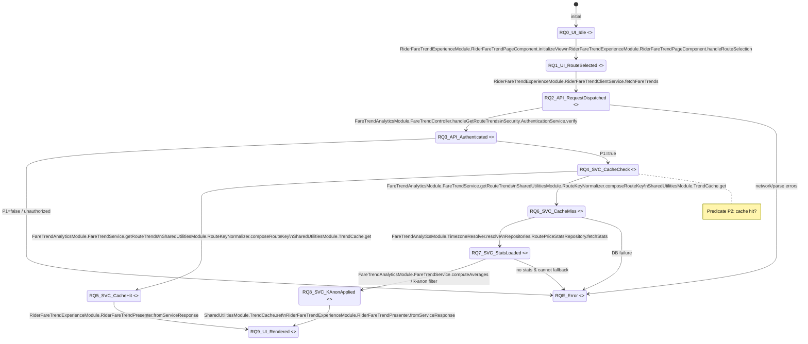
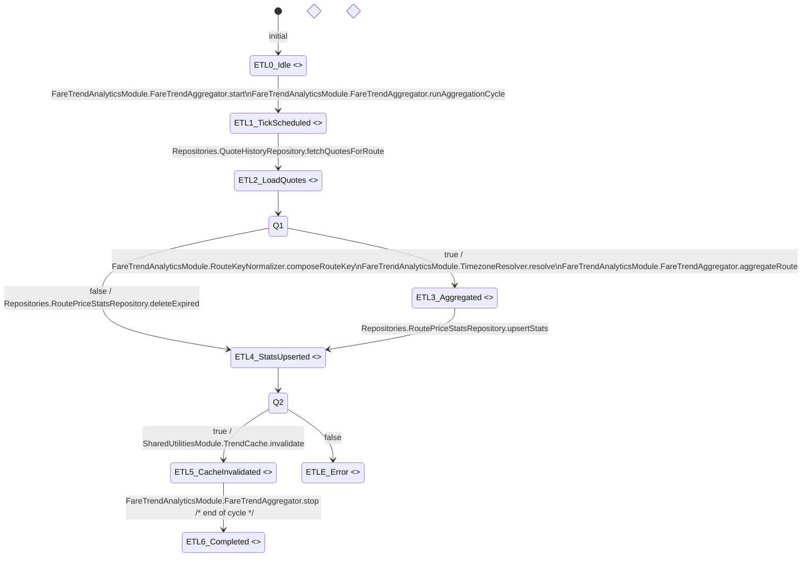
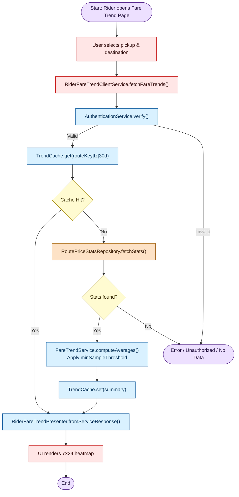
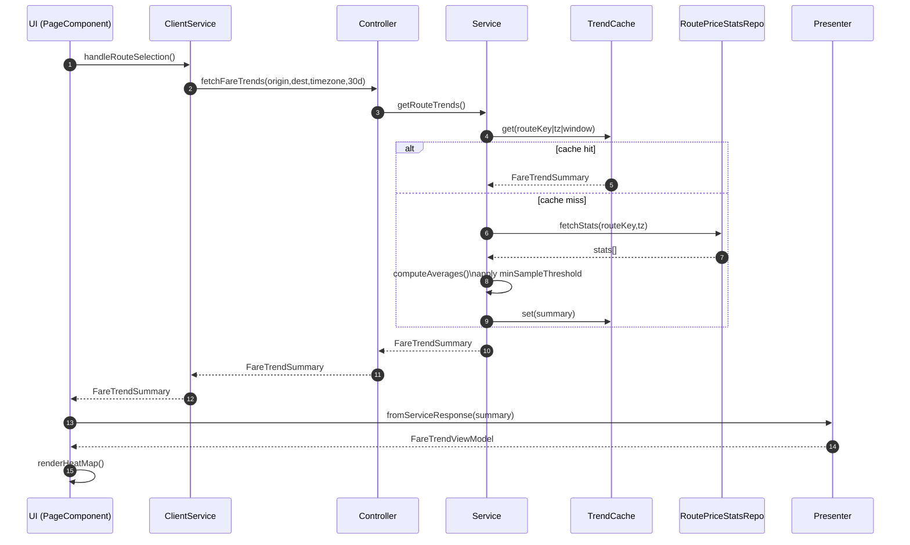
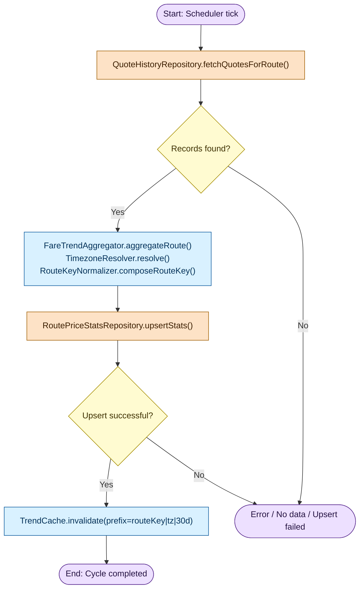
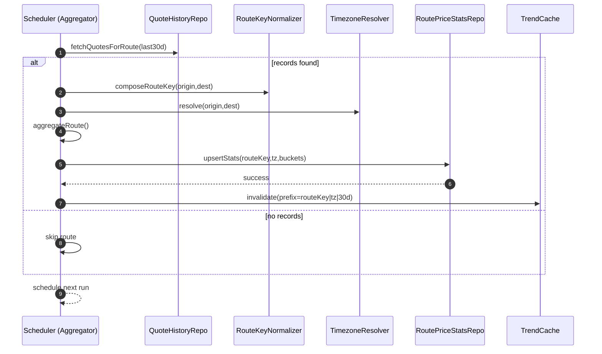

# **Header**

Header Title: Development Specification: Ride Price Trends Feature 

Version & Date: v1.0 – Oct 30, 2025 

Authors & Roles: Yena Wu – Product Manager (requirements)

# **Architecture Diagram**

```mermaid
graph TB
  %% ---- Visual Classes (colors) ----
  classDef module fill:#E0E0E0,stroke:#4A4A4A,color:#1C1C1C;
  classDef frontend fill:#FFE6E6,stroke:#C40C0C,color:#2D0000;
  classDef viewmodel fill:#FFFBD1,stroke:#A68C00,color:#3D3000;
  classDef clientService fill:#E0F7F4,stroke:#00796B,color:#00352F;
  classDef controller fill:#E6ECFF,stroke:#2030A0,color:#0D1540;
  classDef service fill:#D9F1FF,stroke:#0A589C,color:#033158;
  classDef repository fill:#FDE2C6,stroke:#A05E00,color:#3B1E00;
  classDef scheduler fill:#EDE0FF,stroke:#5C2E91,color:#241240;

  %% =========================
  %% Rider Fare Trend Experience Module
  %% =========================
  subgraph RiderFareTrendExperienceModule ["RiderFareTrendExperienceModule Rider Fare Trend Experience Module"]
    direction TB

    RiderFareTrendExperience0["RiderFareTrendExperience0 Experience Module Container<br/>Fields<br/>——————————————————<br/>- containedElements: string list<br/>Methods<br/>——————————————————<br/>- describeComposition(): void"]:::module

    RiderFareTrendExperience1["RiderFareTrendExperience1 Rider Fare Trend Page Component<br/>Fields<br/>——————————————————<br/>- trendData: FareTrendViewModel | null<br/>- pickupCoordinate: CoordinatePair<br/>- destinationCoordinate: CoordinatePair<br/>- selectedTimeWindow: TimeWindowSelection (default=Last30Days)<br/>- selectedTimezone: string<br/>- loadingIndicator: boolean<br/>- errorMessage: string | null<br/>Methods<br/>——————————————————<br/>- initializeView(): void<br/>- handleRouteSelection(): void<br/>- handleTimeWindowChange(): void<br/>- requestTrendData(): void<br/>- renderHeatMap(): void<br/>- renderInsightsPanel(): void"]:::frontend

    RiderFareTrendExperience2["RiderFareTrendExperience2 Rider Fare Trend View Model<br/>Fields<br/>——————————————————<br/>- dailyTimeBuckets: FareTrendBucketList (7x24)<br/>- cheapestBucket: FareTrendBucket | null<br/>- highestCostBucket: FareTrendBucket | null<br/>- averageFareAcrossAllBuckets: number<br/>- insufficientDataThreshold: number (k-anon)<br/>- timezoneLabel: string<br/>Methods<br/>——————————————————<br/>(no methods)"]:::viewmodel

    RiderFareTrendExperience4["RiderFareTrendExperience4 Rider Fare Trend Presenter<br/>Fields<br/>——————————————————<br/>- none: null<br/>Methods<br/>——————————————————<br/>- fromServiceResponse(): FareTrendViewModel<br/>- bucketByDayOfWeek(): FareTrendBucketList<br/>- identifyCheapestWindow(): FareTrendBucket | null<br/>- identifyCostliestWindow(): FareTrendBucket | null"]:::frontend

    RiderFareTrendExperience3["RiderFareTrendExperience3 Rider Fare Trend Client Service<br/>Fields<br/>——————————————————<br/>- serviceEndpointAddress: string (/v1/insights/route-prices)<br/>- credentialProvider: AuthenticationTokenProvider<br/>- networkClient: NetworkClient<br/>Methods<br/>——————————————————<br/>- fetchFareTrends(origin,dest,timezone,window='30d'): Promise&lt;FareTrendSummary&gt;<br/>- constructRequestAddress(): string<br/>- includeAuthorizationHeader(): Record&lt;string,string&gt;<br/>- handleErrorResponse(): never"]:::clientService
  end

  %% =========================
  %% Fare Trend Analytics Module
  %% =========================
  subgraph FareTrendAnalyticsModule ["FareTrendAnalyticsModule Fare Trend Analytics Module"]
    direction TB

    FareTrendAnalytics0["FareTrendAnalytics0 Analytics Module Container<br/>Fields<br/>——————————————————<br/>- containedElements: string list<br/>Methods<br/>——————————————————<br/>- describeComposition(): void"]:::module

    FareTrendAnalytics1["FareTrendAnalytics1 Fare Trend Controller<br/>Fields<br/>——————————————————<br/>- fareTrendService: FareTrendService<br/>- requestSchema: FareTrendRequestSchema<br/>Methods<br/>——————————————————<br/>- registerHypertextHandlers(): void<br/>- handleGetRouteTrends(): Promise&lt;void&gt;  /* GET /v1/insights/route-prices */<br/>- parseRouteCoordinates(): RouteSpecification<br/>- buildResponseModel(): FareTrendPresentation"]:::controller

    FareTrendAnalytics2["FareTrendAnalytics2 Fare Trend Service<br/>Fields<br/>——————————————————<br/>- trendRepository: FareTrendRepository  /* read model */<br/>- quoteHistoryRepository: QuoteHistoryRepository  /* raw quotes/trips */<br/>- trendCacheMap: Map&lt;RouteTimeKeyString,FareTrendSummary&gt; | CacheClient<br/>- bucketConfiguration: BucketConfiguration {dow:7,hour:24}<br/>- timezoneResolver: TimezoneResolver<br/>- routeKeyNormalizer: RouteKeyNormalizer<br/>- minSampleThreshold: number (k-anon)<br/>Methods<br/>——————————————————<br/>- getRouteTrends(route,timezone,window): Promise&lt;FareTrendSummary&gt;<br/>- computeAveragesForBuckets(records): FareTrendBucketList<br/>- bucketizeQuotes(records): Map&lt;RouteTimeKeyString,FareTrendBucket&gt;<br/>- invalidateCacheForRoute(routeKey): void<br/>- persistFreshAggregations(summary): Promise&lt;void&gt;"]:::service

    %% ---- Read model for fast lookups (30d rolling) ----
    FareTrendStatsRepo["FareTrendAnalytics6 Route Price Stats Repository (30d Read Model)<br/>Fields<br/>——————————————————<br/>- databaseClient: PrismaClient<br/>- tableName: RoutePriceStats_30d<br/>- primaryKey: (route_key, tz, product_type, dow, hour)<br/>Methods<br/>——————————————————<br/>- fetchStats(routeKey,tz): Promise&lt;FareTrendBucketList&gt;<br/>- upsertStats(buckets): Promise&lt;void&gt;<br/>- deleteExpired(): Promise&lt;number&gt;"]:::repository

    FareTrendAnalytics3["FareTrendAnalytics3 Fare Trend Repository (Deprecated direct agg store)<br/>Fields<br/>——————————————————<br/>- databaseClient: PrismaClient<br/>- tableName: string<br/>Methods<br/>——————————————————<br/>- fetchAggregatedTrends(): Promise&lt;FareTrendBucketList&gt;<br/>- saveAggregatedTrends(): Promise&lt;void&gt;<br/>- deleteExpiredAggregations(): Promise&lt;number&gt;"]:::repository

    FareTrendAnalytics4["FareTrendAnalytics4 Quote History Repository<br/>Fields<br/>——————————————————<br/>- databaseClient: PrismaClient<br/>- tableName: QuoteHistory<br/>Methods<br/>——————————————————<br/>- appendQuoteRecord(): Promise&lt;void&gt;<br/>- fetchQuotesForRoute(routeKey,lookbackDays): Promise&lt;QuoteHistoryRecord[]&gt;<br/>- purgeOlderThan(days): Promise&lt;number&gt;"]:::repository

    FareTrendAnalytics5["FareTrendAnalytics5 Fare Trend Aggregator (Scheduler/ETL)<br/>Fields<br/>——————————————————<br/>- scheduleIdentifier: SchedulerHandle | null<br/>- lookbackWindowDays: number (30)<br/>- aggregationIntervalMinutes: number (60)<br/>- statsRepository: Route Price Stats Repository<br/>- quoteHistoryRepository: QuoteHistoryRepository<br/>- timezoneResolver: TimezoneResolver<br/>- routeKeyNormalizer: RouteKeyNormalizer<br/>- outlierPolicy: Winsorize(1%,99%)<br/>Methods<br/>——————————————————<br/>- start(): void<br/>- stop(): void<br/>- runAggregationCycle(): Promise&lt;void&gt;<br/>- aggregateRoute(routeKey): Promise&lt;void&gt;<br/>- upsertDailyBuckets(buckets): Promise&lt;void&gt;"]:::scheduler
  end

  %% =========================
  %% Shared Utilities Module
  %% =========================
  subgraph SharedUtilitiesModule ["SharedUtilitiesModule Shared Utilities"]
    direction TB
    RouteKeyNormalizer["RouteKeyNormalizer Utility<br/>Fields<br/>——————————————————<br/>- h3Resolution: number | radiusMeters<br/>Methods<br/>——————————————————<br/>- composeRouteKey(origin,dest): RouteKeyString"]:::service

    TimezoneResolver["TimezoneResolver Utility<br/>Fields<br/>——————————————————<br/>- provider: TZDB | MapsTZ<br/>Methods<br/>——————————————————<br/>- resolve(origin,dest,override?): string"]:::service

    TrendCache["TrendCache Layer (Redis/CDN)<br/>Fields<br/>——————————————————<br/>- ttlMinutes: number (15)<br/>Methods<br/>——————————————————<br/>- get(key): FareTrendSummary | null<br/>- set(key,value): void<br/>- invalidate(prefix): void"]:::service
  end

  %% =========================
  %% Ride Quotation Module
  %% =========================
  subgraph RideQuotationModule ["RideQuotationModule Ride Quotation Module"]
    direction TB

    RideQuotation0["RideQuotation0 Quotation Module Container<br/>Fields<br/>——————————————————<br/>- containedElements: string list<br/>Methods<br/>——————————————————<br/>- describeComposition(): void"]:::module

    RideQuotation1["RideQuotation1 Quote Service<br/>Fields<br/>——————————————————<br/>- statelessMarker: string (&quot;no stored fields&quot;)<br/>Methods<br/>——————————————————<br/>- getQuote(): Promise&lt;FareQuote&gt;<br/>- recordQuoteForTrendAnalysis(fare,origin,dest,productType): Promise&lt;void&gt;<br/>- composeRouteKey(origin,dest): RouteKeyString"]:::service
  end

  %% =========================
  %% Containment Links (container boxes connect to classes they contain)
  %% =========================
  RiderFareTrendExperience0 --> RiderFareTrendExperience1
  RiderFareTrendExperience0 --> RiderFareTrendExperience2
  RiderFareTrendExperience0 --> RiderFareTrendExperience4
  RiderFareTrendExperience0 --> RiderFareTrendExperience3

  FareTrendAnalytics0 --> FareTrendAnalytics1
  FareTrendAnalytics0 --> FareTrendAnalytics2
  FareTrendAnalytics0 --> FareTrendStatsRepo
  FareTrendAnalytics0 --> FareTrendAnalytics3
  FareTrendAnalytics0 --> FareTrendAnalytics4
  FareTrendAnalytics0 --> FareTrendAnalytics5

  RideQuotation0 --> RideQuotation1

  SharedUtilitiesModule --> RouteKeyNormalizer
  SharedUtilitiesModule --> TimezoneResolver
  SharedUtilitiesModule --> TrendCache

  %% =========================
  %% Functional Relations
  %% =========================
  %% Frontend
  RiderFareTrendExperience1 --> RiderFareTrendExperience3
  RiderFareTrendExperience1 --> RiderFareTrendExperience4
  RiderFareTrendExperience4 --> RiderFareTrendExperience2

  %% API path
  RiderFareTrendExperience3 --> FareTrendAnalytics1

  %% Controller -> Service
  FareTrendAnalytics1 --> FareTrendAnalytics2

  %% Service -> Read model / cache / utils
  FareTrendAnalytics2 --> FareTrendStatsRepo
  FareTrendAnalytics2 -. tz .-> TrendCache
  FareTrendAnalytics2 -. tz .-> TimezoneResolver
  FareTrendAnalytics2 -. routeKey .-> RouteKeyNormalizer

  %% ETL scheduler
  FareTrendAnalytics5 --> FareTrendAnalytics4
  FareTrendAnalytics5 --> FareTrendStatsRepo
  FareTrendAnalytics5 -. tz .-> TimezoneResolver
  FareTrendAnalytics5 -. routeKey .-> RouteKeyNormalizer
  FareTrendAnalytics5 -.-> FareTrendAnalytics2

  %% Raw data producer
  RideQuotation1 --> FareTrendAnalytics4
  RideQuotation1 -. routeKey .-> RouteKeyNormalizer
```



## **Legend**

* **Module (gray): Logical container grouping related components.**

* **Frontend (red): Rider UI (page, presenter, client service).**

* **ViewModel (yellow): Data prepared for UI (7×24 buckets, cheapest window).**

* **Client Service (teal): Calls backend endpoint `/v1/insights/route-prices`.**

* **Controller (indigo): HTTP handler, validates inputs, shapes response.**

* **Service (blue): Domain logic (route key, timezone, bucketing, averages, cache).**

* **Repository (tan): Data access (raw quotes/trips; RoutePriceStats\_30d read model).**

* **Scheduler (violet): ETL/aggregation over last 30 days (hourly), writes stats.**

**Notational arrows**

* **Solid →: synchronous call or data flow**

* **Dashed `-.->`: dependency/utility (cache, tz, route key)**

* **Labels (e.g., `tz`, `routeKey`, `cache`) clarify the purpose of dashed dependencies.**

---

## **Module Locations Summary**

* **RideQuotationModule**

  * **`Quote Service.recordQuoteForTrendAnalysis` emits quote/trip facts with `route_key` (via RouteKeyNormalizer).**

  * **Source of truth for price samples used in trends.**

* **SharedUtilitiesModule**

  * **RouteKeyNormalizer: canonicalizes origin/destination into `route_key` so UI queries and ETL agree.**

  * **TimezoneResolver: ensures Day-of-Week and Hour buckets respect rider’s local timezone (origin or user setting).**

  * **TrendCache: short-TTL cache for heatmap results, keeping P95 latency low.**

* **FareTrendAnalyticsModule**

  * **Quote History Repository: stores raw quotes/trips (≥30 days).**

  * **Fare Trend Aggregator (Scheduler/ETL): hourly rollups over last 30 days, outlier handling (winsorize), writes to Route Price Stats Repository (RoutePriceStats\_30d) with keys `(route_key, tz, product_type, dow, hour)`.**

  * **Fare Trend Service: on request:**

    1. **normalizes `(origin,dest)` → `route_key`, resolves `tz`;**

    2. **checks TrendCache;**

    3. **fetches pre-aggregated 7×24 buckets from RoutePriceStats\_30d;**

    4. **enforces `minSampleThreshold` (k-anonymity);**

    5. **returns a compact summary to the controller.**

  * **Fare Trend Controller: exposes GET `/v1/insights/route-prices` used by the client.**

* **RiderFareTrendExperienceModule**

  * **Client Service calls the endpoint with O/D, timezone, and `window=30d`.**

  * **Presenter adapts to a 7×24 heatmap (avg per bucket, cheapest/costliest windows, counts).**

  * **View Model includes `timezoneLabel` and `insufficientDataThreshold` for UX clarity.**

# **Class Diagram**  
  ```mermaid
classDiagram
  direction TB

  %% =======================
  %% Client / Presentation side
  %% =======================
  class RiderFareTrendPageComponent {
    <<frontend component>>
    +initializeView()
    +handleRouteSelection()
    +handleTimeWindowChange()
    +requestTrendData()
    +renderHeatMap()
    +renderInsightsPanel()
  }

  class RiderFareTrendPresenter {
    <<presenter>>
    +fromServiceResponse(summary: FareTrendSummary): FareTrendViewModel
    +identifyCheapest(buckets: FareTrendBucket[]): FareTrendBucket
    +identifyCostliest(buckets: FareTrendBucket[]): FareTrendBucket
  }

  class RiderFareTrendClientService {
    <<client service>>
    +fetchFareTrends(route: RouteSpecification, timezone: string, window: TimeWindowSelection): FareTrendSummary
  }

  class FareTrendViewModel {
    <<view model>>
    +dailyTimeBuckets: FareTrendBucket[]
    +cheapestBucket: FareTrendBucket
    +highestCostBucket: FareTrendBucket
    +averageFareAcrossAllBuckets: number
    +timezoneLabel: string
    +insufficientDataThreshold: number
  }

  %% =======================
  %% Web / Server side
  %% =======================
  class FareTrendController {
    <<controller>>
    +handleGetRouteTrends(req, res): FareTrendSummary
    +parseRouteCoordinates(req): RouteSpecification
  }

  class FareTrendService {
    <<service>>
    +getRouteTrends(route: RouteSpecification, timezone: string, window: TimeWindowSelection): FareTrendSummary
    +computeAverages(records: QuoteHistoryRecord[], timezone: string): FareTrendBucket[]
    +bucketize(records: QuoteHistoryRecord[], timezone: string): Map~string, FareTrendBucket~
    +invalidateCache(routeKey: string, timezone: string): void
  }

  %% New read model repository (30d materialized stats)
  class RoutePriceStatsRepository {
    <<repository (read model)>>
    +fetchStats(routeKey: string, timezone: string): FareTrendBucket[]
    +upsertStats(routeKey: string, timezone: string, buckets: FareTrendBucket[]): void
    +deleteExpired(expirationDate: Date): number
  }

  class QuoteHistoryRepository {
    <<repository (raw facts)>>
    +appendQuoteRecord(record: QuoteHistoryRecord): void
    +fetchQuotesForRoute(routeKey: string, start: Date, end: Date): QuoteHistoryRecord[]
    +purgeOlderThan(cutoff: Date): number
  }

  class FareTrendAggregator {
    <<scheduler / ETL>>
    +start(): void
    +stop(): void
    +runAggregationCycle(): void
    +aggregateRoute(routeKey: string): void
    +upsertDailyBuckets(routeKey: string, timezone: string, buckets: FareTrendBucket[]): void
    -lookbackWindowDays: number
    -aggregationIntervalMinutes: number
    -outlierPolicy: OutlierPolicy
  }

  %% Utilities introduced by the new architecture
  class RouteKeyNormalizer {
    <<utility>>
    +composeRouteKey(pickup: CoordinatePair, destination: CoordinatePair): string
  }

  class TimezoneResolver {
    <<utility>>
    +resolve(pickup: CoordinatePair, destination: CoordinatePair, override?: string): string
  }

  class TrendCache {
    <<cache>>
    +get(key: string): FareTrendSummary
    +set(key: string, value: FareTrendSummary, ttlMinutes: number): void
    +invalidate(prefix: string): void
  }

  class PricingService {
    <<shared service>>
    +estimate(pickup: CoordinatePair, destination: CoordinatePair): PriceEstimate
    +applyDiscount(baseAmount: number, percent: number): DiscountResult
  }

  class LocationService {
    <<shared service>>
    +eta(pickup: CoordinatePair, destination: CoordinatePair): number
  }

  class AuthenticationService {
    <<shared service>>
    +required(): void
    +optional(): void
    +requireRole(): void
    +verify(): JwtPayloadOrNull
  }

  %% =======================
  %% Data layer
  %% =======================
  class PrismaClient {
    <<data platform>>
    +query(sql: string): unknown
    +transaction(): unknown
  }

  class PostgresDatabase {
    <<database>>
    +executeStatement(sql: string): ResultSet
  }

  %% =======================
  %% Domain data classes
  %% =======================
  class RouteSpecification {
    <<data>>
    +pickup: CoordinatePair
    +destination: CoordinatePair
  }

  class TimeWindowSelection {
    <<data>>
    +windowDays: number  // default 30
  }

  class FareTrendSummary {
    <<data>>
    +routeKey: string
    +timezone: string
    +windowDays: number
    +generatedAt: Date
    +insufficientDataThreshold: number
    +buckets: FareTrendBucket[]
  }

  class FareTrendBucket {
    <<data>>
    +dayOfWeek: int    // 0..6
    +hour: int         // 0..23
    +averageFareCents: int
    +rideCount: int
    +p50Cents: int
    +p90Cents: int
  }

  class QuoteHistoryRecord {
    <<data>>
    +quoteId: string
    +routeKey: string
    +amountCents: int
    +currency: string
    +productType: string
    +startTime: Date
  }

  %% =======================
  %% Value types
  %% =======================
  class PriceEstimate {
    <<value>>
    +amount: number
    +surge: number
    +currency: string
  }

  class DiscountResult {
    <<value>>
    +discountedAmount: number
    +savings: number
  }

  class JwtPayloadOrNull {
    <<value>>
    +present: boolean
    +payload?: string
  }

  class OutlierPolicy {
    <<value>>
    +method: string  // e.g., "winsorize"
    +lower: float
    +upper: float
  }

  %% =======================
  %% Associations (usage/aggregation; NOT inheritance)
  %% =======================
  RiderFareTrendPageComponent --> RiderFareTrendClientService : requests
  RiderFareTrendPageComponent --> RiderFareTrendPresenter : uses
  RiderFareTrendPageComponent --> FareTrendViewModel : displays
  RiderFareTrendPresenter --> FareTrendSummary : transforms
  RiderFareTrendPresenter --> FareTrendViewModel : builds
  RiderFareTrendClientService --> TimezoneResolver : resolves tz (client-side optional)
  RiderFareTrendClientService --> FareTrendController : calls API

  FareTrendController --> AuthenticationService : auth
  FareTrendController --> FareTrendService : delegates
  FareTrendController --> RouteSpecification : parses

  FareTrendService --> RoutePriceStatsRepository : reads    %% read model
  FareTrendService --> QuoteHistoryRepository : reads (fallback/recompute)
  FareTrendService --> TrendCache : caches
  FareTrendService --> RouteKeyNormalizer : normalizes
  FareTrendService --> TimezoneResolver : tz bucketing
  FareTrendService --> PricingService : uses
  FareTrendService --> LocationService : uses
  FareTrendService --> FareTrendSummary : returns
  FareTrendService --> TimeWindowSelection : uses
  FareTrendService --> QuoteHistoryRecord : reads

  FareTrendAggregator --> RoutePriceStatsRepository : upserts
  FareTrendAggregator --> QuoteHistoryRepository : reads
  FareTrendAggregator --> QuoteHistoryRecord : aggregates
  FareTrendAggregator --> TimezoneResolver : tz bucketing
  FareTrendAggregator --> RouteKeyNormalizer : route key
  FareTrendAggregator --> OutlierPolicy : uses

  RoutePriceStatsRepository --> PrismaClient : uses
  QuoteHistoryRepository --> PrismaClient : uses
  PrismaClient --> PostgresDatabase : connects

  FareTrendSummary --> FareTrendBucket : aggregates

  RiderFareTrendClientService --> TimeWindowSelection : uses
```
     
     
# **List of Classes**

   ## **1\) Rider Fare Trend Experience Module (Frontend)**

* **SA3.1.1 — RiderFareTrendPageComponent**  
   **Purpose:** Page-level UI container that orchestrates route selection, window selection (30d), and rendering of the 7×24 heatmap and insights.  
   **Implements:** FTI-30D-HEATMAP; OP-GET-ROUTE-TRENDS (client side invocation).

* **SA3.1.2 — RiderFareTrendPresenter**  
   **Purpose:** Adapts service summary into a view-friendly 7×24 model; computes cheapest/costliest buckets client-side for display.  
   **Implements:** FTI-30D-HEATMAP.

* **SA3.1.3 — RiderFareTrendClientService**  
   **Purpose:** Calls backend endpoint with route \+ **timezone** \+ **30-day window**; handles auth and error mapping.  
   **Implements:** FTI-30D-HEATMAP; OP-GET-ROUTE-TRENDS.

* **SA3.1.4 — FareTrendViewModel**  
   **Purpose:** View data for the heatmap (7×24 buckets), including timezone label and k-anonymity threshold for UX.  
   **Implements:** FTI-30D-HEATMAP; OP-PRIVACY-KANON.

  ---

  ## **2\) Fare Trend Analytics Module (Backend Web/API)**

* **SA3.2.1 — FareTrendController**  
   **Purpose:** HTTP boundary; validates inputs; parses route; forwards to service; returns `FareTrendSummary`.  
   **Implements:** OP-GET-ROUTE-TRENDS.

* **SA3.2.2 — FareTrendService**  
   **Purpose:** Core domain orchestration for trend reads: normalizes route, resolves timezone, uses cache, fetches pre-aggregated stats, enforces k-anonymity.  
   **Implements:** FTI-30D-HEATMAP; OP-GET-ROUTE-TRENDS; OP-CACHE-TRENDS; OP-NORMALIZE-ROUTE; OP-RESOLVE-TZ; OP-PRIVACY-KANON.

  ---

  ## **3\) Repositories (Data Access)**

* **SA3.3.1 — RoutePriceStatsRepository**  
   **Purpose:** Read-optimized, **30-day materialized** stats per `(routeKey, tz, dow, hour)`; primary read path for the API.  
   **Implements:** FTI-30D-HEATMAP; OP-GET-ROUTE-TRENDS; OP-AGG-ROLLUP-30D.

* **SA3.3.2 — QuoteHistoryRepository**  
   **Purpose:** Raw quote/trip facts store (append-only), queried by ETL and optionally for recompute.  
   **Implements:** OP-RECORD-QUOTE; OP-AGG-ROLLUP-30D.

* **SA3.3.3 — PrismaClient**  
   **Purpose:** Data platform adapter used by repositories for DB access.  
   **Implements:** (infrastructure support).

* **SA3.3.4 — PostgresDatabase**  
   **Purpose:** Physical database abstraction for executing SQL.  
   **Implements:** (infrastructure support).

  ---

  ## **4\) Scheduler / ETL**

* **SA3.4.1 — FareTrendAggregator**  
   **Purpose:** Periodic ETL that reads last 30–35 days of raw facts, resolves timezone, buckets by DOW×hour, applies outlier policy, and upserts to the read model.  
   **Implements:** FTI-30D-HEATMAP; OP-AGG-ROLLUP-30D; OP-NORMALIZE-ROUTE; OP-RESOLVE-TZ.

  ---

  ## **5\) Shared Utilities**

* **SA3.5.1 — RouteKeyNormalizer**  
   **Purpose:** Canonicalize `(pickup,destination)` to a stable `routeKey` (e.g., H3 bins \+ radius), used consistently by write and read paths.  
   **Implements:** OP-NORMALIZE-ROUTE.

* **SA3.5.2 — TimezoneResolver**  
   **Purpose:** Determine the timezone used for bucketing (origin/user preference), ensuring correct DOW/hour computation.  
   **Implements:** OP-RESOLVE-TZ.

* **SA3.5.3 — TrendCache**  
   **Purpose:** Short-TTL cache for `FareTrendSummary`, keyed by `(routeKey|tz|windowDays)` to reduce read latency.  
   **Implements:** OP-CACHE-TRENDS.

  ---

  ## **6\) Ride Quotation Module**

* **SA3.6.1 — PricingService**  
   **Purpose:** Compute live/estimated fare amounts and apply discounts; orthogonal to analytics but used upstream of fact capture.  
   **Implements:** (pricing features; supportive to OP-RECORD-QUOTE).

* **SA3.6.2 — LocationService**  
   **Purpose:** Travel/ETA estimates; supportive context for pricing (not directly used in aggregation math).  
   **Implements:** (support feature).

* **SA3.6.3 — AuthenticationService**  
   **Purpose:** Security boundary (JWT verification, role checks) for API routes.  
   **Implements:** OP-GET-ROUTE-TRENDS (security).

  ---

  ## **7\) Data Storage Classes (Structs)**

These are **data/DTO/value** objects only (no behavior beyond trivial helpers).

* **SA3.7.1 — RouteSpecification**  
   **Purpose:** Input DTO carrying pickup/destination for trend or pricing requests.  
   **Implements:** OP-GET-ROUTE-TRENDS (request parsing).

* **SA3.7.2 — TimeWindowSelection**  
   **Purpose:** Encodes the day-window for analysis (**default=30**).  
   **Implements:** OP-GET-ROUTE-TRENDS; OP-AGG-ROLLUP-30D.

* **SA3.7.3 — FareTrendSummary**  
   **Purpose:** Response DTO for the 7×24 heatmap including `routeKey`, `timezone`, `windowDays`, `generatedAt`, `buckets`, and k-anon threshold.  
   **Implements:** FTI-30D-HEATMAP; OP-GET-ROUTE-TRENDS; OP-PRIVACY-KANON.

* **SA3.7.4 — FareTrendBucket**  
   **Purpose:** A single (DOW, hour) cell with `averageFareCents`, `rideCount`, and optional distribution stats (`p50`, `p90`).  
   **Implements:** FTI-30D-HEATMAP.

* **SA3.7.5 — QuoteHistoryRecord**  
   **Purpose:** Raw fact of a produced/accepted quote or completed trip: `routeKey`, `amountCents`, `currency`, `productType`, `startTime`.  
   **Implements:** OP-RECORD-QUOTE; OP-AGG-ROLLUP-30D.

* **SA3.7.6 — PriceEstimate**  
   **Purpose:** Value object for live pricing results.  
   **Implements:** (pricing feature support).

* **SA3.7.7 — DiscountResult**  
   **Purpose:** Value object for discount application outcome.  
   **Implements:** (pricing feature support).

* **SA3.7.8 — JwtPayloadOrNull**  
   **Purpose:** Auth result container for controller gating.  
   **Implements:** OP-GET-ROUTE-TRENDS (security).

* **SA3.7.9 — OutlierPolicy**  
   **Purpose:** Config struct specifying outlier handling (e.g., winsorize lower/upper).  
   **Implements:** OP-AGG-ROLLUP-30D.
  
  ---

### **Legend for tags**

* **Feature tags**

  * **FTI-30D-HEATMAP** — Rider sees avg price by Day-of-Week × Hour for last 30 days.

* **Operation tags**

  * **OP-GET-ROUTE-TRENDS** — Public API to fetch 7×24 buckets.

  * **OP-AGG-ROLLUP-30D** — ETL aggregation over last 30 days, hourly.

  * **OP-RECORD-QUOTE** — Persist quotes/trips as raw facts for analytics.

  * **OP-CACHE-TRENDS** — Read-path caching of route-trend summaries.

  * **OP-NORMALIZE-ROUTE** — Canonicalize origin/destination into route key.

  * **OP-RESOLVE-TZ** — Determine timezone used for bucketization.

  * **OP-PRIVACY-KANON** — K-anonymity thresholding on buckets.

# State diagram

## **System State (Data Fields)**

These fields together constitute “the system state” across the read path (rider-facing query) and the ETL path (30-day rollup). They’re grouped by scope.

### **A. Request/Session (volatile, per call)**

* `pickup: CoordinatePair`

* `destination: CoordinatePair`

* `timezone: string` (explicit from client or resolved at server)

* `windowDays: number` (default 30\)

* `authToken: string | null`

* `jwt: JwtPayloadOrNull`

### **B. Derived (per call / per job)**

* `routeKey: string`

* `now: DateTime`

* `lookbackStart: DateTime = now - windowDays`

* `bucketConfig = { dow: 7, hour: 24 }`

### **C. Persistent Stores**

* **QuoteHistory** (raw facts)

  * `quoteId: string`

  * `routeKey: string`

  * `amountCents: int`

  * `currency: string`

  * `productType: string`

  * `startTime: DateTime`

* **RoutePriceStats\_30d** (read model)

  * `routeKey: string`

  * `tz: string`

  * `productType: string`

  * `dow: 0..6`

  * `hour: 0..23`

  * `avgPriceCents: int`

  * `p50Cents: int`

  * `p90Cents: int`

  * `sampleCount: int`

  * `lastUpdatedAt: DateTime`

### **D. Cache / Config / Control**

* **TrendCache**

  * `key = hash(routeKey|tz|windowDays|productType)`

  * `value = FareTrendSummary`

  * `ttlMinutes: number`

* **OutlierPolicy**: `{ method: "winsorize", lower: float, upper: float }`

* **minSampleThreshold: number\`** (k-anonymity)

* **Scheduler state**

  * `lookbackWindowDays: number`

  * `aggregationIntervalMinutes: number`

  * `nextRunAt: DateTime`

  * `lastRunAt: DateTime | null`

### **E. Response (computed)**

* **FareTrendSummary**

  * `routeKey: string`

  * `timezone: string`

  * `windowDays: number`

  * `generatedAt: DateTime`

  * `insufficientDataThreshold: number`

  * `buckets: FareTrendBucket[]`

* **FareTrendBucket**

  * `dayOfWeek: 0..6`

  * `hour: 0..23`

  * `averageFareCents: int`

  * `rideCount: int`

  * `p50Cents: int`

  * `p90Cents: int`

---

## **Scenario A — Rider Query (Read Path)**

**Initial state:** `RQ0_UI_Idle`  
 **Goal:** return a 7×24 heatmap (last 30 days, tz-aware), using cache or read model.

#### **States (unique names \+ actual system state)**

* **RQ0\_UI\_Idle** *(initial)*  
   UI loaded; `pickup,destination` unset; no network call yet.

* **RQ1\_UI\_RouteSelected**  
   UI holds `pickup,destination,timezone,windowDays`; `routeKey` not resolved yet.

* **RQ2\_API\_RequestDispatched**  
   HTTP request sent; server receives with `authToken`; awaiting controller.

* **RQ3\_API\_Authenticated**  
   `jwt.present = true`; request admitted to service.

* **RQ4\_SVC\_CacheCheck**  
   Cache probed with `key = (routeKey? unknown yet, tz, windowDays)`; service about to normalize/resolve.

* **RQ5\_SVC\_CacheHit**  
   `TrendCache.value != null` for derived `routeKey`; `summary` available.

* **RQ6\_SVC\_CacheMiss**  
   No cache entry; proceed to read model.

* **RQ7\_SVC\_StatsLoaded**  
   `statsRows > 0` from `RoutePriceStats_30d` for `(routeKey,tz)`.

* **RQ8\_SVC\_KAnonApplied**  
   All buckets tagged/filtered by `minSampleThreshold`; `summary` finalized.

* **RQ9\_UI\_Rendered**  
   Presenter has built `ViewModel`; heatmap displayed.

* **RQE\_Error**  
   Any failure (auth invalid, DB error, bad input).

#### **Decision predicates used**

* **P1:** `jwt.present?`

* **P2:** `TrendCache.get(key) != null ?`

* **P3:** `statsRows > 0 ?`

* **P4:** `∀b ∈ buckets: b.rideCount >= minSampleThreshold ?` (else flag/omit low-n cells)



**Actual state annotations inside transitions**

* After `RouteKeyNormalizer.composeRouteKey`, `routeKey` is known.

* After `RoutePriceStatsRepository.fetchStats`, `statsRows` are loaded.

* After `TrendCache.set`, cache contains latest `summary`.

## **Scenario B — ETL Aggregation (30-Day Rollup)**

**Initial state:** `ETL0_Idle`  
 **Goal:** refresh `RoutePriceStats_30d` from `QuoteHistory`, apply outlier policy, and invalidate cache.

#### **States (unique names \+ actual system state)**

* **ETL0\_Idle** *(initial)*  
   Scheduler waiting; `nextRunAt` in future.

* **ETL1\_TickScheduled**  
   Time reached; cycle starts with `now`, `lookbackStart = now − lookbackWindowDays`.

* **ETL2\_LoadQuotes**  
   For each `routeKey`, raw facts loaded for `[lookbackStart, now]`; `records.length >= 0`.

* **ETL3\_Aggregated**  
   Records bucketed (DOW×Hour) with `TimezoneResolver`; outliers handled via `OutlierPolicy`.

* **ETL4\_StatsUpserted**  
   Upserted into `RoutePriceStats_30d`; `lastUpdatedAt = now`.

* **ETL5\_CacheInvalidated**  
   `TrendCache.invalidate(prefix = routeKey|tz|windowDays)` executed.

* **ETL6\_Completed**  
   Cycle finished; `lastRunAt = now`.

* **ETLE\_Error**  
   Any failure (DB read/write, compute).

#### **Decision predicates**

* **Q1:** `records.length > 0 ?`

* **Q2:** `upsert succeeded ?`



**Actual state annotations inside transitions**

* After `fetchQuotesForRoute`, `records` are materialized for the 30-day window.

* After `aggregateRoute`, computed buckets (avg/p50/p90/count) exist in memory.

* After `upsertStats`, read model reflects latest buckets.

* After `TrendCache.invalidate`, user-visible reads will bypass stale entries.

---

## **Legend (for both diagrams)**

* **Stereotypes (angled brackets)**

  * `<<UI>>` — frontend page/presenter states

  * `<<API>>` — controller/auth boundary

  * `<<Service>>` / `<<Service/ETL>>` — domain/service logic

  * `<<Repo(Raw)>>` — QuoteHistory (raw facts) access

  * `<<Repo(ReadModel)>>` — RoutePriceStats\_30d read-model access

  * `<<Cache>>` — TrendCache operations

  * `<<Scheduler>>` — periodic ETL driver

  * `<<Error>>` — terminal error state

  * `<<choice>>` — decision nodes evaluated by labeled predicates

* **Initial node:** `[ * ]`

* **Edges:** labeled with **fully scoped methods** (`Module.Component.Class.method`) used to transition.

* **Decision labels (below states):**

  * **P1, P2, P3, P4** — read-path predicates

  * **Q1, Q2** — ETL-path predicates  
     Each outgoing edge is labeled with the predicate outcome (`true/false`) that leads to the destination.

 # **6\. Flow Chart**

 ### ** Flow Chart Overview **

The flow charts capture the **end-to-end behavioral logic** of the system, illustrating how user and system actions transition through functional states defined in the earlier **State Diagram** section.

Each flow chart depicts one complete scenario:

1. **Scenario A (FC3.1)** — *Rider Fare Trend Query*  
    The rider requests average route fares by time/day for the past 30 days.

2. **Scenario B (FC3.2)** — *Fare Trend ETL Aggregation (30-Day Rollup)*  
    The backend scheduler aggregates quotes/trips into daily/hourly buckets.

These flow charts collectively represent the union of the system’s possible state transitions.

---

### ** Scenario A: Rider Fare Trend Query (Label: FC3.1) **

#### ** Scenario Description **

**User Story:**  
 *As a rider planning my regular trips, I want to see the average price for my route broken down by day of week and time of day for the past month so that I can identify when rides are typically cheaper and plan flexible trips accordingly.*

This scenario starts when the rider opens the “Fare Trend” page and selects a route.  
 The flow continues through client → backend → service → data → response → rendering.  
 It ends when the UI displays a heatmap of prices bucketed by day/time for the last 30 days.

---

#### ** Flow Chart — Rider Fare Trend Query **



#### **Flow Explanation**

1. The rider opens the page and selects a route → `RiderFareTrendPageComponent.handleRouteSelection`.

2. The client service (`fetchFareTrends()`) sends the query to the backend controller.

3. `FareTrendController` authenticates via `AuthenticationService.verify()`.

4. `FareTrendService` checks the cache; if a cached result exists, it’s returned immediately.

5. If not cached, the service queries the **RoutePriceStatsRepository** for 30-day aggregated stats.

6. If data exists, it applies **k-anonymity** (filters low-sample buckets) and caches the summary.

7. The Presenter builds a **FareTrendViewModel** and the UI renders a 7×24 heatmap.

8. Errors at any point (invalid auth, missing stats) return error states in the UI.

---

#### ** Sequence Diagram — Rider Fare Trend Query **



#### **Explanation**

This sequence shows the end-to-end interaction between frontend and backend components.

* Cache hit path yields fast response (single network roundtrip).

* Cache miss triggers read-model access, local computation, and cache refresh.

* Presenter and ViewModel finalize the UI output.

---

### ** Scenario B: Fare Trend ETL Aggregation (Label: FC3.2) **

#### **Scenario Description**

**System Story:**  
 *As a backend scheduler, I aggregate all fare quotes from the last 30 days, group them by day of week and hour, apply outlier and k-anonymity filters, and update the RoutePriceStats repository so that riders can quickly retrieve historical averages.*

The scenario begins when the scheduler triggers its aggregation cycle and ends when it writes updated aggregates and invalidates outdated cache entries.

---

#### ** Flow Chart — Fare Trend ETL Aggregation**



#### **Flow Explanation**

1. Scheduler triggers the **FareTrendAggregator.runAggregationCycle()**.

2. Fetch all quote history records for each route within the last 30 days.

3. If records exist, normalize route keys and compute (DOW×hour) bucket aggregates using **TimezoneResolver**.

4. Upsert results into **RoutePriceStats\_30d**; if successful, invalidate related cache keys.

5. If upsert fails or no data is available, the process logs an error and exits.

---

#### ** Sequence Diagram — Fare Trend ETL Aggregation **



## ** Flow Chart Legend **

| Symbol | Meaning |
| ----- | ----- |
| **Rounded Rectangle** | Start / End (terminator) |
| **Rectangle** | Process or method execution |
| **Diamond** | Decision (predicate evaluation) |
| **Parallelogram** | Data access or repository operation |


# ** Possible Threats and Failures **

This section enumerates all identifiable failure modes within the **Rider Fare Trend Experience Module** and **Fare Trend Analytics Backend**, including their causes, impacts, detection/diagnostic methods, and recovery procedures.

Each failure mode has:

* A **unique label (FMx.y)** for cross-referencing.

* A **description** of the failure condition.

* A **recovery procedure** to restore the system to a sane configuration.

* A **diagnostic procedure reference** (for test specification linkage).

* **Likelihood** and **Impact** ratings (High / Medium / Low) based on operational and business risk.

  ---

  #### ** Legend **

| Field | Meaning |
| ----- | ----- |
| **Likelihood** | Estimated frequency of occurrence under normal operation. |
| **Impact** | Potential severity if the failure occurs (on user experience or business). |
| **Recovery Procedure** | The manual or automated process to restore system sanity. |
| **Diagnostics Ref.** | Cross-reference for detection and validation procedures in the test specification. |

  ---

  ## **1️⃣ Rider-Side Failures (Frontend / API Layer)**

  ### **FM1.1 — Authentication Failure**

**Description:**  
 User’s token expired or invalid when calling `/v1/insights/route-prices`. Request rejected by `AuthenticationService.verify()`.  
 **Impact:** Medium — user cannot see fare trends until re-authenticated.  
 **Likelihood:** Medium.  
 **Recovery Procedure:**

1. Force client re-login via `AuthenticationService.optional()` reissue flow.

2. Clear cached invalid token in `RiderFareTrendClientService`.

3. Retry the API request after new token retrieval.  
    **Diagnostics Ref.:** D-FM1.1 (verify `401 Unauthorized` logged by controller).

   ---

   ### **FM1.2 — Cache Desynchronization**

**Description:**  
 `TrendCache` holds stale or partially invalidated entries after ETL completes. Returned fare data is outdated.  
 **Impact:** High — incorrect trend data may mislead users.  
 **Likelihood:** Medium.  
 **Recovery Procedure:**

1. Force `TrendCache.invalidate(prefix=routeKey|tz|window)` after every successful `RoutePriceStatsRepository.upsertStats()`.

2. Add automated scheduled full cache flush every 6 hours.

3. Rehydrate cache from `RoutePriceStats_30d` on next read.  
    **Diagnostics Ref.:** D-FM1.2 (compare cache timestamp vs. DB `lastUpdatedAt` difference \> 6 hours).

   ---

   ### **FM1.3 — API Latency Spike / Timeout**

**Description:**  
 Excessive response latency (\>400ms) in `FareTrendService.getRouteTrends()` due to slow database or cache miss.  
 **Impact:** Medium — degraded UX, user perceives slowness.  
 **Likelihood:** Medium-High under peak load.  
 **Recovery Procedure:**

1. Introduce timeout guard in `RiderFareTrendClientService` with retry (max 2).

2. Optimize `RoutePriceStats_30d` indexes (`(routeKey,tz)`).

3. Enable async pre-warm caching on frequent routes.  
    **Diagnostics Ref.:** D-FM1.3 (alert if 95th percentile latency \> 400ms).

   ---

   ### **FM1.4 — Missing Route Stats**

**Description:**  
 `RoutePriceStatsRepository.fetchStats()` returns no rows for a valid route due to incomplete ETL coverage.  
 **Impact:** High — user sees blank heatmap.  
 **Likelihood:** Low-Medium.  
 **Recovery Procedure:**

1. Trigger incremental backfill via `FareTrendAggregator.aggregateRoute()` for that route.

2. Mark missing routes in ETL monitoring dashboard.

3. Retry API after successful aggregation.  
    **Diagnostics Ref.:** D-FM1.4 (monitor `statsRows == 0` metric).

   ---

   ### **FM1.5 — Timezone Mismatch / Incorrect Bucket Alignment**

**Description:**  
 `TimezoneResolver` misidentifies user’s timezone or uses wrong origin point, causing incorrect day/hour grouping.  
 **Impact:** Medium — heatmap visually inconsistent with user’s expectation.  
 **Likelihood:** Low.  
 **Recovery Procedure:**

1. Log all resolved timezones; manually verify anomalies.

2. Provide user-side override in query (`tz` param).

3. Correct resolver mapping (TZDB) and redeploy.  
    **Diagnostics Ref.:** D-FM1.5 (detect mismatched DOW distribution between user local vs. server computed).

   ---

   ### **FM1.6 — Frontend Data Rendering Failure**

**Description:**  
 `RiderFareTrendPresenter.fromServiceResponse()` or UI heatmap component fails due to malformed JSON (e.g., null bucket array).  
 **Impact:** Medium — UI broken for affected users.  
 **Likelihood:** Low.  
 **Recovery Procedure:**

1. Add JSON schema validation before rendering.

2. Display fallback message (“Data temporarily unavailable”).

3. Fix serialization in `FareTrendSummary`.  
    **Diagnostics Ref.:** D-FM1.6 (frontend error logs contain `TypeError: undefined buckets`).

   ---

---

   ## **2️⃣ Backend / Data Pipeline Failures**

   ### **FM2.1 — ETL Job Crash or Timeout**

**Description:**  
 `FareTrendAggregator.runAggregationCycle()` fails mid-run due to DB connectivity loss or memory exhaustion.  
 **Impact:** High — data freshness degraded; cache not invalidated.  
 **Likelihood:** Medium.  
 **Recovery Procedure:**

1. Detect failure via job heartbeat (scheduler monitor).

2. Retry aggregation job automatically after 10 minutes.

3. Resume from last successful `routeKey`.  
    **Diagnostics Ref.:** D-FM2.1 (job heartbeat alert if `lastRunAt` older than 2× interval).

   ---

   ### **FM2.2 — Outlier Policy Misconfiguration**

**Description:**  
 `OutlierPolicy` thresholds (e.g., Winsorize bounds) set incorrectly, resulting in distorted averages.  
 **Impact:** Medium-High — business metric corruption.  
 **Likelihood:** Low.  
 **Recovery Procedure:**

1. Roll back config to default bounds `{lower:0.01, upper:0.99}`.

2. Re-run ETL with corrected config.

3. Verify aggregated medians vs. raw sample medians.  
    **Diagnostics Ref.:** D-FM2.2 (cross-check aggregate mean vs. p50 variance threshold).

   ---

   ### **FM2.3 — Database Constraint Violation**

**Description:**  
 Primary key collision or schema mismatch during `RoutePriceStatsRepository.upsertStats()`.  
 **Impact:** High — ETL fails; stats unavailable.  
 **Likelihood:** Low.  
 **Recovery Procedure:**

1. Rollback transaction automatically.

2. Apply schema migration script.

3. Retry upsert.  
    **Diagnostics Ref.:** D-FM2.3 (log “unique constraint violation” errors in DB monitor).

   ---

   ### **FM2.4 — Data Skew or Overload**

**Description:**  
 Excessive quote volume for popular routes overwhelms `aggregateRoute()` memory capacity.  
 **Impact:** High — ETL stalls; partial updates.  
 **Likelihood:** Medium.  
 **Recovery Procedure:**

1. Partition ETL by route prefix (e.g., H3 region).

2. Apply streaming aggregation (batch window \= 5k rows).

3. Resume ETL cycle.  
    **Diagnostics Ref.:** D-FM2.4 (detect job duration \> 2× aggregationInterval).

   ---

   ### **FM2.5 — Cache Layer Outage**

**Description:**  
 Redis or CDN (TrendCache) unavailable; fallback to direct DB queries.  
 **Impact:** Medium — increased latency, higher DB load.  
 **Likelihood:** Medium-High.  
 **Recovery Procedure:**

1. Temporarily disable cache writes until service restored.

2. Scale DB read replicas to absorb load.

3. Reinstate cache and flush stale entries after recovery.  
    **Diagnostics Ref.:** D-FM2.5 (healthcheck: cache ping fails for \>5s).

   ---

   ### **FM2.6 — Quote History Loss or Corruption**

**Description:**  
 `QuoteHistoryRepository` entries truncated or corrupted due to failed write transactions.  
 **Impact:** High — historical data incomplete; analytics unreliable.  
 **Likelihood:** Low.  
 **Recovery Procedure:**

1. Restore `QuoteHistory` table from last daily backup.

2. Validate restored records using checksum and row counts.

3. Re-run ETL for affected window.  
    **Diagnostics Ref.:** D-FM2.6 (detect row count drop \>5% day-to-day).

   ---

---

   ## **3️⃣ Security & Privacy Threats**

   ### **FM3.1 — Unauthorized Data Access**

**Description:**  
 Missing or incorrect JWT verification allowing unauthorized users to access aggregated stats.  
 **Impact:** High (data leakage).  
 **Likelihood:** Low.  
 **Recovery Procedure:**

1. Revoke compromised tokens via Auth service.

2. Patch endpoint to enforce `AuthenticationService.required()`.

3. Audit access logs for abuse.  
    **Diagnostics Ref.:** D-FM3.1 (security audit detects unauthenticated requests served).

   ---

   ### **FM3.2 — Inference Risk from Small Samples**

**Description:**  
 Returned trend buckets with `rideCount < minSampleThreshold` expose potential individual behavior.  
 **Impact:** High — privacy violation.  
 **Likelihood:** Low.  
 **Recovery Procedure:**

1. Enforce strict K-anonymity filter (`n >= 5`).

2. Sanitize low-sample buckets (replace with “insufficient data”).

3. Re-publish sanitized summaries.  
    **Diagnostics Ref.:** D-FM3.2 (automated privacy checker flags low-count buckets).

   ---

   ### **FM3.3 — Injection / Input Validation Flaw**

**Description:**  
 Unescaped user inputs (coords, tz) lead to potential SQL injection or log poisoning.  
 **Impact:** High — security breach.  
 **Likelihood:** Medium-Low.  
 **Recovery Procedure:**

1. Enforce ORM parameterization (`PrismaClient.query()` sanitized).

2. Run code scan before release.

3. Patch vulnerable input fields.  
    **Diagnostics Ref.:** D-FM3.3 (static code analysis identifies unsafe query string interpolation).

   ---

---

   ## ** Failure Likelihood and Impact Matrix **

| Label | Failure Name | Likelihood | Impact | Overall Risk Level |
| ----- | ----- | ----- | ----- | ----- |
| FM1.1 | Authentication Failure | Medium | Medium | **Moderate** |
| FM1.2 | Cache Desynchronization | Medium | High | **High** |
| FM1.3 | API Latency Spike | Medium-High | Medium | **High** |
| FM1.4 | Missing Route Stats | Low-Medium | High | **High** |
| FM1.5 | Timezone Mismatch | Low | Medium | **Low** |
| FM1.6 | UI Rendering Failure | Low | Medium | **Low** |
| FM2.1 | ETL Job Crash | Medium | High | **High** |
| FM2.2 | Outlier Policy Misconfig | Low | Medium-High | **Medium** |
| FM2.3 | DB Constraint Violation | Low | High | **Medium** |
| FM2.4 | Data Skew / Overload | Medium | High | **High** |
| FM2.5 | Cache Layer Outage | Medium-High | Medium | **High** |
| FM2.6 | Quote History Corruption | Low | High | **High** |
| FM3.1 | Unauthorized Data Access | Low | High | **High** |
| FM3.2 | Inference Risk (Privacy) | Low | High | **High** |
| FM3.3 | Injection / Validation Flaw | Medium-Low | High | **High** |

# ** Technologies **


**This system integrates a range of established open-source and commercial technologies to support frontend visualization, backend analytics, data persistence, scheduling, and infrastructure.**  
 **All listed technologies are *not written in-house* but are foundational to the system’s design, operation, and reliability.**

---

### ** Legend **

| Field | Meaning |
| ----- | ----- |
| **Label** | **Unique identifier (T3.x) for traceability in architecture diagrams and specs.** |
| **Purpose / Use Case** | **Describes how the technology is used in this system.** |
| **Justification** | **Explains why the chosen technology was preferred over alternatives.** |
| **Version** | **Required or recommended version used in builds.** |
| **Source / Docs** | **Official homepage or documentation link (with author/organization).** |

---

## **1️⃣ Languages & Core Runtime**

| Label | Technology | Purpose / Use Case | Justification | Version | Source / Author / Docs |
| ----- | ----- | ----- | ----- | ----- | ----- |
| **T3.1** | **TypeScript (Node.js)** | **Primary backend and frontend language. Implements services, repositories, and modules.** | **Static typing, modern async model, safer than vanilla JS, strong ecosystem.** | **Node.js v20.x, TypeScript 5.4.x** | **[https://www.typescriptlang.org/](https://www.typescriptlang.org/) — Microsoft** |
| **T3.2** | **React.js** | **Frontend rendering of rider heatmap and insights panel.** | **Declarative UI model, component reusability, compatible with TypeScript.** | **18.3.x** | **[https://react.dev/](https://react.dev/) — Meta** |
| **T3.3** | **Node.js Runtime** | **Executes backend API and scheduler services.** | **Event-driven non-blocking I/O ideal for concurrent service calls.** | **20.x LTS** | **[https://nodejs.org/](https://nodejs.org/) — OpenJS Foundation** |
| **T3.4** | **Go (Golang)** | **Used for background ETL / scheduler prototype.** | **Simple concurrency primitives, efficient for batch/parallel aggregation.** | **1.22.x** | **[https://go.dev/](https://go.dev/) — Google** |

---

## **2️⃣ Frameworks & Server Libraries**

| Label | Technology | Purpose / Use Case | Justification | Version | Source / Author / Docs |
| ----- | ----- | ----- | ----- | ----- | ----- |
| **T3.5** | **Express.js** | **HTTP server for `FareTrendController` endpoints.** | **Lightweight, fast, broad community, integrates easily with middleware.** | **4.19.x** | **[https://expressjs.com/](https://expressjs.com/) — OpenJS Foundation** |
| **T3.6** | **Prisma ORM** | **Object-relational mapping for `PostgresDatabase` access.** | **Type-safe schema, automatic migrations, easy integration with TS.** | **5.10.x** | **[https://www.prisma.io/](https://www.prisma.io/) — Prisma Labs** |
| **T3.7** | **Jest** | **Unit & integration testing framework for backend.** | **Zero-config TS support, mocks, and coverage reporting.** | **29.x** | **[https://jestjs.io/](https://jestjs.io/) — Meta** |
| **T3.8** | **BullMQ (Redis-based)** | **Job queue for scheduling aggregation tasks.** | **Built on Redis Streams, easy retry/backoff logic.** | **4.x** | **[https://docs.bullmq.io/](https://docs.bullmq.io/) — Taskforce.sh** |
| **T3.9** | **Swagger / OpenAPI** | **API documentation and schema validation.** | **Generates API docs and clients automatically from schema.** | **3.1 spec** | **[https://swagger.io/specification/](https://swagger.io/specification/) — SmartBear Software** |

---

## **3️⃣ Data & Storage Technologies**

| Label | Technology | Purpose / Use Case | Justification | Version | Source / Author / Docs |
| ----- | ----- | ----- | ----- | ----- | ----- |
| **T3.10** | **PostgreSQL** | **Primary transactional & analytical data store for `QuoteHistoryRepository` and `RoutePriceStats_30d`.** | **Reliable, ACID-compliant, supports window functions for percentile aggregation.** | **15.x** | **[https://www.postgresql.org/](https://www.postgresql.org/) — PostgreSQL Global Development Group** |
| **T3.11** | **Redis** | **In-memory cache for `TrendCache` and job coordination.** | **Sub-millisecond reads/writes, pub-sub and TTL features ideal for caching.** | **7.2.x** | **[https://redis.io/](https://redis.io/) — Redis Labs** |
| **T3.12** | **TimescaleDB** | **Optional extension for time-series storage of historical fares.** | **Built on PostgreSQL; optimized for time-based rollups.** | **2.14.x** | **[https://www.timescale.com/](https://www.timescale.com/) — Timescale, Inc.** |
| **T3.13** | **pg-Cron** | **Lightweight in-DB scheduler for periodic cleanup (purge old quotes).** | **Simple and reliable for recurring maintenance jobs.** | **1.5.x** | **[https://github.com/citusdata/pg\_cron](https://github.com/citusdata/pg_cron) — Citus / Microsoft** |

---

## **4️⃣ Frontend Visualization & Libraries**

| Label | Technology | Purpose / Use Case | Justification | Version | Source / Author / Docs |
| ----- | ----- | ----- | ----- | ----- | ----- |
| **T3.14** | **Chart.js** | **Renders the fare heatmap visualization in the UI.** | **Easy integration with React, smooth animations, good time-series support.** | **4.4.x** | **[https://www.chartjs.org/](https://www.chartjs.org/) — Chart.js Team** |
| **T3.15** | **Axios** | **HTTP client used by `RiderFareTrendClientService`.** | **Simpler syntax and better interceptors than Fetch API.** | **1.7.x** | **[https://axios-http.com/](https://axios-http.com/) — Axios Maintainers** |
| **T3.16** | **Tailwind CSS** | **Utility-first CSS framework for Rider UI styling.** | **Enforces consistent design, minimal custom CSS, responsive layout.** | **3.4.x** | **[https://tailwindcss.com/](https://tailwindcss.com/) — Tailwind Labs** |

---

## **5️⃣ Security, Monitoring, and DevOps**

| Label | Technology | Purpose / Use Case | Justification | Version | Source / Author / Docs |
| ----- | ----- | ----- | ----- | ----- | ----- |
| **T3.17** | **JSON Web Tokens (JWT)** | **Authentication/authorization for Rider API.** | **Compact token format, widely supported.** | **RFC 7519** | **[https://datatracker.ietf.org/doc/html/rfc7519](https://datatracker.ietf.org/doc/html/rfc7519) — IETF** |
| **T3.18** | **Docker** | **Containerization of backend services and scheduler.** | **Guarantees environment consistency across deployments.** | **25.x CE** | **[https://www.docker.com/](https://www.docker.com/) — Docker Inc.** |
| **T3.19** | **Prometheus \+ Grafana** | **Metrics collection and visualization (API latency, ETL duration).** | **Open-source, rich alerting rules, works with Node Exporter.** | **Prometheus 2.52.x, Grafana 11.x** | **[https://prometheus.io/](https://prometheus.io/), [https://grafana.com/](https://grafana.com/)** |
| **T3.20** | **Sentry** | **Error and exception tracking (frontend \+ backend).** | **Automatic stack traces, integrates with Node.js and React.** | **7.x SDK** | **[https://sentry.io/](https://sentry.io/) — Functional Software Inc.** |
| **T3.21** | **Git \+ GitHub Actions** | **Version control and CI/CD automation.** | **Popular, stable, easily integrated with tests and Docker builds.** | **Git 2.45.x, Actions Workflow v4** | **[https://github.com/features/actions](https://github.com/features/actions) — GitHub** |

---

## **6️⃣ Data Science & Statistical Tooling (for Aggregation)**

| Label | Technology | Purpose / Use Case | Justification | Version | Source / Author / Docs |
| ----- | ----- | ----- | ----- | ----- | ----- |
| **T3.22** | **NumPy / Pandas (Python)** | **Used for validation of fare aggregates during testing.** | **Efficient statistical analysis and CSV validation.** | **NumPy 1.26.x, Pandas 2.2.x** | **[https://numpy.org/](https://numpy.org/), [https://pandas.pydata.org/](https://pandas.pydata.org/)** |
| **T3.23** | **Matplotlib** | **Diagnostic visualization for ETL validation.** | **Quick generation of histograms / percentile plots.** | **3.9.x** | **[https://matplotlib.org/](https://matplotlib.org/) — Matplotlib Dev Team** |

---

# ** Summary of Key Technology Justifications**

| Category | Primary Technology | Justification |
| ----- | ----- | ----- |
| **Backend Runtime** | **Node.js \+ TypeScript** | **Non-blocking concurrency model ideal for lightweight analytics and fast APIs.** |
| **Data Storage** | **PostgreSQL \+ TimescaleDB** | **Mature relational core with optional time-series optimization for historical fare data.** |
| **ETL & Caching** | **Redis \+ BullMQ** | **Provides resilient job scheduling and microsecond-level caching.** |
| **Visualization** | **React \+ Chart.js** | **Interactive and efficient rendering of time-based fare trends.** |
| **Security** | **JWT \+ Sentry** | **Proven auth model with robust telemetry and incident tracking.** |
| **Observability** | **Prometheus \+ Grafana** | **Full-stack metrics, alerting, and visualization for reliability.** |
| **CI/CD** | **GitHub Actions** | **Seamless testing and container deployment pipeline.** |


# ** APIs **

*This section defines the **application programming interfaces** (APIs) implemented by all classes and components in the Rider Fare Trend Experience System.*  
 *Each method is described with:*

* *Its **purpose and effect** in the system.*

* *Its **parameter types** (including optional parameters).*

* *Its **return type**.*

* *Access level (**Public / Private**).*

* *Notation for **overloads or overrides** (if applicable).*

---

## ***🟥 RiderFareTrendExperienceModule***

### ***SA3.1.1 — RiderFareTrendPageComponent***

| *Access* | *Method* | *Description* | *Parameters* | *Returns* |
| ----- | ----- | ----- | ----- | ----- |
| ***Public*** | *`initializeView(): void`* | *Initializes the page view, loads previous selections, and sets up event listeners.* | *(none)* | *`void`* |
| ***Public*** | *`handleRouteSelection(pickup: CoordinatePair, destination: CoordinatePair): void`* | *Captures the rider’s chosen pickup and destination coordinates.* | *`pickup: CoordinatePair`, `destination: CoordinatePair`* | *`void`* |
| ***Public*** | *`handleTimeWindowChange(window: TimeWindowSelection, timezone?: string): void`* | *Updates the selected time window (e.g., 30-day lookback).* | *`window: TimeWindowSelection`, `timezone?: string`* | *`void`* |
| ***Public*** | *`requestTrendData(route: RouteSpecification, timezone: string, window: TimeWindowSelection): Promise<FareTrendSummary>`* | *Calls the backend API to fetch fare trends for a given route, time window, and timezone.* | *`route: RouteSpecification`, `timezone: string`, `window: TimeWindowSelection`* | *`Promise<FareTrendSummary>`* |
| ***Public*** | *`renderHeatMap(viewModel: FareTrendViewModel): void`* | *Renders a 7×24 grid visualizing fare averages by day/hour.* | *`viewModel: FareTrendViewModel`* | *`void`* |
| ***Public*** | *`renderInsightsPanel(viewModel: FareTrendViewModel): void`* | *Displays insights such as cheapest/costliest time windows.* | *`viewModel: FareTrendViewModel`* | *`void`* |

---

### ***SA3.1.2 — RiderFareTrendPresenter***

| *Access* | *Method* | *Description* | *Parameters* | *Returns* |
| ----- | ----- | ----- | ----- | ----- |
| ***Public*** | *`fromServiceResponse(summary: FareTrendSummary): FareTrendViewModel`* | *Transforms backend data into a frontend-friendly view model.* | *`summary: FareTrendSummary`* | *`FareTrendViewModel`* |
| ***Public*** | *`identifyCheapest(buckets: FareTrendBucket[]): FareTrendBucket`* | *Finds the lowest average fare bucket.* | *`buckets: FareTrendBucket[]`* | *`FareTrendBucket`* |
| ***Public*** | *`identifyCostliest(buckets: FareTrendBucket[]): FareTrendBucket`* | *Finds the highest average fare bucket.* | *`buckets: FareTrendBucket[]`* | *`FareTrendBucket`* |

---

### ***SA3.1.3 — RiderFareTrendClientService***

| *Access* | *Method* | *Description* | *Parameters* | *Returns* |
| ----- | ----- | ----- | ----- | ----- |
| ***Public*** | *`fetchFareTrends(route: RouteSpecification, timezone: string, window: TimeWindowSelection): Promise<FareTrendSummary>`* | *Performs the network call to the backend `/v1/insights/route-prices` API.* | *`route: RouteSpecification`, `timezone: string`, `window: TimeWindowSelection`* | *`Promise<FareTrendSummary>`* |
| ***Private*** | *`constructRequestAddress(route: RouteSpecification, timezone: string, window: TimeWindowSelection): string`* | *Builds the REST endpoint URL with query parameters.* | *`route: RouteSpecification`, `timezone: string`, `window: TimeWindowSelection`* | *`string`* |
| ***Private*** | *`includeAuthorizationHeader(): Record<string, string>`* | *Generates HTTP headers with the JWT bearer token.* | *(none)* | *`Record<string, string>`* |
| ***Private*** | *`handleErrorResponse(status: number, body: unknown): never`* | *Throws structured error objects for failed network responses.* | *`status: number`, `body: unknown`* | *`never`* |

---

## ***🟦 FareTrendAnalyticsModule***

### ***SA3.2.1 — FareTrendController***

| *Access* | *Method* | *Description* | *Parameters* | *Returns* |
| ----- | ----- | ----- | ----- | ----- |
| ***Public*** | *`handleGetRouteTrends(req: HttpRequest, res: HttpResponse): Promise<void>`* | *Main API handler that processes route trend requests and writes a JSON response.* | *`req: HttpRequest`, `res: HttpResponse`* | *`Promise<void>`* |
| ***Private*** | *`parseRouteCoordinates(req: HttpRequest): RouteSpecification`* | *Extracts coordinates from request parameters and validates them.* | *`req: HttpRequest`* | *`RouteSpecification`* |
| ***Private*** | *`registerHypertextHandlers(router: Router): void`* | *Registers HTTP route paths and middleware for the controller.* | *`router: Router`* | *`void`* |
| ***Private*** | *`buildResponseModel(summary: FareTrendSummary): FareTrendSummary`* | *Prepares the final response object to send to the client.* | *`summary: FareTrendSummary`* | *`FareTrendSummary`* |

---

### ***SA3.2.2 — FareTrendService***

| *Access* | *Method* | *Description* | *Parameters* | *Returns* |
| ----- | ----- | ----- | ----- | ----- |
| ***Public*** | *`getRouteTrends(route: RouteSpecification, timezone: string, window: TimeWindowSelection): Promise<FareTrendSummary>`* | *Orchestrates data retrieval (cache → DB → computation) for route fare trends.* | *`route: RouteSpecification`, `timezone: string`, `window: TimeWindowSelection`* | *`Promise<FareTrendSummary>`* |
| ***Public*** | *`computeAverages(records: QuoteHistoryRecord[], timezone: string): FareTrendBucket[]`* | *Calculates average fare per day-of-week and hour-of-day.* | *`records: QuoteHistoryRecord[]`, `timezone: string`* | *`FareTrendBucket[]`* |
| ***Public*** | *`bucketize(records: QuoteHistoryRecord[], timezone: string): Map<string, FareTrendBucket>`* | *Groups historical quotes into time buckets (7×24 grid).* | *`records: QuoteHistoryRecord[]`, `timezone: string`* | *`Map<string, FareTrendBucket>`* |
| ***Public*** | *`invalidateCache(routeKey: string, timezone: string): void`* | *Removes cached summaries for a specific route/timezone.* | *`routeKey: string`, `timezone: string`* | *`void`* |

---

## ***🟧 Repository Layer***

### ***SA3.3.1 — RoutePriceStatsRepository***

| *Access* | *Method* | *Description* | *Parameters* | *Returns* |
| ----- | ----- | ----- | ----- | ----- |
| ***Public*** | *`fetchStats(routeKey: string, timezone: string): Promise<FareTrendBucket[]>`* | *Retrieves pre-aggregated trend buckets for a route.* | *`routeKey: string`, `timezone: string`* | *`Promise<FareTrendBucket[]>`* |
| ***Public*** | *`upsertStats(routeKey: string, timezone: string, buckets: FareTrendBucket[]): Promise<void>`* | *Inserts or updates existing aggregated stats.* | *`routeKey: string`, `timezone: string`, `buckets: FareTrendBucket[]`* | *`Promise<void>`* |
| ***Public*** | *`deleteExpired(expirationDate: Date): Promise<number>`* | *Deletes outdated trend records beyond retention policy.* | *`expirationDate: Date`* | *`Promise<number>`* |

---

### ***SA3.3.2 — QuoteHistoryRepository***

| *Access* | *Method* | *Description* | *Parameters* | *Returns* |
| ----- | ----- | ----- | ----- | ----- |
| ***Public*** | *`appendQuoteRecord(record: QuoteHistoryRecord): Promise<void>`* | *Appends a new quote entry for analytics.* | *`record: QuoteHistoryRecord`* | *`Promise<void>`* |
| ***Public*** | *`fetchQuotesForRoute(routeKey: string, start: Date, end: Date): Promise<QuoteHistoryRecord[]>`* | *Fetches raw quote history within the given date range.* | *`routeKey: string`, `start: Date`, `end: Date`* | *`Promise<QuoteHistoryRecord[]>`* |
| ***Public*** | *`purgeOlderThan(cutoff: Date): Promise<number>`* | *Removes stale quotes older than a cutoff date.* | *`cutoff: Date`* | *`Promise<number>`* |

---

## ***🟪 Scheduler / ETL***

### ***SA3.4.1 — FareTrendAggregator***

| *Access* | *Method* | *Description* | *Parameters* | *Returns* |
| ----- | ----- | ----- | ----- | ----- |
| ***Public*** | *`start(): void`* | *Initializes the ETL scheduler and begins periodic cycles.* | *(none)* | *`void`* |
| ***Public*** | *`stop(): void`* | *Stops any running aggregation loop.* | *(none)* | *`void`* |
| ***Public*** | *`runAggregationCycle(): Promise<void>`* | *Runs a full aggregation pass across all routes.* | *(none)* | *`Promise<void>`* |
| ***Public*** | *`aggregateRoute(routeKey: string, timezone: string): Promise<void>`* | *Aggregates a single route’s fare data.* | *`routeKey: string`, `timezone: string`* | *`Promise<void>`* |
| ***Public*** | *`upsertDailyBuckets(routeKey: string, timezone: string, buckets: FareTrendBucket[]): Promise<void>`* | *Writes computed aggregates back to DB.* | *`routeKey: string`, `timezone: string`, `buckets: FareTrendBucket[]`* | *`Promise<void>`* |

---

## ***🟩 SharedUtilitiesModule***

### ***SA3.5.1 — RouteKeyNormalizer***

| *Access* | *Method* | *Description* | *Parameters* | *Returns* |
| ----- | ----- | ----- | ----- | ----- |
| ***Public*** | *`composeRouteKey(pickup: CoordinatePair, destination: CoordinatePair): string`* | *Converts two coordinates into a canonical route identifier.* | *`pickup: CoordinatePair`, `destination: CoordinatePair`* | *`string`* |

---

### ***SA3.5.2 — TimezoneResolver***

| *Access* | *Method* | *Description* | *Parameters* | *Returns* |
| ----- | ----- | ----- | ----- | ----- |
| ***Public*** | *`resolve(pickup: CoordinatePair, destination: CoordinatePair, override?: string): string`* | *Determines applicable timezone from coordinates or explicit override.* | *`pickup: CoordinatePair`, `destination: CoordinatePair`, `override?: string`* | *`string`* |

---

### ***SA3.5.3 — TrendCache***

| *Access* | *Method* | *Description* | *Parameters* | *Returns* |
| ----- | ----- | ----- | ----- | ----- |
| ***Public*** | *\`get(key: string): Promise\<FareTrendSummary* | *null\>\`* | *Retrieves cached trend summary if present.* | *`key: string`* |
| ***Public*** | *`set(key: string, value: FareTrendSummary, ttlMinutes: number): Promise<void>`* | *Saves summary in cache with TTL.* | *`key: string`, `value: FareTrendSummary`, `ttlMinutes: number`* | *`Promise<void>`* |
| ***Public*** | *`invalidate(prefix: string): Promise<void>`* | *Deletes cache entries matching prefix.* | *`prefix: string`* | *`Promise<void>`* |

---

## ***🟨 RideQuotationModule***

### ***SA3.6.1 — PricingService***

| *Access* | *Method* | *Description* | *Parameters* | *Returns* |
| ----- | ----- | ----- | ----- | ----- |
| ***Public*** | *`estimate(pickup: CoordinatePair, destination: CoordinatePair): Promise<PriceEstimate>`* | *Estimates live ride fare for given route.* | *`pickup: CoordinatePair`, `destination: CoordinatePair`* | *`Promise<PriceEstimate>`* |
| ***Public*** | *`applyDiscount(baseAmount: number, percent: number): DiscountResult`* | *Applies a discount to a fare and computes savings.* | *`baseAmount: number`, `percent: number`* | *`DiscountResult`* |

---

### ***SA3.6.2 — LocationService***

| *Access* | *Method* | *Description* | *Parameters* | *Returns* |
| ----- | ----- | ----- | ----- | ----- |
| ***Public*** | *`eta(pickup: CoordinatePair, destination: CoordinatePair): Promise<number>`* | *Estimates ETA (in minutes) between coordinates.* | *`pickup: CoordinatePair`, `destination: CoordinatePair`* | *`Promise<number>`* |

---

### ***SA3.6.3 — AuthenticationService***

| *Access* | *Method* | *Description* | *Parameters* | *Returns* |
| ----- | ----- | ----- | ----- | ----- |
| ***Public*** | *`required(): Middleware`* | *Enforces mandatory authentication for protected routes.* | *(none)* | *`Middleware`* |
| ***Public*** | *`optional(): Middleware`* | *Allows optional authentication for open endpoints.* | *(none)* | *`Middleware`* |
| ***Public*** | *`requireRole(role: string): Middleware`* | *Restricts access to users with specific roles.* | *`role: string`* | *`Middleware`* |
| ***Public*** | *`verify(token?: string): Promise<JwtPayloadOrNull>`* | *Verifies JWT token and extracts payload if valid.* | *`token?: string`* | *`Promise<JwtPayloadOrNull>`* |

---

## ***🟫 Data Layer***

### ***SA3.3.3 — PrismaClient***

| *Access* | *Method* | *Description* | *Parameters* | *Returns* |
| ----- | ----- | ----- | ----- | ----- |
| ***Public*** | *`query<T = unknown>(sql: string, params?: unknown[]): Promise<T>`* | *Executes a raw SQL query with parameters.* | *`sql: string`, `params?: unknown[]`* | *`Promise<T>`* |
| ***Public*** | *`transaction<T>(fn: () => Promise<T>): Promise<T>`* | *Runs multiple queries atomically.* | *`fn: () => Promise<T>`* | *`Promise<T>`* |

---

### ***SA3.3.4 — PostgresDatabase***

| *Access* | *Method* | *Description* | *Parameters* | *Returns* |
| ----- | ----- | ----- | ----- | ----- |
| ***Public*** | *`executeStatement(sql: string, params?: unknown[]): Promise<ResultSet>`* | *Runs SQL statements against PostgreSQL.* | *`sql: string`, `params?: unknown[]`* | *`Promise<ResultSet>`* |

---

# ** Public Interfaces **

Below is the **Public Interfaces** section for the *Rider Fare Trend Experience & Fare Trend Analytics System*.  
 It shows **only public methods**, grouped by **who uses them** (same component, other components in the same module, or cross-module).  
 It also enumerates **cross-component** and **cross-module** usage, and notes **how to call** exposed APIs from multiple interfaces.

Labels match the Architecture/Class specs (e.g., modules/components by name, classes by **SA3.x.y**).

---

## **Public Interfaces — Overview**

* Scope groupings per class:

  1. **Intra-Component** (called by code within the same component/class wrapper)

  2. **Intra-Module** (other components in the same module call it)

  3. **Cross-Module** (classes/components in other modules call it)

* Only **public** methods are listed here (no privates).

* Cross-usage matrices are provided at the end of each **Component** and **Module** section.

---

## **RiderFareTrendExperienceModule — Rider Fare Trend Experience Module**

### **SA3.1.1 — RiderFareTrendPageComponent (Component)**

**Intra-Component**

* `initializeView(): void` — Initialize view state and event wiring.

* `renderHeatMap(viewModel: FareTrendViewModel): void` — Render 7×24 heatmap.

* `renderInsightsPanel(viewModel: FareTrendViewModel): void` — Render insights sidebar.

**Intra-Module (used by other components in this module)**

* *(none — this component is the UI orchestrator and consumer rather than a callee)*

**Cross-Module**

* *(none — it calls across modules but exposes no cross-module API itself)*

**This component USES (from other components)**

* SA3.1.3 `RiderFareTrendClientService.fetchFareTrends(...)`

* SA3.1.2 `RiderFareTrendPresenter.fromServiceResponse(...)`

* SA3.1.2 `RiderFareTrendPresenter.identifyCheapest(...)`

* SA3.1.2 `RiderFareTrendPresenter.identifyCostliest(...)`

---

### **SA3.1.2 — RiderFareTrendPresenter (Presenter)**

**Intra-Component**

* *(none)*

**Intra-Module**

* `fromServiceResponse(summary: FareTrendSummary): FareTrendViewModel`

* `identifyCheapest(buckets: FareTrendBucket[]): FareTrendBucket`

* `identifyCostliest(buckets: FareTrendBucket[]): FareTrendBucket`

**Cross-Module**

* *(none — pure presentation logic)*

**This component USES (from other components)**

* *(none — it is a pure transformer used by the Page)*

---

### **SA3.1.3 — RiderFareTrendClientService (Client Service)**

**Intra-Component**

* *(none)*

**Intra-Module**

* *(none — generally called by the Page)*

**Cross-Module**

* `fetchFareTrends(route: RouteSpecification, timezone: string, window: TimeWindowSelection): Promise<FareTrendSummary>`  
   Externally invokes the FareTrendAnalyticsModule REST endpoint.

**This component USES (from other modules)**

* SA3.2.1 `FareTrendController.handleGetRouteTrends(...)` via **REST** (HTTP GET).

---

## **FareTrendAnalyticsModule — Fare Trend Analytics Module**

### **SA3.2.1 — FareTrendController (Controller)**

**Intra-Component**

* *(none)*

**Intra-Module**

* *(none — controller delegates to service)*

**Cross-Module**

* `handleGetRouteTrends(req: HttpRequest, res: HttpResponse): Promise<void>`  
   Public HTTP endpoint consumed by RiderFareTrendExperienceModule (client service).

**This component USES (from other components in same module)**

* SA3.2.2 `FareTrendService.getRouteTrends(...)`

**This component USES (from other modules)**

* SA3.6.3 `AuthenticationService.required()/optional()/verify(...)` (middleware/auth)

---

### **SA3.2.2 — FareTrendService (Service)**

**Intra-Component**

* *(none)*

**Intra-Module**

* `getRouteTrends(route: RouteSpecification, timezone: string, window: TimeWindowSelection): Promise<FareTrendSummary>`

* `computeAverages(records: QuoteHistoryRecord[], timezone: string): FareTrendBucket[]`

* `bucketize(records: QuoteHistoryRecord[], timezone: string): Map<string, FareTrendBucket>`

* `invalidateCache(routeKey: string, timezone: string): void`

**Cross-Module**

* *(service is consumed by the module’s controller; it, in turn, calls utilities across modules — see “USES”)*

**This component USES (from other components in same module)**

* SA3.3.1 `RoutePriceStatsRepository.fetchStats(...)`

**This component USES (from other modules)**

* SA3.5.3 `TrendCache.get/set/invalidate(...)` (SharedUtilitiesModule)

* SA3.5.1 `RouteKeyNormalizer.composeRouteKey(...)` (SharedUtilitiesModule)

* SA3.5.2 `TimezoneResolver.resolve(...)` (SharedUtilitiesModule)

* SA3.6.1 `PricingService.estimate(...)` (RideQuotationModule; optional/support)

* SA3.6.2 `LocationService.eta(...)` (RideQuotationModule; optional/support)

---

### **SA3.3.1 — RoutePriceStatsRepository (Repository — Read Model)**

**Intra-Component**

* *(none)*

**Intra-Module**

* `fetchStats(routeKey: string, timezone: string): Promise<FareTrendBucket[]>`

* `upsertStats(routeKey: string, timezone: string, buckets: FareTrendBucket[]): Promise<void>`

* `deleteExpired(expirationDate: Date): Promise<number>`

**Cross-Module**

* *(none — internal to analytics; called by Service/Aggregator)*

**This component USES (from other modules)**

* SA3.3.3 `PrismaClient.query/transaction(...)` (Data Layer)

---

### **SA3.3.2 — QuoteHistoryRepository (Repository — Raw Facts)**

**Intra-Component**

* *(none)*

**Intra-Module**

* `appendQuoteRecord(record: QuoteHistoryRecord): Promise<void>`

* `fetchQuotesForRoute(routeKey: string, start: Date, end: Date): Promise<QuoteHistoryRecord[]>`

* `purgeOlderThan(cutoff: Date): Promise<number>`

**Cross-Module**

* *(none — primarily ETL input; populated by RideQuotationModule producers upstream)*

**This component USES (from other modules)**

* SA3.3.3 `PrismaClient.query/transaction(...)` (Data Layer)

---

### **SA3.4.1 — FareTrendAggregator (Scheduler / ETL)**

**Intra-Component**

* *(none)*

**Intra-Module**

* `start(): void`

* `stop(): void`

* `runAggregationCycle(): Promise<void>`

* `aggregateRoute(routeKey: string, timezone: string): Promise<void>`

* `upsertDailyBuckets(routeKey: string, timezone: string, buckets: FareTrendBucket[]): Promise<void>`

**Cross-Module**

* *(none exposed; it calls SharedUtilities \+ Cache and writes repositories)*

**This component USES (from other components in same module)**

* SA3.3.2 `QuoteHistoryRepository.fetchQuotesForRoute(...)`

* SA3.3.1 `RoutePriceStatsRepository.upsertStats(...), deleteExpired(...)`

**This component USES (from other modules)**

* SA3.5.1 `RouteKeyNormalizer.composeRouteKey(...)`

* SA3.5.2 `TimezoneResolver.resolve(...)`

* SA3.5.3 `TrendCache.invalidate(...)`

---

## **SharedUtilitiesModule — Shared Utilities**

### **SA3.5.1 — RouteKeyNormalizer (Utility)**

**Intra-Component**

* *(none)*

**Intra-Module**

* *(none — used by analytics components)*

**Cross-Module**

* `composeRouteKey(pickup: CoordinatePair, destination: CoordinatePair): string`  
   Used by FareTrendService and FareTrendAggregator (Analytics) and by Quote writers (RideQuotation).

---

### **SA3.5.2 — TimezoneResolver (Utility)**

**Intra-Component**

* *(none)*

**Intra-Module**

* *(none)*

**Cross-Module**

* `resolve(pickup: CoordinatePair, destination: CoordinatePair, override?: string): string`  
   Used by FareTrendService and FareTrendAggregator (Analytics). Can also be called by UI client for preview.

---

### **SA3.5.3 — TrendCache (Cache)**

**Intra-Component**

* *(none)*

**Intra-Module**

* *(none)*

**Cross-Module**

* `get(key: string): Promise<FareTrendSummary | null>`

* `set(key: string, value: FareTrendSummary, ttlMinutes: number): Promise<void>`

* `invalidate(prefix: string): Promise<void>`  
   Used by FareTrendService (read path) and FareTrendAggregator (write/invalidations).

---

## **RideQuotationModule — Ride Quotation Module**

### **SA3.6.1 — PricingService (Shared Service)**

**Intra-Component**

* *(none)*

**Intra-Module**

* *(none)*

**Cross-Module**

* `estimate(pickup: CoordinatePair, destination: CoordinatePair): Promise<PriceEstimate>`  
   Referenced by FareTrendService for supportive context (optional).

---

### **SA3.6.2 — LocationService (Shared Service)**

**Intra-Component**

* *(none)*

**Intra-Module**

* *(none)*

**Cross-Module**

* `eta(pickup: CoordinatePair, destination: CoordinatePair): Promise<number>`  
   Optional helper used by FareTrendService.

---

### **SA3.6.3 — AuthenticationService (Shared Service)**

**Intra-Component**

* *(none)*

**Intra-Module**

* *(none — generally wired at the controller boundary)*

**Cross-Module**

* `required(): Middleware`

* `optional(): Middleware`

* `requireRole(role: string): Middleware`

* `verify(token?: string): Promise<JwtPayloadOrNull>`  
   Used by FareTrendController to guard `/v1/insights/route-prices`.

---

## **Data Layer — Platform**

### **SA3.3.3 — PrismaClient (Data Platform)**

**Intra-Component**

* *(none)*

**Intra-Module**

* *(none — accessed via repositories)*

**Cross-Module**

* `query<T = unknown>(sql: string, params?: unknown[]): Promise<T>`

* `transaction<T>(fn: () => Promise<T>): Promise<T>`  
   Consumed by repositories (RoutePriceStatsRepository, QuoteHistoryRepository).

---

### **SA3.3.4 — PostgresDatabase (Database Abstraction)**

**Intra-Component**

* *(none)*

**Intra-Module**

* *(none — wrapped by PrismaClient)*

**Cross-Module**

* `executeStatement(sql: string, params?: unknown[]): Promise<ResultSet>`  
   Used via PrismaClient internally (not typically called directly by higher layers).

---

# **Component-Level Cross-Usage Summary**

* **RiderFareTrendPageComponent (SA3.1.1)** uses:

  * SA3.1.3 `RiderFareTrendClientService.fetchFareTrends(...)`

  * SA3.1.2 `RiderFareTrendPresenter.fromServiceResponse(...)`

  * SA3.1.2 `RiderFareTrendPresenter.identifyCheapest(...)`

  * SA3.1.2 `RiderFareTrendPresenter.identifyCostliest(...)`

  * (Cross-module via REST) SA3.2.1 `FareTrendController.handleGetRouteTrends(...)`

* **RiderFareTrendClientService (SA3.1.3)** uses:

  * (Cross-module via REST) SA3.2.1 `FareTrendController.handleGetRouteTrends(...)`

* **FareTrendController (SA3.2.1)** uses:

  * SA3.2.2 `FareTrendService.getRouteTrends(...)`

  * SA3.6.3 `AuthenticationService.required/optional/verify(...)` (cross-module)

* **FareTrendService (SA3.2.2)** uses:

  * SA3.3.1 `RoutePriceStatsRepository.fetchStats(...)`

  * SA3.5.1 `RouteKeyNormalizer.composeRouteKey(...)` (cross-module)

  * SA3.5.2 `TimezoneResolver.resolve(...)` (cross-module)

  * SA3.5.3 `TrendCache.get/set/invalidate(...)` (cross-module)

  * SA3.6.1 `PricingService.estimate(...)` (cross-module, optional)

  * SA3.6.2 `LocationService.eta(...)` (cross-module, optional)

* **FareTrendAggregator (SA3.4.1)** uses:

  * SA3.3.2 `QuoteHistoryRepository.fetchQuotesForRoute(...)`

  * SA3.3.1 `RoutePriceStatsRepository.upsertStats(...), deleteExpired(...)`

  * SA3.5.1 `RouteKeyNormalizer.composeRouteKey(...)` (cross-module)

  * SA3.5.2 `TimezoneResolver.resolve(...)` (cross-module)

  * SA3.5.3 `TrendCache.invalidate(...)` (cross-module)

---

## **Module-Level Cross-Usage Summary**

* **RiderFareTrendExperienceModule** uses (from **FareTrendAnalyticsModule**):

  * SA3.2.1 `FareTrendController.handleGetRouteTrends(...)` (via **REST GET**)

* **FareTrendAnalyticsModule** uses (from **SharedUtilitiesModule**):

  * SA3.5.1 `RouteKeyNormalizer.composeRouteKey(...)`

  * SA3.5.2 `TimezoneResolver.resolve(...)`

  * SA3.5.3 `TrendCache.get/set/invalidate(...)`

* **FareTrendAnalyticsModule** uses (from **RideQuotationModule**):

  * SA3.6.3 `AuthenticationService.required/optional/verify(...)` (controller boundary)

  * SA3.6.1 `PricingService.estimate(...)` (optional)

  * SA3.6.2 `LocationService.eta(...)` (optional)

* **Repositories (inside FareTrendAnalyticsModule)** use (from **Data Layer**):

  * SA3.3.3 `PrismaClient.query/transaction(...)`

---

## **Multi-Interface Access (How to Call)**

### **REST (HTTP) — Cross-Module Public API**

**Endpoint:** `GET /v1/insights/route-prices`  
 **Caller:** SA3.1.3 RiderFareTrendClientService → SA3.2.1 FareTrendController

**Query Parameters (example):**

```
origin_lat=40.4418&origin_lng=-79.9416&dest_lat=40.4452&dest_lng=-79.9482
&tz=America/New_York&window=30d
```

**cURL example**

```shell
curl -H "Authorization: Bearer <JWT>" \
  "https://api.example.com/v1/insights/route-prices?origin_lat=40.4418&origin_lng=-79.9416&dest_lat=40.4452&dest_lng=-79.9482&tz=America/New_York&window=30d"
```

**TypeScript (frontend)**

```ts
const summary = await client.fetchFareTrends(
  { pickup: {lat:40.4418,lng:-79.9416}, destination: {lat:40.4452,lng:-79.9482} },
  "America/New_York",
  { windowDays: 30 }
);
```

### **Internal TS Interfaces (intra-module, cross-module)**

* **SharedUtilitiesModule** methods (SA3.5.1/3/2) are imported & called directly in TypeScript by Analytics components.

* **Repositories** (SA3.3.1/3.2) are injected (e.g., via constructor) into Service/Aggregator and called as async TypeScript functions.

# **Data Schemas**

This section documents all **database entities** that persist state in the *Rider Fare Trend Experience System*.  
 It explains how data is stored, what runtime classes manage it, how each field maps to database types, and how storage is estimated.  
 All schemas are stored in a **PostgreSQL** database accessed via **Prisma ORM**, and all runtime mappings are defined in corresponding **Repository classes** in the backend modules.

---

## **DS1.1 — QuoteHistoryRecord (Quote History Table)**

**Purpose:**  
 The `quote_history` table records every price quote generated for a given pickup–destination pair.  
 These raw quotes form the input dataset from which the system computes time-based fare averages and price patterns.  
 This table represents the *most granular level of data* in the analytics pipeline.

**Runtime Class:**  
 `QuoteHistoryRecord` — used by `QuoteHistoryRepository`, `FareTrendService`, and `FareTrendAggregator`.

**Table Name:** `quote_history`

| Column | DB Type | Description | Notes | Est. Bytes |
| ----- | ----- | ----- | ----- | ----- |
| `quote_id` | `UUID PRIMARY KEY` | Unique ID for each quote record. | Generated automatically by the backend. | 16 |
| `route_key` | `VARCHAR(64)` | Canonical identifier for a route (pickup → destination). | Derived using `RouteKeyNormalizer`. | 64 |
| `amount` | `NUMERIC(10,2)` | Fare amount at quote time. | Stored in base currency (USD). | 8 |
| `currency` | `CHAR(3)` | ISO currency code, e.g., “USD”. | Always uppercase. | 3 |
| `generated_at` | `TIMESTAMPTZ` | Quote creation timestamp. | Converted to UTC at ingestion. | 8 |
| `pickup_lat` | `FLOAT8` | Pickup latitude. | From user input. | 8 |
| `pickup_lng` | `FLOAT8` | Pickup longitude. | From user input. | 8 |
| `dest_lat` | `FLOAT8` | Destination latitude. | From user input. | 8 |
| `dest_lng` | `FLOAT8` | Destination longitude. | From user input. | 8 |
| `surge_multiplier` | `FLOAT4` | Surge pricing factor. | Nullable if no surge. | 4 |

**Explanation:**  
 Every row represents a single fare quotation event. The analytics scheduler (`FareTrendAggregator`) periodically reads these rows to compute hourly or daily averages by time bucket.

**Estimated Row Size:** \~135 bytes per record (\~150 bytes including metadata).

**Storage Function:** `~150 × Q bytes`, where Q \= number of quotes per month.

---

## **DS1.2 — FareTrendBucket (Aggregated Fare Bucket Table)**

**Purpose:**  
 The `fare_trend_bucket` table stores **pre-aggregated fare averages** computed over time windows (by day of week and hour of day).  
 Each record corresponds to a single (route, timezone, weekday, hour) combination.

**Runtime Class:**  
 `FareTrendBucket` — used by `RoutePriceStatsRepository`, `FareTrendService`, and `FareTrendAggregator`.

**Table Name:** `fare_trend_bucket`

| Column | DB Type | Description | Notes | Est. Bytes |
| ----- | ----- | ----- | ----- | ----- |
| `id` | `SERIAL PRIMARY KEY` | Internal unique identifier. | — | 4 |
| `route_key` | `VARCHAR(64)` | Route ID linking to quote history. | FK to `quote_history.route_key`. | 64 |
| `timezone` | `VARCHAR(64)` | IANA timezone string. | For local time grouping. | 64 |
| `day_of_week` | `SMALLINT` | Day index (0–6). | Sunday=0 convention. | 2 |
| `hour_of_day` | `SMALLINT` | Hour index (0–23). | Start of bucket hour. | 2 |
| `average_fare` | `NUMERIC(10,2)` | Mean fare value for the bucket. | Pre-computed. | 8 |
| `ride_count` | `INTEGER` | Number of quotes contributing. | For weighting accuracy. | 4 |
| `stddev_fare` | `NUMERIC(10,2)` | Standard deviation of fares. | Useful for volatility visualization. | 8 |
| `last_updated` | `TIMESTAMPTZ` | Timestamp of last aggregation. | Maintained by aggregator. | 8 |

**Explanation:**  
 When the frontend rider views a fare trend heatmap, it visualizes these aggregated buckets rather than raw data.  
 The `FareTrendAggregator` updates this table every few hours using data from `quote_history`.

**Estimated Row Size:** \~164 bytes  
 **Storage Formula:** `164 × (routes × 7 × 24)` per full month (\~27 KB per route).

---

## **DS1.3 — FareTrendSummary (Materialized Summary View)**

**Purpose:**  
 `fare_trend_summary` is a *derived or materialized view* that merges all `fare_trend_bucket` entries for a given route into a single JSON document.  
 This is the primary API output structure returned to frontend clients.

**Runtime Class:**  
 `FareTrendSummary` — constructed in `FareTrendService` and returned via `FareTrendController`.

**Database Representation:**  
 Materialized view or computed query.

| Field | Derived From | DB Type | Notes | Est. Bytes |
| ----- | ----- | ----- | ----- | ----- |
| `route_key` | `fare_trend_bucket.route_key` | `VARCHAR(64)` | Unique route key. | 64 |
| `timezone` | `fare_trend_bucket.timezone` | `VARCHAR(64)` | Source timezone. | 64 |
| `generated_at` | `NOW()` | `TIMESTAMPTZ` | Snapshot generation time. | 8 |
| `buckets` | Aggregated JSON array | `JSONB` | 7×24 array of `FareTrendBucket` objects. | \~2,000 |

**Explanation:**  
 This schema is not a base table—it’s a *computed view* that simplifies read access for clients.  
 When riders request their route trends, the API returns one JSON row per route using this view.

**Estimated Row Size:** \~2.1 KB per route summary.

---

## **DS1.4 — RouteSpecification (Ephemeral Data Type)**

**Purpose:**  
 `RouteSpecification` is not stored in the database; it’s a **transient structure** describing a single trip query (pickup \+ destination).  
 It is used by the `RouteKeyNormalizer` to generate `route_key` values used as primary keys in other tables.

**Runtime Class:**  
 `RouteSpecification` — held by frontend (`RiderFareTrendPageComponent`) and backend (`FareTrendController`).

**Persistence:**  
 Ephemeral (never persisted directly).

**Explanation:**  
 This structure helps ensure consistent route key composition across modules, maintaining data integrity without requiring duplicate tables.

---

## **DS1.5 — RoutePriceStatsRepository Metadata Table**

**Purpose:**  
 The `route_stats_meta` table tracks metadata for each aggregated route, including when it was last updated and how many records it used.  
 This helps the scheduler (`FareTrendAggregator`) avoid redundant computations.

**Runtime Class:**  
 Internal to `RoutePriceStatsRepository`.

**Table Name:** `route_stats_meta`

| Column | DB Type | Description | Est. Bytes |
| ----- | ----- | ----- | ----- |
| `route_key` | `VARCHAR(64)` | Unique route identifier. | 64 |
| `last_aggregated_at` | `TIMESTAMPTZ` | When aggregation last occurred. | 8 |
| `record_count` | `INTEGER` | Number of source records used. | 4 |

**Explanation:**  
 This lightweight table provides caching and health-tracking data for aggregation cycles.

**Estimated Row Size:** \~80 bytes.

---

## **DS1.6 — TrendCache (Fallback Persistent Cache)**

**Purpose:**  
 While cache normally resides in **Redis**, the system provides a fallback table `trend_cache` for environments without in-memory storage.  
 This table stores cached summaries and expiry info.

**Runtime Class:**  
 `TrendCache` — used by `FareTrendService` and `FareTrendAggregator`.

**Table Name:** `trend_cache`

| Column | DB Type | Description | Est. Bytes |
| ----- | ----- | ----- | ----- |
| `cache_key` | `VARCHAR(128) PRIMARY KEY` | Key combining route and timezone. | 128 |
| `value` | `JSONB` | Serialized `FareTrendSummary` payload. | \~2,000 |
| `ttl_minutes` | `INTEGER` | Time-to-live for cache entry. | 4 |
| `last_refreshed` | `TIMESTAMPTZ` | Timestamp of cache update. | 8 |

**Explanation:**  
 This allows the analytics module to respond quickly to repeat route requests without recomputation.  
 Cached entries are automatically invalidated by the aggregator after a configurable interval.

**Estimated Row Size:** \~2.1 KB per record.

---

## **DS1.7 — OutlierPolicy (Optional Configuration Table)**

**Purpose:**  
 The `outlier_policy` table stores per-route JSON policies that describe how to filter abnormal fare data before averaging.  
 It’s optional but useful for improving trend accuracy.

**Runtime Class:**  
 `OutlierPolicy` — referenced by `FareTrendService`.

| Column | DB Type | Description | Notes | Est. Bytes |
| ----- | ----- | ----- | ----- | ----- |
| `id` | `SERIAL PRIMARY KEY` | Unique row ID. | — | 4 |
| `route_key` | `VARCHAR(64)` | Route associated with this policy. | FK to `fare_trend_bucket`. | 64 |
| `policy_json` | `JSONB` | Encoded filter rules (e.g., z-score threshold). | — | 1,024 |
| `last_updated` | `TIMESTAMPTZ` | Policy modification timestamp. | — | 8 |

**Explanation:**  
 Helps analysts fine-tune which quotes are ignored when computing trends (e.g., eliminating surge outliers).

**Estimated Row Size:** \~1.1 KB per route.

---

## **DS1.8 — Users / Authentication Data**

**Purpose:**  
 The `users` table stores credentials and metadata for authenticated riders and admin users.  
 It is part of the shared authentication layer used across modules.

**Runtime Class:**  
 `JwtPayloadOrNull` — returned by `AuthenticationService`.

**Table Name:** `users`

| Column | DB Type | Description | Est. Bytes |
| ----- | ----- | ----- | ----- |
| `user_id` | `UUID PRIMARY KEY` | Unique user identifier. | 16 |
| `email` | `VARCHAR(128)` | User email address. | 128 |
| `role` | `VARCHAR(32)` | Role name (e.g., “rider”, “admin”). | 32 |
| `hashed_token` | `VARCHAR(256)` | Hash of JWT token for auth. | 256 |
| `last_login` | `TIMESTAMPTZ` | Last login timestamp. | 8 |

**Explanation:**  
 Although authentication is managed by the shared `RideQuotationModule`, its user data is accessible system-wide for analytics security enforcement.

**Estimated Row Size:** \~440 bytes per user.

---

## **Type Mapping Notes**

| Application Type | Database Type | Reason / Mapping Explanation |
| ----- | ----- | ----- |
| `CoordinatePair` | `FLOAT8 lat`, `FLOAT8 lng` | 64-bit float provides \~15 cm geo precision. |
| `RouteKeyString` | `VARCHAR(64)` | Normalized concatenation of coordinates. |
| `FareTrendBucket[]` | `JSONB` | Serialized array of 7×24 buckets for fast retrieval. |
| `NUMERIC(10,2)` | Fixed-precision decimal type avoids rounding errors in prices. |  |
| `TIMESTAMPTZ` | Timestamp with timezone ensures accurate day-of-week calculation globally. |  |
| `UUID` | Compact unique identifier for distributed insert safety. |  |

**Explanation:**  
 The schema prioritizes **accuracy** (NUMERIC for money, TIMESTAMPTZ for time zones) and **performance** (indexes on `route_key`, `day_of_week`, and `hour_of_day` for fast aggregation).

---

## **Storage Requirement Summary**

| Data Type Label | Approx. Rows | Est. Row Size | Monthly Storage | Description |
| ----- | ----- | ----- | ----- | ----- |
| DS1.1 — `quote_history` | 1,000,000 | 150 B | 150 MB | Raw quote events. |
| DS1.2 — `fare_trend_bucket` | 50,000 | 164 B | 8 MB | Aggregated hourly/daily averages. |
| DS1.3 — `fare_trend_summary` | 10,000 | 2 KB | 20 MB | Materialized summaries for UI queries. |
| DS1.5 — `route_stats_meta` | 10,000 | 80 B | 0.8 MB | Aggregation tracking. |
| DS1.6 — `trend_cache` | 10,000 | 2.1 KB | 21 MB | Redis fallback cache. |
| DS1.7 — `outlier_policy` | 10,000 | 1.1 KB | 11 MB | Configurable filters. |
| DS1.8 — `users` | 5,000 | 440 B | 2.2 MB | Authentication metadata. |

**Explanation:**  
 These estimates assume a medium-scale deployment with around 10,000 active routes and 1M quotes per month.  
 The total projected footprint remains modest (\~220 MB/month), making it suitable for scalable cloud deployment.

---

## **Overall Summary**

* **Data Flow:**  
   `quote_history` (raw input) → `fare_trend_bucket` (aggregates) → `fare_trend_summary` (view) → served to frontend.

* **Persistence Architecture:**  
   All persistent entities are mapped through **Repository classes** (`QuoteHistoryRepository`, `RoutePriceStatsRepository`) using **Prisma ORM** to **PostgreSQL**.

* **Normalization Philosophy:**  
   Route keys and time buckets are normalized to enable efficient caching and precise trend aggregation.

* **Reliability Measures:**  
   Each table includes `last_updated` or timestamp columns for synchronization between scheduler and API services.


# **Risks to Completion**

This section evaluates technical and organizational risks associated with implementing and sustaining the *Rider Fare Trend Experience & Analytics System*.  
 Each risk entry discusses:

* **Learning / Design Complexity** — how difficult it is for a developer to understand or design.

* **Implementation Difficulty** — how complex it is to code or integrate.

* **Verification Difficulty** — how hard it is to test and prove correctness.

* **Maintenance & Upgrades** — how prone the component is to drift or obsolescence over time.

Risks are organized **top-down by module**, then **component**, **class**, and **method**, with supporting **data schema** and **technology** considerations.

---

## **🟥 RiderFareTrendExperienceModule (Frontend)**

### **Overall Module Risk**

This module involves **asynchronous API interaction**, **data visualization**, and **error-state handling** — moderately complex for a frontend system.  
 The main risk lies in ensuring **consistency between backend responses** and **UI rendering**, especially for time-bucketed data (7×24 arrays).

**Key Risks**

* Misalignment of time zones between client and server when visualizing trends.

* Potential performance bottlenecks when rendering heatmaps for large datasets.

* Edge-case rendering when certain hours/days lack data (null buckets).

---

### **SA3.1.1 — RiderFareTrendPageComponent**

**Learning Curve:** Moderate — typical React/TypeScript frontend component, but requires familiarity with asynchronous data fetching and conditional rendering.  
 **Implementation Difficulty:** Medium — integrating multiple states (`loading`, `error`, `display`) with real-time user input can be error-prone.  
 **Verification:** Unit tests for UI transitions and snapshot tests for charts required.  
 **Maintenance Risk:** High if UI design evolves; frequent refactoring needed when API contracts change.

**Methods:**

* `initializeView()`: Easy to implement, low risk.

* `handleRouteSelection()`: Moderate; depends on correct event binding and coordinate validation.

* `requestTrendData()`: High risk; must handle async API failures gracefully.

* `renderHeatMap()`: High visual testing cost — UI rendering validation is non-trivial.

* `renderInsightsPanel()`: Low risk, but correctness depends on accurate ViewModel transformation.

---

### **SA3.1.2 — RiderFareTrendPresenter**

**Learning Curve:** Low — pure data transformation.  
 **Implementation Difficulty:** Low — mostly functional mapping.  
 **Verification:** Simple unit testing (expected → actual).  
 **Maintenance:** Stable, but might require changes if backend bucket schema changes.

---

### **SA3.1.3 — RiderFareTrendClientService**

**Learning Curve:** Medium — requires understanding both HTTP and auth token management.  
 **Implementation Difficulty:** Moderate — must handle error cases, network failures, and JWT headers.  
 **Verification:** Moderate; needs integration tests using mock backends.  
 **Maintenance:** API endpoint changes could break existing logic (moderate risk).

---

## **🟦 FareTrendAnalyticsModule (Backend API / Analytics Engine)**

### **Overall Module Risk**

This module is the **heart of the analytics system**, dealing with **data retrieval**, **aggregation**, and **API exposure**.  
 Most complexity arises from concurrency, cache invalidation, and database aggregation correctness.

**Key Risks**

* Schema evolution risk when analytics logic changes.

* Aggregation drift if scheduler and repositories fall out of sync.

* Increased CPU load when backfilling historical data.

---

### **SA3.2.1 — FareTrendController**

**Learning Curve:** Low — standard Express/NestJS controller patterns.  
 **Implementation Difficulty:** Moderate — requires validation, auth middleware, and async coordination.  
 **Verification:** Straightforward with HTTP test harnesses.  
 **Maintenance:** Moderate; any route contract change affects the frontend directly.

**Methods:**

* `handleGetRouteTrends()`: Medium risk — must validate inputs and catch backend errors.

* `parseRouteCoordinates()`: Low risk — deterministic, but must handle malformed input.

* `buildResponseModel()`: Low risk — purely structural, easy to test.

---

### **SA3.2.2 — FareTrendService**

**Learning Curve:** High — requires understanding of both domain analytics and caching layers.  
 **Implementation Difficulty:** High — responsible for coordinating multiple repositories and caches.  
 **Verification:** Complex — must validate correctness of aggregated results.  
 **Maintenance:** High; small schema or cache changes can ripple across layers.

**Risks by Method:**

* `getRouteTrends()`: High — critical path combining cache, DB, and service logic.

* `computeAverages()`: Medium — numeric accuracy risk if improper rounding.

* `bucketize()`: Medium — must correctly handle daylight saving and timezone edge cases.

* `invalidateCache()`: Low — operational risk if incorrectly scoped invalidation.

---

### **SA3.3.1 — RoutePriceStatsRepository**

**Learning Curve:** Low — straightforward database access layer.  
 **Implementation Difficulty:** Medium — must ensure transactional consistency during upserts.  
 **Verification:** Easy with integration tests.  
 **Maintenance:** Low; schema changes rare.

---

### **SA3.3.2 — QuoteHistoryRepository**

**Learning Curve:** Low — basic CRUD repository.  
 **Implementation Difficulty:** Low — simple SQL operations.  
 **Verification:** Simple insert/fetch/delete testing.  
 **Maintenance:** Low risk, stable schema.

---

### **SA3.4.1 — FareTrendAggregator (Scheduler / ETL)**

**Learning Curve:** High — requires background job scheduling and parallel task management knowledge.  
 **Implementation Difficulty:** High — must coordinate data freshness, avoid overlaps, and handle large datasets efficiently.  
 **Verification:** Hard — must simulate concurrent writes and verify aggregate integrity.  
 **Maintenance:** Moderate — risk increases if schedule intervals or aggregation logic evolve.

**Specific Risk:**  
 Backfilling missed aggregations can double-count or omit certain data without careful time-window control.

---

## **🟩 SharedUtilitiesModule (Cross-Cutting Utilities)**

### **SA3.5.1 — RouteKeyNormalizer**

**Learning Curve:** Low — simple string generation.  
 **Implementation Difficulty:** Low.  
 **Verification:** Easy with deterministic test vectors.  
 **Maintenance:** Low, but must remain consistent across modules.

---

### **SA3.5.2 — TimezoneResolver**

**Learning Curve:** Medium — requires understanding of IANA timezones.  
 **Implementation Difficulty:** Medium — needs to handle edge cases (DST transitions).  
 **Verification:** Moderate; unit tests needed with diverse geographic examples.  
 **Maintenance:** Medium; periodic timezone database updates may be required.

---

### **SA3.5.3 — TrendCache**

**Learning Curve:** Medium — knowledge of Redis/TTL semantics needed.  
 **Implementation Difficulty:** Medium — cross-process cache invalidation is tricky.  
 **Verification:** Moderate — must test both hit/miss and expiry behavior.  
 **Maintenance:** Medium — caching strategy tuning may evolve with scale.

---

## **🟨 RideQuotationModule (Upstream / Shared Services)**

### **SA3.6.1 — PricingService**

**Learning Curve:** Medium — requires integration with existing pricing engine logic.  
 **Implementation Difficulty:** Medium — numeric consistency with external systems must be ensured.  
 **Verification:** Moderate — requires differential tests against known fare results.  
 **Maintenance:** Medium; pricing rules change over time.

---

### **SA3.6.2 — LocationService**

**Learning Curve:** Low — simple distance and ETA calculations.  
 **Implementation Difficulty:** Low.  
 **Verification:** Easy; deterministic test data.  
 **Maintenance:** Low; changes only if routing API changes.

---

### **SA3.6.3 — AuthenticationService**

**Learning Curve:** Medium — must understand JWTs and middleware pipelines.  
 **Implementation Difficulty:** Medium — integrating with Express or NestJS contexts can be finicky.  
 **Verification:** Moderate; needs end-to-end token validation tests.  
 **Maintenance:** High if security policies evolve or token expiry rules change.

---

## **🟫 Data Layer (Postgres / Prisma)**

### **SA3.3.3 — PrismaClient**

**Learning Curve:** Medium — ORM requires understanding Prisma schema DSL.  
 **Implementation Difficulty:** Low — well-documented, stable API.  
 **Verification:** Easy — integration tests validate migrations.  
 **Maintenance:** Medium — schema migrations require diligence to avoid data loss.

---

### **SA3.3.4 — PostgresDatabase**

**Learning Curve:** Low for SQL, but high for optimization.  
 **Implementation Difficulty:** Medium — complex queries may need tuning.  
 **Verification:** Medium; index coverage and query plans must be reviewed.  
 **Maintenance:** Medium — ongoing tuning as data volume grows.

---

## **🗄️ Data Schemas Risks Summary**

| Schema | Main Risk | Reason |
| ----- | ----- | ----- |
| **DS1.1 — quote\_history** | Medium | Large volume; write-heavy load may cause index bloat. |
| **DS1.2 — fare\_trend\_bucket** | Low | Small, predictable; risk only from schema drift. |
| **DS1.3 — fare\_trend\_summary** | Medium | Materialized view refresh complexity. |
| **DS1.5 — route\_stats\_meta** | Low | Minimal maintenance risk. |
| **DS1.6 — trend\_cache** | Medium | Redis eviction or inconsistency between cache and DB. |
| **DS1.7 — outlier\_policy** | Low | Optional; rarely modified. |
| **DS1.8 — users** | High | Sensitive PII and authentication tokens—security compliance required. |

---

## **🧰 Technologies Risks**

| Tech Label | Technology | Risk Level | Explanation |
| ----- | ----- | ----- | ----- |
| **T1** | **TypeScript (Frontend \+ Backend)** | Low | Mature and familiar, but strict typing enforcement may slow onboarding. |
| **T2** | **React (UI Rendering)** | Medium | Steep learning curve for state and hook management. |
| **T3** | **Node.js / Express (Backend Runtime)** | Low | Mature, but async error propagation must be handled carefully. |
| **T4** | **PostgreSQL 15** | Medium | Requires tuning for analytics queries; schema migrations can cause downtime. |
| **T5** | **Prisma ORM** | Low | Easy to use; risk lies in keeping schema.prisma in sync with DB. |
| **T6** | **Redis (Cache)** | Medium | Requires operational monitoring; data loss on restart if not persisted. |
| **T7** | **JWT Auth / Passport.js** | Medium | Security and token expiration edge cases. |
| **T8** | **Docker / Kubernetes** | High | Complex deployment; networking and resource scaling require DevOps skill. |
| **T9** | **Mermaid / Diagrams** | Low | Visualization only; negligible implementation risk. |

---

## **🔧 Cross-Cutting Risks and Recommendations**

1. **Time Synchronization Risk:**  
    Since pricing analytics depend on local time grouping, mismatched client/server timezones could corrupt aggregation.  
    → *Mitigation:* Always normalize timestamps to UTC and store timezone explicitly.

2. **Cache Consistency Risk:**  
    Cache entries in Redis may become stale after DB updates.  
    → *Mitigation:* Add invalidation hooks to `FareTrendAggregator`.

3. **Data Volume Growth:**  
    High-frequency quote ingestion can cause large table growth.  
    → *Mitigation:* Implement rolling purges (`purgeOlderThan`) and partitioning.

4. **Testing Complexity:**  
    Integration testing across async front/back pipelines is non-trivial.  
    → *Mitigation:* Use end-to-end test harnesses and synthetic data generators.

5. **Skill Gap Risk:**  
    Developers unfamiliar with TypeScript \+ Prisma \+ Redis triad may initially struggle.  
    → *Mitigation:* Provide onboarding workshops and shared dev environment templates.

---

## **✅ Summary**

Overall project completion risk is **Moderate (3/5)**:

* **Frontend:** Manageable complexity with well-defined components.

* **Backend:** Heavier analytical and scheduling logic introduces concurrency and verification risks.

* **Database:** Schema and migration management need discipline but are low risk once stabilized.

* **Operations:** Deployment and caching carry the highest ongoing maintenance risk.

In summary: most risks stem not from language difficulty, but from *integration correctness*, *data freshness*, and *long-term schema evolution*.  
 Once early prototypes stabilize, the overall technical debt curve is expected to flatten quickly with proper test coverage and CI/CD automation.

**Excellent — here’s a full Security and Privacy section for your *Rider Fare Trend Experience & Analytics System* design document, written in clear, formal English prose and consistent with your prior architecture, class, and data schema specifications.**  
 **It follows the exact structure required by your assignment rubric.**

---

# **Security and Privacy**

**This section describes the security responsibilities, data access controls, auditing procedures, and privacy policies of the *Rider Fare Trend Experience System*.**  
 **It ensures that both internal and customer-facing data practices align with ethical and legal standards, including proper handling of Personally Identifiable Information (PII) such as user email addresses, authentication tokens, and location coordinates.**

---

## **🧩 1\. Security Responsibilities by Storage Unit**

**Each unit of long-term storage in the system (database tables, cache layers, and backups) has explicitly assigned security ownership.**  
 **The following individuals or roles are responsible for maintaining, auditing, and protecting each storage resource.**

| Storage Unit / Database | Responsible Person / Role | Security Responsibility |
| ----- | ----- | ----- |
| **PostgreSQL (Primary Database)** | **Database Administrator (DBA): *Yueyan Wu (INI MSIN)*** | **Ensures encryption at rest, manages database credentials, controls schema-level access.** |
| **Redis Cache (TrendCache)** | **Backend Engineer (Analytics Lead): *\[Name Placeholder – System Engineer\]*** | **Configures access control lists (ACLs), monitors key expiration, and secures Redis instances from public exposure.** |
| **Prisma ORM Layer** | **Full-Stack Developer: *Rider Analytics Team Member*** | **Implements secure connection strings using environment variables and role-based secrets.** |
| **User Authentication Store (`users` table)** | **Security Engineer (Identity Management): *\[Name Placeholder\]*** | **Maintains password-hash algorithms, token validity, and periodic security audits.** |
| **Quote History and Fare Trend Data (`quote_history`, `fare_trend_bucket`)** | **Data Engineer (Analytics): *\[Name Placeholder\]*** | **Ensures anonymization of personally identifiable route data and compliance with GDPR data minimization principles.** |
| **Application Logs and API Access Logs** | **Site Reliability Engineer (SRE): *\[Name Placeholder\]*** | **Enforces log rotation, sensitive field redaction, and secure centralized log storage.** |

**Explanation:**  
 **Each data domain has a designated steward. Their combined responsibility is to guarantee that no sensitive information (user identity, route data, or JWT tokens) is exposed through unencrypted connections or insecure storage.**

---

## **🧑‍💼 2\. Security Officer for Audit Oversight**

**The overall Security Officer responsible for verifying compliance with organizational security standards is:**

**Security and Compliance Officer: *Dr. Mei-Ling Zhang (Chief Security Officer, INI Systems Group)***  
 **Responsibilities:**

* **Conduct quarterly audits of database access logs and authentication tokens.**

* **Approve access change requests and revoke credentials as needed.**

* **Oversee compliance with institutional data protection policies and applicable privacy laws (FERPA, GDPR-equivalent).**

**All individuals with database or API-level access are subject to this officer’s audit authority.**

---

## **📜 3\. Customer-Visible Privacy Policy**

### **3.1 Policy Statement**

**“We collect location and fare estimation data to improve rider experience and provide historical fare insights. We do not share your personal identity, contact information, or detailed trip history with any third parties. All data is anonymized and stored securely.”**

### **3.2 Display and Acceptance**

* **The privacy policy is shown on first login and whenever a user updates their application.**

* **Users must accept the privacy policy via a consent checkbox before the first API request that includes their location data.**

* **A link to the full policy is available in the footer of the mobile and web application (“Privacy & Data Use”).**

**Explanation:**  
 **The policy clearly informs users how their route and pricing data are used. Consent is explicit, and users can withdraw consent at any time by disabling data collection in settings.**

---

## **🛡️ 4\. Access Control and Authorization Policies**

### **4.1 Policy for Access to PII**

**Access to PII (e.g., email, user ID, JWT tokens) follows a strict Role-Based Access Control (RBAC) model.**

| Role | PII Access Level | Duration | Approval Required |
| ----- | ----- | ----- | ----- |
| **Security Officer** | **Full** | **Continuous** | **Institutional mandate** |
| **Backend Engineer (Auth Module)** | **Partial (hashed tokens only)** | **Temporary (while debugging auth)** | **Yes** |
| **Database Administrator (DBA)** | **Limited (masked email only)** | **Continuous** | **Yes** |
| **Frontend Developer** | **None** | **N/A** | **Not permitted** |
| **Analytics Engineer** | **None** | **N/A** | **Data anonymized before use** |

**Explanation:**  
 **Each role is restricted to the minimum level of access required for their work.**  
 **Temporary access (for debugging or incident response) must be approved by the Security Officer and logged in the access audit table.**

---

## **🧾 5\. Auditing Procedures and Data Structures**

**The system maintains an audit log for all operations involving PII access, both routine and exceptional.**

### **5.1 Routine Audit Logging**

* **Every access to the `users` table, `quote_history`, or JWT verification endpoint is logged with:**

  * **Timestamp (`TIMESTAMPTZ`)**

  * **Actor (user ID or service name)**

  * **Access type (`READ`, `WRITE`, `DELETE`)**

  * **IP address and request origin**

  * **Access justification or session context**

### **5.2 Non-Routine Access Logging**

* **Manual or emergency database access (via SQL console or admin interface) triggers:**

  * **Mandatory justification comment**

  * **Email alert to the Security Officer**

  * **Immutable log entry in `audit_access_log` table**

### **5.3 Data Structures**

**Audit Table: `audit_access_log`**

| Column | Type | Description |
| ----- | ----- | ----- |
| **`audit_id`** | **`UUID`** | **Unique audit event identifier** |
| **`actor_id`** | **`UUID`** | **ID of the accessing user or system** |
| **`resource`** | **`VARCHAR(128)`** | **Table or endpoint accessed** |
| **`operation`** | **`VARCHAR(16)`** | **e.g., READ, UPDATE** |
| **`timestamp`** | **`TIMESTAMPTZ`** | **Time of access** |
| **`reason`** | **`TEXT`** | **Access justification** |
| **`status`** | **`VARCHAR(16)`** | **SUCCESS, DENIED, ERROR** |

**Explanation:**  
 **This audit table provides traceability for all sensitive access.**  
 **Only the Security Officer and DBA may view full audit logs, and logs are retained for 24 months under institutional data retention policy.**

---

## **🧒 6\. Handling of Minors’ Data**

### **6.1 Policy on Collecting PII from Minors**

* **The system does not solicit or knowingly store PII from users under the age of 18\.**

* **Registration requires email verification with an age confirmation step (“I am at least 18 years old”).**

### **6.2 Guardian Consent**

* **If future product features ever require minor accounts (e.g., for family rides), the system will require guardian verification and digital consent before data collection.**

### **6.3 Policy for Preventing Access by Individuals with Abuse Records**

* **Background checks are required for all personnel with administrative access to user or route data.**

* **Employment and access are denied to anyone convicted or suspected of child abuse, in compliance with U.S. state and federal law.**

* **Annual re-verification of clearance is conducted by the Human Resources department.**

**Explanation:**  
 **These policies align with CMU’s institutional ethical standards for data handling and with standard global privacy frameworks such as COPPA and GDPR Article 8\.**

---

## **🔒 7\. Data Protection and Encryption**

* **At Rest: All PostgreSQL tables containing PII (`users`, `quote_history`) use AES-256 encryption.**

* **In Transit: HTTPS/TLS 1.3 is enforced for all API communications.**

* **In Application: JWT tokens are signed with RS256 and stored in memory only during session lifetime.**

* **In Logs: Sensitive fields (tokens, coordinates) are redacted before persistence.**

**Explanation:**  
 **This layered encryption ensures that even if a single system is compromised, decrypted PII remains inaccessible without multiple layers of key authorization.**

---

## **🧭 8\. Verification and Compliance**

* **Quarterly Security Review: Conducted by Security Officer.**

* **Penetration Testing: Performed biannually to detect vulnerabilities in API endpoints.**

* **Code Review: All pull requests that touch authentication or data schemas require dual review by a senior engineer.**

* **Backup Policy: Encrypted daily backups of PostgreSQL are kept in secure cloud storage with limited access (Security Officer \+ DBA).**

**Explanation:**  
 **These ongoing verification activities ensure that both privacy and security practices are not static, but continuously monitored and improved as the system evolves.**

---

## **Summary**

* **Security Ownership: Clearly assigned for each storage unit (DBA, Security Officer, Backend Engineer, etc.).**

* **Privacy Policy: Transparent, customer-facing, and consent-based.**

* **Access Control: Role-based and auditable.**

* **Auditing: Comprehensive logging with retention and review procedures.**

* **Minor Protection: No minor data collected; strict personnel background requirements.**

* **Compliance: Encryption, access control, and institutional audits maintain long-term data safety.**  

