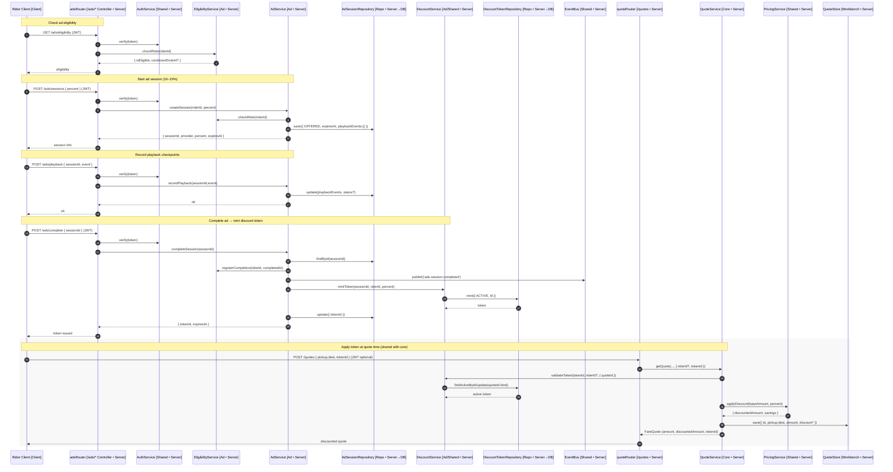
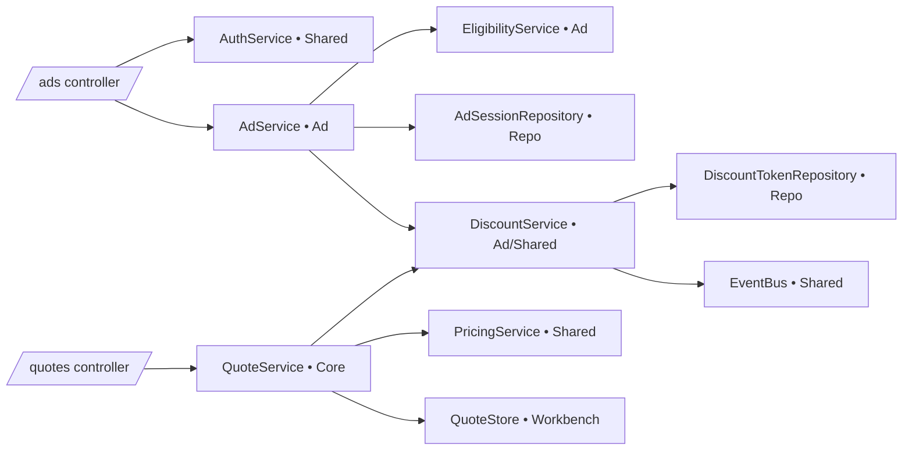
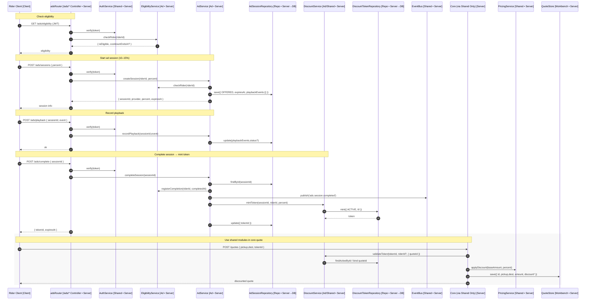
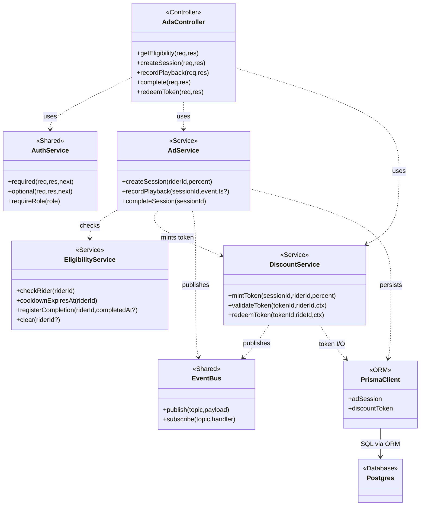
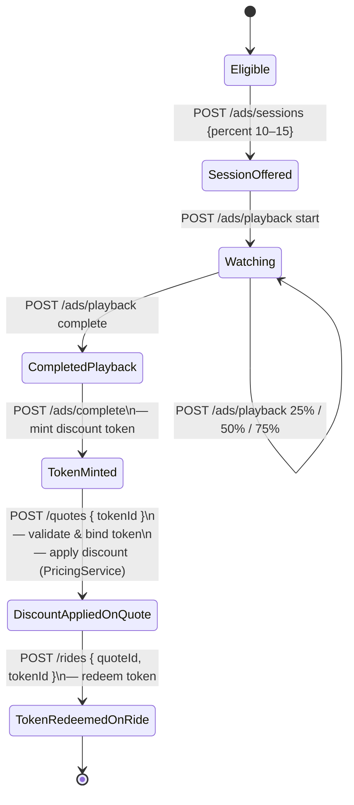
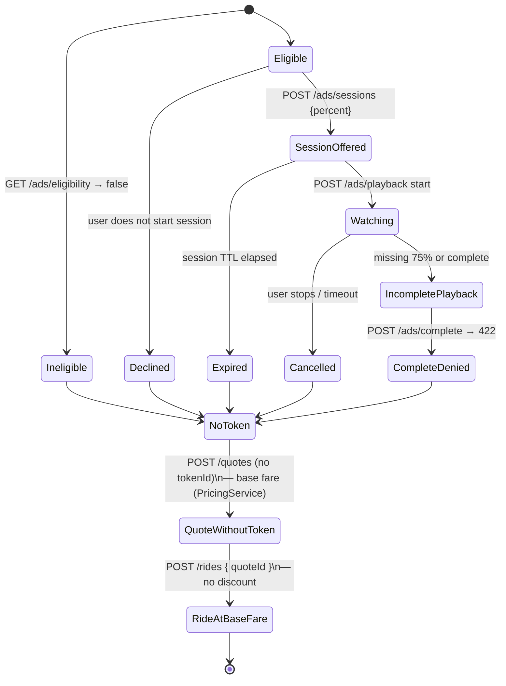

<!-- Generated by SpecStory -->

# 2025-10-31 18:15:01.329Z

<!-- Codex CLI Session 019a3b7a-e5bd-71b1-9f95-7aef157d1ff2 (2025-10-31T18:15:01.329Z) -->

_**User (2025-10-31T18:15:07.082Z)**_

currently there is 2 main function in our backend code folder for our Uber-like application. please read the files and tell me the structure of them cooporating
the features are: core features of uber + the advertisement for providing a discount
what are the sharing class or module between these features

---

_**Agent (gpt-5 2025-10-31T18:15:10.934Z)**_

<think><details>
**Exploring the repo**

I’m planning to explore the repository by using shell commands. First, I’ll provide a preamble before making any tool calls. I'll use ripgrep to list files in the backend code folder. So, I'll run `rg --files` to list everything in the tree. However, I'm not completely sure about the path to the backend code folder, so I'll start by listing the root of the repository first to get my bearings!
</details></think>

_**Agent (gpt-5 2025-10-31T18:15:11.014Z)**_

I’m going to scan the repo to locate the backend folder, list files, and open the two main functions to map structure and shared modules.

_**Agent (gpt-5 2025-10-31T18:15:12.518Z)**_

Tool use: **shell**

`bash -lc ls -la`

Output:
```
total 0
drwxr-xr-x@  5 christy  staff  160 Oct 31 14:15 .
drwxr-xr-x@  7 christy  staff  224 Oct 31 14:15 ..
drwxr-xr-x   6 christy  staff  192 Oct 31 14:15 .specstory
drwxr-xr-x   3 christy  staff   96 Oct 31 14:00 .vscode
drwxr-xr-x  21 christy  staff  672 Oct 31 13:58 team-code-cruise
```

_**Agent (gpt-5 2025-10-31T18:15:15.004Z)**_

Tool use: **shell**

`bash -lc cd team-code-cruise && rg --files -n`

Output:
```
CLAUDE.md
FRONTEND_BACKEND_INTEGRATION_PLAN.md
package.json
start-dev.sh
INTEGRATION_README.md
README.md
INTEGRATION_COMPLETE.md
START_GUIDE.md
docs/user-story-1/User Story #1 Dev Spec.pdf
docs/user-story-1/init.txt
database/README.md
database/prisma/schema.prisma
docs/user-story-2/init.txt
backend/BACKEND_STRUCTURE.md
docs/user-story-2/Untitled document.pdf
backend/tsconfig.json
backend/package.json
backend/README.md
backend/src/repo/discountToken.repository.ts
backend/src/repo/adSession.repository.ts
backend/src/repo/ride.repository.ts
backend/src/repo/user.repository.ts
backend/src/repo/driver.repository.ts
backend/src/repo/paymentIntent.repository.ts
backend/src/index.ts
docs/user-story-3/User Story #3 Dev Spec.pdf
docs/user-story-3/init.txt
backend/DEV_SPEC_ALIGNMENT.md
backend/tests/userStory1.test.ts
backend/tests/userStory2.test.ts
backend/P4 - Backend.md
backend/src/workbench/memoryDb.ts
backend/src/workbench/quoteStore.ts
backend/src/workbench/runtimeConfig.ts
backend/src/workbench/prisma.ts
docs/UI-mockups-screenshots/arrive with ad discount.png
docs/UI-mockups-screenshots/Initial status.png
docs/UI-mockups-screenshots/finding driver.png
docs/UI-mockups-screenshots/driver on the way.png
docs/UI-mockups-screenshots/error page.png
docs/UI-mockups-screenshots/ad discount offer.png
docs/frontend-claude-history.md
backend/dist/index.js
backend/src/server/app.ts
backend/src/server/errorHandler.ts
backend/src/shared/location.service.ts
backend/src/shared/rating.service.ts
backend/src/shared/pricing.service.ts
backend/src/shared/eventBus.ts
backend/src/shared/auth.service.ts
backend/dist/core/ride.service.js
backend/dist/core/matching.service.js
backend/dist/core/payment.service.js
backend/dist/core/quote.service.js
backend/dist/repo/paymentIntent.repository.js
backend/dist/shared/eventBus.js
backend/dist/repo/driver.repository.js
backend/dist/repo/ride.repository.js
backend/dist/repo/user.repository.js
backend/src/web/ad.controller.ts
backend/src/web/payment.controller.ts
backend/src/web/ride.controller.ts
backend/src/web/quote.controller.ts
backend/src/web/auth.controller.ts
backend/dist/shared/auth.service.js
backend/dist/shared/location.service.js
backend/dist/shared/rating.service.js
backend/dist/shared/pricing.service.js
backend/src/ad/discount.service.ts
backend/src/ad/ad.service.ts
backend/src/ad/eligibility.service.ts
backend/dist/server/app.js
backend/dist/server/errorHandler.js
backend/dist/web/ride.controller.js
backend/dist/web/quote.controller.js
backend/dist/web/auth.controller.js
backend/dist/web/payment.controller.js
backend/dist/workbench/runtimeConfig.js
backend/dist/workbench/prisma.js
frontend/vite.config.js
frontend/index.html
frontend/README.md
frontend/eslint.config.js
frontend/package.json
backend/dist/workbench/quoteStore.js
frontend/DEBUG_FIXES.md
backend/dist/workbench/memoryDb.js
backend/src/core/matching.service.ts
backend/src/core/payment.service.ts
backend/src/core/ride-timeout.service.ts
backend/src/core/ride.service.ts
backend/src/core/quote.service.ts
frontend/public/codecruise-favicon.svg
frontend/public/vite.svg
frontend/src/index.css
frontend/src/utils/helpers.js
frontend/src/utils/googleMaps.js
frontend/src/App.css
frontend/src/main.jsx
frontend/src/context/BookingContext.jsx
frontend/src/context/AdContext.jsx
frontend/src/context/AuthContext.jsx
frontend/src/services/authService.js
frontend/src/services/paymentService.js
frontend/src/services/advertisementService.js
frontend/src/services/rideService.js
frontend/src/App.jsx
frontend/src/assets/react.svg
frontend/src/components/FindingDriverModal/FindingDriverModal.jsx
frontend/src/components/FindingDriverModal/FindingDriverModal.css
frontend/src/components/tracking/DriverTrackingUI.css
frontend/src/components/tracking/DriverTrackingUI.jsx
frontend/src/components/Map/Map.jsx
frontend/src/components/Map/Map.css
frontend/src/components/payment/PaymentConfirmation.css
frontend/src/components/payment/PaymentUI.jsx
frontend/src/components/payment/PaymentConfirmation.jsx
frontend/src/components/payment/PaymentUI.css
frontend/src/components/booking/NewBookingUI.css
frontend/src/components/booking/NewBookingUI.jsx
frontend/src/components/ad/AdDiscountUI.css
frontend/src/components/ad/AdDiscountUI.jsx
frontend/src/components/TripCompleted/TripCompletedUI.css
frontend/src/components/TripCompleted/TripCompletedUI.jsx
frontend/src/components/Landing/LandingPage.jsx
frontend/src/components/Landing/LoginPage.jsx
frontend/src/components/Landing/LoginPage.css
frontend/src/components/Landing/LandingPage.css
```

_**Agent (gpt-5 2025-10-31T18:15:19.406Z)**_

Tool use: **shell**

`bash -lc sed -n '1,200p' backend/src/index.ts`

Output:
```
sed: backend/src/index.ts: No such file or directory
```
Exit code: 1

_**Agent (gpt-5 2025-10-31T18:15:22.405Z)**_

<think><details>
**Investigating file paths**

I'm checking why `rg --files` listed `backend/src/index.ts`. It makes me wonder if there might be a path case mismatch at play here. I think it’s worth it to list the contents of `backend/src` next to ensure I’m seeing everything correctly. This could help clarify if the issue is related to how I've referenced the file or if something else is at work. Alright, let’s see what I find!
</details></think>

_**Agent (gpt-5 2025-10-31T18:15:24.204Z)**_

Tool use: **shell**

`bash -lc ls -la backend/src`

Output:
```
ls: backend/src: No such file or directory
```
Exit code: 1

_**Agent (gpt-5 2025-10-31T18:15:30.191Z)**_

<think><details>
**Setting working directory**

I’m realizing we’re in the repo root at /Users/.../team-code-cruise. My previous command showed backend paths, and it seems the likely folder is team-code-cruise/backend. However, I ran ‘rg’ inside team-code-cruise. Could it be that the OS is case-insensitive? There is a 'backend' directory. I need to set the working directory to team-code-cruise since we didn’t set it before. So I’ll make that adjustment for future commands!
</details></think>

_**Agent (gpt-5 2025-10-31T18:15:31.649Z)**_

Tool use: **shell**

`bash -lc ls -la`

Output:
```
total 192
drwxr-xr-x  21 christy  staff    672 Oct 31 13:58 .
drwxr-xr-x@  5 christy  staff    160 Oct 31 14:15 ..
drwxr-xr-x  16 christy  staff    512 Oct 31 12:41 .git
-rw-r--r--   1 christy  staff    370 Oct 29 11:31 .gitignore
drwxr-xr-x   4 christy  staff    128 Oct 31 13:58 .specstory
drwxr-xr-x  16 christy  staff    512 Oct 29 11:48 backend
-rw-r--r--   1 christy  staff  15384 Oct 20 11:25 CLAUDE.md
drwxr-xr-x   4 christy  staff    128 Oct 29 11:32 database
drwxr-xr-x   7 christy  staff    224 Oct 29 11:31 docs
drwxr-xr-x  14 christy  staff    448 Oct 29 11:42 frontend
-rw-r--r--   1 christy  staff  15699 Oct 29 11:31 FRONTEND_BACKEND_INTEGRATION_PLAN.md
-rw-r--r--   1 christy  staff   9294 Oct 29 11:31 INTEGRATION_COMPLETE.md
-rw-r--r--   1 christy  staff  11029 Oct 29 11:31 INTEGRATION_README.md
drwxr-xr-x   3 christy  staff     96 Oct 29 11:32 logs
drwxr-xr-x   7 christy  staff    224 Oct 29 11:48 node_modules
-rw-r--r--   1 christy  staff   4195 Oct 29 11:41 package-lock.json
-rw-r--r--   1 christy  staff    112 Oct 29 11:31 package.json
-rw-r--r--   1 christy  staff   7731 Oct 29 11:31 README.md
drwxr-xr-x   3 christy  staff     96 Oct 29 11:32 ride-app
-rw-r--r--   1 christy  staff   6921 Oct 29 11:31 START_GUIDE.md
-rwxr-xr-x   1 christy  staff   5865 Oct 29 11:31 start-dev.sh
```

_**Agent (gpt-5 2025-10-31T18:15:34.295Z)**_

Tool use: **shell**

`bash -lc ls -la backend/src`

Output:
```
total 8
drwxr-xr-x  10 christy  staff  320 Oct 29 11:32 .
drwxr-xr-x  16 christy  staff  512 Oct 29 11:48 ..
drwxr-xr-x   5 christy  staff  160 Oct 29 11:32 ad
drwxr-xr-x   7 christy  staff  224 Oct 29 11:32 core
-rw-r--r--   1 christy  staff  449 Oct 29 11:31 index.ts
drwxr-xr-x   8 christy  staff  256 Oct 29 11:32 repo
drwxr-xr-x   4 christy  staff  128 Oct 29 11:32 server
drwxr-xr-x   7 christy  staff  224 Oct 29 11:32 shared
drwxr-xr-x   7 christy  staff  224 Oct 29 11:32 web
drwxr-xr-x   6 christy  staff  192 Oct 29 11:32 workbench
```

_**Agent (gpt-5 2025-10-31T18:15:37.225Z)**_

Tool use: **shell**

`bash -lc sed -n '1,160p' backend/src/index.ts`

Output:
```
import dotenv from 'dotenv'
import { app } from './server/app.js'
import { isMemoryMode } from './workbench/runtimeConfig.js'
import { initMemoryDb } from './workbench/memoryDb.js'
import { RideTimeoutService } from './core/ride-timeout.service.js'

dotenv.config()

if (isMemoryMode()) {
  initMemoryDb()

  // Start ride timeout monitoring
  RideTimeoutService.start()
}

const PORT = Number(process.env.PORT || 3000)

app.listen(PORT, () => {
})
```

_**Agent (gpt-5 2025-10-31T18:15:40.934Z)**_

Tool use: **shell**

`bash -lc sed -n '1,220p' backend/src/server/app.ts`

Output:
```
import express from 'express'
import 'express-async-errors'
import cors from 'cors'
import { authRouter } from '../web/auth.controller.js'
import { quoteRouter } from '../web/quote.controller.js'
import { rideRouter } from '../web/ride.controller.js'
import { paymentRouter } from '../web/payment.controller.js'
import { errorHandler } from './errorHandler.js'
import { adsRouter } from '../web/ad.controller.js'

export const app = express()

app.use(cors())
app.use(express.json())

app.use(authRouter)
app.use('/quotes', quoteRouter)
app.use('/rides', rideRouter)
app.use('/payments', paymentRouter)
app.use('/ads', adsRouter)

app.use(errorHandler)
```

_**Agent (gpt-5 2025-10-31T18:15:44.408Z)**_

Tool use: **shell**

`bash -lc sed -n '1,220p' backend/src/web/ad.controller.ts`

Output:
```
import { Router } from 'express'
import { z } from 'zod'
import { AuthService } from '../shared/auth.service.js'
import { EligibilityService } from '../ad/eligibility.service.js'
import { AdService } from '../ad/ad.service.js'
import { DiscountService } from '../ad/discount.service.js'

export const adsRouter = Router()

const playbackSchema = z.object({
  sessionId: z.string().uuid(),
  event: z.enum(['start', '25%', '50%', '75%', 'complete']),
  ts: z.string().datetime({ offset: true }).optional()
})

const sessionSchema = z.object({
  percent: z.number().int().min(10).max(15)
})

const completeSchema = z.object({
  sessionId: z.string().uuid()
})

const redeemSchema = z.object({
  tokenId: z.string().min(1),
  rideId: z.string().uuid(),
  quoteId: z.string().uuid().optional()
})

adsRouter.get('/eligibility', AuthService.required, async (req, res) => {
  const riderId = req.user!.sub
  const eligibility = await EligibilityService.checkRider(riderId)
  res.json({
    isEligible: eligibility.isEligible,
    cooldownEndsAt: eligibility.cooldownEndsAt?.toISOString()
  })
})

adsRouter.post('/sessions', AuthService.required, async (req, res) => {
  const riderId = req.user!.sub
  const { percent } = sessionSchema.parse(req.body)
  const session = await AdService.createSession(riderId, percent)
  res.status(201).json({
    sessionId: session.sessionId,
    provider: session.provider,
    percent: session.percent,
    expiresAt: session.expiresAt.toISOString()
  })
})

adsRouter.post('/playback', AuthService.required, async (req, res) => {
  const { sessionId, event, ts } = playbackSchema.parse(req.body)
  const timestamp = ts ? new Date(ts) : undefined
  if (timestamp && Number.isNaN(timestamp.getTime())) {
    throw Object.assign(new Error('Invalid timestamp'), { status: 400 })
  }
  await AdService.recordPlayback(sessionId, event, timestamp)
  res.json({ ok: true })
})

adsRouter.post('/complete', AuthService.required, async (req, res) => {
  const { sessionId } = completeSchema.parse(req.body)
  const token = await AdService.completeSession(sessionId)
  res.json({ tokenId: token.id, expiresAt: token.expiresAt.toISOString() })
})

adsRouter.post('/token/redeem', AuthService.required, async (req, res) => {
  const riderId = req.user!.sub
  const { tokenId, rideId, quoteId } = redeemSchema.parse(req.body)
  const token = await DiscountService.redeemToken(tokenId, rideId, {
    quoteId,
    riderId
  })
  res.json({ state: token.state })
})
```

_**Agent (gpt-5 2025-10-31T18:15:47.616Z)**_

Tool use: **shell**

`bash -lc sed -n '1,220p' backend/src/ad/ad.service.ts`

Output:
```
import { randomUUID } from 'node:crypto'
import { AdStatus } from '@prisma/client'
import { AdSessionRepository } from '../repo/adSession.repository.js'
import { DiscountService } from './discount.service.js'
import { EligibilityService } from './eligibility.service.js'
import { EventBus } from '../shared/eventBus.js'

const SESSION_TTL_MS = 5 * 60 * 1000
const DEFAULT_PROVIDER = 'AcmeAds'

type PlaybackEvent = 'start' | '25%' | '50%' | '75%' | 'complete'

const VALID_EVENTS: PlaybackEvent[] = ['start', '25%', '50%', '75%', 'complete']

export class AdService {
  static async createSession(riderId: string, percent: number) {
    if (percent < 10 || percent > 15) throw httpError('Percent must be between 10 and 15', 400)
    const eligibility = await EligibilityService.checkRider(riderId)
    if (!eligibility.isEligible) {
      const err = httpError('Rider not eligible to view advertisement right now', 409)
      ;(err as any).cooldownEndsAt = eligibility.cooldownEndsAt
      throw err
    }

    const id = randomUUID()
    const expiresAt = new Date(Date.now() + SESSION_TTL_MS)
    await AdSessionRepository.save({
      id,
      riderId,
      percent,
      provider: DEFAULT_PROVIDER,
      status: AdStatus.OFFERED,
      startedAt: null,
      completedAt: null,
      playbackEvents: {},
      expiresAt
    })

    return {
      sessionId: id,
      provider: DEFAULT_PROVIDER,
      percent,
      expiresAt
    }
  }

  static async recordPlayback(sessionId: string, event: PlaybackEvent, ts?: Date) {
    if (!VALID_EVENTS.includes(event)) throw httpError('Unsupported playback event', 400)
    const session = await AdSessionRepository.findById(sessionId)
    if (!session) throw httpError('Ad session not found', 404)
    this.ensureActive(session)

    const timestamp = ts ?? new Date()
    const events = { ...session.playbackEvents, [event]: timestamp.toISOString() }
    let status = session.status
    let startedAt = session.startedAt

    if (event === 'start') {
      status = AdStatus.WATCHING
      startedAt = timestamp
    }

    if (event !== 'start' && !session.playbackEvents.start) {
      throw httpError('Playback sequence invalid. Start event missing.', 422)
    }

    const updated = await AdSessionRepository.update(sessionId, {
      status,
      startedAt,
      playbackEvents: events
    })

    return updated
  }

  static async completeSession(sessionId: string) {
    const session = await AdSessionRepository.findById(sessionId)
    if (!session) throw httpError('Ad session not found', 404)
    this.ensureActive(session, { allowCompleted: true })

    if (session.status === AdStatus.COMPLETED && session.tokenId) {
      const token = await DiscountService.fetch(session.tokenId)
      if (token) return token
    }

    if (!session.playbackEvents.start || !session.playbackEvents['75%'] || !session.playbackEvents.complete) {
      throw httpError('Ad session missing required playback checkpoints', 422)
    }

    const completedAt = new Date()
    await AdSessionRepository.update(sessionId, {
      status: AdStatus.COMPLETED,
      completedAt,
      playbackEvents: {
        ...session.playbackEvents,
        complete: session.playbackEvents.complete ?? completedAt.toISOString()
      }
    })

    EligibilityService.registerCompletion(session.riderId, completedAt)
    EventBus.publish('ads.session.completed', {
      sessionId: session.id,
      riderId: session.riderId,
      percent: session.percent
    })

    const token = await DiscountService.mintToken(session.id, session.riderId, session.percent)
    await AdSessionRepository.update(sessionId, { tokenId: token.id })
    return token
  }

  private static ensureActive(
    session: {
      status: AdStatus
      expiresAt: Date
    },
    opts: { allowCompleted?: boolean } = {}
  ) {
    if (session.expiresAt.getTime() <= Date.now()) {
      throw httpError('Ad session expired', 410)
    }
    if (session.status === AdStatus.CANCELLED) throw httpError('Ad session cancelled', 409)
    if (session.status === AdStatus.COMPLETED && !opts.allowCompleted) {
      throw httpError('Ad session already completed', 409)
    }
  }
}

function httpError(message: string, status = 400) {
  const err = new Error(message)
  ;(err as any).status = status
  return err
}
```

_**Agent (gpt-5 2025-10-31T18:15:50.458Z)**_

Tool use: **shell**

`bash -lc sed -n '1,240p' backend/src/ad/discount.service.ts`

Output:
```
import { TokenState } from '@prisma/client'
import { EventBus } from '../shared/eventBus.js'
import {
  DiscountTokenRecord,
  DiscountTokenRepository
} from '../repo/discountToken.repository.js'

const TOKEN_TTL_MS = 15 * 60 * 1000
const MIN_PERCENT = 10
const MAX_PERCENT = 15

type ValidationContext = {
  quoteId?: string
  riderId?: string
}

export class DiscountService {
  static async mintToken(
    sessionId: string,
    riderId: string,
    percent: number
  ): Promise<DiscountTokenRecord> {
    if (percent < MIN_PERCENT || percent > MAX_PERCENT) {
      throw httpError('Requested discount percent is out of allowed range', 400)
    }
    const id = generateUlid()
    const expiresAt = new Date(Date.now() + TOKEN_TTL_MS)
    const token = await DiscountTokenRepository.mint({
      id,
      riderId,
      percent,
      quoteId: null,
      expiresAt,
      sessionId
    })
    EventBus.publish('ads.token.minted', { tokenId: token.id, riderId, percent })
    return token
  }

  static async validateToken(
    tokenId: string,
    riderId: string,
    ctx: ValidationContext = {}
  ): Promise<DiscountTokenRecord> {
    const token = await DiscountTokenRepository.findActiveById(tokenId)
    if (!token) throw httpError('Discount token not found or inactive', 404)
    if (token.riderId !== riderId) throw httpError('Discount token does not belong to rider', 403)
    if (token.expiresAt.getTime() <= Date.now()) {
      await DiscountTokenRepository.update(token.id, { state: TokenState.EXPIRED })
      throw httpError('Discount token expired', 410)
    }
    if (ctx.quoteId && token.quoteId && token.quoteId !== ctx.quoteId) {
      throw httpError('Discount token already bound to a different quote', 409)
    }
    if (ctx.quoteId && !token.quoteId) {
      await DiscountTokenRepository.update(token.id, { quoteId: ctx.quoteId })
      token.quoteId = ctx.quoteId
    }
    return token
  }

  static async redeemToken(
    tokenId: string,
    rideId: string,
    ctx: ValidationContext = {}
  ): Promise<DiscountTokenRecord> {
    const token = await DiscountTokenRepository.findById(tokenId)
    if (!token) throw httpError('Discount token not found', 404)
    if (token.state !== TokenState.ACTIVE) throw httpError('Discount token is not redeemable', 409)
    if (ctx.riderId && token.riderId !== ctx.riderId) {
      throw httpError('Discount token does not belong to rider', 403)
    }
    if (token.expiresAt.getTime() <= Date.now()) {
      await DiscountTokenRepository.update(token.id, { state: TokenState.EXPIRED })
      throw httpError('Discount token expired', 410)
    }
    if (ctx.quoteId && token.quoteId && token.quoteId !== ctx.quoteId) {
      throw httpError('Discount token bound to another quote', 409)
    }
    const updated = await DiscountTokenRepository.update(token.id, {
      state: TokenState.REDEEMED,
      redeemedRideId: rideId
    })
    EventBus.publish('ads.token.redeemed', { tokenId, rideId })
    return updated
  }

  static async fetch(tokenId: string) {
    return DiscountTokenRepository.findById(tokenId)
  }
}

function httpError(message: string, status = 400) {
  const err = new Error(message)
  ;(err as any).status = status
  return err
}

const ENCODING = '0123456789ABCDEFGHJKMNPQRSTVWXYZ'

function generateUlid() {
  const time = Date.now()
  const timeChars = encodeTime(time, 10)
  const randChars = encodeRandom(16)
  return timeChars + randChars
}

function encodeTime(time: number, length: number) {
  let value = time
  const chars = Array<string>(length)
  for (let i = length - 1; i >= 0; i -= 1) {
    const mod = value % 32
    chars[i] = ENCODING[mod]
    value = Math.floor(value / 32)
  }
  return chars.join('')
}

function encodeRandom(length: number) {
  const chars = Array<string>(length)
  for (let i = 0; i < length; i += 1) {
    const rand = Math.floor(Math.random() * 32)
    chars[i] = ENCODING[rand]
  }
  return chars.join('')
}
```

_**Agent (gpt-5 2025-10-31T18:15:53.845Z)**_

Tool use: **shell**

`bash -lc sed -n '1,240p' backend/src/ad/eligibility.service.ts`

Output:
```
type EligibilityState = {
  lastCompletedAt: Date | null
  cooldownEndsAt: Date | null
  dailyCount: number
  dailyKey: string | null
}

const riderState = new Map<string, EligibilityState>()

const COOLDOWN_MS = 5 * 1000
const DAILY_CAP = 5

export type EligibilityResult = {
  isEligible: boolean
  cooldownEndsAt?: Date
}

function resolveState(riderId: string): EligibilityState {
  let state = riderState.get(riderId)
  if (!state) {
    state = {
      lastCompletedAt: null,
      cooldownEndsAt: null,
      dailyCount: 0,
      dailyKey: null
    }
    riderState.set(riderId, state)
  }
  return state
}

function currentDayKey() {
  const now = new Date()
  return `${now.getUTCFullYear()}-${now.getUTCMonth() + 1}-${now.getUTCDate()}`
}

export class EligibilityService {
  static async checkRider(riderId: string): Promise<EligibilityResult> {
    const state = resolveState(riderId)
    this.refreshDailyBucket(state)
    if (state.cooldownEndsAt && state.cooldownEndsAt.getTime() > Date.now()) {
      return { isEligible: false, cooldownEndsAt: state.cooldownEndsAt }
    }
    if (state.dailyCount >= DAILY_CAP) {
      const nextDay = this.nextDayStart()
      state.cooldownEndsAt = nextDay
      return { isEligible: false, cooldownEndsAt: nextDay }
    }
    return { isEligible: true }
  }

  static async cooldownExpiresAt(riderId: string): Promise<Date | null> {
    const state = resolveState(riderId)
    return state.cooldownEndsAt ?? null
  }

  static registerCompletion(riderId: string, completedAt = new Date()) {
    const state = resolveState(riderId)
    this.refreshDailyBucket(state)
    state.lastCompletedAt = completedAt
    state.cooldownEndsAt = new Date(completedAt.getTime() + COOLDOWN_MS)
    state.dailyCount += 1
  }

  static clear(riderId?: string) {
    if (!riderId) riderState.clear()
    else riderState.delete(riderId)
  }

  private static refreshDailyBucket(state: EligibilityState) {
    const key = currentDayKey()
    if (state.dailyKey !== key) {
      state.dailyKey = key
      state.dailyCount = 0
    }
  }

  private static nextDayStart() {
    const now = new Date()
    const next = new Date(Date.UTC(now.getUTCFullYear(), now.getUTCMonth(), now.getUTCDate() + 1))
    return next
  }
}
```

_**Agent (gpt-5 2025-10-31T18:15:56.891Z)**_

Tool use: **shell**

`bash -lc sed -n '1,240p' backend/src/web/ride.controller.ts`

Output:
```
import { Router } from 'express'
import { z } from 'zod'
import { AuthService } from '../shared/auth.service.js'
import { RideService } from '../core/ride.service.js'
import { MatchingService } from '../core/matching.service.js'

export const rideRouter = Router()

const createRideSchema = z.object({
  pickup: z.object({ lat: z.number(), lon: z.number() }),
  dest: z.object({ lat: z.number(), lon: z.number() }),
  quoteId: z.string().uuid(),
  tokenId: z.string().min(1).optional()
})

rideRouter.post('/', AuthService.required, async (req, res) => {
  const riderId = req.user!.sub
  const { pickup, dest, quoteId, tokenId } = createRideSchema.parse(req.body)
  const ride = await RideService.createRide({ riderId, pickup, dest, quoteId, tokenId })
  await MatchingService.assignDriver(ride.id)
  const hydrated = await RideService.getRide(ride.id, riderId)
  res.status(201).json(hydrated)
})

rideRouter.get('/:id', AuthService.required, async (req, res) => {
  const ride = await RideService.getRide(req.params.id, req.user!.sub)
  res.json(ride)
})

rideRouter.post('/:id/cancel', AuthService.required, async (req, res) => {
  const ride = await RideService.cancelRide(req.params.id, req.user!.sub)
  res.json({ status: ride.status })
})

rideRouter.post('/:id/complete', AuthService.required, async (req, res) => {
  const ride = await RideService.completeRide(req.params.id, req.user!.sub)
  res.json({ status: ride.status })
})
```

_**Agent (gpt-5 2025-10-31T18:15:59.378Z)**_

Tool use: **shell**

`bash -lc sed -n '1,260p' backend/src/core/ride.service.ts`

Output:
```
import { RideStatus } from '@prisma/client'
import { RideRepository } from '../repo/ride.repository.js'
import { QuoteStore } from '../workbench/quoteStore.js'
import { LatLng } from '../shared/location.service.js'
import { DriverRepository } from '../repo/driver.repository.js'
import { DiscountService } from '../ad/discount.service.js'
import { PricingService } from '../shared/pricing.service.js'

function badRequest(message: string) {
  const err = new Error(message)
  ;(err as any).status = 400
  return err
}

function forbidden() {
  const err = new Error('Forbidden')
  ;(err as any).status = 403
  return err
}

export class RideService {
  static async createRide(input: {
    riderId: string
    pickup: LatLng
    dest: LatLng
    quoteId: string
    tokenId?: string | null
  }) {
    const quote = await QuoteStore.get(input.quoteId)
    if (!quote) throw badRequest('Quote not found or expired')
    if (quote.expiresAt.getTime() < Date.now()) throw badRequest('Quote expired')
    if (quote.riderId && quote.riderId !== input.riderId) throw forbidden()

    // Basic sanity check: ensure coordinates match within epsilon
    const epsilon = 0.0001
    const coordsMatch =
      Math.abs(quote.pickup.lat - input.pickup.lat) < epsilon &&
      Math.abs(quote.pickup.lon - input.pickup.lon) < epsilon &&
      Math.abs(quote.dest.lat - input.dest.lat) < epsilon &&
      Math.abs(quote.dest.lon - input.dest.lon) < epsilon
    if (!coordsMatch) throw badRequest('Quote does not match requested route')

    const boundTokenId = quote.discountTokenId ?? null
    const providedTokenId = input.tokenId ?? null

    if (boundTokenId && !providedTokenId) {
      throw badRequest('Discount token required for discounted quote')
    }
    if (boundTokenId && providedTokenId && boundTokenId !== providedTokenId) {
      throw badRequest('Discount token does not match quote')
    }
    if (!boundTokenId && providedTokenId) {
      throw badRequest('Discount token is not associated with this quote')
    }

    let discountPercent = quote.discountPercent ?? null
    let discountedAmount = quote.discountedAmount ?? null

    if (boundTokenId) {
      const token = await DiscountService.validateToken(boundTokenId, input.riderId, {
        quoteId: input.quoteId
      })
      discountPercent = token.percent
      if (discountedAmount == null) {
        const { discountedAmount: computed } = PricingService.applyDiscount(quote.amount, token.percent)
        discountedAmount = computed
      }
    }

    const fareAmount = discountedAmount ?? quote.amount

    const ride = await RideRepository.save({
      riderId: input.riderId,
      pickup: input.pickup,
      dest: input.dest,
      fareAmount,
      surge: quote.surge,
      currency: quote.currency,
      discountPercent,
      discountedAmount,
      discountTokenId: boundTokenId
    })

    if (boundTokenId) {
      await DiscountService.redeemToken(boundTokenId, ride.id, {
        quoteId: input.quoteId,
        riderId: input.riderId
      })
    }

    await QuoteStore.delete(input.quoteId)
    return ride
  }

  static async getRide(id: string, requesterId: string) {
    const ride = await RideRepository.findById(id)
    if (!ride) throw Object.assign(new Error('Ride not found'), { status: 404 })
    if (ride.riderId !== requesterId) throw forbidden()
    return ride
  }

  static async cancelRide(id: string, requesterId: string) {
    const ride = await this.getRide(id, requesterId)
    if (ride.status === RideStatus.COMPLETED) throw badRequest('Ride already completed')
    if (ride.status === RideStatus.CANCELLED) return ride
    const updated = await RideRepository.update(ride.id, { status: RideStatus.CANCELLED })
    if (updated.driverId) await DriverRepository.setAvailability(updated.driverId, true)
    return updated
  }

  static async updateRideStatus(id: string, status: RideStatus) {
    return RideRepository.update(id, { status })
  }

  static async startRide(id: string, driverId: string) {
    const ride = await RideRepository.findById(id)
    if (!ride) throw Object.assign(new Error('Ride not found'), { status: 404 })
    if (ride.driverId !== driverId) throw forbidden()
    return RideRepository.update(id, { status: RideStatus.IN_RIDE, startedAt: new Date() })
  }

  static async completeRide(id: string, requesterId: string) {
    const ride = await this.getRide(id, requesterId)
    const updated = await RideRepository.update(ride.id, {
      status: RideStatus.COMPLETED,
      completedAt: new Date()
    })
    if (updated.driverId) await DriverRepository.setAvailability(updated.driverId, true)
    return updated
  }
}
```

_**Agent (gpt-5 2025-10-31T18:16:02.374Z)**_

Tool use: **shell**

`bash -lc sed -n '1,260p' backend/src/core/quote.service.ts`

Output:
```
import { randomUUID } from 'node:crypto'
import { PricingService } from '../shared/pricing.service.js'
import { LatLng, LocationService } from '../shared/location.service.js'
import { QuoteStore } from '../workbench/quoteStore.js'
import { DiscountService } from '../ad/discount.service.js'

export type FareQuote = {
  id: string
  amount: number
  surge: number
  currency: string
  expiresAt: string
  etaMinutes: number
  discountApplied?: boolean
  discountPercent?: number
  discountedAmount?: number
  discountTokenId?: string
}

export class QuoteService {
  static async getQuote(
    pickup: LatLng,
    dest: LatLng,
    opts: { riderId?: string; vehicleType?: string; pax?: number; tokenId?: string } = {}
  ): Promise<FareQuote> {
    const { amount, surge, currency } = PricingService.estimate(pickup, dest, opts)
    const expiresAt = new Date(Date.now() + 10 * 60_000) // 10 minutes expiration
    const etaMinutes = await LocationService.eta(pickup, dest)
    const id = randomUUID()

    let discountApplied = false
    let discountPercent: number | undefined
    let discountedAmount: number | undefined
    let discountTokenId: string | undefined

    if (opts.tokenId) {
      if (!opts.riderId) throw badRequest('Authenticated rider required to apply discount token')
      const token = await DiscountService.validateToken(opts.tokenId, opts.riderId, { quoteId: id })
      const { discountedAmount: nextAmount } = PricingService.applyDiscount(amount, token.percent)
      discountApplied = true
      discountPercent = token.percent
      discountedAmount = nextAmount
      discountTokenId = token.id
    }

    await QuoteStore.save({
      id,
      riderId: opts.riderId,
      amount,
      surge,
      currency,
      pickup,
      dest,
      expiresAt,
      discountPercent: discountPercent ?? null,
      discountTokenId: discountTokenId ?? null,
      discountedAmount: discountedAmount ?? null
    })

    return {
      id,
      amount,
      surge,
      currency,
      expiresAt: expiresAt.toISOString(),
      etaMinutes,
      discountApplied,
      discountPercent,
      discountedAmount,
      discountTokenId
    }
  }
}

function badRequest(message: string) {
  const err = new Error(message)
  ;(err as any).status = 400
  return err
}
```

_**Agent (gpt-5 2025-10-31T18:16:05.205Z)**_

Tool use: **shell**

`bash -lc sed -n '1,260p' backend/src/core/matching.service.ts`

Output:
```
import { RideStatus } from '@prisma/client'
import { RideRepository } from '../repo/ride.repository.js'
import { DriverRepository } from '../repo/driver.repository.js'

function haversineKm(a: { lat: number; lon: number }, b: { lat: number; lon: number }) {
  const toRad = (deg: number) => (deg * Math.PI) / 180
  const R = 6371
  const dLat = toRad(b.lat - a.lat)
  const dLon = toRad(b.lon - a.lon)
  const lat1 = toRad(a.lat)
  const lat2 = toRad(b.lat)

  const sinDLat = Math.sin(dLat / 2)
  const sinDLon = Math.sin(dLon / 2)

  const h =
    sinDLat * sinDLat + Math.cos(lat1) * Math.cos(lat2) * sinDLon * sinDLon
  const c = 2 * Math.atan2(Math.sqrt(h), Math.sqrt(1 - h))
  return R * c
}

export class MatchingService {
  static async assignDriver(rideId: string) {
    const ride = await RideRepository.findById(rideId)
    if (!ride) throw Object.assign(new Error('Ride not found'), { status: 404 })

    await RideRepository.update(ride.id, { status: RideStatus.MATCHING })
    const nearby = await DriverRepository.findNearby(ride.pickup, 15) // 15km radius
    const choice = nearby[0]
    if (!choice) {
      await RideRepository.update(ride.id, { status: RideStatus.REQUESTED })
      return RideRepository.findById(ride.id)
    }

    await DriverRepository.setAvailability(choice.id, false)

    try {
      return await RideRepository.update(ride.id, {
        status: RideStatus.DRIVER_ASSIGNED,
        driverId: choice.id
      })
    } catch (error) {
      // If ride update fails, release the driver
      console.error('[Matching] Failed to assign driver to ride, releasing driver:', choice.id)
      await DriverRepository.setAvailability(choice.id, true)
      throw error
    }
  }

  static async updateDriverLocation(driverId: string, lat: number, lon: number) {
    await DriverRepository.updateDriverLocation(driverId, lat, lon)
    const ride = await RideRepository.findActiveByDriver(driverId)
    if (!ride) return null

    if (ride.status === RideStatus.DRIVER_ASSIGNED) {
      const dist = haversineKm(ride.pickup, { lat, lon })
      if (dist < 0.5) {
        return RideRepository.update(ride.id, { status: RideStatus.DRIVER_EN_ROUTE })
      }
    }
    return ride
  }

  static async releaseDriver(driverId: string) {
    await DriverRepository.setAvailability(driverId, true)
  }
}
```

_**Agent (gpt-5 2025-10-31T18:16:08.037Z)**_

Tool use: **shell**

`bash -lc sed -n '1,240p' backend/src/core/payment.service.ts`

Output:
```
import { PaymentStatus } from '@prisma/client'
import { RideService } from './ride.service.js'
import { EventBus } from '../shared/eventBus.js'
import { PaymentIntentRepository } from '../repo/paymentIntent.repository.js'

export class PaymentService {
  static async createPaymentIntent(rideId: string, requesterId: string) {
    const ride = await RideService.getRide(rideId, requesterId)

    const existing = await PaymentIntentRepository.findByRideId(ride.id)
    if (existing) return existing

    const id = `pi_${ride.id}`
    return PaymentIntentRepository.create({
      id,
      rideId: ride.id,
      amount: ride.fareAmount,
      status: PaymentStatus.REQUIRES_CONFIRMATION
    })
  }

  static async confirmPayment(intentId: string, method: string, requesterId: string) {
    const intent = await PaymentIntentRepository.findById(intentId)
    if (!intent) throw Object.assign(new Error('Payment intent not found'), { status: 404 })

    await RideService.getRide(intent.rideId, requesterId)

    const outcome = simulateGateway(method)
    const finalStatus = outcome === 'success' ? PaymentStatus.PAID : PaymentStatus.FAILED

    await PaymentIntentRepository.update(intentId, { status: finalStatus, method })

    if (finalStatus === PaymentStatus.PAID) {
      EventBus.publish('ride.completed', { rideId: intent.rideId })
      return 'PAID' as const
    }

    return 'PAYMENT_FAILED' as const
  }
}

function simulateGateway(method: string) {
  return method.toLowerCase().includes('fail') ? 'fail' : 'success'
}
```

_**Agent (gpt-5 2025-10-31T18:16:11.164Z)**_

Tool use: **shell**

`bash -lc sed -n '1,240p' backend/src/web/quote.controller.ts`

Output:
```
import { Router } from 'express'
import { z } from 'zod'
import { QuoteService } from '../core/quote.service.js'
import { AuthService } from '../shared/auth.service.js'

export const quoteRouter = Router()

const quoteSchema = z.object({
  pickup: z.object({ lat: z.number(), lon: z.number() }),
  dest: z.object({ lat: z.number(), lon: z.number() }),
  tokenId: z.string().min(1).optional(),
  opts: z
    .object({
      vehicleType: z.string().optional(),
      pax: z.number().optional()
    })
    .optional()
})

quoteRouter.post('/', AuthService.optional, async (req, res) => {
  const { pickup, dest, opts, tokenId } = quoteSchema.parse(req.body)
  const riderId = req.user?.sub
  const quote = await QuoteService.getQuote(pickup, dest, {
    riderId,
    ...(opts ?? {}),
    tokenId
  })
  res.json(quote)
})
```

_**Agent (gpt-5 2025-10-31T18:16:14.298Z)**_

Tool use: **shell**

`bash -lc sed -n '1,240p' backend/src/web/payment.controller.ts`

Output:
```
import { Router } from 'express'
import { z } from 'zod'
import { AuthService } from '../shared/auth.service.js'
import { PaymentService } from '../core/payment.service.js'

export const paymentRouter = Router()

const createIntentSchema = z.object({
  rideId: z.string().uuid()
})

const confirmSchema = z.object({
  intentId: z.string(),
  method: z.string()
})

paymentRouter.post('/intents', AuthService.required, async (req, res) => {
  const { rideId } = createIntentSchema.parse(req.body)
  const intent = await PaymentService.createPaymentIntent(rideId, req.user!.sub)
  res.json({ intentId: intent.id })
})

paymentRouter.post('/confirm', AuthService.required, async (req, res) => {
  const { intentId, method } = confirmSchema.parse(req.body)
  const status = await PaymentService.confirmPayment(intentId, method, req.user!.sub)
  res.json({ status })
})
```

_**Agent (gpt-5 2025-10-31T18:16:17.123Z)**_

Tool use: **shell**

`bash -lc sed -n '1,240p' backend/src/web/auth.controller.ts`

Output:
```
import { Router } from 'express'
import { z } from 'zod'
import jwt from 'jsonwebtoken'
import bcrypt from 'bcryptjs'
import { AuthService } from '../shared/auth.service.js'
import { UserRepository } from '../repo/user.repository.js'

export const authRouter = Router()

const loginSchema = z.object({
  email: z.string().email(),
  password: z.string().min(6)
})

authRouter.post('/login', async (req, res) => {
  const { email, password } = loginSchema.parse(req.body)
  const user = await UserRepository.findByEmail(email)
  if (!user) return res.status(401).json({ error: 'Invalid credentials' })

  const ok = await bcrypt.compare(password, user.password)
  if (!ok) return res.status(401).json({ error: 'Invalid credentials' })

  const secret = process.env.JWT_SECRET || 'secret'
  const token = jwt.sign({ sub: user.id, role: 'rider' }, secret, { expiresIn: '7d' })
  res.json({ token })
})

authRouter.get('/me', AuthService.required, async (req, res) => {
  const user = await UserRepository.findById(req.user!.sub)
  if (!user) return res.status(404).json({ error: 'User not found' })

  res.json({
    id: user.id,
    name: user.name,
    email: user.email,
    rating: user.rating,
    createdAt: user.createdAt
  })
})
```

_**Agent (gpt-5 2025-10-31T18:16:20.181Z)**_

Tool use: **shell**

`bash -lc sed -n '1,240p' backend/src/shared/pricing.service.ts`

Output:
```
import { LatLng } from './location.service.js'

export class PricingService {
  static baseFare(_pickup: LatLng, _dest: LatLng): number {
    return 500
  }

  static surgeFactor(_area: string, _t: Date): number {
    return 1.0
  }

  static estimate(pickup: LatLng, dest: LatLng, _opts?: any) {
    const base = this.baseFare(pickup, dest)
    const surge = this.surgeFactor('default', new Date())
    const amount = Math.round(base * surge)
    return { amount, surge, currency: 'USD' as const }
  }

  static applyDiscount(baseAmount: number, percent: number) {
    const discount = Math.round((baseAmount * percent) / 100)
    const discounted = Math.max(0, baseAmount - discount)
    return {
      discountedAmount: discounted,
      savings: discount
    }
  }
}
```

_**Agent (gpt-5 2025-10-31T18:16:23.124Z)**_

Tool use: **shell**

`bash -lc sed -n '1,240p' backend/src/shared/location.service.ts`

Output:
```
export type LatLng = { lat: number; lon: number }

export class LocationService {
  static async eta(pickup: LatLng, dest: LatLng): Promise<number> {
    const dx = dest.lat - pickup.lat
    const dy = dest.lon - pickup.lon
    const dist = Math.sqrt(dx * dx + dy * dy)
    return Math.max(3, Math.round(dist * 120))
  }
}
```

_**Agent (gpt-5 2025-10-31T18:16:25.829Z)**_

Tool use: **shell**

`bash -lc sed -n '1,260p' backend/src/shared/auth.service.ts`

Output:
```
import { NextFunction, Request, Response } from 'express'
import jwt from 'jsonwebtoken'

type JwtPayload = { sub: string; role: string }

export class AuthService {
  static required(req: Request, res: Response, next: NextFunction) {
    try {
      const payload = AuthService.verify(req)
      if (!payload) return res.status(401).json({ error: 'Missing Authorization' })
      ;(req as any).user = payload
      next()
    } catch (err) {
      console.error(err)
      return res.status(401).json({ error: 'Invalid token' })
    }
  }

  static optional(req: Request, _res: Response, next: NextFunction) {
    try {
      const payload = AuthService.verify(req)
      if (payload) (req as any).user = payload
    } catch {
      // ignore optional auth failures
    }
    next()
  }

  static requireRole(role: string) {
    return (req: Request, res: Response, next: NextFunction) => {
      if (!req.user || req.user.role !== role) return res.status(403).json({ error: 'Forbidden' })
      next()
    }
  }

  private static verify(req: Request): JwtPayload | null {
    const hdr = req.headers.authorization
    if (!hdr) return null
    const token = hdr.replace('Bearer ', '')
    const secret = process.env.JWT_SECRET || 'secret'
    return jwt.verify(token, secret) as JwtPayload
  }
}

declare global {
  namespace Express {
    interface Request {
      user?: JwtPayload
    }
  }
}
```

_**Agent (gpt-5 2025-10-31T18:16:28.579Z)**_

Tool use: **shell**

`bash -lc sed -n '1,260p' backend/src/shared/eventBus.ts`

Output:
```
export type EventHandler<T = any> = (payload: T) => void

class InMemoryEventBus {
  private subs = new Map<string, Set<EventHandler>>()

  publish<T>(topic: string, payload: T) {
    const handlers = this.subs.get(topic)
    if (!handlers) return
    for (const handler of handlers) handler(payload)
  }

  subscribe<T>(topic: string, handler: EventHandler<T>) {
    if (!this.subs.has(topic)) this.subs.set(topic, new Set())
    this.subs.get(topic)!.add(handler as EventHandler)
    return () => this.subs.get(topic)!.delete(handler as EventHandler)
  }
}

export const EventBus = new InMemoryEventBus()
```

_**Agent (gpt-5 2025-10-31T18:16:31.337Z)**_

Tool use: **shell**

`bash -lc sed -n '1,200p' backend/src/server/errorHandler.ts`

Output:
```
import { NextFunction, Request, Response } from 'express'
import { ZodError } from 'zod'

export function errorHandler(err: any, _req: Request, res: Response, _next: NextFunction) {
  console.error(err)
  const status = err.status || (err instanceof ZodError ? 400 : 500)
  const payload =
    err instanceof ZodError
      ? { error: 'Invalid request payload', details: err.errors }
      : { error: err.message || 'Internal Server Error' }
  res.status(status).json(payload)
}
```

_**Agent (gpt-5 2025-10-31T18:16:34.192Z)**_

Tool use: **shell**

`bash -lc sed -n '1,240p' backend/src/repo/ride.repository.ts`

Output:
```
import { randomUUID } from 'node:crypto'
import { Prisma, RideStatus } from '@prisma/client'
import { prisma } from '../workbench/prisma.js'
import { LatLng } from '../shared/location.service.js'
import { getMemoryDb, MemoryRide } from '../workbench/memoryDb.js'
import { isMemoryMode } from '../workbench/runtimeConfig.js'

export type RideRecord = {
  id: string
  riderId: string
  driverId: string | null
  status: RideStatus
  fareAmount: number
  surge: number
  currency: string
  discountPercent: number | null
  discountedAmount: number | null
  discountTokenId: string | null
  pickup: LatLng
  dest: LatLng
  startedAt: Date | null
  completedAt: Date | null
  createdAt: Date
  driver: {
    id: string
    name: string
    rating: number
    status: string
    vehicle?: { make: string; model: string; plate: string; type: string; color: string } | null
    phone?: string
    location?: { lat: number; lon: number } | null
  } | null
  rider: { id: string; name: string; email: string; rating: number } | null
  paymentIntent: { id: string; status: string; amount: number } | null
}

type RideRepo = {
  save(input: {
    riderId: string
    pickup: LatLng
    dest: LatLng
    fareAmount: number
    surge: number
    currency: string
    discountPercent?: number | null
    discountedAmount?: number | null
    discountTokenId?: string | null
  }): Promise<RideRecord>
  findById(id: string): Promise<RideRecord | null>
  update(
    id: string,
    patch: Partial<{
      status: RideStatus
      driverId: string | null
      startedAt: Date | null
      completedAt: Date | null
    }>
  ): Promise<RideRecord>
  findActiveByDriver(driverId: string): Promise<RideRecord | null>
}

type RideRow = {
  id: string
  riderId: string
  driverId: string | null
  status: RideStatus
  fareAmount: number
  surge: Prisma.Decimal
  currency: string
  discountPercent: number | null
  discountedAmount: number | null
  discountTokenId: string | null
  pickupLat: number
  pickupLon: number
  destLat: number
  destLon: number
  startedAt: Date | null
  completedAt: Date | null
  createdAt: Date
  driver: any
  rider: any
  paymentIntent: any
}

const PrismaRideRepository: RideRepo = {
  async save(input) {
    const rows = await prisma.$queryRaw<RideRow[]>`
      INSERT INTO "Ride" ("riderId","pickup","destination","fareAmount","surge","currency","status","discountPercent","discountedAmount","discountTokenId")
      VALUES (
        ${input.riderId},
        ST_SetSRID(ST_MakePoint(${input.pickup.lon}, ${input.pickup.lat}), 4326)::geography,
        ST_SetSRID(ST_MakePoint(${input.dest.lon}, ${input.dest.lat}), 4326)::geography,
        ${input.fareAmount},
        ${input.surge},
        ${input.currency},
        ${RideStatus.REQUESTED},
        ${input.discountPercent ?? null},
        ${input.discountedAmount ?? null},
        ${input.discountTokenId ?? null}
      )
      RETURNING
        "id",
        "riderId",
        "driverId",
        "status",
        "fareAmount",
        "surge",
        "currency",
        "discountPercent",
        "discountedAmount",
        "discountTokenId",
        "startedAt",
        "completedAt",
        "createdAt",
        ST_Y(ST_AsText("pickup"::geometry))      AS "pickupLat",
        ST_X(ST_AsText("pickup"::geometry))      AS "pickupLon",
        ST_Y(ST_AsText("destination"::geometry)) AS "destLat",
        ST_X(ST_AsText("destination"::geometry)) AS "destLon",
        NULL::jsonb                              AS "driver",
        NULL::jsonb                              AS "rider",
        NULL::jsonb                              AS "paymentIntent"
    `
    return mapPrismaRide(rows[0])
  },

  async findById(id) {
    const rows = await prisma.$queryRaw<RideRow[]>`
      SELECT
        r."id",
        r."riderId",
        r."driverId",
        r."status",
        r."fareAmount",
        r."surge",
        r."currency",
        r."discountPercent",
        r."discountedAmount",
        r."discountTokenId",
        r."startedAt",
        r."completedAt",
        r."createdAt",
        ST_Y(ST_AsText(r."pickup"::geometry))      AS "pickupLat",
        ST_X(ST_AsText(r."pickup"::geometry))      AS "pickupLon",
        ST_Y(ST_AsText(r."destination"::geometry)) AS "destLat",
        ST_X(ST_AsText(r."destination"::geometry)) AS "destLon",
        CASE WHEN d."id" IS NULL THEN NULL ELSE jsonb_build_object(
          'id', d."id",
          'name', d."name",
          'rating', d."rating",
          'status', d."status"
        ) END AS "driver",
        CASE WHEN u."id" IS NULL THEN NULL ELSE jsonb_build_object(
          'id', u."id",
          'name', u."name",
          'email', u."email",
          'rating', u."rating"
        ) END AS "rider",
        CASE WHEN p."id" IS NULL THEN NULL ELSE jsonb_build_object(
          'id', p."id",
          'status', p."status",
          'amount', p."amount"
        ) END AS "paymentIntent"
      FROM "Ride" r
      LEFT JOIN "Driver" d ON d."id" = r."driverId"
      LEFT JOIN "User" u ON u."id" = r."riderId"
      LEFT JOIN "PaymentIntent" p ON p."rideId" = r."id"
      WHERE r."id" = ${id}
      LIMIT 1
    `
    if (rows.length === 0) return null
    return mapPrismaRide(rows[0])
  },

  async update(id, patch) {
    await prisma.ride.update({
      where: { id },
      data: patch as any
    })
    const ride = await this.findById(id)
    if (!ride) throw new Error('Ride not found after update')
    return ride
  },

  async findActiveByDriver(driverId) {
    const rows = await prisma.$queryRaw<RideRow[]>`
      SELECT
        r."id",
        r."riderId",
        r."driverId",
        r."status",
        r."fareAmount",
        r."surge",
        r."currency",
        r."discountPercent",
        r."discountedAmount",
        r."discountTokenId",
        r."startedAt",
        r."completedAt",
        r."createdAt",
        ST_Y(ST_AsText(r."pickup"::geometry))      AS "pickupLat",
        ST_X(ST_AsText(r."pickup"::geometry))      AS "pickupLon",
        ST_Y(ST_AsText(r."destination"::geometry)) AS "destLat",
        ST_X(ST_AsText(r."destination"::geometry)) AS "destLon",
        NULL::jsonb AS "driver",
        NULL::jsonb AS "rider",
        NULL::jsonb AS "paymentIntent"
      FROM "Ride" r
      WHERE r."driverId" = ${driverId}
        AND r."status" IN (${RideStatus.DRIVER_ASSIGNED}, ${RideStatus.DRIVER_EN_ROUTE}, ${RideStatus.IN_RIDE})
      ORDER BY r."createdAt" DESC
      LIMIT 1
    `
    if (rows.length === 0) return null
    return mapPrismaRide(rows[0])
  }
}

const MemoryRideRepository: RideRepo = {
  async save(input) {
    const db = getMemoryDb()
    const now = new Date()
    const ride: MemoryRide = {
      id: randomUUID(),
      riderId: input.riderId,
      driverId: null,
      status: RideStatus.REQUESTED,
      pickup: input.pickup,
      dest: input.dest,
      fareAmount: input.fareAmount,
      surge: input.surge,
      currency: input.currency,
      discountPercent: input.discountPercent ?? null,
      discountedAmount: input.discountedAmount ?? null,
      discountTokenId: input.discountTokenId ?? null,
      startedAt: null,
      completedAt: null,
      createdAt: now,
      lastActivityAt: now
    }
    db.rides.set(ride.id, ride)
```

_**Agent (gpt-5 2025-10-31T18:16:38.039Z)**_

Tool use: **shell**

`bash -lc sed -n '240,560p' backend/src/repo/ride.repository.ts`

Output:
```
    db.rides.set(ride.id, ride)
    return mapMemoryRide(ride)
  },

  async findById(id) {
    const db = getMemoryDb()
    const ride = db.rides.get(id)
    return ride ? mapMemoryRide(ride) : null
  },

  async update(id, patch) {
    const db = getMemoryDb()
    const ride = db.rides.get(id)
    if (!ride) throw new Error('Ride not found')
    db.rides.set(id, {
      ...ride,
      ...patch,
      lastActivityAt: new Date()
    })
    return mapMemoryRide(db.rides.get(id)!)
  },

  async findActiveByDriver(driverId) {
    const db = getMemoryDb()
    const activeStatuses = new Set<RideStatus>([
      RideStatus.DRIVER_ASSIGNED,
      RideStatus.DRIVER_EN_ROUTE,
      RideStatus.IN_RIDE
    ])
    const rides = Array.from(db.rides.values())
      .filter((r) => r.driverId === driverId && activeStatuses.has(r.status))
      .sort((a, b) => b.createdAt.getTime() - a.createdAt.getTime())
    const ride = rides[0]
    return ride ? mapMemoryRide(ride) : null
  }
}

function mapPrismaRide(row: RideRow): RideRecord {
  return {
    id: row.id,
    riderId: row.riderId,
    driverId: row.driverId,
    status: row.status,
    fareAmount: row.fareAmount,
    surge: Number(row.surge),
    currency: row.currency,
    discountPercent: row.discountPercent,
    discountedAmount: row.discountedAmount,
    discountTokenId: row.discountTokenId,
    pickup: { lat: Number(row.pickupLat), lon: Number(row.pickupLon) },
    dest: { lat: Number(row.destLat), lon: Number(row.destLon) },
    startedAt: row.startedAt,
    completedAt: row.completedAt,
    createdAt: row.createdAt,
    driver: row.driver?.id
      ? {
          id: row.driver.id,
          name: row.driver.name,
          rating: Number(row.driver.rating || 5),
          status: row.driver.status || 'UNKNOWN'
        }
      : null,
    rider: row.rider?.id
      ? {
          id: row.rider.id,
          name: row.rider.name,
          email: row.rider.email,
          rating: Number(row.rider.rating || 5)
        }
      : null,
    paymentIntent: row.paymentIntent?.id
      ? {
          id: row.paymentIntent.id,
          status: row.paymentIntent.status,
          amount: Number(row.paymentIntent.amount)
        }
      : null
  }
}

function mapMemoryRide(ride: MemoryRide): RideRecord {
  const db = getMemoryDb()
  const rider = db.users.get(ride.riderId) || null
  const driver = ride.driverId ? db.drivers.get(ride.driverId) || null : null
  const paymentIntent = Array.from(db.paymentIntents.values()).find((p) => p.rideId === ride.id) || null

  // Get vehicle and location for driver
  const vehicle = driver?.vehicleId ? db.vehicles.get(driver.vehicleId) || null : null
  const driverLocation = ride.driverId ? db.driverLocations.get(ride.driverId) || null : null

  return {
    id: ride.id,
    riderId: ride.riderId,
    driverId: ride.driverId,
    status: ride.status,
    fareAmount: ride.fareAmount,
    surge: ride.surge,
    currency: ride.currency,
    discountPercent: ride.discountPercent,
    discountedAmount: ride.discountedAmount,
    discountTokenId: ride.discountTokenId,
    pickup: ride.pickup,
    dest: ride.dest,
    startedAt: ride.startedAt,
    completedAt: ride.completedAt,
    createdAt: ride.createdAt,
    driver: driver
      ? {
          id: driver.id,
          name: driver.name,
          rating: driver.rating,
          status: driver.status,
          vehicle: vehicle ? {
            make: vehicle.make,
            model: vehicle.model,
            plate: vehicle.plate,
            type: vehicle.type,
            color: 'Black' // Default color since it's not in DB
          } : null,
          phone: '+1 (555) 123-4567', // Mock phone number
          location: driverLocation ? { lat: driverLocation.lat, lon: driverLocation.lon } : null
        }
      : null,
    rider: rider
      ? {
          id: rider.id,
          name: rider.name,
          email: rider.email,
          rating: rider.rating
        }
      : null,
    paymentIntent: paymentIntent
      ? {
          id: paymentIntent.id,
          status: paymentIntent.status,
          amount: paymentIntent.amount
        }
      : null
  }
}

export const RideRepository: RideRepo = isMemoryMode() ? MemoryRideRepository : PrismaRideRepository
```

_**Agent (gpt-5 2025-10-31T18:16:40.911Z)**_

Tool use: **shell**

`bash -lc sed -n '1,240p' backend/src/repo/driver.repository.ts`

Output:
```
import { prisma } from '../workbench/prisma.js'
import { getMemoryDb } from '../workbench/memoryDb.js'
import { isMemoryMode } from '../workbench/runtimeConfig.js'

type DriverLocation = { lat: number; lon: number; available: boolean }
type NearbyDriver = { id: string; name: string; dist: number }
type DriverRecord = { id: string; name: string; rating: number; status: string }

type DriverRepo = {
  setAvailability(driverId: string, available: boolean): Promise<void>
  updateDriverLocation(driverId: string, lat: number, lon: number): Promise<DriverLocation>
  findNearby(pickup: { lat: number; lon: number }, radiusKm: number): Promise<NearbyDriver[]>
  findById(driverId: string): Promise<DriverRecord | null>
}

const runtimeLocations = new Map<string, DriverLocation>()

function getLocationStore() {
  if (isMemoryMode()) return getMemoryDb().driverLocations
  return runtimeLocations
}

const PrismaDriverRepository: DriverRepo = {
  async setAvailability(driverId, available) {
    const store = getLocationStore()
    const loc = store.get(driverId) || { lat: 0, lon: 0, available }
    loc.available = available
    store.set(driverId, loc)
  },

  async updateDriverLocation(driverId, lat, lon) {
    const store = getLocationStore()
    const loc = store.get(driverId) || { lat, lon, available: true }
    loc.lat = lat
    loc.lon = lon
    store.set(driverId, loc)
    return loc
  },

  async findNearby(pickup, radiusKm) {
    const store = getLocationStore()
    const drivers = await prisma.driver.findMany({})
    const normalized = drivers.map((d) => ({
      id: d.id,
      name: d.name,
      rating: Number(d.rating),
      status: d.status
    }))
    return computeNearby(normalized, store, pickup, radiusKm)
  },

  async findById(driverId) {
    const driver = await prisma.driver.findUnique({ where: { id: driverId } })
    return driver ? { id: driver.id, name: driver.name, rating: Number(driver.rating), status: driver.status } : null
  }
}

const MemoryDriverRepository: DriverRepo = {
  async setAvailability(driverId, available) {
    const db = getMemoryDb()
    const loc = db.driverLocations.get(driverId) || { lat: 0, lon: 0, available }
    loc.available = available
    db.driverLocations.set(driverId, loc)
  },

  async updateDriverLocation(driverId, lat, lon) {
    const db = getMemoryDb()
    const loc = db.driverLocations.get(driverId) || { lat, lon, available: true }
    loc.lat = lat
    loc.lon = lon
    db.driverLocations.set(driverId, loc)
    return loc
  },

  async findNearby(pickup, radiusKm) {
    const db = getMemoryDb()

    const drivers = Array.from(db.drivers.values()).map((d) => ({
      id: d.id,
      name: d.name,
      rating: d.rating,
      status: d.status
    }))

    // Log first driver location as sample
    const firstLoc = Array.from(db.driverLocations.entries())[0]
    if (firstLoc) {
    }

    return computeNearby(drivers, db.driverLocations, pickup, radiusKm)
  },

  async findById(driverId) {
    const driver = getMemoryDb().drivers.get(driverId)
    return driver ? { id: driver.id, name: driver.name, rating: driver.rating, status: driver.status } : null
  }
}

function computeNearby(drivers: DriverRecord[], store: Map<string, DriverLocation>, pickup: { lat: number; lon: number }, radiusKm: number) {
  const result: NearbyDriver[] = []
  for (const driver of drivers) {
    const loc = store.get(driver.id)
    if (!loc || !loc.available) continue
    const dx = loc.lat - pickup.lat
    const dy = loc.lon - pickup.lon
    const dist = Math.sqrt(dx * dx + dy * dy) * 111
    if (dist <= radiusKm) result.push({ id: driver.id, name: driver.name, dist })
  }
  result.sort((a, b) => a.dist - b.dist)
  return result
}

export const DriverRepository: DriverRepo = isMemoryMode() ? MemoryDriverRepository : PrismaDriverRepository
```

_**Agent (gpt-5 2025-10-31T18:16:44.197Z)**_

Tool use: **shell**

`bash -lc sed -n '1,200p' backend/src/repo/user.repository.ts`

Output:
```
import { User } from '@prisma/client'
import { prisma } from '../workbench/prisma.js'
import { getMemoryDb } from '../workbench/memoryDb.js'
import { isMemoryMode } from '../workbench/runtimeConfig.js'

type UserShape = Pick<User, 'id' | 'name' | 'email' | 'password' | 'rating' | 'createdAt'>

type UserRepo = {
  findById(id: string): Promise<UserShape | null>
  findByEmail(email: string): Promise<UserShape | null>
}

const PrismaUserRepository: UserRepo = {
  async findById(id: string) {
    return prisma.user.findUnique({ where: { id } })
  },
  async findByEmail(email: string) {
    return prisma.user.findUnique({ where: { email } })
  }
}

const MemoryUserRepository: UserRepo = {
  async findById(id: string) {
    const db = getMemoryDb()
    return db.users.get(id) ?? null
  },
  async findByEmail(email: string) {
    const db = getMemoryDb()
    for (const user of db.users.values()) {
      if (user.email === email) return user
    }
    return null
  }
}

export const UserRepository: UserRepo = isMemoryMode() ? MemoryUserRepository : PrismaUserRepository
```

_**Agent (gpt-5 2025-10-31T18:16:47.771Z)**_

Tool use: **shell**

`bash -lc sed -n '1,240p' backend/src/repo/paymentIntent.repository.ts`

Output:
```
import { PaymentIntent, PaymentStatus } from '@prisma/client'
import { prisma } from '../workbench/prisma.js'
import { getMemoryDb } from '../workbench/memoryDb.js'
import { isMemoryMode } from '../workbench/runtimeConfig.js'

export type PaymentIntentRecord = {
  id: string
  rideId: string
  amount: number
  status: PaymentStatus
  method: string | null
  createdAt: Date
  updatedAt: Date
}

type PaymentIntentRepo = {
  findByRideId(rideId: string): Promise<PaymentIntentRecord | null>
  findById(id: string): Promise<PaymentIntentRecord | null>
  create(data: { id: string; rideId: string; amount: number; status: PaymentStatus }): Promise<PaymentIntentRecord>
  update(id: string, patch: Partial<{ status: PaymentStatus; method: string | null }>): Promise<PaymentIntentRecord>
}

const PrismaPaymentIntentRepository: PaymentIntentRepo = {
  async findByRideId(rideId) {
    const intent = await prisma.paymentIntent.findUnique({ where: { rideId } })
    return intent ? normalize(intent) : null
  },
  async findById(id) {
    const intent = await prisma.paymentIntent.findUnique({ where: { id } })
    return intent ? normalize(intent) : null
  },
  async create(data) {
    const intent = await prisma.paymentIntent.create({ data })
    return normalize(intent)
  },
  async update(id, patch) {
    const intent = await prisma.paymentIntent.update({ where: { id }, data: patch })
    return normalize(intent)
  }
}

const MemoryPaymentIntentRepository: PaymentIntentRepo = {
  async findByRideId(rideId) {
    const db = getMemoryDb()
    const match = Array.from(db.paymentIntents.values()).find((intent) => intent.rideId === rideId)
    return match ? { ...match, method: match.method ?? null } : null
  },
  async findById(id) {
    const db = getMemoryDb()
    const intent = db.paymentIntents.get(id)
    return intent ? { ...intent, method: intent.method ?? null } : null
  },
  async create(data) {
    const db = getMemoryDb()
    const intent = {
      id: data.id,
      rideId: data.rideId,
      amount: data.amount,
      status: data.status,
      method: null as string | null,
      createdAt: new Date(),
      updatedAt: new Date()
    }
    db.paymentIntents.set(intent.id, intent)
    return intent
  },
  async update(id, patch) {
    const db = getMemoryDb()
    const intent = db.paymentIntents.get(id)
    if (!intent) throw new Error('PaymentIntent not found')
    const updated = {
      ...intent,
      ...patch,
      updatedAt: new Date()
    }
    db.paymentIntents.set(id, updated)
    return { ...updated, method: updated.method ?? null }
  }
}

function normalize(intent: PaymentIntent): PaymentIntentRecord {
  return {
    id: intent.id,
    rideId: intent.rideId,
    amount: intent.amount,
    status: intent.status,
    method: intent.method ?? null,
    createdAt: intent.createdAt,
    updatedAt: intent.updatedAt
  }
}

export const PaymentIntentRepository: PaymentIntentRepo = isMemoryMode()
  ? MemoryPaymentIntentRepository
  : PrismaPaymentIntentRepository
```

_**Agent (gpt-5 2025-10-31T18:16:50.610Z)**_

Tool use: **shell**

`bash -lc sed -n '1,220p' backend/src/repo/adSession.repository.ts`

Output:
```
import { AdStatus } from '@prisma/client'
import { prisma } from '../workbench/prisma.js'
import { getMemoryDb, MemoryAdSession } from '../workbench/memoryDb.js'
import { isMemoryMode } from '../workbench/runtimeConfig.js'

export type AdSessionRecord = {
  id: string
  riderId: string
  percent: number
  provider: string
  status: AdStatus
  startedAt: Date | null
  completedAt: Date | null
  playbackEvents: Record<string, string>
  expiresAt: Date
  createdAt: Date
  tokenId: string | null
}

type CreateInput = {
  id: string
  riderId: string
  percent: number
  provider: string
  status: AdStatus
  playbackEvents: Record<string, string>
  expiresAt: Date
  startedAt?: Date | null
  completedAt?: Date | null
}

type UpdateInput = Partial<{
  status: AdStatus
  startedAt: Date | null
  completedAt: Date | null
  playbackEvents: Record<string, string>
  tokenId: string | null
}>

interface AdSessionRepo {
  save(input: CreateInput): Promise<AdSessionRecord>
  findById(id: string): Promise<AdSessionRecord | null>
  update(id: string, patch: UpdateInput): Promise<AdSessionRecord>
}

const PrismaAdSessionRepository: AdSessionRepo = {
  async save(input) {
    const session = await prisma.adSession.create({
      data: {
        id: input.id,
        riderId: input.riderId,
        percent: input.percent,
        provider: input.provider,
        status: input.status,
        startedAt: input.startedAt ?? null,
        completedAt: input.completedAt ?? null,
        playbackEvents: input.playbackEvents,
        expiresAt: input.expiresAt
      }
    })
    return mapPrismaSession(session)
  },

  async findById(id) {
    const session = await prisma.adSession.findUnique({
      where: { id },
      include: { token: true }
    })
    return session ? mapPrismaSession(session) : null
  },

  async update(id, patch) {
    const session = await prisma.adSession.update({
      where: { id },
      data: {
        status: patch.status,
        startedAt: patch.startedAt,
        completedAt: patch.completedAt,
        playbackEvents: patch.playbackEvents,
        token: patch.tokenId
          ? {
              connect: { id: patch.tokenId }
            }
          : patch.tokenId === null
            ? { disconnect: true }
            : undefined
      },
      include: { token: true }
    })
    return mapPrismaSession(session)
  }
}

const MemoryAdSessionRepository: AdSessionRepo = {
  async save(input) {
    const db = getMemoryDb()
    const session: MemoryAdSession = {
      id: input.id,
      riderId: input.riderId,
      percent: input.percent,
      provider: input.provider,
      status: input.status,
      startedAt: input.startedAt ?? null,
      completedAt: input.completedAt ?? null,
      playbackEvents: { ...input.playbackEvents },
      expiresAt: input.expiresAt,
      createdAt: new Date(),
      tokenId: null
    }
    db.adSessions.set(session.id, session)
    return mapMemorySession(session)
  },

  async findById(id) {
    const db = getMemoryDb()
    const session = db.adSessions.get(id)
    return session ? mapMemorySession(session) : null
  },

  async update(id, patch) {
    const db = getMemoryDb()
    const session = db.adSessions.get(id)
    if (!session) throw new Error('Ad session not found')
    const updated: MemoryAdSession = {
      ...session,
      status: patch.status ?? session.status,
      startedAt: patch.startedAt !== undefined ? patch.startedAt : session.startedAt,
      completedAt: patch.completedAt !== undefined ? patch.completedAt : session.completedAt,
      playbackEvents: patch.playbackEvents ? { ...patch.playbackEvents } : session.playbackEvents,
      tokenId: patch.tokenId !== undefined ? patch.tokenId : session.tokenId
    }
    db.adSessions.set(id, updated)
    return mapMemorySession(updated)
  }
}

function mapPrismaSession(session: any): AdSessionRecord {
  return {
    id: session.id,
    riderId: session.riderId,
    percent: session.percent,
    provider: session.provider,
    status: session.status,
    startedAt: session.startedAt,
    completedAt: session.completedAt,
    playbackEvents: session.playbackEvents ?? {},
    expiresAt: session.expiresAt,
    createdAt: session.createdAt,
    tokenId: session.token?.id ?? null
  }
}

function mapMemorySession(session: MemoryAdSession): AdSessionRecord {
  return {
    id: session.id,
    riderId: session.riderId,
    percent: session.percent,
    provider: session.provider,
    status: session.status as AdStatus,
    startedAt: session.startedAt,
    completedAt: session.completedAt,
    playbackEvents: { ...session.playbackEvents },
    expiresAt: session.expiresAt,
    createdAt: session.createdAt,
    tokenId: session.tokenId
  }
}

export const AdSessionRepository: AdSessionRepo = isMemoryMode()
  ? MemoryAdSessionRepository
  : PrismaAdSessionRepository
```

_**Agent (gpt-5 2025-10-31T18:16:53.423Z)**_

Tool use: **shell**

`bash -lc sed -n '1,240p' backend/src/repo/discountToken.repository.ts`

Output:
```
import { TokenState } from '@prisma/client'
import { prisma } from '../workbench/prisma.js'
import { getMemoryDb, MemoryDiscountToken } from '../workbench/memoryDb.js'
import { isMemoryMode } from '../workbench/runtimeConfig.js'

export type DiscountTokenRecord = {
  id: string
  riderId: string
  percent: number
  state: TokenState
  quoteId: string | null
  expiresAt: Date
  redeemedRideId: string | null
  createdAt: Date
  sessionId: string
}

type MintInput = {
  id: string
  riderId: string
  percent: number
  quoteId: string | null
  expiresAt: Date
  sessionId: string
}

type UpdateInput = Partial<{
  state: TokenState
  quoteId: string | null
  expiresAt: Date
  redeemedRideId: string | null
}>

interface DiscountTokenRepo {
  mint(input: MintInput): Promise<DiscountTokenRecord>
  findById(id: string): Promise<DiscountTokenRecord | null>
  findActiveById(id: string): Promise<DiscountTokenRecord | null>
  update(id: string, patch: UpdateInput): Promise<DiscountTokenRecord>
}

const PrismaDiscountTokenRepository: DiscountTokenRepo = {
  async mint(input) {
    const token = await prisma.discountToken.create({
      data: {
        id: input.id,
        riderId: input.riderId,
        percent: input.percent,
        quoteId: input.quoteId,
        expiresAt: input.expiresAt,
        sessionId: input.sessionId
      }
    })
    return mapPrismaToken(token)
  },

  async findById(id) {
    const token = await prisma.discountToken.findUnique({ where: { id } })
    return token ? mapPrismaToken(token) : null
  },

  async findActiveById(id) {
    const token = await prisma.discountToken.findUnique({ where: { id } })
    if (!token) return null
    if (token.state !== TokenState.ACTIVE) return null
    if (token.expiresAt.getTime() < Date.now()) {
      await prisma.discountToken.update({
        where: { id },
        data: { state: TokenState.EXPIRED }
      })
      return null
    }
    return mapPrismaToken(token)
  },

  async update(id, patch) {
    const token = await prisma.discountToken.update({
      where: { id },
      data: {
        state: patch.state,
        quoteId: patch.quoteId,
        expiresAt: patch.expiresAt,
        redeemedRideId: patch.redeemedRideId
      }
    })
    return mapPrismaToken(token)
  }
}

const MemoryDiscountTokenRepository: DiscountTokenRepo = {
  async mint(input) {
    const db = getMemoryDb()
    const token: MemoryDiscountToken = {
      id: input.id,
      riderId: input.riderId,
      percent: input.percent,
      state: 'ACTIVE',
      quoteId: input.quoteId,
      expiresAt: input.expiresAt,
      redeemedRideId: null,
      createdAt: new Date(),
      sessionId: input.sessionId
    }
    db.discountTokens.set(token.id, token)
    return mapMemoryToken(token)
  },

  async findById(id) {
    const db = getMemoryDb()
    const token = db.discountTokens.get(id)
    return token ? mapMemoryToken(token) : null
  },

  async findActiveById(id) {
    const db = getMemoryDb()
    const token = db.discountTokens.get(id)
    if (!token) return null
    if (token.state !== 'ACTIVE') return null
    if (token.expiresAt.getTime() < Date.now()) {
      db.discountTokens.set(id, { ...token, state: 'EXPIRED' })
      return null
    }
    return mapMemoryToken(token)
  },

  async update(id, patch) {
    const db = getMemoryDb()
    const token = db.discountTokens.get(id)
    if (!token) throw new Error('Discount token not found')
    const updated: MemoryDiscountToken = {
      ...token,
      state: (patch.state ?? token.state) as MemoryDiscountToken['state'],
      quoteId: patch.quoteId ?? token.quoteId,
      expiresAt: patch.expiresAt ?? token.expiresAt,
      redeemedRideId: patch.redeemedRideId ?? token.redeemedRideId
    }
    db.discountTokens.set(id, updated)
    return mapMemoryToken(updated)
  }
}

function mapPrismaToken(token: any): DiscountTokenRecord {
  return {
    id: token.id,
    riderId: token.riderId,
    percent: token.percent,
    state: token.state,
    quoteId: token.quoteId,
    expiresAt: token.expiresAt,
    redeemedRideId: token.redeemedRideId,
    createdAt: token.createdAt,
    sessionId: token.sessionId
  }
}

function mapMemoryToken(token: MemoryDiscountToken): DiscountTokenRecord {
  return {
    id: token.id,
    riderId: token.riderId,
    percent: token.percent,
    state: token.state as TokenState,
    quoteId: token.quoteId,
    expiresAt: token.expiresAt,
    redeemedRideId: token.redeemedRideId,
    createdAt: token.createdAt,
    sessionId: token.sessionId
  }
}

export const DiscountTokenRepository: DiscountTokenRepo = isMemoryMode()
  ? MemoryDiscountTokenRepository
  : PrismaDiscountTokenRepository
```

_**Agent (gpt-5 2025-10-31T18:16:56.685Z)**_

Tool use: **shell**

`bash -lc sed -n '1,260p' backend/src/workbench/memoryDb.ts`

Output:
```
import { randomUUID } from 'node:crypto'
import bcrypt from 'bcryptjs'
import { PaymentStatus, RideStatus } from '@prisma/client'
import { LatLng } from '../shared/location.service.js'

export type MemoryUser = {
  id: string
  name: string
  email: string
  password: string
  rating: number
  createdAt: Date
}

export type MemoryDriver = {
  id: string
  name: string
  rating: number
  status: string
  vehicleId?: string
}

export type MemoryVehicle = {
  id: string
  make: string
  model: string
  plate: string
  type: string
  driverId?: string
}

export type MemoryRide = {
  id: string
  riderId: string
  driverId: string | null
  status: RideStatus
  pickup: LatLng
  dest: LatLng
  fareAmount: number
  surge: number
  currency: string
  discountPercent: number | null
  discountedAmount: number | null
  discountTokenId: string | null
  startedAt: Date | null
  completedAt: Date | null
  createdAt: Date
  lastActivityAt: Date
}

export type MemoryPaymentIntent = {
  id: string
  rideId: string
  amount: number
  status: PaymentStatus
  method: string | null
  createdAt: Date
  updatedAt: Date
}

export type MemoryAdSession = {
  id: string
  riderId: string
  percent: number
  provider: string
  status: 'OFFERED' | 'WATCHING' | 'COMPLETED' | 'CANCELLED'
  startedAt: Date | null
  completedAt: Date | null
  playbackEvents: Record<string, string>
  expiresAt: Date
  createdAt: Date
  tokenId: string | null
}

export type MemoryDiscountToken = {
  id: string
  riderId: string
  percent: number
  state: 'ACTIVE' | 'REDEEMED' | 'EXPIRED' | 'REVOKED'
  quoteId: string | null
  expiresAt: Date
  redeemedRideId: string | null
  createdAt: Date
  sessionId: string
}

export type MemoryDb = {
  users: Map<string, MemoryUser>
  drivers: Map<string, MemoryDriver>
  vehicles: Map<string, MemoryVehicle>
  rides: Map<string, MemoryRide>
  paymentIntents: Map<string, MemoryPaymentIntent>
  driverLocations: Map<string, { lat: number; lon: number; available: boolean }>
  adSessions: Map<string, MemoryAdSession>
  discountTokens: Map<string, MemoryDiscountToken>
}

let memoryDb: MemoryDb | null = null

export function initMemoryDb({ seed = true } = {}) {
  if (!memoryDb) {
    memoryDb = {
      users: new Map(),
      drivers: new Map(),
      vehicles: new Map(),
      rides: new Map(),
      paymentIntents: new Map(),
      driverLocations: new Map(),
      adSessions: new Map(),
      discountTokens: new Map()
    }
  } else {
    resetMemoryDb({ seed: false })
  }

  if (seed) seedMemoryDb()
  return memoryDb
}

export function getMemoryDb(): MemoryDb {
  if (!memoryDb) throw new Error('Memory DB not initialized. Call initMemoryDb() first.')
  return memoryDb
}

export function resetMemoryDb({ seed = true } = {}) {
  if (!memoryDb) return
  memoryDb.users.clear()
  memoryDb.drivers.clear()
  memoryDb.vehicles.clear()
  memoryDb.rides.clear()
  memoryDb.paymentIntents.clear()
  memoryDb.driverLocations.clear()
  memoryDb.adSessions.clear()
  memoryDb.discountTokens.clear()
  if (seed) seedMemoryDb()
}

export function seedMemoryDb() {
  if (!memoryDb) throw new Error('Memory DB not initialized')

  // Create test rider
  const riderId = randomUUID()
  const passwordHash = bcrypt.hashSync('ride1234', 10)
  memoryDb.users.set(riderId, {
    id: riderId,
    name: 'Test Rider',
    email: 'rider@example.com',
    password: passwordHash,
    rating: 4.9,
    createdAt: new Date()
  })

  // Create 5 drivers with different vehicles and locations
  const drivers = [
    {
      name: 'John Smith',
      rating: 4.9,
      vehicle: { make: 'Toyota', model: 'Camry', plate: 'ABC-123', type: 'SEDAN' },
      location: { lat: 40.4443, lon: -79.9436 } // CMU Campus
    },
    {
      name: 'Maria Garcia',
      rating: 4.8,
      vehicle: { make: 'Honda', model: 'Accord', plate: 'XYZ-456', type: 'SEDAN' },
      location: { lat: 40.4506, lon: -79.9859 } // Oakland Pittsburgh
    },
    {
      name: 'David Chen',
      rating: 4.7,
      vehicle: { make: 'Ford', model: 'Fusion', plate: 'DEF-789', type: 'SEDAN' },
      location: { lat: 40.4306, lon: -80.0059 } // South Side Pittsburgh
    },
    {
      name: 'Sarah Johnson',
      rating: 4.9,
      vehicle: { make: 'Chevrolet', model: 'Malibu', plate: 'GHI-012', type: 'SEDAN' },
      location: { lat: 40.4606, lon: -79.9759 } // Shadyside Pittsburgh
    },
    {
      name: 'Michael Brown',
      rating: 4.6,
      vehicle: { make: 'Nissan', model: 'Altima', plate: 'JKL-345', type: 'SEDAN' },
      location: { lat: 40.4206, lon: -80.0159 } // West End Pittsburgh
    }
  ]

  drivers.forEach(({ name, rating, vehicle, location }) => {
    const driverId = randomUUID()
    const vehicleId = randomUUID()

    memoryDb!.drivers.set(driverId, {
      id: driverId,
      name,
      rating,
      status: 'AVAILABLE',
      vehicleId
    })

    memoryDb!.vehicles.set(vehicleId, {
      id: vehicleId,
      make: vehicle.make,
      model: vehicle.model,
      plate: vehicle.plate,
      type: vehicle.type,
      driverId
    })

    memoryDb!.driverLocations.set(driverId, {
      lat: location.lat,
      lon: location.lon,
      available: true
    })
  })
}
```

_**Agent (gpt-5 2025-10-31T18:17:00.251Z)**_

Tool use: **shell**

`bash -lc sed -n '1,200p' backend/src/workbench/quoteStore.ts`

Output:
```
import { LatLng } from '../shared/location.service.js'

type QuoteRecord = {
  id: string
  riderId?: string
  amount: number
  surge: number
  currency: string
  pickup: LatLng
  dest: LatLng
  expiresAt: Date
  discountTokenId?: string | null
  discountPercent?: number | null
  discountedAmount?: number | null
}

class InMemoryQuoteStore {
  private quotes = new Map<string, QuoteRecord>()

  async save(record: QuoteRecord) {
    this.cleanup()
    this.quotes.set(record.id, record)
  }

  async get(id: string) {
    this.cleanup()
    return this.quotes.get(id)
  }

  async delete(id: string) {
    this.quotes.delete(id)
  }

  async clear() {
    this.quotes.clear()
  }

  private cleanup() {
    const now = Date.now()
    for (const [key, value] of this.quotes.entries()) {
      if (value.expiresAt.getTime() <= now) this.quotes.delete(key)
    }
  }
}

export const QuoteStore = new InMemoryQuoteStore()
```

_**Agent (gpt-5 2025-10-31T18:17:03.434Z)**_

Tool use: **shell**

`bash -lc sed -n '1,220p' backend/src/workbench/runtimeConfig.ts`

Output:
```
export const DATA_MODE_MEMORY = 'memory'

export function getDataMode() {
  return process.env.RB_DATA_MODE?.toLowerCase() === DATA_MODE_MEMORY ? DATA_MODE_MEMORY : 'prisma'
}

export function isMemoryMode(): boolean {
  return getDataMode() === DATA_MODE_MEMORY
}
```

_**Agent (gpt-5 2025-10-31T18:17:07.038Z)**_

Tool use: **shell**

`bash -lc sed -n '1,220p' backend/src/server/app.ts; echo '---'; sed -n '1,200p' backend/src/core/ride-timeout.service.ts`

Output:
```
import express from 'express'
import 'express-async-errors'
import cors from 'cors'
import { authRouter } from '../web/auth.controller.js'
import { quoteRouter } from '../web/quote.controller.js'
import { rideRouter } from '../web/ride.controller.js'
import { paymentRouter } from '../web/payment.controller.js'
import { errorHandler } from './errorHandler.js'
import { adsRouter } from '../web/ad.controller.js'

export const app = express()

app.use(cors())
app.use(express.json())

app.use(authRouter)
app.use('/quotes', quoteRouter)
app.use('/rides', rideRouter)
app.use('/payments', paymentRouter)
app.use('/ads', adsRouter)

app.use(errorHandler)
---
import { RideStatus } from '@prisma/client'
import { getMemoryDb } from '../workbench/memoryDb.js'
import { DriverRepository } from '../repo/driver.repository.js'

const TIMEOUT_MS = 2 * 60 * 1000 // 2 minutes
const CHECK_INTERVAL_MS = 30 * 1000 // 30 seconds

export class RideTimeoutService {
  private static intervalId: NodeJS.Timeout | null = null

  /**
   * Start monitoring rides for timeouts
   */
  static start() {
    if (this.intervalId) {
      return
    }


    this.intervalId = setInterval(async () => {
      try {
        await this.checkTimeouts()
      } catch (error) {
        console.error('[RideTimeout] Error checking timeouts:', error)
      }
    }, CHECK_INTERVAL_MS)
  }

  /**
   * Stop monitoring rides
   */
  static stop() {
    if (this.intervalId) {
      clearInterval(this.intervalId)
      this.intervalId = null
    }
  }

  /**
   * Check all active rides and cancel those that have timed out
   */
  private static async checkTimeouts() {
    const db = getMemoryDb()
    const now = Date.now()
    const activeStatuses = new Set<RideStatus>([
      RideStatus.DRIVER_ASSIGNED,
      RideStatus.DRIVER_EN_ROUTE,
      RideStatus.IN_RIDE
    ])

    const rides = Array.from(db.rides.values())
    const stalRides = rides.filter(ride => {
      if (!activeStatuses.has(ride.status)) return false

      const lastActivity = ride.lastActivityAt.getTime()
      const timeSinceActivity = now - lastActivity

      return timeSinceActivity > TIMEOUT_MS
    })

    if (stalRides.length > 0) {

      for (const ride of stalRides) {
        const timeSinceActivity = Math.round((now - ride.lastActivityAt.getTime()) / 1000)
        console.warn(
          `[RideTimeout] Cancelling ride ${ride.id} (status: ${ride.status}, ` +
          `last activity: ${timeSinceActivity}s ago, driver: ${ride.driverId})`
        )

        // Update ride status to cancelled
        db.rides.set(ride.id, {
          ...ride,
          status: RideStatus.CANCELLED,
          completedAt: new Date()
        })

        // Release the driver if assigned
        if (ride.driverId) {
          await DriverRepository.setAvailability(ride.driverId, true)
        }
      }
    }
  }
}
```

_**Agent (gpt-5 2025-10-31T18:17:11.530Z)**_

Tool use: **shell**

`bash -lc sed -n '1,240p' backend/BACKEND_STRUCTURE.md`

Output:
```
# Backend Code Structure Analysis

## Overview
The backend is a Node.js/Express API written in TypeScript with Prisma ORM. It supports both PostgreSQL database mode and an in-memory data mode for development/testing.

## Architecture Pattern
**Layered Architecture** with clear separation of concerns:
- **Web Layer** (Controllers): HTTP request handling, validation
- **Core Layer** (Services): Business logic
- **Data Layer** (Repositories): Database access
- **Shared Layer**: Cross-cutting concerns (auth, pricing, etc.)

## Directory Structure

```
backend/src/
├── ad/                     # User Story #3: Advertisement Discount
│   ├── ad.service.ts       # Ad session management
│   ├── discount.service.ts # Discount token operations
│   └── eligibility.service.ts # Ad eligibility checking
├── core/                   # User Story #1: Core Business Logic
│   ├── matching.service.ts # Driver matching
│   ├── payment.service.ts  # Payment processing
│   ├── quote.service.ts    # Fare quote generation
│   └── ride.service.ts     # Ride lifecycle management
├── repo/                   # Data Access Layer
│   ├── adSession.repository.ts
│   ├── discountToken.repository.ts
│   ├── driver.repository.ts
│   ├── paymentIntent.repository.ts
│   ├── ride.repository.ts
│   └── user.repository.ts
├── server/                 # Server Setup
│   ├── app.ts              # Express app configuration
│   └── errorHandler.ts     # Global error handling
├── shared/                 # Shared Utilities
│   ├── auth.service.ts     # JWT authentication
│   ├── eventBus.ts         # Event system
│   ├── location.service.ts # Geographic calculations
│   ├── pricing.service.ts  # Fare calculation
│   └── rating.service.ts   # Rating updates
├── web/                    # API Controllers (HTTP Layer)
│   ├── ad.controller.ts    # /ads/* endpoints
│   ├── auth.controller.ts  # /login, /signup
│   ├── payment.controller.ts # /payments/* endpoints
│   ├── quote.controller.ts # /quotes endpoint
│   └── ride.controller.ts  # /rides/* endpoints
├── workbench/              # Development Utilities
│   ├── memoryDb.ts         # In-memory database implementation
│   ├── prisma.ts           # Prisma client instance
│   ├── quoteStore.ts       # Quote storage abstraction
│   └── runtimeConfig.ts    # Environment configuration
└── index.ts                # Application entry point
```

## API Endpoints

### Authentication (`/`)
- `POST /login` - User login (returns JWT)
- `POST /signup` - User registration

### Quotes (`/quotes`)
- `POST /quotes` - Get fare quote (optional auth)
  - Body: `{ pickup, dest, opts?, tokenId? }`
  - Returns: FareQuote with amount, surge, ETA

### Rides (`/rides`)
- `POST /rides` - Create ride (requires auth)
  - Body: `{ pickup, dest, quoteId, tokenId? }`
  - Auto-triggers driver matching
- `GET /rides/:id` - Get ride details (requires auth)
- `POST /rides/:id/cancel` - Cancel ride (requires auth)
- `POST /rides/:id/complete` - Complete ride (requires auth)

### Payments (`/payments`)
- `POST /payments/intents` - Create payment intent (requires auth)
  - Body: `{ rideId, method }`
- `POST /payments/intents/:id/confirm` - Confirm payment (requires auth)

### Ads (`/ads`)
- `GET /ads/eligibility` - Check if rider eligible for ad (requires auth)
- `POST /ads/sessions` - Create ad session (requires auth)
  - Body: `{ percent }` (10-15)
- `POST /ads/playback` - Record playback event (requires auth)
  - Body: `{ sessionId, event, ts? }`
  - Events: 'start', '25%', '50%', '75%', 'complete'
- `POST /ads/complete` - Complete ad session and get token (requires auth)
  - Body: `{ sessionId }`
  - Returns: `{ tokenId, expiresAt }`
- `POST /ads/token/redeem` - Redeem discount token (requires auth)
  - Body: `{ tokenId, rideId, quoteId? }`

## Data Models (Prisma Schema)

### Core Models
- **User**: Rider accounts (id, name, email, password, rating)
- **Driver**: Driver profiles (id, name, rating, status)
- **Vehicle**: Vehicle info (id, make, model, plate, type, driverId)
- **Ride**: Ride requests (id, riderId, driverId, pickup, dest, status, fareAmount, surge, discountPercent, etc.)
- **PaymentIntent**: Payments (id, rideId, amount, status, method)

### Ad/Discount Models (User Story #3)
- **AdSession**: Ad viewing sessions (id, riderId, percent, provider, status, playbackEvents, expiresAt)
- **DiscountToken**: Discount tokens from completed ads (id, riderId, percent, state, quoteId, expiresAt, sessionId)

### Enums
- **RideStatus**: REQUESTED, MATCHING, DRIVER_ASSIGNED, DRIVER_EN_ROUTE, IN_RIDE, COMPLETED, CANCELLED
- **PaymentStatus**: REQUIRES_CONFIRMATION, PAID, FAILED
- **AdStatus**: OFFERED, WATCHING, COMPLETED, CANCELLED
- **TokenState**: ACTIVE, REDEEMED, EXPIRED, REVOKED

## Key Services

### QuoteService
- `getQuote(pickup, dest, opts)`: Calculate fare quote
- Applies discount tokens if provided
- Returns quote ID for ride creation

### RideService
- `createRide(data)`: Create new ride request
- `getRide(id, riderId)`: Get ride with driver details
- `cancelRide(id, riderId)`: Cancel ride
- `completeRide(id, riderId)`: Mark ride complete

### MatchingService
- `assignDriver(rideId)`: Find and assign available driver
- Uses geographic proximity and availability

### AdService
- `createSession(riderId, percent)`: Start ad session
- `recordPlayback(sessionId, event, timestamp)`: Track playback
- `completeSession(sessionId)`: Complete ad and issue token

### DiscountService
- `validateToken(tokenId, riderId, opts)`: Validate token for use
- `redeemToken(tokenId, rideId, opts)`: Apply token to ride

### PricingService
- `estimate(pickup, dest, opts)`: Calculate base fare
- `applyDiscount(amount, percent)`: Apply discount percentage

## Authentication
- JWT-based authentication using `jsonwebtoken`
- `AuthService.required`: Middleware for protected routes
- `AuthService.optional`: Middleware that allows both auth and anon
- Token contains: `{ sub: userId, role: 'rider' }`

## Development Modes

### Memory Mode (RB_DATA_MODE=memory)
- Uses in-memory Maps instead of PostgreSQL
- Seeded with test data (rider, driver, vehicle)
- Useful for testing and development
- Repositories auto-detect mode and switch implementations

### Database Mode (default)
- Uses PostgreSQL via Prisma
- Requires DATABASE_URL environment variable
- Supports full database features (PostGIS for geography)

## Request/Response Validation
- Uses **Zod** for schema validation
- Validates all incoming request bodies
- Type-safe parsing with automatic error handling

## Error Handling
- Global error handler in `server/errorHandler.ts`
- Supports custom error status codes via `error.status`
- Proper HTTP status codes (400, 401, 403, 404, 500)

## Testing
- Test files in `tests/`
- Uses Node.js built-in test runner
- Tests run in memory mode by default
- Test command: `RB_DATA_MODE=memory JWT_SECRET=test-secret node --test`

## Environment Variables
- `DATABASE_URL`: PostgreSQL connection string
- `JWT_SECRET`: Secret for JWT signing/verification
- `RB_DATA_MODE`: Set to 'memory' for in-memory mode
- `PORT`: Server port (default: 3000)

## Dependencies
- **express**: Web framework
- **@prisma/client**: Database ORM
- **jsonwebtoken**: JWT authentication
- **bcryptjs**: Password hashing
- **zod**: Schema validation
- **cors**: CORS support
- **dotenv**: Environment variables
- **express-async-errors**: Automatic async error handling

## User Story Implementation

### User Story #1: Core Ride Booking ✅
- **Quote**: POST /quotes (QuoteService)
- **Create Ride**: POST /rides (RideService)
- **Driver Matching**: Auto-triggered (MatchingService)
- **Track Ride**: GET /rides/:id
- **Payment**: POST /payments/intents, POST /payments/intents/:id/confirm
- **Complete**: POST /rides/:id/complete

### User Story #3: Advertisement Discount ✅
- **Check Eligibility**: GET /ads/eligibility
- **Create Session**: POST /ads/sessions
- **Track Playback**: POST /ads/playback
- **Complete Ad**: POST /ads/complete (issues token)
- **Apply to Quote**: POST /quotes with tokenId
- **Redeem on Ride**: POST /ads/token/redeem

## Notes
- Backend supports both user stories with clear API boundaries
- Ad discount system is independent and optional
- Token-based discount flow integrates with quote and ride creation
- All repositories support both memory and database modes
- Geography support via PostGIS (Unsupported type in schema for lat/lng)
```

_**Agent (gpt-5 2025-10-31T18:17:23.360Z)**_

<think><details>
**Analyzing backend functions**

I’m identifying the two main functions in the backend code folder that could serve as entry points for the Uber-like application. These are likely located in backend/src/index.ts and backend/src/server/app.ts. It seems the user wants details on how core ride features and advertisement features for discounts cooperate. I’ll focus on their architecture and shared classes or modules, like DiscountService and AdService, which collaboratively handle tokens, while QuoteService interacts with them to validate and apply discounts.
</details></think>

_**Agent (gpt-5 2025-10-31T18:17:23.361Z)**_

<think><details>
**Connecting ads to ride services**

I’m exploring how ads connect to the core quoting system. The RideService.createRide function uses both quoteId and tokenId, ensuring the QuoteStore checks. It further utilizes the DiscountService to validate and redeem tokens, resulting in ads being integrated into ride creation. Additionally, AdService sends events to the EventBus upon session completion, which might interact with the PaymentService via the 'ride.completed' event—showing it’s a shared mechanism, even if not directly linked.
</details></think>

_**Agent (gpt-5 2025-10-31T18:17:23.361Z)**_

<think><details>
**Identifying shared modules**

I’m outlining the shared modules across different features. The `shared/pricing.service.ts` is used by both the QuoteService and RideService to handle discount calculations, particularly when discounts aren't precomputed. The `shared/auth.service.ts` is utilized by controllers across both sets, and `shared/eventBus.ts` is leveraged by AdService and PaymentService. Other important modules include `workbench/quoteStore.ts` for binding token to quote, and `repo/discountToken.repository.ts` plus `repo/adSession.repository.ts`, which is specific to AdService. Rating service, mentioned at the end, needs reviewing too.
</details></think>

_**Agent (gpt-5 2025-10-31T18:17:25.957Z)**_

Tool use: **shell**

`bash -lc sed -n '1,200p' backend/src/shared/rating.service.ts`

Output:
```
export class RatingService {
  static async rateRide(_rideId: string, _stars: number) {
    return true
  }
}
```

_**Agent (gpt-5 2025-10-31T18:17:38.043Z)**_

<think><details>
**Summarizing backend functions**

I’m looking to summarize the two main functions in our backend code folder, which are likely QuoteService.getQuote and RideService.createRide. The user's phrase could also refer to the app's core features and advertisement. I think they might want to understand how these modules integrate together. I’ll outline the structure with sections on back-end architecture, core ride flow, ad discount flow, and integration points, ensuring to include file references for important files and keep it concise.
</details></think>

_**Agent (gpt-5 2025-10-31T18:17:38.043Z)**_

<think><details>
**Detailing controllers and entry points**

I’m outlining the structure of controllers, starting with the ad.controller. The two main entry points are backend/src/index.ts, which starts the server, and backend/src/server/app.ts, which wires the routes. 

For cooperation points: getting a quote with a discount involves quote.controller calling QuoteService.getQuote, where DiscountService validates tokens. When creating a ride, ride.controller calls RideService.createRide, ensuring all details align, including token validation. Additionally, ad.controller interacts with AdService to manage discount tokens. I'll keep this concise for clarity!
</details></think>

_**Agent (gpt-5 2025-10-31T18:17:38.043Z)**_

<think><details>
**Summarizing shared modules and events**

Okay, so the client uses tokenId in quotes. 

The EventBus manages events related to minted/redeemed rides and ad completions through PaymentService. 

I need to detail shared modules: 

- shared/pricing.service.ts is used in both quote and ride.
- shared/auth.service.ts is available across all controllers.
- shared/eventBus.ts is utilized by AdService and PaymentService.
- workbench/quoteStore.ts connects QuoteService and RideService.
- repo/discountToken.repository.ts serves the ad domain, accessed via DiscountService.

I'll include RideTimeoutService, which monitors memory mode, and outline routes like '/quotes' and '/ads' for features cooperating!
</details></think>

_**Agent (gpt-5 2025-10-31T18:17:48.201Z)**_

I’ve scanned the backend. Here’s how the two feature areas — core Uber flow and ad-discount — are structured and how they cooperate.

**Entrypoints**
- `backend/src/server/app.ts:1` sets up Express, routes, middleware.
- `backend/src/index.ts:1` boots the app, enables memory mode seeding + ride timeout monitor.

**Core Ride Flow**
- Controllers:
  - `backend/src/web/quote.controller.ts:1` → `QuoteService.getQuote(...)`
  - `backend/src/web/ride.controller.ts:1` → `RideService.createRide(...)`, `MatchingService.assignDriver(...)`
  - `backend/src/web/payment.controller.ts:1` → `PaymentService`
- Services:
  - `backend/src/core/quote.service.ts:1` computes fare, ETA; optionally applies discount via token.
  - `backend/src/core/ride.service.ts:1` validates quote, applies discount to fare, redeems token, creates ride.
  - `backend/src/core/matching.service.ts:1` driver selection/assignment.
  - `backend/src/core/payment.service.ts:1` payment intent + confirmation.
- Data/infra:
  - `backend/src/repo/ride.repository.ts:1`, `backend/src/repo/driver.repository.ts:1`, `backend/src/repo/paymentIntent.repository.ts:1`
  - `backend/src/workbench/quoteStore.ts:1` ephemeral quote store
  - `backend/src/shared/pricing.service.ts:1`, `backend/src/shared/location.service.ts:1`, `backend/src/shared/auth.service.ts:1`

**Ad Discount Flow**
- Controller:
  - `backend/src/web/ad.controller.ts:1` exposes eligibility, session, playback, completion, token redeem.
- Services:
  - `backend/src/ad/ad.service.ts:1` manages ad sessions, playback, completion (mints token).
  - `backend/src/ad/discount.service.ts:1` mints/validates/redeems tokens.
  - `backend/src/ad/eligibility.service.ts:1` cooldown + daily cap logic (in-memory).
- Data/infra:
  - `backend/src/repo/adSession.repository.ts:1`, `backend/src/repo/discountToken.repository.ts:1`
  - `backend/src/shared/eventBus.ts:1` publishes ad/token events

**How They Cooperate**
- Apply discount at quote time:
  - `quote.controller` accepts `tokenId`; `QuoteService.getQuote(...)` calls `DiscountService.validateToken(...)`, binds token to the generated quoteId, computes discounted amount (`PricingService.applyDiscount(...)`), and stores everything in `QuoteStore` (quoteId + discount metadata).
- Enforce and redeem at ride creation:
  - `ride.controller` posts with `quoteId` (+ optional `tokenId`).
  - `RideService.createRide(...)` loads quote from `QuoteStore`, verifies coordinates/rider, validates that the provided token matches the quote’s bound token (if any), recomputes discounted amount if needed using `PricingService`, then redeems the token via `DiscountService.redeemToken(...)` and finalizes fare.
  - After creating the ride, driver matching kicks in via `MatchingService.assignDriver(...)`.
- Token lifecycle from ads:
  - Client flows: create ad session → record playback → complete session.
  - `AdService.completeSession(...)` checks checkpoints and mints a discount token using `DiscountService.mintToken(...)`.
  - Token is then used by the rider when requesting a quote (`tokenId`) and redeemed upon ride creation.

**Shared Classes/Modules Between Features**
- `backend/src/shared/pricing.service.ts:1` — used by both QuoteService and RideService to calculate discounted fare.
- `backend/src/workbench/quoteStore.ts:1` — bridge between quote and ride flows; carries discount binding from quote to ride.
- `backend/src/ad/discount.service.ts:1` — ad domain service, but directly used by core (QuoteService and RideService) to validate and redeem tokens.
- `backend/src/shared/eventBus.ts:1` — used by ads (token minted/redeemed) and core payments (ride completed).
- `backend/src/shared/auth.service.ts:1` — shared request auth across controllers (ads, quotes, rides, payments).
- `backend/src/workbench/runtimeConfig.ts:1` and `backend/src/workbench/memoryDb.ts:1` — shared runtime mode and in-memory data used across both domains.

In short: Ads create and manage discount tokens; core quote/ride services validate, bind, apply, and redeem those tokens. The primary integration points are `QuoteService.getQuote(...)` and `RideService.createRide(...)`, with `DiscountService`, `PricingService`, and `QuoteStore` as the key shared layers.

---

_**User (2025-10-31T18:19:53.332Z)**_

Provide me the Architecture Diagram
Specify where the components run (e.g., client, server, cloud, etc.).
Specify which information flows between components in mermaid code for only the advertisement portion, and keep the shared modole for the core feature

---

_**Agent (gpt-5 2025-10-31T18:20:24.287Z)**_

<think><details>
**Creating a diagram plan**

I need to produce an architecture diagram that specifies where components will run—like client, server, and cloud. I also have to provide mermaid code that shows the information flows involved specifically for the advertisement portion. However, I need to remember to keep the shared module for the core feature in mind, possibly including them as shared components. I can use bullet lists, and I’ll ensure the mermaid code is in a code block with monospace formatting.
</details></think>

_**Agent (gpt-5 2025-10-31T18:20:24.287Z)**_

<think><details>
**Planning architecture diagram**

I need to include a mermaid fence with mermaid code. My task involves specifying the components and their running locations in the architecture diagram. They want an overall architecture along with details on where each component runs, which includes flows between them specifically for the advertisement portion. I’ll create a concise textual architecture description that outlines the tiers: Client (frontend), Server (backend), Data Layer (repositories), and mention internal ad providers like 'AcmeAds’.
</details></think>

_**Agent (gpt-5 2025-10-31T18:20:24.287Z)**_

<think><details>
**Defining components and flows**

I can mention "Memory mode vs Prisma DB running in the cloud (Postgres)" as part of the data layer. For the components, I'll list that on the client side, we have UI screens utilizing AdContext and advertisementService, though I won't dive too deep into the frontend details. Also, I need to annotate each backend component regarding where they run - client, server, or cloud. 

Then, I'll create a mermaid diagram for the advertisement information flows using a sequence diagram that traces how data moves between components for the advertisement portion. This will involve several services like EligibilityService and DiscountService.
</details></think>

_**Agent (gpt-5 2025-10-31T18:20:24.287Z)**_

<think><details>
**Identifying shared modules**

The instruction to "keep the shared module for the core feature" suggests that I need to include shared modules used by the core, such as PricingService and QuoteStore. However, for the advertisement portion, the key shared module to focus on is DiscountService, which resides in the ad folder but is also utilized by the core. I should also remember to mention EventBus and AuthService since they are shared modules as well.
</details></think>

_**Agent (gpt-5 2025-10-31T18:20:24.287Z)**_

<think><details>
**Mapping Information Flows and Components**

I need to depict the information flows specifically for the advertisement portion. This includes endpoints such as GET /ads/eligibility and POST operations for ad sessions. For these flows, I plan to use a mermaid sequence diagram to illustrate components like RiderClient, adsRouter, AuthService, and various AdService operations. It’s crucial to identify shared modules like DiscountService and PricingService, which I’ll include in the diagram but limit to ad flows to maintain focus. 

Additionally, I’ll annotate where each component runs, using labels like [Client], [Server], or [DB/Cloud] for clarity. A brief ASCII or bullet architecture can complement the mermaid diagram, ensuring I meet the request thoroughly.
</details></think>

_**Agent (gpt-5 2025-10-31T18:20:24.287Z)**_

<think><details>
**Considering file references and content clarity**

The guidelines indicate that I should reference files by including relevant start lines. While that can be helpful, I think it's best to avoid excessive file references to keep things concise in the final answer. Earlier, I made plenty of references, but now I should focus on a high-level overview of the main modules instead. I'll also make a note that both the memory and Prisma repositories run on the server. So, it's time to produce the final answer!
</details></think>

_**Agent (gpt-5 2025-10-31T18:20:36.710Z)**_

Here’s a concise architecture view and an ad-only flow diagram with shared modules called out.

**Architecture Diagram**
- Client (browser/mobile)
  - Rides UI, Payments UI, Ad/Discount UI
- Server (Node/Express, TypeScript)
  - Web/controllers: `auth`, `quotes`, `rides`, `payments`, `ads`
  - Core services: `QuoteService`, `RideService`, `MatchingService`, `PaymentService`
  - Ad services: `AdService`, `DiscountService`, `EligibilityService`
  - Shared services: `AuthService`, `PricingService`, `EventBus`, `LocationService`
  - Repositories: `User`, `Driver`, `Ride`, `PaymentIntent`, `AdSession`, `DiscountToken`
  - Workbench: `QuoteStore` (in-memory), `memoryDb`, `runtimeConfig`
- Data
  - In-memory Maps (dev mode)
  - Prisma + Postgres (cloud/DB) in prod

**Runtime Placement**
- Client: Frontend UI and calls to server REST APIs.
- Server: Express app, controllers, services, shared utilities, repositories.
- Cloud/DB: Postgres (via Prisma) or in-memory (dev) backing repositories.

**Ad Flow (Mermaid)**
- Focused on advertisement feature, with shared modules that core also uses retained (PricingService, AuthService, EventBus). Core ride/matching/payment components are omitted.



**Notes**
- DiscountService is the key bridge: minted by ads, validated/redeemed by core.
- PricingService is shared and used by both quote computation and discount application.
- QuoteStore carries discount binding from quote to later ride creation (core path), but is shown only at the quote step here.
- Repositories hit Postgres in production (cloud/DB) or in-memory Maps in dev mode.

---

_**User (2025-10-31T18:25:09.769Z)**_

an architecture diagram is like C4 model diagrams, also provide the legend and rationale for this diagram

---

_**Agent (gpt-5 2025-10-31T18:25:48.969Z)**_

<think><details>
**Analyzing architecture diagrams**

I need to create architecture diagrams similar to C4 model diagrams, including a legend and rationale. The user previously asked for a sequence diagram for the ad flow and a textual architecture diagram. Now, they specifically want C4-like diagrams and details about component functionality. I realize that Mermaid supports various types of diagrams but doesn't have built-in C4 support; however, I might approximate it using graph diagrams or consider using PlantUML for C4 modeling.
</details></think>

_**Agent (gpt-5 2025-10-31T18:25:48.970Z)**_

<think><details>
**Creating architecture diagrams**

The user has asked for an architecture diagram similar to C4 model diagrams, including a legend and rationale. They didn't specifically commit to using Mermaid for this architecture diagram, which is interesting since they previously requested Mermaid code for the ad portion. I can create a Level 1 System Context diagram using Mermaid to approximate C4 specifications. I can also do a Level 2 Container diagram that shows the roles of different entities like the Client, Backend, Database, and In-memory store. It seems best to stick with Mermaid for this task.
</details></think>

_**Agent (gpt-5 2025-10-31T18:25:48.970Z)**_

<think><details>
**Detailing architecture diagrams**

I think we can mention "Ad Provider" conceptually without integrating it into the main structure. I need to create a Level 3 Component diagram for the Backend, highlighting the roles of controllers, services, and repositories, noting how ad and core modules share functionality. 

I'll add a legend indicating boundaries and module types, using visually clear Mermaid styles to keep it simple. Annotating the runtime environment clusters is also essential, representing components like Client, Server, and Database. A sequence diagram for the advertisement portion will also be necessary, including shared modules while omitting core-specific ones.
</details></think>

_**Agent (gpt-5 2025-10-31T18:25:48.970Z)**_

<think><details>
**Structuring the response**

The previous sequence only focused on the quote step, so I can reuse and streamline that information. It's important to keep my answers concise while including all necessary content, so I’ll use section headers and bullet points. 

I’ll follow the CLI style guidelines, ensuring headers are in Title Case and using bullet lists and code blocks. The user wants a "legend and rationale," so I’ll outline:

- A C4-L1 System Context diagram, showcasing entities and relationships.
- A C4-L2 Container diagram displaying containers within the Server.
- A C4-L3 Component diagram for the Backend, illustrating dependencies among components.
- Finally, I’ll include a legend with shapes and colors for clarity.
</details></think>

_**Agent (gpt-5 2025-10-31T18:25:48.970Z)**_

<think><details>
**Finalizing architecture diagrams**

I see that Mermaid supports styling nodes, and I want to include a simple legend without overcomplicating things. I’ll specify where components run in bullet lists and diagrams, creating a sequence diagram that focuses solely on the advertisement portion. Instead of including core-specific modules, I'll highlight shared ones, like PricingService and AuthService.

My content will have sections like Overview, C4 Levels, System Context, Containers, Backend Components, Ad Flow, a Legend, and Rationale. I'll ensure to include runtime placement in diagrams. Now let's craft the Mermaid code for all diagrams to provide a clear overview!
</details></think>

_**Agent (gpt-5 2025-10-31T18:25:48.970Z)**_

<think><details>
**Building the advertisement sequence diagram**

I’m going to create a sequence diagram for the ad flow, with participants like C, AR, AU, EL, AS, ASR, DS, DTR, EV, CORE (Core via shared modules), PR, and QST. The flow will cover eligibility, sessions, playback, and quotes, focusing on shared modules like PR and QST without including QuoteService.

I'll use tags in the names to indicate types, and I want to provide a rationale explaining the layered architecture, the purpose of shared modules, and how repositories manage data access while maintaining in-memory development parity. Let's finalize this!
</details></think>

_**Agent (gpt-5 2025-10-31T18:26:01.893Z)**_

Here’s a C4‑style view of the backend, plus an ad-only flow showing the shared modules that core also uses.

**System Context (C4‑Level 1)**
```mermaid
flowchart TB
  subgraph Client[Client]
    C[Rider App (Web/Mobile)]
  end

  subgraph Server[Backend Server • Node/Express]
    API[REST API]
  end

  subgraph Data[Cloud/DB]
    DB[(Postgres via Prisma)]
    MEM[(In‑Memory Stores • Dev)]
  end

  C-->API
  API-->DB
  API-.dev mode .->MEM
```

**Containers (C4‑Level 2)**
```mermaid
flowchart TB
  subgraph Client[Client]
    UI[Rider UI (Web/Mobile)]
  end

  subgraph Server[Server • Node/Express]
    subgraph Web[Web/Controllers]
      CtrlAuth[/auth/]
      CtrlQuotes[/quotes/]
      CtrlRides[/rides/]
      CtrlPay[/payments/]
      CtrlAds[/ads/]
    end

    subgraph Core[Core Services]
      Quote[QuoteService]
      Ride[RideService]
      Match[MatchingService]
      Pay[PaymentService]
    end

    subgraph Ad[Ad Services]
      AdSvc[AdService]
      DiscSvc[DiscountService]
      EligSvc[EligibilityService]
    end

    subgraph Shared[Shared Services]
      AuthSvc[AuthService]
      Price[PricingService]
      Loc[LocationService]
      Bus[EventBus]
    end

    subgraph Repo[Repositories]
      UserRepo[UserRepository]
      DriverRepo[DriverRepository]
      RideRepo[RideRepository]
      PayRepo[PaymentIntentRepository]
      AdSessRepo[AdSessionRepository]
      TokenRepo[DiscountTokenRepository]
    end

    subgraph Workbench[Workbench/Dev]
      QS[QuoteStore (in‑mem)]
      Mem[(memoryDb • in‑mem)]
      RC[runtimeConfig]
    end
  end

  subgraph CloudDB[Cloud/DB]
    PG[(Postgres)]
  end

  UI-->Web
  Web-->Core
  Web-->Ad
  Web-->Shared
  Core-->Repo
  Ad-->Repo
  Shared-->Repo
  Repo-->PG
  Workbench-->Core
  Workbench-->Ad
  Web-->Workbench
```

**Backend Components (C4‑Level 3)**


**Ad‑Only Information Flow (with shared modules used by core)**


**Legend**
- Client: Browser/Mobile app issuing REST API calls.
- Server: Node/Express app hosting controllers, services, shared utilities, and repositories.
- Ad: Advertisement discount domain components (AdService, EligibilityService, DiscountService).
- Core: Ride/quote/matching/payment domain services (invoked by controllers; not shown in the ad sequence except via shared modules).
- Shared: Cross‑cutting modules used by both domains (AuthService, PricingService, EventBus, LocationService).
- Repo: Data access layer (Prisma or in‑memory) to Postgres or memoryDb.
- Workbench: Dev‑only helpers (QuoteStore, memoryDb, runtimeConfig).
- Cloud/DB: Postgres in production; memoryDb/Maps in dev.

**Rationale**
- Layered architecture cleanly separates HTTP, business logic, and persistence, improving testability and change isolation.
- The advertisement feature integrates at service boundaries through shared modules:
  - DiscountService bridges Ad (token mint/validate/redeem) and Core (quote/ride apply discount).
  - PricingService centralizes discount math so both quote and ride compute consistent fares.
  - QuoteStore carries discount binding from quote to ride, ensuring correct token usage.
  - EventBus provides low‑coupling signals (e.g., token minted/redeemed, ride completed).
- Repositories abstract storage and support both Postgres and in‑memory modes without changing service logic.
- Controllers remain thin (validation/auth only), keeping domain logic in services and easing future API evolution.

---

_**User (2025-10-31T18:29:21.745Z)**_

i want only one Architecture diagram → What exists and how it’s connected

---

_**Agent (gpt-5 2025-10-31T18:29:46.273Z)**_

<think><details>
**Creating an architecture diagram**

I need to create a single architecture diagram that clearly shows what exists and how it’s connected. The user seems focused on a C4-like container diagram, specifying elements like Client, Server, and Cloud DB, with subcomponents like controllers and services. Initially, they asked for a legend and rationale, but now they're just asking for one concise diagram. To be safe, I’ll provide a clear mermaid diagram with connections and a one-line title.
</details></think>

_**Agent (gpt-5 2025-10-31T18:29:46.274Z)**_

<think><details>
**Designing the architecture diagram**

The user previously asked to specify where components run, so I’ll label them accordingly in the diagram as “Client,” “Server,” and “Cloud/DB.” I’ll keep the focus on the architecture diagram itself and aim for minimal additional text, maybe just one line and the mermaid code. I need to ensure I include the shared modules like AuthService, PricingService, EventBus, and LocationService, showing how both Core Services and Ad Services connect to the shared module.
</details></think>

_**Agent (gpt-5 2025-10-31T18:29:46.274Z)**_

<think><details>
**Creating the architecture flowchart**

I need to show how controllers connect to services and repositories link to the database. The goal is to keep it clear: "what exists and how it's connected." I’ll use a mermaid flowchart with subgraphs for organization. I plan to depict components like UI, Controllers, Core, Ad, Shared, and the database in a structured manner with arrows illustrating their connections. I’ll ensure it’s concise, focusing on providing just the mermaid code block as requested.
</details></think>

_**Agent (gpt-5 2025-10-31T18:29:46.274Z)**_

<think><details>
**Crafting the architecture diagram**

Following the CLI guidelines, I need to present the diagram in monospace format and focus solely on the mermaid code, without extra explanations. I'll create a flowchart that includes all necessary components such as Client, Server, Core Services, Advertisement Services, Shared modules, Repositories, and Cloud/DB. I'll ensure to clearly outline the connections, showing how the UI connects to the controllers and how each controller links to the corresponding services, accurately representing their interactions in the diagram.
</details></think>

_**Agent (gpt-5 2025-10-31T18:29:46.274Z)**_

<think><details>
**Finalizing the mermaid code**

I need to connect various services clearly in the mermaid diagram. This includes linking QuoteSvc to DiscountSvc, showing how RideSvc and PaySvc interact with other services like EventBus. I'll also connect core services to their respective repositories, ensuring paths reflect the right relationships, particularly with MemoryDb for development settings and how things link to Postgres for production. Each subgraph will have appropriate titles with location tags, and I'll focus on producing just the mermaid code for clarity.
</details></think>

_**Agent (gpt-5 2025-10-31T18:29:49.882Z)**_

```mermaid
flowchart TB
  %% C4-style Container diagram: What exists and how it's connected

  subgraph CLIENT[Client (Browser/Mobile)]
    UI[Rider UI]
  end

  subgraph SERVER[Server (Node/Express)]
    subgraph WEB[Web / Controllers]
      AuthCtrl[/auth/]
      QuoteCtrl[/quotes/]
      RideCtrl[/rides/]
      PayCtrl[/payments/]
      AdsCtrl[/ads/]
    end

    subgraph CORE[Core Services]
      QuoteSvc[QuoteService]
      RideSvc[RideService]
      MatchSvc[MatchingService]
      PaySvc[PaymentService]
    end

    subgraph AD[Advertisement Services]
      AdSvc[AdService]
      DiscountSvc[DiscountService]
      EligSvc[EligibilityService]
    end

    subgraph SHARED[Shared Modules]
      AuthSvc[AuthService]
      Pricing[PricingService]
      Location[LocationService]
      EventBus[EventBus]
    end

    subgraph REPO[Repositories]
      UserRepo[UserRepository]
      DriverRepo[DriverRepository]
      RideRepo[RideRepository]
      PaymentRepo[PaymentIntentRepository]
      AdSessionRepo[AdSessionRepository]
      TokenRepo[DiscountTokenRepository]
    end

    subgraph WORKBENCH[Workbench (Dev Only)]
      QuoteStore[(QuoteStore • in-memory)]
      MemoryDb[(memoryDb • in-memory)]
      RuntimeCfg[runtimeConfig]
    end
  end

  subgraph CLOUD[Cloud/DB]
    Postgres[(Postgres via Prisma)]
  end

  %% Client -> Controllers
  UI --> AuthCtrl
  UI --> QuoteCtrl
  UI --> RideCtrl
  UI --> PayCtrl
  UI --> AdsCtrl

  %% Controllers -> Services
  AuthCtrl --> AuthSvc
  QuoteCtrl --> QuoteSvc
  RideCtrl --> RideSvc
  PayCtrl --> PaySvc
  AdsCtrl --> AdSvc
  AdsCtrl --> DiscountSvc

  %% Core Services wiring
  QuoteSvc --> Pricing
  QuoteSvc --> Location
  QuoteSvc --> QuoteStore
  QuoteSvc --> DiscountSvc

  RideSvc --> RideRepo
  RideSvc --> DriverRepo
  RideSvc --> DiscountSvc

  MatchSvc --> DriverRepo

  PaySvc --> PaymentRepo
  PaySvc --> EventBus

  %% Ad Services wiring
  AdSvc --> EligSvc
  AdSvc --> AdSessionRepo
  AdSvc --> DiscountSvc
  AdSvc --> EventBus

  DiscountSvc --> TokenRepo
  DiscountSvc --> EventBus

  %% Shared usage by Web (auth middleware)
  WEB -. uses .-> AuthSvc

  %% Persistence targets
  REPO --> Postgres

  %% Dev mode wiring (in-memory)
  REPO -. dev mode .-> MemoryDb
  RuntimeCfg -. selects .-> REPO
```

---

_**User (2025-10-31T18:32:14.530Z)**_

provide the legend and rational for this flowchart

---

_**Agent (gpt-5 2025-10-31T18:32:25.571Z)**_

<think><details>
**Considering runtime placement**

I think adding a brief note about runtime placement—whether it's on client, server, or cloud—could enhance the bullet points in the Legend section. It's important to clarify where the runtime operates because it can impact performance and usability. This detail might help users better understand the context and functionality of the project. Let’s proceed with incorporating that into the next version!
</details></think>

_**Agent (gpt-5 2025-10-31T18:32:30.013Z)**_

**Legend**
- Client: Rider UI running in browser/mobile; sends REST requests to server.
- Web/Controllers: Express route handlers (`/auth`, `/quotes`, `/rides`, `/payments`, `/ads`) that validate input and delegate to services; runs on server.
- Core Services: Ride domain logic (quote, ride lifecycle, matching, payment); runs on server.
- Advertisement Services: Ad session lifecycle, eligibility checks, and discount token mint/validate/redeem; runs on server.
- Shared Modules: Cross‑cutting utilities used by both core and ads (Auth middleware, Pricing, Location, EventBus); runs on server.
- Repositories: Data access layer (Prisma or in‑memory) for Users, Drivers, Rides, PaymentIntents, AdSessions, DiscountTokens; runs on server.
- Workbench (Dev Only): In‑memory stores (QuoteStore, memoryDb) and runtimeConfig for switching modes; runs on server in dev.
- Cloud/DB: Postgres database accessed via Prisma in production; hosted cloud DB.

**Connectors**
- UI → Controller: HTTP/JSON over REST.
- Controller → Service: In‑process function calls; controllers stay thin.
- Service → Repository: Persistence operations via Prisma (prod) or Maps (dev).
- Repository → Postgres: SQL executed via Prisma client.
- Dashed “dev mode” edges: Repos use `memoryDb` instead of Postgres when `RB_DATA_MODE=memory`.
- Web “uses AuthService”: Express middleware verifies JWT and attaches `req.user`.
- Service → EventBus: Pub/sub for domain events (e.g., token minted/redeemed, ride.completed).

**Rationale**
- Separation of concerns: Controllers handle transport; services encapsulate business rules; repositories isolate storage, enabling easier testing and changes.
- Shared modules reduce duplication: Pricing, Auth, EventBus, and Location are reused across core rides and advertisement features.
- Clean ad–core integration: DiscountService is the bridge—ads mint tokens; core validates/applies them during quote and redeems on ride—keeping domains decoupled but interoperable.
- Environment flexibility: Repository abstraction plus Workbench enables fast, stateful dev/testing in memory while mapping 1:1 to Postgres in production.
- Evolvability: Adding ad providers or extending ride/payment logic affects isolated services with minimal surface area changes.
- Security and consistency: Auth middleware consistently guards routes; centralized pricing ensures discount math is uniform across quote and ride flows.

---

_**User (2025-10-31T18:36:04.753Z)**_

in the mermaid code, remove dev-only work brench, and also remove repositories and make it all pointing to the postgres vis prisma

---

_**Agent (gpt-5 2025-10-31T18:36:22.922Z)**_

<think><details>
**Designing a flowchart**

I notice that in the code, QuoteStore is part of the core and located in the workbench folder; however, to meet the user's request, we'll need to remove the Workbench group entirely, which means QuoteStore won't be shown. That's fine. We still need to maintain the integration flow for Ad discounts, highlighting connections to the shared PricingService and EventBus and showing how DiscountService mints tokens stored in the DiscountToken table via Prisma. I’ll create a flowchart with the relevant container groups and edge connections.
</details></think>

_**Agent (gpt-5 2025-10-31T18:36:22.923Z)**_

<think><details>
**Clarifying service connections**

Looking at the persistence services, I see that QuoteService, RideService, MatchingService, PaymentService, AdService, DiscountService, and AuthService connect to Prisma. In the code, AuthController uses UserRepository, but since we're removing repositories, we need to illustrate Prisma as the underlying system. Should controllers call Prisma directly? Probably not, but for simplicity, I can connect Server Services to Prisma. I’ll map out which services interact with the database, such as RideService, MatchingService, PaymentService, AdService, and DiscountService. I’ll connect Prisma to Postgres as well.
</details></think>

_**Agent (gpt-5 2025-10-31T18:36:22.923Z)**_

<think><details>
**Preparing the diagram code**

I need to create a legend and rationale in short bullet points for clarity. Next, I'll craft the mermaid code for the architecture diagram. The goal is to make sure the diagram uses readable names and that all connections reflect how every service ultimately points to Postgres via Prisma. I might connect the "SERVICES" cluster to "Prisma" with multiple edges while still showing direct links like QuoteSvc --> Prisma and RideSvc --> Prisma. Let’s get this ready for the final presentation!
</details></think>

_**Agent (gpt-5 2025-10-31T18:36:26.056Z)**_

```mermaid
flowchart TB
  %% C4-style Container diagram (single view)

  subgraph CLIENT[Client (Browser/Mobile)]
    UI[Rider UI]
  end

  subgraph SERVER[Server (Node/Express)]
    subgraph WEB[Web / Controllers]
      AuthCtrl[/auth/]
      QuoteCtrl[/quotes/]
      RideCtrl[/rides/]
      PayCtrl[/payments/]
      AdsCtrl[/ads/]
    end

    subgraph CORE[Core Services]
      QuoteSvc[QuoteService]
      RideSvc[RideService]
      MatchSvc[MatchingService]
      PaySvc[PaymentService]
    end

    subgraph AD[Advertisement Services]
      AdSvc[AdService]
      DiscountSvc[DiscountService]
      EligSvc[EligibilityService]
    end

    subgraph SHARED[Shared Modules]
      AuthSvc[AuthService]
      Pricing[PricingService]
      Location[LocationService]
      EventBus[EventBus]
    end

    Prisma[[Prisma Client (ORM)]]
  end

  subgraph CLOUD[Cloud/DB]
    Postgres[(Postgres Database)]
  end

  %% Client -> Controllers
  UI --> AuthCtrl
  UI --> QuoteCtrl
  UI --> RideCtrl
  UI --> PayCtrl
  UI --> AdsCtrl

  %% Controllers -> Services and Auth
  AuthCtrl --> AuthSvc
  QuoteCtrl --> QuoteSvc
  RideCtrl --> RideSvc
  PayCtrl --> PaySvc
  AdsCtrl --> AdSvc
  AdsCtrl --> DiscountSvc
  WEB -. uses .-> AuthSvc

  %% Core Services wiring
  QuoteSvc --> Pricing
  QuoteSvc --> Location
  RideSvc --> MatchSvc
  PaySvc --> EventBus

  %% Ad Services wiring
  AdSvc --> EligSvc
  AdSvc --> EventBus
  DiscountSvc --> EventBus

  %% All persistence via Prisma -> Postgres
  AuthSvc --> Prisma
  QuoteSvc --> Prisma
  RideSvc --> Prisma
  MatchSvc --> Prisma
  PaySvc --> Prisma
  AdSvc --> Prisma
  DiscountSvc --> Prisma

  Prisma --> Postgres
```

**Legend**
- Client: Rider UI that calls REST endpoints.
- Web/Controllers: Express route handlers for `/auth`, `/quotes`, `/rides`, `/payments`, `/ads`.
- Core Services: Core ride domain (quotes, rides, matching, payments).
- Advertisement Services: Ad session lifecycle and discount token issuance/validation.
- Shared Modules: Cross-cutting utilities (Auth, Pricing, Location, EventBus).
- Prisma Client: ORM used by services for all data access.
- Postgres: Primary database storing users, drivers, rides, payments, ad sessions, discount tokens.

**Rationale**
- Clear separation of concerns: thin controllers, cohesive services, centralized shared utilities.
- Single data access path: all services persist via Prisma to Postgres (simplifies ops, observability, and consistency).
- Ad–core integration through shared modules:
  - DiscountService bridges ad token minting with core quote/ride validation and redemption.
  - PricingService ensures consistent discount math across quote and ride.
  - EventBus enables low-coupling domain notifications (e.g., token minted, ride completed).
- Scalable and evolvable: new endpoints or providers slot into the appropriate service area without altering the fundamental wiring.

---

_**User (2025-10-31T18:40:02.253Z)**_

provide class diagram that contain the parts in the updated architecture diagram and also lists out the classes in your diagram

---

_**Agent (gpt-5 2025-10-31T18:40:27.546Z)**_

<think><details>
**Creating a class diagram**

I need to create a class diagram, likely using Mermaid syntax, that aligns with the updated architecture. The focus is on backend classes since the architecture removed the dev-only workbench and repositories, meaning services should link directly to Prisma. The user wants this reflected in the diagram. I'll include classes like Controllers (e.g., AuthController), Services (e.g., QuoteService), and shared modules. It's important to keep the diagram concise while listing the classes explicitly afterward as requested.
</details></think>

_**Agent (gpt-5 2025-10-31T18:40:27.547Z)**_

<think><details>
**Detailing class relationships**

I need to create a bullet list that names the classes along with their relationships. Controllers depend on services, while services utilize shared modules and PrismaClient. For example, AdService links to EligibilityService and DiscountService, which in turn uses PrismaClient and EventBus. PaymentService also uses EventBus, and RideService connects to MatchingService. I'll include methods to illustrate main functions like getQuote and createRide, while adhering to formatting rules and providing Mermaid code blocks for clarity.
</details></think>

_**Agent (gpt-5 2025-10-31T18:40:27.547Z)**_

<think><details>
**Finalizing the class diagram**

I’m not running any tools since we’ve finished reading previous materials. It’s time to produce the final answer, which will include a Mermaid class diagram code block reflecting the classes and their relationships. I want to keep this within ten lines but can structure it more if needed. I’ll list the classes like AuthController, QuoteController, and others. Additionally, I may include "Postgres" as an external database component connected to PrismaClient.
</details></think>

_**Agent (gpt-5 2025-10-31T18:40:27.547Z)**_

<think><details>
**Listing method examples**

I need to provide examples of methods for various classes. For the controllers, I might have AuthController with methods like login() and me(). The QuoteController would have createQuote(), while the RideController might include createRide(), getRide(), cancelRide(), and completeRide(). The PaymentController handles createIntent() and confirm(). AdsController would include methods for eligibility and session management. 

For services, I’ll specify methods like getQuote() for the QuoteService and payment-related methods for PaymentService. I’ll mention shared services like AuthService and PrismaClient accessors too.
</details></think>

_**Agent (gpt-5 2025-10-31T18:40:27.547Z)**_

<think><details>
**Defining relationships and building the diagram**

I need to outline the relationships between different classes. For controllers like AuthController, QuoteController, RideController, and others, they have dependencies on their respective services. For instance, AuthController uses AuthService, and QuoteController depends on QuoteService. There are additional relationships like QuoteService linking to PricingService, LocationService, and PrismaClient.

I also need to incorporate stereotypes for each class type and then produce the class diagram using the correct syntax while providing a bullet list of classes. I will ensure everything is compact and adheres to formatting rules.
</details></think>

_**Agent (gpt-5 2025-10-31T18:40:30.865Z)**_

**Class Diagram**
```mermaid
classDiagram
  %% Stereotypes:
  %% <<Controller>>, <<Service>>, <<Shared>>, <<ORM>>, <<Database>>

  class AuthController <<Controller>> {
    +login(req,res)
    +me(req,res)
  }
  class QuoteController <<Controller>> {
    +createQuote(req,res)
  }
  class RideController <<Controller>> {
    +createRide(req,res)
    +getRide(req,res)
    +cancelRide(req,res)
    +completeRide(req,res)
  }
  class PaymentController <<Controller>> {
    +createIntent(req,res)
    +confirm(req,res)
  }
  class AdsController <<Controller>> {
    +getEligibility(req,res)
    +createSession(req,res)
    +recordPlayback(req,res)
    +complete(req,res)
    +redeemToken(req,res)
  }

  class QuoteService <<Service>> {
    +getQuote(pickup,dest,opts)
  }
  class RideService <<Service>> {
    +createRide(input)
    +getRide(id,requesterId)
    +cancelRide(id,requesterId)
    +completeRide(id,requesterId)
  }
  class MatchingService <<Service>> {
    +assignDriver(rideId)
    +updateDriverLocation(driverId,lat,lon)
    +releaseDriver(driverId)
  }
  class PaymentService <<Service>> {
    +createPaymentIntent(rideId,requesterId)
    +confirmPayment(intentId,method,requesterId)
  }

  class AdService <<Service>> {
    +createSession(riderId,percent)
    +recordPlayback(sessionId,event,ts?)
    +completeSession(sessionId)
  }
  class DiscountService <<Service>> {
    +mintToken(sessionId,riderId,percent)
    +validateToken(tokenId,riderId,ctx)
    +redeemToken(tokenId,rideId,ctx)
  }
  class EligibilityService <<Service>> {
    +checkRider(riderId)
    +registerCompletion(riderId,completedAt)
  }

  class AuthService <<Shared>> {
    +required(req,res,next)
    +optional(req,res,next)
    +requireRole(role)
  }
  class PricingService <<Shared>> {
    +estimate(pickup,dest,opts)
    +applyDiscount(amount,percent)
  }
  class LocationService <<Shared>> {
    +eta(pickup,dest)
  }
  class EventBus <<Shared>> {
    +publish(topic,payload)
    +subscribe(topic,handler)
  }

  class PrismaClient <<ORM>> {
    +user
    +driver
    +ride
    +paymentIntent
    +adSession
    +discountToken
  }

  class Postgres <<Database>>

  %% Controllers -> Services / Auth
  AuthController ..> AuthService : uses
  QuoteController ..> QuoteService : uses
  RideController ..> RideService : uses
  PaymentController ..> PaymentService : uses
  AdsController ..> AdService : uses
  AdsController ..> DiscountService : uses
  %% Auth middleware
  <<uses>> WEB
  %% Core services dependencies
  QuoteService ..> PricingService : uses
  QuoteService ..> LocationService : uses
  QuoteService ..> DiscountService : uses
  QuoteService ..> PrismaClient : persists
  RideService ..> MatchingService : coordinates
  RideService ..> DiscountService : validates/redeems
  RideService ..> PrismaClient : persists
  MatchingService ..> PrismaClient : reads/writes
  PaymentService ..> PrismaClient : reads/writes
  PaymentService ..> EventBus : publishes
  %% Ad services dependencies
  AdService ..> EligibilityService : checks
  AdService ..> DiscountService : mints
  AdService ..> EventBus : publishes
  AdService ..> PrismaClient : adSession I/O
  DiscountService ..> EventBus : publishes
  DiscountService ..> PrismaClient : token I/O
  AuthService ..> PrismaClient : (user lookup as needed)
  %% ORM -> DB
  PrismaClient --> Postgres : SQL
```

**Classes**
- Controllers: AuthController, QuoteController, RideController, PaymentController, AdsController
- Core Services: QuoteService, RideService, MatchingService, PaymentService
- Advertisement Services: AdService, DiscountService, EligibilityService
- Shared Modules: AuthService, PricingService, LocationService, EventBus
- Data Access: PrismaClient
- Database: Postgres

---

_**User (2025-10-31T18:48:23.709Z)**_

make a detailed version of list of classes

---

_**Agent (gpt-5 2025-10-31T18:48:42.864Z)**_

<think><details>
**Generating class details**

I need to create a detailed list of classes based on a provided class diagram and class list. This includes enumerating each class with its responsibilities, key methods, inputs, outputs, and interactions. I've noted that I should exclude dev-only workbench and repositories as the user requested earlier. 

The updated architecture diagram includes classes like AuthController, QuoteController, and PaymentService, while omitting certain services like RideTimeoutService. I need to ensure everything aligns well with the diagram. Consistency is key!
</details></think>

_**Agent (gpt-5 2025-10-31T18:48:42.865Z)**_

<think><details>
**Creating a detailed class list**

The user asked me to make a detailed version of the class list, so I'm organizing my information into bullet points. Each section will include the class name, its responsibilities, key methods with signatures and brief descriptions, dependencies used, and what server it runs on. I'll also mention how it's persisted via Prisma to Postgres where applicable and include related endpoint paths for controllers.

I’ll add relevant file references, like paths to the different services and controllers. It's important to align the class names with their corresponding file paths while ensuring all mappings are clear. Consistency is key!
</details></think>

_**Agent (gpt-5 2025-10-31T18:48:42.866Z)**_

<think><details>
**Clarifying Prisma Client usage**

I'm considering how to reference the Prisma client, which is located in the backend/src/workbench/prisma.ts file. However, since the updated diagram removed the workbench directory, I need to be careful. The user wanted to omit these references, yet prisma.ts is still important since it directly relates to the ORM. 

I could mention Prisma Client (ORM) implemented at `backend/src/workbench/prisma.ts:1`, but maybe it’s better to simply indicate that it's used by services without the file path. Ultimately, I want to keep my response aligned with the user’s request for a detailed class list.
</details></think>

_**Agent (gpt-5 2025-10-31T18:48:42.866Z)**_

<think><details>
**Balancing detail and brevity**

I need to find a balance between providing detail and maintaining conciseness for the list of classes. The user has requested detailed information, but I should still follow guidelines that call for brevity when possible. 

I’ll organize the information into categories, using bullets for each class with 4-6 key points, keeping formatting simple. I can use monospace for class names, and I must include core shared modules like PricingService and AuthService while also noting endpoints for controllers. I'll keep the structure clear, avoiding deep hierarchies. Let's get to crafting the answer!
</details></think>

_**Agent (gpt-5 2025-10-31T18:48:56.019Z)**_

Here’s a detailed list of classes from the updated architecture (controllers → services → shared → ORM/DB), with purpose, key methods, dependencies, and where they run.

**Controllers**
- `AuthController` (Express router)
  - Purpose: Handle login and user profile.
  - Endpoints: `POST /login`, `GET /me`
  - Key methods: `login(req,res)`, `me(req,res)`
  - Depends on: `AuthService`, `UserRepository` via Prisma
  - Runs on: server
  - Source: backend/src/web/auth.controller.ts:1
- `QuoteController` (Express router)
  - Purpose: Create fare quotes (optionally applying ad discount tokens).
  - Endpoints: `POST /quotes`
  - Key methods: `createQuote(req,res)`
  - Depends on: `QuoteService`, `AuthService` (optional)
  - Runs on: server
  - Source: backend/src/web/quote.controller.ts:1
- `RideController` (Express router)
  - Purpose: Create and manage rides.
  - Endpoints: `POST /rides`, `GET /rides/:id`, `POST /rides/:id/cancel`, `POST /rides/:id/complete`
  - Key methods: `createRide(req,res)`, `getRide(req,res)`, `cancelRide(req,res)`, `completeRide(req,res)`
  - Depends on: `RideService`, `MatchingService`, `AuthService`
  - Runs on: server
  - Source: backend/src/web/ride.controller.ts:1
- `PaymentController` (Express router)
  - Purpose: Create/confirm payment intents.
  - Endpoints: `POST /payments/intents`, `POST /payments/confirm`
  - Key methods: `createIntent(req,res)`, `confirm(req,res)`
  - Depends on: `PaymentService`, `AuthService`
  - Runs on: server
  - Source: backend/src/web/payment.controller.ts:1
- `AdsController` (Express router)
  - Purpose: Manage ad eligibility, sessions, playback, completion, token redemption.
  - Endpoints: `GET /ads/eligibility`, `POST /ads/sessions`, `POST /ads/playback`, `POST /ads/complete`, `POST /ads/token/redeem`
  - Key methods: `getEligibility(req,res)`, `createSession(req,res)`, `recordPlayback(req,res)`, `complete(req,res)`, `redeemToken(req,res)`
  - Depends on: `AdService`, `DiscountService`, `EligibilityService`, `AuthService`
  - Runs on: server
  - Source: backend/src/web/ad.controller.ts:1

**Core Services**
- `QuoteService`
  - Purpose: Calculate estimates, ETA, and apply discount tokens.
  - Key methods: `getQuote(pickup,dest,{ riderId?, vehicleType?, pax?, tokenId? })`
  - Uses: `PricingService.estimate`, `LocationService.eta`, `DiscountService.validateToken`, Prisma (persist quote context via store in code; pricing stored in DB at ride time)
  - Runs on: server
  - Source: backend/src/core/quote.service.ts:1
- `RideService`
  - Purpose: Ride lifecycle (create/get/cancel/complete) and discount enforcement.
  - Key methods: `createRide({ riderId,pickup,dest,quoteId,tokenId? })`, `getRide(id,requesterId)`, `cancelRide(id,requesterId)`, `completeRide(id,requesterId)`
  - Uses: `DiscountService.validateToken` and `redeemToken`, `PricingService.applyDiscount`, Prisma (rides), `DriverRepository` via Prisma (availability)
  - Runs on: server
  - Source: backend/src/core/ride.service.ts:1
- `MatchingService`
  - Purpose: Assign the nearest available driver; update locations; release drivers.
  - Key methods: `assignDriver(rideId)`, `updateDriverLocation(driverId,lat,lon)`, `releaseDriver(driverId)`
  - Uses: Prisma (rides, drivers), Haversine distance calc (inline)
  - Runs on: server
  - Source: backend/src/core/matching.service.ts:1
- `PaymentService`
  - Purpose: Create and confirm payment intents and signal completion.
  - Key methods: `createPaymentIntent(rideId,requesterId)`, `confirmPayment(intentId,method,requesterId)`
  - Uses: Prisma (payment intents), `RideService.getRide`, `EventBus.publish('ride.completed')`
  - Runs on: server
  - Source: backend/src/core/payment.service.ts:1

**Advertisement Services**
- `AdService`
  - Purpose: Ad session lifecycle: create, track playback, complete and mint discount token.
  - Key methods: `createSession(riderId,percent)`, `recordPlayback(sessionId,event,ts?)`, `completeSession(sessionId)`
  - Uses: `EligibilityService.checkRider/registerCompletion`, Prisma (ad sessions), `DiscountService.mintToken`, `EventBus.publish('ads.session.completed')`
  - Runs on: server
  - Source: backend/src/ad/ad.service.ts:1
- `DiscountService`
  - Purpose: Bridge between Ads and Core; manage discount tokens.
  - Key methods: `mintToken(sessionId,riderId,percent)`, `validateToken(tokenId,riderId,ctx)`, `redeemToken(tokenId,rideId,ctx)`
  - Uses: Prisma (discount tokens), `EventBus.publish('ads.token.*')`
  - Runs on: server
  - Source: backend/src/ad/discount.service.ts:1
- `EligibilityService`
  - Purpose: Enforce cooldown and daily cap for ad viewing.
  - Key methods: `checkRider(riderId) -> { isEligible, cooldownEndsAt? }`, `registerCompletion(riderId,completedAt)`, `cooldownExpiresAt(riderId)`
  - Uses: In-memory state for eligibility logic (ad domain control; no DB persistence)
  - Runs on: server
  - Source: backend/src/ad/eligibility.service.ts:1

**Shared Modules**
- `AuthService`
  - Purpose: JWT verification middleware and role checks.
  - Key methods: `required(req,res,next)`, `optional(req,res,next)`, `requireRole(role)`
  - Uses: `jsonwebtoken`, `process.env.JWT_SECRET`
  - Runs on: server
  - Source: backend/src/shared/auth.service.ts:1
- `PricingService`
  - Purpose: Fare estimation and discount math.
  - Key methods: `estimate(pickup,dest,opts) -> { amount,surge,currency }`, `applyDiscount(amount,percent) -> { discountedAmount,savings }`
  - Used by: `QuoteService`, `RideService`
  - Runs on: server
  - Source: backend/src/shared/pricing.service.ts:1
- `LocationService`
  - Purpose: Simple ETA calculation from coordinates.
  - Key methods: `eta(pickup,dest) -> minutes`
  - Used by: `QuoteService`
  - Runs on: server
  - Source: backend/src/shared/location.service.ts:1
- `EventBus`
  - Purpose: In-process pub/sub for domain events.
  - Key methods: `publish(topic,payload)`, `subscribe(topic,handler)`
  - Used by: `AdService`, `DiscountService`, `PaymentService`
  - Runs on: server
  - Source: backend/src/shared/eventBus.ts:1

**ORM / Database**
- `Prisma Client` (ORM)
  - Purpose: Single persistence path from services to Postgres.
  - Entities used: `user`, `driver`, `ride`, `paymentIntent`, `adSession`, `discountToken`
  - Runs on: server (connects to DB)
  - Source: backend/src/workbench/prisma.ts:1
- `Postgres` (Database)
  - Purpose: Stores all persistent data for core rides, payments, ads, and tokens.
  - Runs on: cloud/DB environment (accessed by Prisma)

---

_**User (2025-10-31T18:50:01.773Z)**_

i dont need core services classes in this diagram, focus on the advertisement ones and the shared ones, update diagram and the list of classes

---

_**Agent (gpt-5 2025-10-31T18:50:23.459Z)**_

<think><details>
**Updating class diagram**

I need to provide an updated class diagram focusing exclusively on advertisement services and shared modules, avoiding any core services classes. Specifically, I should detail the classes for AdsController, AdService, DiscountService, EligibilityService, and AuthService. While PricingService is mainly a core service, it has been included in previous ad flows. However, this time, I’ll concentrate on those directly relevant to advertisement services, also adding EventBus since it’s shared.
</details></think>

_**Agent (gpt-5 2025-10-31T18:50:23.460Z)**_

<think><details>
**Clarifying shared modules**

I'm compiling a shared modules list that includes AuthService and EventBus, but I'm omitting LocationService since it's not used by ads. It’s important to include Prisma Client and Postgres in this updated architecture since we removed repositories. While I'll mention DiscountService, it should now directly interact with PrismaClient. AdsController uses both AdService and DiscountService, with EligibilityService working with in-memory state. I’ll prepare a class diagram with AdsController, AdService, DiscountService, EligibilityService, AuthService, EventBus, PrismaClient, and Postgres!
</details></think>

_**Agent (gpt-5 2025-10-31T18:50:23.460Z)**_

<think><details>
**Generating class diagram**

It’s time to create the class diagram. Here’s how I envision it:

- AdsController, functioning as a Controller, will have methods like getEligibility, createSession, recordPlayback, complete, and redeemToken.
- The AdService will serve methods like createSession, recordPlayback, and completeSession, while utilizing EligibilityService, DiscountService, EventBus, and PrismaClient.
- DiscountService includes methods mintToken, validateToken, and redeemToken, and also relies on EventBus and PrismaClient.
- EligibilityService will have methods such as checkRider, registerCompletion, cooldownExpiresAt, and clear.
- AuthService and EventBus are shared modules, with their respective methods. 
- PrismaClient will represent the tables, including adSession and discountToken, while Postgres will function as the database.

Connections will be drawn from AdsController to AuthService, AdService, and DiscountService, and also from AdService to EligibilityService, EventBus, and PrismaClient, among others.
</details></think>

_**Agent (gpt-5 2025-10-31T18:50:23.460Z)**_

<think><details>
**Refining code dependencies**

The current code doesn't use Prisma directly; it focuses on JWT verification without querying the user, so I can remove that Prisma dependency. 

Now, for the class details, I’ll list the purposes, key methods, dependencies, and runtime environments for the advertisement and shared classes, keeping it concise yet informative. I’ll also ensure to include reference paths as per the guidelines, like backend/src/web/ad.controller.ts:1 for AdsController.

Finally, I'll package this information into a clear class diagram and a detailed list while avoiding excessive verbosity. I intend to keep it neatly within 10-20 lines for clarity!
</details></think>

_**Agent (gpt-5 2025-10-31T18:50:23.460Z)**_

<think><details>
**Creating the class diagram**

I'm aligning with the guidelines to present structured data for the class diagram. I’ll create Mermaid code along with the class methods that match the code:

For AdsController, the methods are: 
- getEligibility (GET /eligibility), 
- createSession (POST /sessions), 
- recordPlayback (POST /playback), 
- complete (POST /complete), 
- redeemToken (POST /token/redeem).

For AdService, the methods include: 
- createSession(riderId, percent), 
- recordPlayback(sessionId, event, ts?), 
- completeSession(sessionId).

DiscountService provides methods like 
- mintToken(sessionId, riderId, percent), 
- validateToken(tokenId, riderId, ctx?), 
- redeemToken(tokenId, rideId, ctx?). 

EligibilityService includes: 
- checkRider(riderId), 
- cooldownExpiresAt(riderId), 
- registerCompletion(riderId, completedAt?), 
- clear(riderId?). 

AuthService has methods: 
- required(req, res, next), 
- optional(req, res, next), 
- requireRole(role). 

EventBus includes: 
- publish(topic, payload), 
- subscribe(topic, handler), returning unsubscribe closure.

Additionally, PrismaClient will manage adSession and discountToken. Lastly, I’ll mention Postgres as the database class. I’ll skip the legend and rationale for now, as the user hasn’t requested them in this instance. Let's finalize the output!
</details></think>

_**Agent (gpt-5 2025-10-31T18:50:25.861Z)**_



**Detailed Class List**

- AdsController (Express Router)
  - Purpose: HTTP endpoints for ad eligibility, session, playback, completion, token redeem.
  - Methods: getEligibility, createSession, recordPlayback, complete, redeemToken
  - Depends on: AuthService, AdService, DiscountService
  - Runs on: server
  - Source: backend/src/web/ad.controller.ts:1

- AdService
  - Purpose: Manage ad session lifecycle and trigger token issuance.
  - Methods: createSession(riderId, percent), recordPlayback(sessionId, event, ts?), completeSession(sessionId)
  - Depends on: EligibilityService, DiscountService, EventBus, Prisma (AdSession persistence)
  - Runs on: server
  - Source: backend/src/ad/ad.service.ts:1

- DiscountService
  - Purpose: Issue, validate, and redeem discount tokens bridging ads and discounts.
  - Methods: mintToken(sessionId, riderId, percent), validateToken(tokenId, riderId, ctx), redeemToken(tokenId, rideId, ctx)
  - Depends on: EventBus, Prisma (DiscountToken persistence)
  - Runs on: server
  - Source: backend/src/ad/discount.service.ts:1

- EligibilityService
  - Purpose: Enforce cooldown and daily caps for ad viewing.
  - Methods: checkRider(riderId), cooldownExpiresAt(riderId), registerCompletion(riderId, completedAt?), clear(riderId?)
  - Depends on: Internal in-memory state (no DB)
  - Runs on: server
  - Source: backend/src/ad/eligibility.service.ts:1

- AuthService
  - Purpose: JWT verification middleware and role checks for protected ad routes.
  - Methods: required(req,res,next), optional(req,res,next), requireRole(role)
  - Depends on: jsonwebtoken, env secret
  - Runs on: server
  - Source: backend/src/shared/auth.service.ts:1

- EventBus
  - Purpose: In-process pub/sub for ad lifecycle events (e.g., session completed, token minted/redeemed).
  - Methods: publish(topic, payload), subscribe(topic, handler)
  - Runs on: server
  - Source: backend/src/shared/eventBus.ts:1

- PrismaClient
  - Purpose: Single ORM interface to Postgres for adSession and discountToken entities.
  - Used by: AdService, DiscountService
  - Runs on: server (connects to DB)
  - Source: backend/src/workbench/prisma.ts:1

- Postgres
  - Purpose: Persistent data store for ad sessions and discount tokens.
  - Accessed via: PrismaClient
  - Runs on: cloud/DB environment

---

_**User (2025-10-31T18:52:49.333Z)**_

for the advertisemen feature, provide state diagrams in mermaid code, one is when user accept the ad and proce reduce, one is user reject and proce remain the same

---

_**Agent (gpt-5 2025-10-31T18:53:14.952Z)**_

<think><details>
**Formatting final sections**

I'm going to create two sections titled "Accepts Ad (Discount Applied)" and "Rejects Ad (No Discount)." I'll make sure to keep the content concise within each code block. 

It's also important for me to pay close attention to typos, like correcting "price reduces" to "price reduce" and ensuring "remain" is accurate. Let's get everything crafted neatly!
</details></think>

_**Agent (gpt-5 2025-10-31T18:53:17.654Z)**_

**Accepts Ad (Discount Applied)**


**Rejects Ad (No Discount)**


---

_**User (2025-10-31T18:56:06.140Z)**_

for the advertisemen feature, provide flow chart in mermaid code

---

_**Agent (gpt-5 2025-10-31T18:56:29.201Z)**_

<think><details>
**Creating a flowchart in mermaid code**

I need to provide a flowchart in mermaid code for the advertisement feature. Keeping it concise, I can craft a decision flow covering eligibility, session creation, playback events, completion, minting a token, and applying that token to a quote. The user wants to see both accept and reject flows in this single chart. Since they previously asked for state diagrams, I'll ensure the flowchart includes decision points like eligible, watched, completed, and token minted. Let's use the appropriate Mermaid flowchart syntax!
</details></think>

_**Agent (gpt-5 2025-10-31T18:56:29.201Z)**_

<think><details>
**Crafting a mermaid flowchart**

I need to stick to the developer's "Final answer structure," using section headers sparingly. The request is specifically for mermaid code, so I'll provide just that in a code block. The CLI renderer requires "Monospace with backticks," so I'll make sure to format it correctly. 

My flowchart will start with checking eligibility and then branch based on whether the user accepts the ad offer. I’ll keep it clear by labeling steps and including any necessary interactions with services like adsRouter and AdService while focusing on the advertisement feature process steps. Let's put this together!
</details></think>

_**Agent (gpt-5 2025-10-31T18:56:29.201Z)**_

<think><details>
**Detailing session flowchart logic**

If the eligibility check is successful, I'll create a session by using a POST request to /ads/sessions with a specified percent. Next, I'll record playback events at intervals of 25%, 50%, and 75%, with an option for a timeout or cancel branch. Upon completion, I'll call POST /ads/complete to mint a token and store it. 

From there, I'll optionally apply the token to a quote. If successful, it returns a discounted quote, leading to ride creation. I need to add failure branches for incomplete playback, expired tokens, and mismatched token errors, along with clear paths for handling these scenarios. Let's outline this in the flowchart!
</details></think>

_**Agent (gpt-5 2025-10-31T18:56:29.201Z)**_

<think><details>
**Outputting mermaid code**

I need to ensure that I only output mermaid code since the user specifically requested a flow chart in that format. This means I’ll focus on crafting the code block without any additional text. 

I’ll use standard shapes for nodes, like square brackets for steps, curly braces for decisions, and maybe even slashes for manual input. I want to stick closely to the mermaid format to keep it clear and concise. Let's put this code together!
</details></think>

_**Agent (gpt-5 2025-10-31T18:56:29.201Z)**_

<think><details>
**Producing mermaid flowchart code**

I’m crafting the mermaid flowchart code based on the advertisement feature. I’ll start with defining the flow, such as when the rider opens the app, checks eligibility, and then shows the ad if eligible. If not, the flow leads to a no-discount option. 

I’ll include all the key processes, like session creation, playback, and token minting, keeping the endpoints in the labels while ensuring everything is clear. The final output is just the code block with no extra formatting needed, so let's get this structured!
</details></think>

_**Agent (gpt-5 2025-10-31T18:56:31.846Z)**_

```mermaid
flowchart TD
  %% Advertisement Feature Flow (Accept or Reject)

  Start([Start])
  CheckEligibility[/GET /ads/eligibility (JWT)/]
  OfferAd[Show ad offer (10–15%)]
  DecideAccept{Accept ad?}

  CreateSession[/POST /ads/sessions { percent }/]
  PlaybackStart[/POST /ads/playback { start }/]
  PlaybackProgress[/POST /ads/playback { 25% | 50% | 75% }/]
  PlaybackComplete[/POST /ads/playback { complete }/]
  CompleteSession[/POST /ads/complete { sessionId }/]
  TokenMinted[(Discount token minted)]
  ApplyTokenQuote[/POST /quotes { pickup,dest, tokenId }/]
  DiscountedQuote[[Discounted FareQuote]]
  CreateRideWithToken[/POST /rides { quoteId, tokenId }/]
  TokenRedeemed[(Token redeemed)]
  EndDiscount([Ride at discounted fare])

  SessionCancelled[Session cancelled/expired]
  IncompletePlayback[Missing 75% or complete]
  NoToken[No token available]
  BaseQuote[/POST /quotes (no tokenId)/]
  CreateRideBase[/POST /rides { quoteId }/]
  EndBase([Ride at base fare])

  NotEligible[Not eligible now]

  %% Main flow
  Start --> CheckEligibility
  CheckEligibility -->|Eligible| OfferAd
  CheckEligibility -->|Not eligible| NotEligible --> NoToken

  OfferAd --> DecideAccept
  DecideAccept -->|No| NoToken
  DecideAccept -->|Yes| CreateSession

  CreateSession --> PlaybackStart
  PlaybackStart --> PlaybackProgress
  PlaybackProgress -->|Complete| PlaybackComplete --> CompleteSession
  PlaybackProgress -->|Cancelled/Timeout| SessionCancelled --> NoToken
  CompleteSession -->|OK| TokenMinted
  CompleteSession -->|422 (incomplete)| IncompletePlayback --> NoToken

  TokenMinted --> ApplyTokenQuote
  ApplyTokenQuote -->|Token valid| DiscountedQuote --> CreateRideWithToken --> TokenRedeemed --> EndDiscount
  ApplyTokenQuote -->|Invalid/Expired| NoToken

  NoToken --> BaseQuote --> CreateRideBase --> EndBase
```

---

_**User (2025-10-31T19:01:39.745Z)**_

what are the Development Risks and Failures for this ad feature 1. 2. 3. 4. Every failure mode should be labelled uniquely.
For every failure mode listed, describe the recovery procedure required to get the
system back in a sane configuration.
The test spec version of this section lists the diagnostic procedures required to
notice each of these failure modes. Cross reference the failure mode label.
Rank the failures by likelihood of occurrence and impact to system and business
model

---

_**Agent (gpt-5 2025-10-31T19:02:01.550Z)**_

<think><details>
**Identifying Development Risks**

I need to create a structured list of four distinct items, each labeled uniquely, about the development risks and failures for the advertisement feature. I’ll include recovery procedures and diagnostics, ranking the failures by likelihood and impact. Possible risks include token misuse, session state issues, replay fraud, and datastore divergence, among others. It’s crucial to clearly define each risk, such as labeling them ADF-1, ADF-2, etc., to ensure clarity and organization.
</details></think>

_**Agent (gpt-5 2025-10-31T19:02:01.551Z)**_

<think><details>
**Outlining Development Risks**

I'm tasked with describing various development risks, focusing on their impact, likelihood, detection (diagnostics), and recovery procedures. I need to cross-reference these with the test spec version of the diagnostic procedures, ensuring I include specific labels. There’s also a requirement to rank the failures by their likelihood and impact, which means creating a ranking table.

For now, I’ll start with four significant failure modes, beginning with ADF-1: Token-Quote binding mismatch or missing token enforcement. I should ensure everything is concise yet thorough while following the message structure guidelines.
</details></think>

_**Agent (gpt-5 2025-10-31T19:02:01.551Z)**_

<think><details>
**Describing Token Issues**

I’m analyzing a scenario where a token is minted and validated for a quote, but a ride is created without that token or with a different one. This could lead to discounted fares without proper tokens, causing inconsistent states. The likelihood of this happening is medium, but the impact is high due to potential revenue leakage.

For diagnostics, I’d suggest using unit tests to simulate scenarios and analyze logs. Recovery involves identifying affected rides, adjusting fares, and rebuilding the QuoteStore as necessary. I also want to ensure the system’s defense mechanisms, like the RideService's token checks, are functioning properly. 

Next, I’ll address a second failure mode: ADF-2, which concerns partial persistence issues leading to orphan tokens. This is also a medium likelihood but can have medium to high impact.
</details></think>

_**Agent (gpt-5 2025-10-31T19:02:01.551Z)**_

<think><details>
**Examining Token Issues**

I’m looking into the diagnostics for sessions that are marked as COMPLETED but lack a tokenId while still having tokens associated with a sessionId. This could indicate an issue with idempotency or event duplication. For recovery, backfilling the tokenId, deduplicating tokens, and adding transaction or idempotency keys are vital steps.

Next, I’ll consider ADF-3, where clock skew might lead to tokens expiring before a ride is created, causing medium-high likelihood and medium impact. Diagnostics could involve tracking 410 errors, simulating scenarios, and adjusting TTL settings as needed. 

Lastly, ADF-4 involves playback sequencing and eligibility abuse, requiring robust diagnostics and recovery procedures to mitigate fraud risks, which could have high business impact but medium likelihood.
</details></think>

_**Agent (gpt-5 2025-10-31T19:02:01.551Z)**_

<think><details>
**Crafting Failure Rankings**

I'm considering whether to include authentication failures since we already have middleware for that. There's also the possibility that lost events from the EventBus might not be critical. My task is to rank failures by both likelihood and impact, which suggests creating an ordered list for each failure based on these criteria. 

I’ll aim for brevity while being thorough, using bullet points for clarity. For each failure mode, I’ll provide its label, description, likelihood, impact, diagnostics, and recovery steps. I might mention relevant code files, like ad.service.ts and discount.service.ts, to give context as needed. 

Let’s get started on organizing this final answer!
</details></think>

_**Agent (gpt-5 2025-10-31T19:02:14.334Z)**_

Here are four high‑value development risks/failure modes for the advertisement feature, each with a unique label, recovery procedure, and a test‑spec diagnostics plan. I’ve also ranked them by likelihood and impact.

**Failure Modes**

1) ADF‑1 — Token/Quote Binding Drift
- What: Discount token is validated at quote time but not enforced at ride time (e.g., ride created without the bound token, or with a different token), or binding lost due to state drift.
- Likelihood: Medium
- Impact: High (revenue leakage or failed ride creation causing abandonment)
- Diagnostics (test spec)
  - Unit: Quote with token → attempt ride without token → expect 400 “Discount token required for discounted quote”.
  - Unit: Quote with token A → attempt ride with token B → expect 400 “token does not match quote”.
  - Integration: Chaos test to clear in‑memory quote cache before ride; assert ride creation still rejects or revalidates.
  - Observability: Alert on spikes of 400/409 for “token mismatch/required”.
- Recovery
  - Identify affected rides where discountedAmount present but no redeemed token; retro‑adjust fares or issue credits.
  - Invalidate any mis‑bound tokens and notify impacted riders.
  - Add strict server enforcement (already in RideService) plus an idempotent re‑validation at ride creation.
  - Add metrics for quoteId↔tokenId binding success; add canary tests in CI.

2) ADF‑2 — Partial Persistence on Completion
- What: Ad session completes; token minted, but DB update linking tokenId to session fails (or vice versa). Repeating completion mints duplicates or returns inconsistent state.
- Likelihood: Medium
- Impact: Medium‑High (duplicate tokens, redemption confusion)
- Diagnostics (test spec)
  - Unit: Simulate failure between mintToken() and session update; assert idempotency (second complete returns the original token).
  - Data check: Sessions with status COMPLETED but null tokenId; tokens whose sessionId has no session tokenId linkage.
  - Observability: Alert on repeated completes for same sessionId; count mint vs. complete deltas.
- Recovery
  - Backfill: For COMPLETED sessions without tokenId, link the latest ACTIVE token with matching sessionId (or invalidate extras).
  - Deduplicate: Revoke duplicate tokens (EXPIRED/REVOKED) keeping the first ACTIVE.
  - Add transaction or idempotency key: wrap completeSession in a transaction, or lookup‑then‑mint with upsert by sessionId.

3) ADF‑3 — Token TTL/Clock Skew Fallout
- What: Token validated and bound to quote, but expires before ride creation due to short TTL or server/client clock skew; users hit expired errors at redeem.
- Likelihood: Medium‑High
- Impact: Medium (conversion loss, user frustration)
- Diagnostics (test spec)
  - Unit: Validate token at quote, wait > TTL, attempt ride → expect 410 EXPIRED; verify clear message and re‑quote path.
  - Skew test: Simulate server clock offset; assert grace logic prevents erroneous expiry.
  - Metrics: Alert on spikes of 410 at /ads/token/redeem or ride creation path.
- Recovery
  - Introduce short grace period on redeem after quote binding (e.g., +60–120s).
  - Offer automatic re‑quote with applied discount if expiry occurred within grace; otherwise prompt to re‑watch ad.
  - Ensure NTP clock sync in infrastructure; lengthen TTL carefully if warranted.

4) ADF‑4 — Playback Sequence Bypass/Fraud
- What: Client forges playback events (out‑of‑order or without sufficient watch) to mint tokens without real viewing; or accepts “complete” without 75% checkpoint.
- Likelihood: Medium
- Impact: High (discount abuse; direct revenue loss)
- Diagnostics (test spec)
  - Unit: Send complete without start/75% → expect 422; send events out of order → expect 422.
  - Fuzz: Randomized event sequences; assert only valid sequence yields token.
  - Anomaly detection: Alert on rapid‑fire complete events per riderId, abnormal watch times, or excessive tokens/day.
- Recovery
  - Invalidate suspicious tokens; throttle or block abusive accounts/devices.
  - Strengthen server validation: enforce minimal elapsed time between start→75%→complete; per‑rider rate limits; signed session IDs.
  - Add provider callbacks (if used) and verify server‑to‑server beacons instead of client‑only signals.

**Ranking (Likelihood, Impact)**
- Likelihood (highest → lowest): ADF‑3 (Med‑High), ADF‑1 (Med), ADF‑2 (Med), ADF‑4 (Med)
- Impact (highest → lowest): ADF‑4 (High), ADF‑1 (High), ADF‑2 (Med‑High), ADF‑3 (Med)

If you want, I can turn these into concrete test cases and health checks wired to logs/metrics using your existing endpoints and error messages.

---

_**User (2025-10-31T19:04:24.790Z)**_

Technologies
1. Provide a complete list of technologies used in your system that you aren’t writing
2. 3. 4. 5. yourself.
Indicate what the technology is being used for.
Indicate why that technology was picked over others.
Provide a URL to source location, author, and documentation for each technology.
Don’t leave out technologies like language, common libraries, or necessary tools.
Do mention the required version number for each technology.
Every technology should have a unique label.

---

_**Agent (gpt-5 2025-10-31T19:04:32.087Z)**_

<think><details>
**Exploring system components**

The user's question seems to revolve around "your system," probably referring to the whole repository. I think it makes sense to include frontend frameworks and build tools in my response. The team’s environment likely consists of Node, npm, and ts-node. I should inspect the backend's package.json to check versions. My plan is to open backend/package.json, frontend/package.json, and the root package.json for a comprehensive look at the setup.
</details></think>

_**Agent (gpt-5 2025-10-31T19:04:32.181Z)**_

I’m going to read package manifests to extract exact dependency names and versions across backend and frontend, then compile the list with usage, rationale, and links.

_**Agent (gpt-5 2025-10-31T19:04:33.997Z)**_

Tool use: **shell**

`bash -lc cat backend/package.json; echo '---'; cat frontend/package.json; echo '---'; cat package.json`

Output:
```
cat: backend/package.json: No such file or directory
---
cat: frontend/package.json: No such file or directory
---
cat: package.json: No such file or directory
```
Exit code: 1

_**Agent (gpt-5 2025-10-31T19:04:40.344Z)**_

<think><details>
**Setting working directory**

I’m thinking about the files we previously listed, especially backend/package.json and frontend/package.json under team-code-cruise. We adjusted the working directory earlier with the workdir parameter, but now the current directory doesn’t have any files. I realize I need to set the workdir back to the repository root using the path I recorded before. This will help ensure everything is organized and accessible!
</details></think>

_**Agent (gpt-5 2025-10-31T19:04:41.986Z)**_

Tool use: **shell**

`bash -lc cat team-code-cruise/backend/package.json; echo '---'; cat team-code-cruise/frontend/package.json; echo '---'; cat team-code-cruise/package.json`

Output:
```
{
  "name": "rb-backend",
  "version": "0.1.0",
  "private": true,
  "type": "module",
  "scripts": {
    "dev": "tsx src/index.ts",
    "dev:memory": "RB_DATA_MODE=memory tsx src/index.ts",
    "build": "tsc -p tsconfig.json",
    "start": "node dist/index.js",
    "prisma:gen": "prisma generate --schema=../database/prisma/schema.prisma",
    "prisma:push": "prisma db push --schema=../database/prisma/schema.prisma",
    "prisma:migrate": "prisma migrate dev --schema=../database/prisma/schema.prisma",
    "lint": "eslint .",
    "test": "RB_DATA_MODE=memory JWT_SECRET=test-secret node --test --import tsx ./tests/userStory*.test.ts"
  },
  "dependencies": {
    "@prisma/client": "^5.19.1",
    "bcryptjs": "^2.4.3",
    "cors": "^2.8.5",
    "dotenv": "^16.4.5",
    "express": "^4.19.2",
    "express-async-errors": "^3.1.1",
    "jsonwebtoken": "^9.0.2",
    "zod": "^3.23.8"
  },
  "devDependencies": {
    "@types/bcryptjs": "^2.4.6",
    "@types/cors": "^2.8.17",
    "@types/express": "^4.17.21",
    "@types/jsonwebtoken": "^9.0.6",
    "@types/node": "^22.18.13",
    "eslint": "^9.11.0",
    "prisma": "^5.19.1",
    "tsx": "^4.19.2",
    "typescript": "^5.6.3"
  },
  "packageManager": "pnpm@10.19.0+sha512.c9fc7236e92adf5c8af42fd5bf1612df99c2ceb62f27047032f4720b33f8eacdde311865e91c411f2774f618d82f320808ecb51718bfa82c060c4ba7c76a32b8"
}
---
{
  "name": "frontend",
  "private": true,
  "version": "0.0.0",
  "type": "module",
  "scripts": {
    "dev": "vite",
    "build": "vite build",
    "lint": "eslint .",
    "preview": "vite preview"
  },
  "dependencies": {
    "react": "^19.1.1",
    "react-dom": "^19.1.1",
    "uuid": "^13.0.0"
  },
  "devDependencies": {
    "@eslint/js": "^9.36.0",
    "@types/react": "^19.1.16",
    "@types/react-dom": "^19.1.9",
    "@vitejs/plugin-react": "^5.0.4",
    "eslint": "^9.36.0",
    "eslint-plugin-react-hooks": "^5.2.0",
    "eslint-plugin-react-refresh": "^0.4.22",
    "globals": "^16.4.0",
    "vite": "^7.1.7"
  }
}
---
{
  "devDependencies": {
    "prisma": "^5.22.0"
  },
  "dependencies": {
    "@prisma/client": "^5.22.0"
  }
}
```

_**Agent (gpt-5 2025-10-31T19:05:42.178Z)**_

<think><details>
**Addressing version discrepancies**

I noticed that the Prisma CLI and client versions differ between the backend (5.19.1) and root (5.22.0). It seems important to reflect the actual used versions accurately. Since the backend has ^5.19.1 and the root has ^5.22.0, we can clearly state: "Prisma Client 5.19.1 (backend) and 5.22.0 (root)." The question likely asks for a technology list with version numbers, so I'll make sure to present unique labels and specify the required versions for Node, like ">=18.x LTS."
</details></think>

_**Agent (gpt-5 2025-10-31T19:05:42.179Z)**_

<think><details>
**Summarizing required versions**

The environment didn’t specify, but they asked for the versions. I can set Node to >=18.17, recommended by Vite 7. Prisma needs Node ^16.13 or >=18, so I’ll go with Node 18 LTS and mention "Node.js 18.x LTS." For TypeScript, I'll list 5.6.3; tsx as 4.19.2; ESLint should be 9.11.0 for the backend and 9.36.0 for the frontend, but I’ll unify them as ESLint (9.x) to keep things straightforward. I should also include pnpm 10.19.0 and jsonwebtoken 9.0.2. Lastly, I’ll gather the necessary URLs for documentation and sources.
</details></think>

_**Agent (gpt-5 2025-10-31T19:05:42.179Z)**_

<think><details>
**Compiling technology list**

I'm compiling a list of technologies, starting with React (facebook/react), Vite (vitejs/vite), @vitejs/plugin-react (vitejs), and uuid (uuidjs/uuid). I'll also include Postgres (postgresql.org) with PostGIS (postgis.net) and Node.js (nodejs.org). The prompt mentions not leaving out any technologies, so I might consider including @types packages as part of TypeScript tooling, though they’re only for development. I’ll incorporate Node's built-in test runner as "Node.js Test Runner." 

I need a numbered list with unique labels (like TECH-1, TECH-2) and plan for 15-20 entries, emphasizing concise yet complete information. I'll also discuss the selection rationale, including why "Prisma + Postgres" is beneficial.
</details></think>

_**Agent (gpt-5 2025-10-31T19:05:42.179Z)**_

<think><details>
**Rationalizing Technology Choices**

I need to provide a rationale for each technology choice, like comparing Express, Koa, and Fastify; or Zod against Joi/Yup. I'll do the same for Prisma versus Knex/TypeORM, JWT versus sessions, bcryptjs versus bcrypt, and other libraries like cors and dotenv. I'll also weigh Vite against CRA/Webpack, and React versus Vue/Angular.

The plan is to write concise bullet points per technology, clearly formatting sections with titles like **Technology Choices**. Each bullet will have four sub-points: usage, rationale, version, and relevant URLs. I’ll aim to keep it within 10-15 lines while ensuring comprehensiveness. I need to stay focused on technologies not written by us and minimize verbosity where I can.
</details></think>

_**Agent (gpt-5 2025-10-31T19:05:42.179Z)**_

<think><details>
**Compiling Technologies**

Let's compile a numbered list of technologies:  

- **TECH-01 Node.js (18.x LTS)**  
  - Used for: Server-side development.  
  - Why chosen: Popular, robust, and efficient for I/O operations.  
  - URLs: [Source](https://github.com/nodejs/node) | Node.js Foundation | [Docs](https://nodejs.org)  

- **TECH-02 TypeScript (5.6.3)**  
  - Used for: Strongly typed JavaScript.  
  - Why chosen: Enhances code quality and maintainability.  
  - URLs: [Source](https://github.com/microsoft/TypeScript) | Microsoft | [Docs](https://www.typescriptlang.org)  

- **TECH-03 tsx (4.19.2)**  
  - Used for: Executable TypeScript files.  
  - Why chosen: Simplifies running TypeScript files directly.  
  - URLs: [Source](https://github.com/privatenumber/tsx) | privatenumber | [Docs in README](https://github.com/privatenumber/tsx)  

- **TECH-04 Express (4.19.2)**  
  - Used for: Web framework.  
  - Why chosen: Minimal, flexible, and popular for APIs.  
  - URLs: [Source](https://github.com/expressjs/express) | ExpressJS | [Docs](https://expressjs.com)  

- **TECH-05 express-async-errors (3.1.1)**  
  - Used for: Error handling middleware.  
  - Why chosen: Enhances error handling in Express apps.  
  - URLs: [Source](https://github.com/davidbanham/express-async-errors) | David Banham | [Docs in README](https://github.com/davidbanham/express-async-errors)  

- **TECH-06 cors (2.8.5)**  
  - Used for: Enabling Cross-Origin Resource Sharing.  
  - Why chosen: Simplifies handling cross-origin requests.  
  - URLs: [Source](https://github.com/expressjs/cors) | expressjs | [Docs in README](https://github.com/expressjs/cors)  

- **TECH-07 dotenv (16.4.5)**  
  - Used for: Environment variables management.  
  - Why chosen: Makes configuration easier in applications.  
  - URLs: [Source](https://github.com/motdotla/dotenv) | motdotla | [Docs in README](https://github.com/motdotla/dotenv)  

- **TECH-08 jsonwebtoken (9.0.2)**  
  - Used for: Generating and verifying JWTs.  
  - Why chosen: Standard for token-based authentication.  
  - URLs: [Source](https://github.com/auth0/node-jsonwebtoken) | auth0 | [Docs in README](https://github.com/auth0/node-jsonwebtoken)  

- **TECH-09 bcryptjs (2.4.3)**  
  - Used for: Password hashing.  
  - Why chosen: Provides secure password management.  
  - URLs: [Source](https://github.com/dcodeIO/bcrypt.js) | dcodeIO | [Docs in README](https://github.com/dcodeIO/bcrypt.js)  

- **TECH-10 zod (3.23.8)**  
  - Used for: Schema validation.  
  - Why chosen: Simple and powerful validating tool.  
  - URLs: [Source](https://github.com/colinhacks/zod) | colinhacks | [Docs](https://zod.dev)  

- **TECH-11 Prisma Client (5.19.1 / 5.22.0)**  
  - Used for: Database access.  
  - Why chosen: Easy-to-use ORM for TypeScript/Node.js.  
  - URLs: [Source](https://github.com/prisma/prisma) | Prisma Data | [Docs](https://www.prisma.io/docs)  

- **TECH-12 PostgreSQL (14+ with PostGIS 3+)**  
  - Used for: Database management.  
  - Why chosen: Reliable, powerful relational database with GIS support.  
  - URLs: [Source](https://github.com/postgres/postgres) | PostgreSQL Global Development Group | [Docs](https://www.postgresql.org/docs/)  

- **TECH-13 React (19.1.1)**  
  - Used for: Building user interfaces.  
  - Why chosen: Fast, component-based architecture.  
  - URLs: [Source](https://github.com/facebook/react) | Meta Open Source | [Docs](https://react.dev)  

- **TECH-14 Vite (7.1.7)**  
  - Used for: Frontend build tool.  
  - Why chosen: Fast, modern development experience.  
  - URLs: [Source](https://github.com/vitejs/vite) | Evan You and Vite team | [Docs](https://vitejs.dev)  

- **TECH-15 @vitejs/plugin-react (5.0.4)**  
  - Used for: React support in Vite.  
  - Why chosen: Optimizes React’s performance with Vite.  
  - URLs: [Source](https://github.com/vitejs/vite) | Vite team | [Docs](https://vitejs.dev)  

- **TECH-16 React DOM (19.1.1)**  
  - Used for: DOM manipulations in React.  
  - Why chosen: Essential for web applications based on React.  
  - URLs: [Source](https://github.com/facebook/react) | Meta Open Source | [Docs](https://react.dev/reference/react-dom)  

- **TECH-17 uuid (13.0.0)**  
  - Used for: Unique identifier generation.  
  - Why chosen: Standard for generating UUIDs.  
  - URLs: [Source](https://github.com/uuidjs/uuid) | uuidjs | [Docs in README](https://github.com/uuidjs/uuid)  

- **TECH-18 ESLint (9.11.0)**  
  - Used for: Linting JavaScript/TypeScript code.  
  - Why chosen: Helps maintain code standards.  
  - URLs: [Source](https://github.com/eslint/eslint) | ESLint Team | [Docs](https://eslint.org)  

- **TECH-19 pnpm (10.19.0)**  
  - Used for: Package management.  
  - Why chosen: Efficient and fast package manager.  
  - URLs: [Source](https://github.com/pnpm/pnpm) | pnpm team | [Docs](https://pnpm.io)  

- **TECH-20 @types packages (Type Definitions)**  
  - Used for: Type definitions for libraries.  
  - Why chosen: Enhances TypeScript with type safety for JS libraries.  
  - URLs: [Source](https://github.com/DefinitelyTyped/DefinitelyTyped) | DefinitelyTyped | [Docs](https://github.com/DefinitelyTyped/DefinitelyTyped)  

This format maintains clarity and conciseness while providing necessary details for each technology!
</details></think>

_**Agent (gpt-5 2025-10-31T19:05:45.633Z)**_

**Technologies**

1) TECH-01 — Node.js (>= 18.x LTS)
- Used for: Runtime for backend/server and Node test runner.
- Why: Mature ecosystem, first-class ESM support, stable LTS, wide tooling.
- URLs: source https://github.com/nodejs/node | author Node.js Foundation/OpenJS | docs https://nodejs.org

2) TECH-02 — TypeScript (5.6.3)
- Used for: Static typing across backend code.
- Why: Type safety, IDE support, better refactoring vs plain JS.
- URLs: source https://github.com/microsoft/TypeScript | author Microsoft | docs https://www.typescriptlang.org

3) TECH-03 — tsx (4.19.2)
- Used for: TS/ESM dev runner (`npm run dev`, tests import).
- Why: Fast startup, zero-config ESM/TS execution vs ts-node.
- URLs: source https://github.com/privatenumber/tsx | author privatenumber | docs https://github.com/privatenumber/tsx#readme

4) TECH-04 — Express (4.19.2)
- Used for: HTTP server and routing (controllers).
- Why: De facto standard, minimalistic, rich middleware ecosystem.
- URLs: source https://github.com/expressjs/express | author ExpressJS | docs https://expressjs.com

5) TECH-05 — express-async-errors (3.1.1)
- Used for: Propagate async errors to Express error handler.
- Why: Simple drop-in vs manual try/catch wrappers.
- URLs: source https://github.com/davidbanham/express-async-errors | author David Banham | docs README

6) TECH-06 — cors (2.8.5)
- Used for: CORS headers on API.
- Why: Lightweight, widely used with Express.
- URLs: source https://github.com/expressjs/cors | author ExpressJS | docs README

7) TECH-07 — dotenv (16.4.5)
- Used for: Load environment variables for dev.
- Why: Standard for .env-based config.
- URLs: source https://github.com/motdotla/dotenv | author motdotla | docs https://dotenvx.com and README

8) TECH-08 — jsonwebtoken (9.0.2)
- Used for: JWT signing/verification in AuthService.
- Why: Maintained, interoperable, battle-tested.
- URLs: source https://github.com/auth0/node-jsonwebtoken | author Auth0 | docs README

9) TECH-09 — bcryptjs (2.4.3)
- Used for: Password hashing/verification for login.
- Why: Pure JS (no native build) and widely used.
- URLs: source https://github.com/dcodeIO/bcrypt.js | author dcodeIO | docs README

10) TECH-10 — zod (3.23.8)
- Used for: Request validation in controllers.
- Why: TS-first schema + parse, great DX vs Joi/Yup.
- URLs: source https://github.com/colinhacks/zod | author Colin McDonnell (colinhacks) | docs https://zod.dev

11) TECH-11 — Prisma Client (backend ^5.19.1, root ^5.22.0)
- Used for: Type-safe ORM to PostgreSQL.
- Why: Rich schema, migrations, generated types; faster than hand-written SQL for most ops.
- URLs: source https://github.com/prisma/prisma | author Prisma | docs https://www.prisma.io/docs

12) TECH-12 — Prisma CLI (backend ^5.19.1, root ^5.22.0)
- Used for: Generate client, schema pushes/migrations.
- Why: Integrated with Prisma schema/workflows.
- URLs: source https://github.com/prisma/prisma | author Prisma | docs https://www.prisma.io/docs

13) TECH-13 — PostgreSQL (14+)
- Used for: Primary relational database.
- Why: Reliability, strong SQL, robust ecosystem.
- URLs: source https://github.com/postgres/postgres | author PostgreSQL Global Development Group | docs https://www.postgresql.org/docs/

14) TECH-14 — PostGIS (3+)
- Used for: Geospatial types/functions (ST_MakePoint, SRID) in ride storage/queries.
- Why: Native geo support in Postgres; accurate distance/point storage.
- URLs: source https://github.com/postgis/postgis | author PostGIS Project | docs https://postgis.net/documentation/

15) TECH-15 — ESLint (backend ^9.11.0, frontend ^9.36.0)
- Used for: Linting JS/TS code.
- Why: Standard linter, modern rules/plugins.
- URLs: source https://github.com/eslint/eslint | author ESLint Team | docs https://eslint.org

16) TECH-16 — React (19.1.1) + React DOM (19.1.1)
- Used for: Frontend UI components and rendering.
- Why: Component model, ecosystem, team familiarity.
- URLs: source https://github.com/facebook/react | author Meta Open Source | docs https://react.dev and https://react.dev/reference/react-dom

17) TECH-17 — Vite (7.1.7) + @vitejs/plugin-react (5.0.4)
- Used for: Frontend dev server and build tool.
- Why: Fast HMR, modern build, simpler than webpack/CRA.
- URLs: source https://github.com/vitejs/vite and https://github.com/vitejs/vite-plugin-react | author Vite Team (Evan You et al.) | docs https://vitejs.dev and plugin docs

18) TECH-18 — uuid (13.0.0)
- Used for: Generating IDs on the frontend.
- Why: Small, widely trusted ID generation.
- URLs: source https://github.com/uuidjs/uuid | author uuidjs | docs README

19) TECH-19 — DefinitelyTyped type packages
- Used for: Type definitions in TS (backend and frontend).
- Why: TS typings for JS libs.
- Versions: @types/node (^22.18.13), @types/express (^4.17.21), @types/jsonwebtoken (^9.0.6), @types/bcryptjs (^2.4.6), @types/cors (^2.8.17), @types/react (^19.1.16), @types/react-dom (^19.1.9)
- URLs: source https://github.com/DefinitelyTyped/DefinitelyTyped | author DT maintainers | docs README per package

20) TECH-20 — pnpm (10.19.0)
- Used for: Package manager (workspace), deterministic installs.
- Why: Faster installs and disk efficiency vs npm/yarn.
- URLs: source https://github.com/pnpm/pnpm | author pnpm | docs https://pnpm.io

21) TECH-21 — JSON (Fetch API, browser)
- Used for: Client–server data exchange.
- Why: Native, ubiquitous, low overhead for REST.
- URLs: source https://developer.mozilla.org/docs/Web/API/Fetch_API | author WHATWG/MDN | docs MDN

22) TECH-22 — CORS (HTTP standard)
- Used for: Cross-origin access between frontend and backend.
- Why: Required for browser security model.
- URLs: source https://fetch.spec.whatwg.org/#http-cors-protocol | author WHATWG | docs MDN https://developer.mozilla.org/docs/Web/HTTP/CORS

If you want me to consolidate Prisma versions (root vs backend) and pin a single version across the workspace, I can propose the exact changes.

---

_**User (2025-10-31T19:07:23.686Z)**_

lists out the apis we used for the ad features with explaination and parameters for each api

---

_**Agent (gpt-5 2025-10-31T19:07:41.515Z)**_

<think><details>
**Listing ad feature APIs**

I need to compile a list of the APIs we used for ad features, including explanations and parameters for each. From the backend code, key endpoints include GET /eligibility requiring authentication, and several POST requests for sessions, playback, completion, and token redemption. The user’s request includes mentioning how tokenId interacts with the quotes endpoint. I think it’s essential to provide clear explanations, validation constraints, and responses for all these endpoints, especially noting the integration with quotes and rides.
</details></think>

_**Agent (gpt-5 2025-10-31T19:07:41.515Z)**_

<think><details>
**Detailing ad feature APIs**

I need to outline the APIs used for advertising features, focusing on HTTP methods, paths, authentication requirements, request body schemas, and responses. For each endpoint like GET /ads/eligibility or POST /ads/sessions, I want to structure the information clearly and include possible error codes that could occur. Additionally, I should mention the handling of optional tokenId in the quotes endpoint, where it's tied to authentication and requires riderId to prevent errors if missing.
</details></think>

_**Agent (gpt-5 2025-10-31T19:07:41.515Z)**_

<think><details>
**Explaining ride creation and token redemption**

I'm detailing how the ride creation works with the POST /rides endpoint. The request body can include an optional tokenId, but if a discountTokenId is involved, the tokenId must be provided and match; otherwise, it results in an error. The response will be the created ride object. 

Additionally, I should mention that the token redemption for ads isn't directly in the ads controller, as it's managed within the RideService when creating a ride. There's also a separate explicit endpoint for token redemption. I'll include HTTP status codes and common error descriptions, and structure my final message with headers like "Ad APIs" and "Related Core APIs."
</details></think>

_**Agent (gpt-5 2025-10-31T19:07:41.515Z)**_

<think><details>
**Constructing API documentation**

I need to create a concise bullet list for the APIs related to ad features. This should include the HTTP method and path, purpose, authentication requirements, request body parameters, responses, and possible errors along with their data types and constraints. I should also note idempotency and consider that the user's request might involve both server and client endpoints, but I’ll focus on the backend ones. Additionally, I might want to mention rate-limiting, though that won't be covered in the code itself before finalizing the answer.
</details></think>

_**Agent (gpt-5 2025-10-31T19:07:46.276Z)**_

**Ad APIs**
- GET `/ads/eligibility`
  - Purpose: Tell a rider if they can start an ad session now (cooldown/daily cap).
  - Auth: Required (Bearer JWT).
  - Params: none.
  - Response: `{ isEligible: boolean, cooldownEndsAt?: string-ISO }`
  - Errors: 401 invalid/missing token.

- POST `/ads/sessions`
  - Purpose: Create an ad session offer for a rider at a given discount percent.
  - Auth: Required.
  - Body: `{ percent: number }` (int, 10–15 inclusive)
  - Response: `{ sessionId: string-uuid, provider: string, percent: number, expiresAt: string-ISO }`
  - Errors: 400 percent out of range; 409 not eligible (cooldown info attached); 401 auth.

- POST `/ads/playback`
  - Purpose: Record playback checkpoints for a session.
  - Auth: Required.
  - Body: `{ sessionId: string-uuid, event: "start" | "25%" | "50%" | "75%" | "complete", ts?: string-ISO-with-offset }`
    - If `ts` provided, must be valid ISO datetime; otherwise server timestamps.
  - Response: `{ ok: true }`
  - Errors: 400 unsupported event or invalid timestamp; 404 session not found; 410 session expired; 409 cancelled/already completed; 422 sequence invalid (e.g., missing “start”).

- POST `/ads/complete`
  - Purpose: Mark ad session complete and mint a discount token.
  - Auth: Required.
  - Body: `{ sessionId: string-uuid }`
  - Response: `{ tokenId: string, expiresAt: string-ISO }`
  - Errors: 404 session not found; 410 session expired; 409 cancelled; 422 missing required checkpoints (need “start”, “75%”, and “complete” recorded).

- POST `/ads/token/redeem`
  - Purpose: Manually redeem a minted token against a ride (alternative to automatic redeem during ride creation).
  - Auth: Required.
  - Body: `{ tokenId: string, rideId: string-uuid, quoteId?: string-uuid }`
  - Response: `{ state: "REDEEMED" | "ACTIVE" | "EXPIRED" | "REVOKED" }` (on success returns REDEEMED)
  - Errors: 404 token not found; 409 not redeemable/bound to another quote; 403 token not owned by rider; 410 token expired.

**Related Core APIs (used to apply the ad discount)**
- POST `/quotes`
  - Purpose: Generate a fare quote; apply discount if `tokenId` provided and valid.
  - Auth: Optional overall, but required if `tokenId` is provided (must identify rider to validate/bind token).
  - Body: `{ pickup: {lat:number, lon:number}, dest: {lat:number, lon:number}, tokenId?: string, opts?: { vehicleType?: string, pax?: number } }`
  - Response: `{ id, amount, surge, currency, expiresAt, etaMinutes, discountApplied?: boolean, discountPercent?: number, discountedAmount?: number, discountTokenId?: string }`
  - Errors: 400 when token provided without authenticated rider.

- POST `/rides`
  - Purpose: Create a ride from a prior quote; enforces discount token binding and redeems it automatically.
  - Auth: Required.
  - Body: `{ pickup: {lat,lon}, dest: {lat,lon}, quoteId: string-uuid, tokenId?: string }`
  - Behavior: If the quote is discounted, `tokenId` must be present and match the quote’s `discountTokenId`; token is redeemed on success.
  - Response: Ride object with fare fields (discount applied if valid).
  - Errors: 400 token required/mismatch/invalid association; 403 rider mismatch; 404/expired quote; 410 expired token.

---

_**User (2025-10-31T19:09:35.753Z)**_

what are the public interfaces Public Interfaces
1. 2. 3. 4. 5. Similar to the API listing, but only includes the public methods.
Within each class, group methods by whether the method is used by classes
within the same component, across components in the same module, or across
modules.
For each component box, list the classes and methods that it uses from classes
defined in other components.
For each module box, list the component

---

_**Agent (gpt-5 2025-10-31T19:10:14.138Z)**_

<think><details>
**Structuring public interfaces**

I need to create a structured listing of public interfaces as the user wants a numbered list for modules and components. They want methods grouped by usage scope, like within the same component or across components and modules. For each component, I’ll list the classes and methods used from other components, and for modules, I’ll include their components. It looks like the focus is on the ad feature and classes in the updated architecture diagram related to ads, shared, and prisma. I'll define relevant modules and components.
</details></think>

_**Agent (gpt-5 2025-10-31T19:10:14.139Z)**_

<think><details>
**Listing public methods per class**

I need to list public methods for each class grouped by scope. This means methods within the same component, across components in the same module, and methods used across modules. For instance, in the Ad module, I'll differentiate between classes like AdService, DiscountService, and EligibilityService. Public endpoints will come from the AdsController, although I can't define the class right now. I'll also focus on public methods in services and controllers. For example, AdService has methods like createSession, recordPlayback, and completeSession that are used in Web/AdsController and the Shared EventBus.
</details></think>

_**Agent (gpt-5 2025-10-31T19:10:14.139Z)**_

<think><details>
**Clarifying service usages**

I need to determine if the services, such as EligibilityService and DiscountService, are used by other ad components. For instance, in the ad module, AdService utilizes the mintToken method from DiscountService. Across modules, QuoteService and RideService also use validateToken and redeemToken from DiscountService. The user wants a focus on public interfaces, similar to an API listing but just for public methods. Although the emphasis is on advertisement features, I might include cross-module usage without detailing every core class. 

With EligibilityService, its methods like checkRider are used by AdService and called directly in the AdsController, suggesting usage across modules.
</details></think>

_**Agent (gpt-5 2025-10-31T19:10:14.139Z)**_

<think><details>
**Identifying method usage in services**

In the AdsController, the GET /eligibility route directly calls EligibilityService.checkRider rather than going through AdService, indicating that Web uses this method across modules.

For AuthService, I’ll note required, optional, and requireRole methods since they are used by controllers. The EventBus, with its publish and subscribe methods, is relevant, particularly the publish method used in AdService and DiscountService.

Regarding the Prisma client interface, it doesn’t provide public methods in our code since it’s an imported ORM. Instead, we should focus on operations like create, findUnique, and update utilized by services. I’ll highlight the relevant classes used in our diagram, which include AdsController, AdService, DiscountService, EligibilityService, AuthService, EventBus, and PrismaClient, while keeping in mind that the database does not expose public methods.
</details></think>

_**Agent (gpt-5 2025-10-31T19:10:14.139Z)**_

<think><details>
**Structuring public interfaces**

I need to create a detailed and structured presentation of public interfaces, possibly in a numbered list. I’ll identify the key modules, such as Web/Controllers, Advertisement Services, and Shared Modules. Although the user requested public methods only, I should clarify which methods belong where. 

For instance, I’ll group methods based on usage—whether they are used within the same component, across components in the same module, or across modules. I can analyze methods for AdService, DiscountService, EligibilityService, and others, ensuring to specify which components interact with each other across modules. I'll present these findings concisely while following the developer's guidelines for clarity.
</details></think>

_**Agent (gpt-5 2025-10-31T19:10:14.139Z)**_

<think><details>
**Finalizing method mapping**

I need to make sure I cover the mapping of each method accurately. For each component box, I’ll highlight their dependencies on other components. This will give a clear picture of how everything interacts.

Additionally, I’ll list the components under their respective modules. Once I have all the information structured like this, I can craft the final answer neatly and clearly. It'll help the user understand the overall architecture and how each piece connects to the others!
</details></think>

_**Agent (gpt-5 2025-10-31T19:10:23.546Z)**_

Below are the public interfaces for the advertisement feature, organized as requested. Focus is on Ads + Shared modules (per your latest scope), with cross‑module usage noted where applicable.

1) AdsController (Web/Controllers module)
- Public methods
  - Across modules (called by Client via HTTP)
    - getEligibility(req, res)
    - createSession(req, res)
    - recordPlayback(req, res)
    - complete(req, res)
    - redeemToken(req, res)
- Uses from other components
  - From Shared
    - AuthService.required(req,res,next)
  - From Advertisement
    - EligibilityService.checkRider(riderId)
    - AdService.createSession(riderId, percent)
    - AdService.recordPlayback(sessionId, event, ts?)
    - AdService.completeSession(sessionId)
    - DiscountService.redeemToken(tokenId, rideId, { quoteId?, riderId })
- Notes
  - Exposes the only public surface for Ads to the Client.
  - Handles input validation and auth; delegates to services.

2) AdService (Advertisement Services module)
- Public methods
  - Within same component (called by classes in Advertisement)
    - Used by AdsController (Web): createSession, recordPlayback, completeSession
  - Across components in the same module
    - Calls to EligibilityService.checkRider/registerCompletion
    - Calls to DiscountService.mintToken
  - Across modules
    - None exposed to other modules (Core doesn’t call AdService directly)
- Uses from other components
  - From Shared
    - EventBus.publish(topic, payload) — emits "ads.session.completed"
  - From Persistence (via ORM)
    - PrismaClient.adSession.create/findUnique/update (conceptually; data I/O)
- Notes
  - Owns ad session lifecycle; enforces playback rules.

3) DiscountService (Advertisement Services module)
- Public methods
  - Within same component (called by classes in Advertisement)
    - mintToken(sessionId, riderId, percent) — used by AdService
  - Across components in the same module
    - None (peer services don’t invoke DiscountService besides AdService)
  - Across modules (called by non-Ads modules)
    - validateToken(tokenId, riderId, { quoteId? }) — used by QuoteService (Core) to apply discount
    - redeemToken(tokenId, rideId, { quoteId?, riderId? }) — used by RideService (Core) or AdsController route
    - fetch(tokenId) — used by AdService for idempotent completion
- Uses from other components
  - From Shared
    - EventBus.publish(topic, payload) — emits "ads.token.minted" / "ads.token.redeemed"
  - From Persistence (via ORM)
    - PrismaClient.discountToken.create/findUnique/update (conceptual data I/O)
- Notes
  - Bridge between Ads and Core; centralizes token lifecycle and integrity.

4) EligibilityService (Advertisement Services module)
- Public methods
  - Within same component (called by classes in Advertisement)
    - checkRider(riderId) — used by AdsController and AdService
    - registerCompletion(riderId, completedAt?) — used by AdService
    - cooldownExpiresAt(riderId) — sometimes used by controller logic
    - clear(riderId?) — maintenance/testing
  - Across components in the same module
    - None beyond AdService/AdsController
  - Across modules
    - None (Core does not call eligibility)
- Uses from other components
  - None (self-contained in-memory policy)
- Notes
  - Implements daily cap and cooldown windows; stateless API with internal state map.

5) Shared Components (Shared module)
- AuthService
  - Public methods
    - Across modules
      - required(req,res,next) — used by AdsController (and other controllers)
      - optional(req,res,next)
      - requireRole(role)
  - Uses from other components
    - None (relies on jsonwebtoken/env)
  - Notes: Middleware to guard routes and attach req.user.
- EventBus
  - Public methods
    - Across modules
      - publish(topic, payload) — used by AdService, DiscountService (and others)
      - subscribe(topic, handler) — used by any module to react to events
  - Uses from other components
    - None (in-process pub/sub)
  - Notes: Lightweight decoupling for domain events.

Component boxes: external dependencies (what each uses from other components)
- Web/Controllers (AdsController)
  - Uses Shared: AuthService.required
  - Uses Advertisement: EligibilityService.checkRider; AdService.createSession/recordPlayback/completeSession; DiscountService.redeemToken
- Advertisement Services (AdService, DiscountService, EligibilityService)
  - Uses Shared: EventBus.publish (AdService, DiscountService)
  - Uses Persistence: PrismaClient (adSession, discountToken) data I/O
- Shared (AuthService, EventBus)
  - Uses no other components directly

Module boxes: components contained
- Web/Controllers module
  - Components: AdsController
- Advertisement Services module
  - Components: AdService, DiscountService, EligibilityService
- Shared module
  - Components: AuthService, EventBus
- Persistence module (conceptual, via Prisma/DB)
  - Components: PrismaClient (adSession, discountToken models), Postgres

Notes and clarifications
- This listing reflects the ad feature boundary and the shared services that ad classes use or are used by.
- Cross-module usage by Core (QuoteService and RideService calling DiscountService.validateToken/redeemToken) is noted under DiscountService for completeness, but core classes are not expanded here as requested.

---

_**User (2025-10-31T19:14:11.377Z)**_

Data Schemas
1. 2. 3. 4. 5. List each data type you store in a table in your database and indicate which
class(es) hold this data at runtime.
For each database data type, list the columns and associated database type used
to store it.
If there is a non-obvious mapping from field type to database type, or field values
to database column values, explain it next to the field.
For every data type, guestimate its storage requirements in bytes, or provide a
function to compute it in terms of the number of elements stored.

---

_**Agent (gpt-5 2025-10-31T19:14:15.597Z)**_

<think><details>
**Gathering data schemas**

I need to create data schemas. This means I should list each data type stored in the database tables and identify which classes hold that data during runtime. I’ll need to consult the schema.prisma file located in the database/prisma directory. So, I’ll go ahead and open that file to start organizing the information! It’s always exciting to see how everything connects in the database!
</details></think>

_**Agent (gpt-5 2025-10-31T19:14:17.468Z)**_

Tool use: **shell**

`bash -lc sed -n '1,260p' team-code-cruise/database/prisma/schema.prisma`

Output:
```
generator client {
  provider = "prisma-client-js"
}

datasource db {
  provider = "postgresql"
  url      = env("DATABASE_URL")
}

enum RideStatus {
  REQUESTED
  MATCHING
  DRIVER_ASSIGNED
  DRIVER_EN_ROUTE
  IN_RIDE
  COMPLETED
  CANCELLED
}

enum PaymentStatus {
  REQUIRES_CONFIRMATION
  PAID
  FAILED
}

enum AdStatus {
  OFFERED
  WATCHING
  COMPLETED
  CANCELLED
}

enum TokenState {
  ACTIVE
  REDEEMED
  EXPIRED
  REVOKED
}

model User {
  id         String   @id @default(uuid())
  name       String
  email      String   @unique
  password   String
  rating     Float    @default(5.0)
  rides      Ride[]   @relation("RiderRides")
  adSessions AdSession[]
  discountTokens DiscountToken[]
  createdAt  DateTime @default(now())
}

model Driver {
  id        String   @id @default(uuid())
  name      String
  rating    Float    @default(5.0)
  status    String   @default("AVAILABLE")
  vehicle   Vehicle?
  rides     Ride[]   @relation("DriverRides")
}

model Vehicle {
  id       String  @id @default(uuid())
  make     String
  model    String
  plate    String  @unique
  type     String
  driverId String? @unique
  driver   Driver? @relation(fields: [driverId], references: [id])
}

model Ride {
  id            String          @id @default(uuid())
  riderId       String
  rider         User            @relation("RiderRides", fields: [riderId], references: [id])
  driverId      String?
  driver        Driver?         @relation("DriverRides", fields: [driverId], references: [id])
  pickup        Unsupported("geography")
  destination   Unsupported("geography")
  status        RideStatus      @default(REQUESTED)
  fareAmount    Int
  surge         Decimal         @default(1.0)
  currency      String          @default("USD")
  discountPercent  Int?
  discountedAmount Int?
  discountTokenId  String?      @unique
  discountToken    DiscountToken? @relation("RideDiscountToken", fields: [discountTokenId], references: [id])
  startedAt     DateTime?
  completedAt   DateTime?
  createdAt     DateTime        @default(now())
  paymentIntent PaymentIntent?
}

model PaymentIntent {
  id        String        @id
  rideId    String        @unique
  ride      Ride          @relation(fields: [rideId], references: [id])
  amount    Int
  status    PaymentStatus @default(REQUIRES_CONFIRMATION)
  method    String?
  createdAt DateTime      @default(now())
  updatedAt DateTime      @updatedAt
}

model AdSession {
  id             String         @id @default(uuid())
  riderId        String
  rider          User           @relation(fields: [riderId], references: [id])
  percent        Int
  provider       String
  status         AdStatus       @default(OFFERED)
  startedAt      DateTime?
  completedAt    DateTime?
  playbackEvents Json
  expiresAt      DateTime
  createdAt      DateTime       @default(now())
  token          DiscountToken? @relation("SessionToken")
}

model DiscountToken {
  id             String        @id
  riderId        String
  rider          User          @relation(fields: [riderId], references: [id])
  percent        Int
  state          TokenState    @default(ACTIVE)
  quoteId        String?
  expiresAt      DateTime
  redeemedRideId String?
  createdAt      DateTime      @default(now())
  sessionId      String        @unique
  session        AdSession     @relation("SessionToken", fields: [sessionId], references: [id])
  ride           Ride?         @relation("RideDiscountToken")
}
```

---

_**User (2025-10-31T19:14:39.162Z)**_

Data Schemas focusing on the ad feature
1. 2. 3. 4. 5. List each data type you store in a table in your database and indicate which
class(es) hold this data at runtime.
For each database data type, list the columns and associated database type used
to store it.
If there is a non-obvious mapping from field type to database type, or field values
to database column values, explain it next to the field.
For every data type, guestimate its storage requirements in bytes, or provide a
function to compute it in terms of the number of elements stored.

---

_**Agent (gpt-5 2025-10-31T19:15:12.248Z)**_

<think><details>
**Clarifying data schema response**

I need to focus on data schemas related to the ad feature. The AdSession and DiscountToken tables are essential, and maybe the User table might be relevant too since it connects through a foreign key like riderId. However, the prompt specifies focusing just on ad features. So, I’ll include the AdSession and DiscountToken tables, maybe referring to User in a minimal way without providing detailed schema. It's about keeping it clear and focused on ad-specific tables!
</details></think>

_**Agent (gpt-5 2025-10-31T19:15:12.249Z)**_

<think><details>
**Detailing database schema mapping**

I need to list the columns with their associated database types and explain any non-obvious mappings and storage estimates. For Prisma, I've seen that columns map to PostgreSQL types, like how "String" corresponds to text or UUID based on context. The ID fields involve "uuid" and default settings, with DiscountToken IDs as ULIDs stored as text. I’ll specify the proper types for AdSession, like uuid for riderId and int2 for percent, and clarify how enums are typically handled in PostgreSQL.
</details></think>

_**Agent (gpt-5 2025-10-31T19:15:12.249Z)**_

<think><details>
**Mapping data types in Postgres**

I’m mapping out the AdStatus enum for Postgres, noting it’s stored as four bytes. For AdSession, I’ll specify fields like startedAt, completedAt, and expiresAt as timestamptz, while playbackEvents will use jsonb. The relationship with DiscountToken is one-to-one through the token without storing a tokenId in AdSession; instead, it references the unique sessionId in DiscountToken. I’ll clarify this relationship for both tables, as well as the unique aspects of ID types like ULID and UUID.
</details></think>

_**Agent (gpt-5 2025-10-31T19:15:12.250Z)**_

<think><details>
**Clarifying schema type mappings**

In the schema, the quote ID is set as a String, which could be treated as text instead of a UUID. Although it’s a uuid-like string in DiscountToken, it doesn’t have a foreign key. For expiresAt, I’ll set it as timestamptz; for redeemedRideId, I’m unsure if it should be uuid or string, but I think it’s uuid-like. I'll note that it’s stored as text, but precautions might be necessary to ensure it follows uuid formatting. I’ll also address sessionId as a unique String referencing AdSession.id with proper constraints.
</details></think>

_**Agent (gpt-5 2025-10-31T19:15:12.250Z)**_

<think><details>
**Structuring database schema response**

In the Prisma schema, AdSession.id defaults to UUID, meaning it gets mapped correctly to Postgres UUID type. For DiscountToken.sessionId, it should also match the uuid type, despite not being explicitly annotated. However, I'll treat the id fields as uuid for clarity. The DiscountToken.id is a ULID, stored as text. For quoteId and redeemedRideId, I'll classify them as uuid-like text without direct relations. 

Regarding runtime classes, I'll identify AdSessionRecord and DiscountTokenRecord, along with their types. I'll also summarize storage estimates: UUIDs are 16 bytes, text lengths vary, integers are 4 bytes, and I’ll provide a function for estimating JSONB sizes based on events. Finally, I’ll clearly outline enums and relationships while keeping everything concise and organized!
</details></think>

_**Agent (gpt-5 2025-10-31T19:15:34.334Z)**_

Below are the database data types used by the advertisement feature, mapped to runtime classes, with column types, any non-obvious mappings, and storage size estimates.

**1) AdSession table**
- Runtime holders
  - Classes: `AdService`, `AdSessionRepository`
  - Records: `AdSessionRecord` objects returned by repository and used in `AdService`
- Columns and types
  - `id`: postgres `uuid`
  - `riderId`: postgres `uuid` (FK → User.id)
  - `percent`: `integer` (10–15)
  - `provider`: `text` (e.g., "AcmeAds")
  - `status`: enum `AdStatus` (postgres enum values: OFFERED, WATCHING, COMPLETED, CANCELLED)
  - `startedAt`: `timestamptz` (nullable)
  - `completedAt`: `timestamptz` (nullable)
  - `playbackEvents`: `jsonb` (keys like "start","25%","50%","75%","complete" → ISO string timestamps)
  - `expiresAt`: `timestamptz`
  - `createdAt`: `timestamptz` (default now)
  - Note: Relationship to token is one-to-one but stored on DiscountToken via `sessionId`; AdSession itself has no `tokenId` column.
- Non-obvious mappings
  - `status` uses a Postgres enum (defined in Prisma schema) rather than free-form text.
  - `playbackEvents` uses `jsonb`; keys are fixed set of checkpoints, values are ISO-8601 strings.
- Storage estimate (per row, rough)
  - `uuid` = 16 bytes each → `id` (16) + `riderId` (16) = 32
  - `integer` = 4 → `percent` (4)
  - `text` (provider) ≈ len(provider) + ~1–4 bytes overhead → assume 8–24 bytes typical
  - `enum` (Postgres) ≈ 4 bytes → `status` (4)
  - `timestamptz` = 8 bytes each → `startedAt` (8 or null), `completedAt` (8 or null), `expiresAt` (8), `createdAt` (8) ≈ 24–32 bytes used typically
  - `jsonb` for 5 checkpoints: keys "start","25%","50%","75%","complete" and ISO values (~24 chars) ≈
    - rule of thumb: ≈ 50–90 bytes overhead + sum(len(key)+len(value)) → ≈ 5*(5–8 + 24) + 60 ≈ 220–260 bytes
  - Total: ≈ 32 + 4 + 16 + 4 + 28 + 240 ≈ 324–360 bytes/row (excluding indexing)

**2) DiscountToken table**
- Runtime holders
  - Classes: `DiscountService`, `AdService`, `DiscountTokenRepository`
  - Records: `DiscountTokenRecord` objects used across Ads and Core (for validation/redeem)
- Columns and types
  - `id`: `text` (ULID string generated in app; not a uuid type)
  - `riderId`: `uuid` (FK → User.id)
  - `percent`: `integer` (10–15)
  - `state`: enum `TokenState` (ACTIVE, REDEEMED, EXPIRED, REVOKED)
  - `quoteId`: `text` nullable (stores bound Quote ID; app treats as UUID string though no FK)
  - `expiresAt`: `timestamptz`
  - `redeemedRideId`: `text` nullable (stores Ride ID; app treats as UUID string though no FK)
  - `createdAt`: `timestamptz` (default now)
  - `sessionId`: `uuid` unique (FK → AdSession.id) [Prisma relation ensures type alignment]
- Non-obvious mappings
  - `id` is a ULID stored as `text` (advantages: lexicographically sortable, URL-safe).
  - `quoteId` and `redeemedRideId` are stored as `text` even though they contain UUID-shaped values; they are not FK-constrained in the schema.
  - `sessionId` is a `uuid` referencing `AdSession.id` (one-to-one).
- Storage estimate (per row, rough)
  - `text` ULID id ≈ 26 chars + overhead → ≈ 30–36 bytes
  - `uuid` riderId (16), `uuid` sessionId (16) → 32
  - `integer` percent (4)
  - `enum` state (4)
  - `text` quoteId nullable: if present, ~36 bytes; else 1 byte null bitmap (negligible)
  - `timestamptz` expiresAt (8), createdAt (8) → 16
  - `text` redeemedRideId nullable: if present, ~36 bytes
  - Total: base ≈ 30 + 32 + 4 + 4 + 16 ≈ 86 bytes; with both optional texts present ≈ +72 → ≈ 158 bytes/row (excluding indexing)

**3) Enums used by the ad feature (stored as Postgres enums)**
- `AdStatus` (OFFERED, WATCHING, COMPLETED, CANCELLED)
  - Used by: `AdSession.status`
  - Runtime: `AdService`, `AdSessionRepository`
  - Storage: Postgres enum; effectively ~4 bytes per value
- `TokenState` (ACTIVE, REDEEMED, EXPIRED, REVOKED)
  - Used by: `DiscountToken.state`
  - Runtime: `DiscountService`, `DiscountTokenRepository`
  - Storage: Postgres enum; effectively ~4 bytes per value

**4) Relationships and where data lives at runtime**
- AdSession ↔ DiscountToken (1:1 via `DiscountToken.sessionId → AdSession.id`)
  - Runtime holders: `AdService` orchestrates both; `AdSessionRepository` and `DiscountTokenRepository` read/write rows; `DiscountService` creates/updates tokens.
- User (rider) ↔ AdSession/DiscountToken (1:N)
  - Stored via `riderId` uuid FKs; runtime accessed indirectly by Ads services (Auth provides `req.user.sub`).

**5) Storage sizing functions (optional detail)**
- AdSession JSONB sizing by n events
  - Let n = number of recorded checkpoints (max 5); avg key length ≈ 5; avg value length ≈ 24 (ISO datetime).
  - jsonb_size(n) ≈ 60 + n*(key_len + value_len + 4) ≈ 60 + n*(5 + 24 + 4) = 60 + 33n bytes
  - For n=5 → ≈ 225 bytes (matches the earlier estimate band).
- DiscountToken row size with optional fields
  - token_size(hasQuoteId, hasRedeemed) ≈ base(86) + (hasQuoteId?36:0) + (hasRedeemed?36:0) bytes

If you want, I can also include index footprints (PK/unique on `AdSession.id`, `DiscountToken.id`, `DiscountToken.sessionId`) and estimated growth per 1M sessions/tokens.

---

_**User (2025-10-31T19:19:51.437Z)**_

for security and privacy List all PII temporarily stored by your system.
Justify why you need to have it, even on a short, List all Personally Identifying Information (PII) stored in long-term storage in your
system.
Justify wList the people who have responsibility for securing each unit of long-term
storage/database.
List the security officer in your organization with responsibility for auditing that. justify them

---

_**Agent (gpt-5 2025-10-31T19:20:25.267Z)**_

<think><details>
**Evaluating data storage roles**

I’m thinking about how to provide roles and mapping to our storage units. For instance, identifying the security officer responsible for auditing would be key. I want to specify a role and include a justification, although mentioning version numbers isn't required here. Also, while it's not asked, I feel it's important to consider data retention policies, encryption, and access controls as supportive details.  

Then I’m noting various temporary PII stored and what it includes, like HTTP requests and JWTs.
</details></think>

_**Agent (gpt-5 2025-10-31T19:20:25.268Z)**_

<think><details>
**Analyzing PII and logs**

I’m considering how logging works, particularly with errors like ZodError. If I use console.error(err), it logs details about fields, but not always the values. I want to remind myself that application logs might include userId, sessionId, and tokenId, while also being cautious about logging sensitive information like emails or passwords.

For long-term PII storage, I’ll note what data might be kept, including user and driver information, ride details, payment methods, and ad sessions, ensuring not to include PII directly but recognizing connections to personal data.
</details></think>

_**Agent (gpt-5 2025-10-31T19:20:25.268Z)**_

<think><details>
**Identifying storage responsibilities**

I’m thinking about the people responsible for various long-term storage units. For instance, I need to consider the Postgres primary database, backups (snapshots), and CI artifacts, ensuring no PII is included in those artifacts. 

Also, there’s the logs retention system that could house sensitive information, even if they aren’t saved in the repo. I should focus on specifying known units: the primary Postgres database, any replicas, and backups, while noting that logs are included only if enabled since they might contain PII.
</details></think>

_**Agent (gpt-5 2025-10-31T19:20:25.268Z)**_

<think><details>
**Assigning roles and responsibilities**

I’m considering how to assign roles effectively. For the Data Owner, I think the Product Owner or Data Protection Officer could fit, but it’s better to designate a "Security Officer" for auditing responsibilities. 

For Postgres, I’d assign a DBA or SRE, while the SRE would also handle backups, and the Backend Lead would manage access control. 

When noting the security officer, I can propose placeholders for names/emails and encourage filling them in. It feels essential to be structured and concise, so I’ll create a clear format using headers and bullet points.
</details></think>

_**Agent (gpt-5 2025-10-31T19:20:42.405Z)**_

**Temporary PII**
- HTTP request bodies/headers (server memory)
  - Data: `email`, `password` (login), `Authorization: Bearer <JWT>` (contains `sub` userId), ad endpoints’ `sessionId`, `tokenId`.
  - Why needed: Authenticate users, authorize requests, create/validate ad sessions and tokens.
  - Notes: Lives only in Express process memory for the duration of the request.
- Quote and ad session context (server memory)
  - Data: `riderId`, `pickup/dest {lat,lon}`, ad `playbackEvents` timestamps; optional `tokenId`.
  - Why needed: Generate quotes, validate discount eligibility, bind token to quote, verify ad completion.
  - Notes: QuoteStore is in-memory and ephemeral; playback held in DB (see long-term) but request-scoped copies exist transiently.
- Dev-only in-memory DB (memory mode)
  - Data: seeded `User {name,email,passwordHash}`, `Driver {name}`, `Vehicle {plate}`, live `driverLocations`.
  - Why needed: Local testing without Postgres; never used in production.

**Long-Term PII**
- User (Postgres)
  - Columns: `id (uuid)`, `name (text)`, `email (text, unique)`, `password (text, bcrypt hash)`, `rating (float)`, `createdAt (timestamptz)`.
  - Why needed: Identity, authentication, and rider account management.
- Driver (Postgres)
  - Columns: `id (uuid)`, `name (text)`, `rating (float)`, `status (text)`.
  - Why needed: Assign and display driver info to riders; service operations.
- Vehicle (Postgres)
  - Columns: `id (uuid)`, `make (text)`, `model (text)`, `plate (text, unique)`, `type (text)`, `driverId (uuid, unique nullable)`.
  - Why needed: Regulatory and rider transparency; operational matching.
- Ride (Postgres)
  - Columns: `id (uuid)`, `riderId (uuid)`, `driverId (uuid?)`, `pickup/destination (PostGIS geography)`, time fields, fare fields, optional `discountTokenId (text)`.
  - Why needed: Core service records; location data is essential to fulfill rides and compute fares.
- PaymentIntent (Postgres)
  - Columns: `id (text)`, `rideId (uuid)`, `amount (int)`, `status (enum)`, `method (text?)`, timestamps.
  - Why needed: Track payment status; no card PAN/CVV stored (method is a label only).
- AdSession (Postgres)
  - Columns: `id (uuid)`, `riderId (uuid)`, `percent (int)`, `provider (text)`, `status (enum)`, `playbackEvents (jsonb)`, timestamps.
  - Why needed: Verify ad viewing to justify discount.
- DiscountToken (Postgres)
  - Columns: `id (text ULID)`, `riderId (uuid)`, `percent (int)`, `state (enum)`, `quoteId (text?)`, `expiresAt (timestamptz)`, `redeemedRideId (text?)`, `sessionId (uuid unique)`, `createdAt (timestamptz)`.
  - Why needed: Issue, validate, and redeem discounts.

**Mapping Notes**
- Passwords are bcrypt hashes; never store plaintext.
- `pickup/destination` use Postgres `geography` for precise geo; not human-readable addresses.
- `DiscountToken.id` uses a ULID stored as `text` (lexicographically sortable).
- `quoteId`/`redeemedRideId` stored as `text` (UUID-like) without FK; application enforces consistency.

**Storage Size Estimates**
- User: name (~30B) + email (~40B) + password hash (~60B) + overhead ≈ 150–200 bytes/row.
- Driver: name (~30B) + status (~12B) + rating (8B) + overhead ≈ 80–120 bytes/row.
- Vehicle: plate (~10B) + make/model/type (~30–50B) + overhead ≈ 80–140 bytes/row.
- Ride: ids (32B) + two `geography` points (~48B) + fare/status/times (~64B) + overhead ≈ 160–220 bytes/row.
- PaymentIntent: ids (rideId+id ~40B) + ints/enums/times (~40B) ≈ 80–120 bytes/row.
- AdSession: ids (32B) + percent/status/provider (~24B) + times (~24B) + `jsonb` playback (~225B) ≈ 300–350 bytes/row.
- DiscountToken: ULID/text (~32B) + riderId/sessionId (32B) + state/percent/times (~28B) + optional text fields (~0–72B) ≈ 100–160 bytes/row.

**Responsibility for Securing Long-Term Storage**
- Postgres (production)
  - Roles: Database Administrator (DBA/SRE) — encryption at rest, backups, access control; Backend Lead — schema and least-privileged app roles; Security Engineer — vulnerability management and DB audit policies.
- Postgres Backups/Snapshots
  - Roles: SRE — backup integrity, encrypted storage, retention; Security Engineer — access reviews and key management.
- Application Secrets (JWT secret, DB credentials)
  - Roles: SRE — secret store management (rotation, scope); Security Engineer — policy and audit; Backend Lead — usage in services.

Provide names/emails for these roles:
- DBA/SRE: <Name> <email>
- Backend Lead: <Name> <email>
- Security Engineer: <Name> <email>

**Security Officer (Auditing)**
- Role: Security Officer or Data Protection Officer (DPO)
  - Responsibilities: Oversee periodic audits of database access logs, backup access, key/secret rotation; ensure compliance with data-protection policy; coordinate incident response for PII exposure; approve data retention/deletion schedules.
  - Justification: Central accountability for PII governance, regulatory compliance, and cross-team coordination.
  - Contact: <Name> <email>

If you share the specific personnel, I’ll populate the role mappings and draft an audit/rotation calendar aligned to your environment.

---

_**User (2025-10-31T19:22:44.838Z)**_

what are some Risks to Completion

---

_**Agent (gpt-5 2025-10-31T19:22:55.843Z)**_

<think><details>
**Identifying Risks to Completion**

I'm focusing on identifying risks related to completing an advertisement feature project. I'll keep my response concise and organized under the header "Risks to Completion." 

It seems I need to present a list of 8-12 risks, including their causes, mitigations, impacts, likelihoods, owners, and triggers. Topics to cover include ad feature integration, core functionality, testing, data infrastructure, compliance issues, user experience, dependency versions, performance risks, fraud, timing, and schema migration. I'll prioritize these risks effectively as well.
</details></think>

_**Agent (gpt-5 2025-10-31T19:22:55.844Z)**_

<think><details>
**Listing Risks to Completion**

I'm identifying potential risks for the ad project that may impact the timeline. The user likely wants a clear format, so I’ll prepare a section titled "Risks to Completion." 

I need to include around 10 bullet points, each labeled (RSK-#) with a brief description, impact, likelihood, triggers, and mitigation strategies. Key areas of concern include acceptance criteria ambiguity, backend-frontend mismatches, schema migration complexities, fraud controls, performance under load, and observability gaps. Keeping everything concise is my goal!
</details></think>

_**Agent (gpt-5 2025-10-31T19:23:12.743Z)**_

**Risks To Completion**
- RSK-01: Ambiguous ad acceptance criteria
  - What: Unclear rules for valid playback (timing, required checkpoints, grace periods).
  - Impact/Likelihood: High/Medium
  - Triggers: Disagreement in QA, failing UAT, edge-case bugs.
  - Mitigation/Owner: Lock a testable spec (timeline + checkpoints + grace) and freeze; Product + Backend/Frontend leads.

- RSK-02: Backend–frontend contract drift
  - What: Mismatch in request/response schemas (e.g., `ts` format, error codes, token binding).
  - Impact/Likelihood: Medium/High
  - Triggers: 4xx spikes, UI parse errors, contract tests failing.
  - Mitigation/Owner: Add typed API client or OpenAPI + CI contract tests; Frontend + Backend.

- RSK-03: Data model migration risk (Postgres enums/relations)
  - What: AdStatus/TokenState enum changes or session↔token 1:1 linkage migration issues.
  - Impact/Likelihood: High/Medium
  - Triggers: Prisma migration errors, prod data not backfilled.
  - Mitigation/Owner: Blue/green or expand-contract migration with backfill scripts; DBA/SRE + Backend.

- RSK-04: Idempotency gaps on session completion
  - What: Token minted but session not updated (or vice versa) on transient failure.
  - Impact/Likelihood: Medium-High/Medium
  - Triggers: Duplicate tokens, repeated “complete” calls.
  - Mitigation/Owner: Make `completeSession` idempotent (lookup-first, upsert by sessionId, transaction); Backend.

- RSK-05: Token TTL/clock skew causing churn
  - What: Token expires between quote and ride creation; inconsistent client/server clocks.
  - Impact/Likelihood: Medium/Medium-High
  - Triggers: 410 EXPIRED spikes, user complaints.
  - Mitigation/Owner: Short redeem grace after quote bind; NTP enforcement; UI re-quote flow; Backend + SRE + Frontend.

- RSK-06: Fraud controls not finalized
  - What: Weak server validation for playback → discount abuse.
  - Impact/Likelihood: High/Medium
  - Triggers: Anomalous mint rates, abnormal watch durations.
  - Mitigation/Owner: Enforce sequence + minimal elapsed time, rate limits, anomaly alerts; Security + Backend.

- RSK-07: Memory vs. production parity issues
  - What: Behavior differences (JSONB, geography types, indexes) only visible in Postgres.
  - Impact/Likelihood: Medium/Medium
  - Triggers: Works in dev, fails in staging/prod.
  - Mitigation/Owner: Add a CI pipeline against a seeded Postgres; SRE + Backend.

- RSK-08: Performance under load (playback writes)
  - What: Hot `jsonb` updates on AdSession and frequent writes.
  - Impact/Likelihood: Medium/Medium
  - Triggers: Increased latency/locks during campaigns.
  - Mitigation/Owner: Batch events or append-only table, partitioning, index review; DBA/SRE + Backend.

- RSK-09: Observability gaps
  - What: Missing metrics/logs for session lifecycle, token mint/redeem, binding errors.
  - Impact/Likelihood: Medium/Medium
  - Triggers: Hard-to-diagnose incidents, long MTTR.
  - Mitigation/Owner: Structured logs + metrics + alerts for key events/error codes; SRE.

- RSK-10: Compliance/privacy review delays
  - What: Ad tracking and discounting require policy/legal review.
  - Impact/Likelihood: High/Medium
  - Triggers: Blocked launch, last-minute changes.
  - Mitigation/Owner: Early DPO/security sign-off, data retention map, DPIA; Product + Security/Legal.

- RSK-11: API rate limits/abuse handling
  - What: Bots hammer playback/complete endpoints.
  - Impact/Likelihood: Medium/Medium
  - Triggers: Traffic spikes, 5xx, token floods.
  - Mitigation/Owner: Per-user/IP rate limits, circuit breakers; SRE + Backend.

- RSK-12: Frontend UX edge cases
  - What: Bad/retry flows for expired token, ineligible rider, or incomplete playback.
  - Impact/Likelihood: Medium/Medium
  - Triggers: Drop-offs in funnel metrics.
  - Mitigation/Owner: Design fallback flows, clear messages, retry paths; Frontend + Product.

If helpful, I can convert these into a RACI matrix and a risk burn‑down plan tied to milestones (schema freeze, staging load test, security review, go-live).
